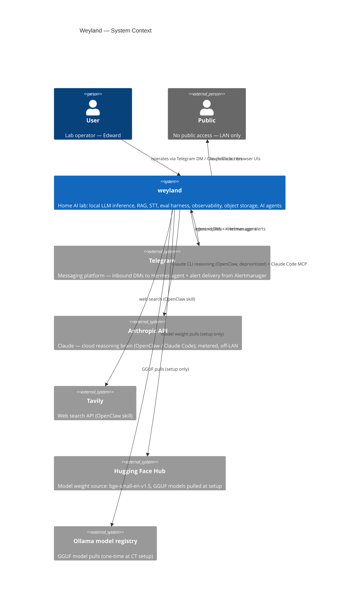

# Weyland — Architecture

**Living architecture document.** What Weyland is, what runs on it, how the pieces fit, and how data
flows through the validated paths. This is the synthesis layer above the registries and runbooks —
when they disagree, the registries ([hosts.md](hosts.md), [api.md](api.md)) are the source of truth
for *values*; this doc owns the *picture and the why*. Keep it current as the system evolves.

**Companion docs:** [hosts.md](hosts.md) · [api.md](api.md) · roadmap [backlog.md](backlog.md) ·
runbooks: [b6-minio](runbooks/storage-minio.md) · [b7-ollama](runbooks/model-serving-ollama.md) ·
[b11-whisper](runbooks/transcription-whisper.md) · [b4-eval](runbooks/eval-harness.md) ·
concepts: [llm-inference-cpu-vs-gpu](concepts/llm-inference-cpu-vs-gpu.md) · ops: [test.md](validation/test-commands.md)

**Diagrams:** [C4 Context](diagrams/c4-context.md) · [C4 Container](diagrams/c4-container.md) · Components: [mother](diagrams/c4-component-mother.md) · [hermes](diagrams/c4-component-hermes.md) · [ollama](diagrams/c4-component-ollama.md) · [whisper](diagrams/c4-component-whisper.md) · [openclaw](diagrams/c4-component-openclaw.md) · [rogueone](diagrams/c4-component-rogueone.md) · Flows (see §9 for the grouped table): [ingestion](diagrams/flow-ingestion.md) · [RAG query](diagrams/flow-rag-query.md) · [backend dispatch](diagrams/flow-backend-dispatch.md) · [voice chat](diagrams/flow-voice-chat.md) · [eval pipeline](diagrams/flow-eval.md) · [eval scoring](diagrams/flow-eval-scoring.md) · [health/status](diagrams/flow-health-status.md) · [pipeline trigger](diagrams/flow-pipeline-trigger.md) · [agent MCP](diagrams/flow-agent-mcp.md) · [mesh mTLS](diagrams/flow-mesh-mtls.md) · [tracing](diagrams/flow-tracing.md) · [guardrails](diagrams/flow-guardrails.md) · [act-tool](diagrams/flow-act-tool.md) · [ingress/TLS](diagrams/flow-ingress-tls.md) · [model gateway](diagrams/flow-model-gateway.md) · [model catalog](diagrams/flow-model-catalog.md) · [roadmap-sync](diagrams/flow-roadmap-sync.md) · [alerting](diagrams/flow-alerting.md) · [deploy](diagrams/flow-deploy.md)

---

## 1. Overview

Weyland is a **home AI lab** for experimentation and learning — not production. It runs local LLM
inference, speech-to-text, multi-backend retrieval (RAG), pipeline orchestration, an evaluation
harness, observability, and object storage, all on a LAN, with Claude as the primary reasoning brain
behind an agent layer.

The design rests on **four clear roles** and one hardware principle:

```text
weyland   = bare-metal Proxmox host (the iron)
mother    = k3s AI platform (the shared services)
hermes    = primary agent (Telegram front door + system-view)
rogueone  = GPU inference + dev workstation (the muscle + the keyboard)
```

**Hardware principle (B7):** *CPU = capacity (big, cheap, slow); GPU = speed (small, dear, fast).*
weyland's CPU (Ryzen 9 9955HX, 96 GB) serves big models via Ollama; rogueone's GPU serves small fast
ones via vLLM. See [concepts/llm-inference-cpu-vs-gpu.md](concepts/llm-inference-cpu-vs-gpu.md).

---

## 2. System context (C4 Level 1)



For the full internal container breakdown see [diagrams/c4-container.md](diagrams/c4-container.md). For component detail see the component diagrams linked above.

---

## 3. Topology

Everything physical lives on one box — **weyland**, a Minisforum MS-A2 running Proxmox bare-metal —
plus **rogueone**, an external laptop on the same LAN. weyland hosts two VMs and three unprivileged
LXC containers:

```text
weyland (MS-A2, Proxmox, 192.168.1.232)
├── vm-100  openclaw   192.168.1.169   agent control plane (Docker) — DEPRIORITIZED (B28)
├── vm-101  mother     192.168.1.243   k3s AI platform
├── ct-102  ollama     192.168.1.244   Ollama CPU LLM serving
├── ct-103  whisper    192.168.1.246   whisper.cpp CPU STT
└── ct-104  hermes     192.168.1.247   Hermes agent (qwen3-coder MoE) — primary agent + MCP client
rogueone (laptop, 192.168.1.230, RTX 5000 Ada 16 GB) — external; vLLM + dev + Claude Code
```

---

## 4. Hosts & roles

| Host | What | IP | Access | Role |
|---|---|---|---|---|
| **weyland** | MS-A2, Proxmox bare-metal (Ryzen 9 9955HX 16C, 96 GB) | .232 | `root@weyland` | The iron: VM/CT lifecycle, snapshots, storage. *Stays infrastructure* — no app sprawl. |
| **mother** | VM vm-101, k3s | .243 | `emangini@mother` | Shared AI platform: tool-server, vector/graph stores, Dagster, UIs, observability, MinIO, DNS, ingress. |
| **openclaw** | VM vm-100, Docker | .169 | `emangini@openclaw` | DEPRIORITIZED (B28). Was interaction/control plane: OpenClaw + Telegram; Claude CLI brain. |
| **rogueone** | Laptop, RTX 5000 Ada 16 GB | .230 | `emangini@rogueone` | GPU inference (vLLM) + dev workstation + Claude Code (MCP client). Not always-on. |
| **ollama** | LXC CT 102 | .244 | via `weyland` host | CPU LLM serving (Ollama, 6 models). |
| **whisper** | LXC CT 103 | .246 | via `weyland` host | CPU STT (whisper.cpp + OpenAI shim). |
| **hermes** | LXC CT 104 | .247 | via `weyland` host | **Primary agent** (B2): Hermes on `qwen3-coder` (MoE); MCP client of the tool-server system-view; Telegram front door (live 2026-06-14). |

**Boundaries (intentional):** the **VM boundary** = lifecycle / blast-radius / rollback; the
**k8s boundary** = deployable services; the **tool-server boundary** = the stable interface between
agents/workflows and platform state. Agents call the tool-server, *not* databases directly.

---

## 5. Networking & naming

- **One flat LAN** (`192.168.1.0/24`). All hosts/CTs are first-class on it (CTs bridge `vmbr0`).
- **CoreDNS** (on mother `:53`) is authoritative for **`weyland.lab`**: a wildcard maps `*.weyland.lab`
  -> mother (Traefik), with specific zones overriding it for the standalone CTs
  (`ollama.weyland.lab` -> .244, `whisper.weyland.lab` -> .246). Everything else forwards to 1.1.1.1/9.9.9.9.
- **Traefik** (k3s ingress) terminates **TLS** for the `*.weyland.lab` UIs using an mkcert wildcard cert.
- **rogueone** also keeps `/etc/hosts` entries for `*.weyland.lab` (it isn't pointed at CoreDNS).
- **DHCP reservations** pin the CTs (`.244`, `.246`) so endpoint URLs stay stable.
- **Addressing convention:** k3s services -> `mother:<NodePort>` or `*.weyland.lab` (Traefik);
  standalone CTs -> reserved IP / `*.weyland.lab`; in-cluster-only -> `*.weyland.svc`.

---

## 6. Component inventory

### mother (k3s, namespace `weyland` unless noted)
| Component | Endpoint | Purpose |
|---|---|---|
| weyland-tool-server (v0.4.0) | `mother:30080` | RAG retrieval (4 backends) + `/context/ask` (RAG gen) + `/evals/*` + `/pipeline/trigger` + health, **+ `/mcp` system-view MCP server** (read-only tools, `fastapi-mcp` Streamable HTTP), **+ B14 guardrail layer** (shadow-mode validators on `/context/*`, verdicts → `/metrics` + `guardrail_verdicts` table). Consumers: Hermes (CT 104) + **Claude Code** (rogueone, validated 2026-06-14). The platform's HTTP boundary. |
| Postgres + pgvector | `weyland-postgres.weyland.svc:5432` | `rag_documents`/`rag_chunks` (vector 384-dim) + `eval_*` tables. In-cluster only. |
| Qdrant | `mother:30083` (HTTP), `:30084` (gRPC) | vector store, collection `weyland_chunks`. |
| Weaviate | `mother:30087` (gRPC 50051) | vector store, class `WeylandChunk`. |
| Neo4j | `mother:30085` (HTTP), `:30086` (Bolt) | graph + vector index (GraphRAG foundation), APOC + **GDS** (PageRank/Louvain). B37 **AIDLC `:Entry` graph** (`RELATED_TO`/`SURFACES_AT`/`TAGGED`/`IN_VERTICAL` from frontmatter). |
| NeoDash | `mother:30088` | Neo4j dashboard/viz UI (free Bloom-alternative; browser connects to Bolt `:30086`). `k8s/neodash.yaml`. |
| Dagster | `dagster.weyland.lab` (3 pods) | ingestion job + eval jobs (`weyland_eval_job`, `weyland_eval_score_job`) + **model-catalog job** (`weyland_catalog_schedule`, 6h → `model_catalog` table) + **AIDLC-KB ingest** (`weyland_aidlc_kb_job`, on-demand → MinIO `aidlc-kb` → 4 backends + frontmatter graph, B37) + **TechDocs publish** (`weyland_techdocs_job`, hourly: `mkdocs build` → MinIO `techdocs` bucket, keeps the IDP docs in sync, B41). |
| LiteLLM model gateway | `mother:30400`, `litellm.weyland.lab` | OpenAI-compatible proxy fronting **all Gemini + OpenRouter** models (wildcard); human-gated off-LAN egress (valve) + spend alerts. [runbooks/model-gateway.md](runbooks/model-gateway.md). |
| Open WebUI | `chat.weyland.lab` | browser voice/chat -> Ollama (chat) + whisper (STT). |
| n8n | `n8n.weyland.lab` | workflow automation (ingestion role retired -> Dagster; retained for other automation). |
| Prometheus + Grafana | `grafana.weyland.lab` (ns `monitoring`) | observability (cluster/node/pod dashboards). |
| MinIO | `s3.weyland.lab` (S3), Filestash `files.weyland.lab` (ns `minio`) | object storage (8 TB USB -> mother). |
| APISIX | `mother:30090` (gateway), `apisix.weyland.lab` (dashboard) | API gateway. |
| Headlamp | `headlamp.weyland.lab` | Kubernetes UI. |
| weyland IDP (B3) | `idp.weyland.lab` | Internal Developer Platform — Backstage (tool-neutrally named). Software catalog + TechDocs + Catalog Graph + Scaffolder golden paths of the platform (slices A+B+C live). Meshed (STRICT Postgres). **Self-syncs from the repo (B41):** catalog read live via `type: url` off public GitHub (no ConfigMap), TechDocs built+published hourly by a Dagster job → MinIO `techdocs` bucket. Config via ConfigMap. `k8s/weyland-idp/`, [runbooks/weyland-idp.md](runbooks/weyland-idp.md). |
| CoreDNS | `mother:53` | LAN DNS resolver for `weyland.lab`. |
| Traefik | (ingress) | TLS front door for `*.weyland.lab`. |
| Istio service mesh (B8 — ✅ done) | `istio-system` ns; Kiali `kiali.weyland.lab`, Jaeger `jaeger.weyland.lab` (both dev-password gated) | Sidecar mesh, minimal profile (no Istio gateway — Traefik stays ingress). Meshed: tool-server + 4 vector/graph backends + Dagster, **PERMISSIVE mTLS**; **Postgres STRICT** (proven enforcing — vector backends stay PERMISSIVE by design, they have un-meshed Prometheus/NodePort clients). TCP backends (neo4j Bolt / Postgres) need `appProtocol: tcp`. Mesh metrics + tracing consolidated onto the kube-prometheus-stack + Grafana (addon Prometheus dropped). Kiali read-only + RBAC-tightened. See [runbooks/service-mesh-istio.md](runbooks/service-mesh-istio.md). |

### weyland CTs
| Component | Endpoint | Purpose |
|---|---|---|
| Ollama (CT 102) | `ollama.weyland.lab:11434/v1` (.244) | CPU LLM serving — 6 models, `num_thread 8`, one model resident (`OLLAMA_MAX_LOADED_MODELS=1`). |
| whisper-server (CT 103) | `whisper.weyland.lab:8080/inference` (.246) | native whisper.cpp STT (multipart). |
| whisper OpenAI shim (CT 103) | `whisper.weyland.lab:9000/v1/audio/transcriptions` (.246) | OpenAI-compatible STT adapter -> whisper-server. |
| Hermes (CT 104) | `192.168.1.247` (agent; no served API) | **Primary agent** (B2). Brain -> Ollama `qwen3-coder` (MoE); **MCP client** of the tool-server `/mcp` system-view (read-only v1); **Telegram gateway front door** (live 2026-06-14, allowlisted DM -> agent). **B27 Kanban** (native SQLite): self-management + a `weyland-roadmap` board mirroring `backlog.md` (one-way, 6h); planning on Gemini-free via the LiteLLM gateway, workers local. Runbook [runbooks/agent-hermes.md](runbooks/agent-hermes.md). |

### rogueone
| Component | Endpoint | Purpose |
|---|---|---|
| vLLM | `rogueone:8000/v1` | GPU LLM serving (Qwen), on-demand. |
| Obsidian vault | (local) | personal notes — **no longer a RAG source** (retired in B25b). The RAG now ingests the GitHub repo (`docs/` + `nodes/`) via Dagster git-pull. |
| Claude Code | (local CLI) | Dev assistant; MCP client of tool-server `/mcp` (validated 2026-06-14). |

---

## 7. Data stores

- **Postgres / pgvector** — the spine. `rag_documents` + `rag_chunks` (384-dim `bge` vectors) is the
  primary RAG store; `eval_runs / eval_questions / eval_results / eval_scores` + `eval_leaderboard`
  view back the eval harness (B4). Reused (not a new DB) for evals by design.
- **Qdrant / Weaviate / Neo4j** — parallel vector/graph backends, all written in the *same* Dagster
  run and all queryable via the tool-server (`?backend=`). Neo4j adds a vector index + graph edges
  (GraphRAG foundation).
- **AIDLC knowledge corpus (B37)** — ~510 brand-neutral entries from the AIDLC knowledge repos, ingested
  from a private MinIO bucket by the on-demand `weyland_aidlc_kb_job` into the *same* 4 stores under an
  `aidlc-kb/` `source_path` namespace (KB-scoped hash-gate + prune; the docs-pipeline prunes are guarded to
  never touch it). Neo4j also holds a deterministic **frontmatter graph** — `(:Entry)` linked by
  `RELATED_TO`/`SURFACES_AT`/`TAGGED`/`IN_VERTICAL` (no LLM; fuzzy extraction is deferred to B38).
- **MinIO** — S3-compatible object storage (model artifacts, datasets, backups). Filestash is the UI
  (the community console is stripped). See [runbooks/storage-minio.md](runbooks/storage-minio.md).
- **`model_catalog`** (Postgres) — current-state lookup of reachable hosted models (OpenRouter / Gemini /
  Ollama, with free flag + pricing + context), refreshed every 6h by Dagster (replace-by-source). Distinct
  from the normalized `models` infra-inventory table. See [runbooks/model-gateway.md](runbooks/model-gateway.md).
- **Embeddings** — `BAAI/bge-small-en-v1.5` (384-dim), baked into both the tool-server and Dagster
  images so ingestion and query embed identically.

---

## 8. Model serving

| Path | Where | Engine | Use |
|---|---|---|---|
| **Large LLMs (capacity)** | weyland CT 102 (CPU) | Ollama (llama.cpp/GGUF) | RAG generation, eval, batch — 6 models, ~13-89 s/RAG-call. Prefer MoE (low active params). |
| **STT** | weyland CT 103 (CPU) | whisper.cpp `large-v3` | voice -> text, faster-than-real-time; OpenAI-shim for drop-in clients. |
| **Small fast LLMs (speed)** | rogueone (GPU) | vLLM | low-latency utility inference (Qwen), on-demand. |
| **Hosted models (escalation)** | (cloud) via mother **LiteLLM** | Gemini + OpenRouter (free tiers) | stronger-than-local brains on demand; API-key (no subscription/ToS issue); human-gated egress. |

All inference speaks the **OpenAI `/v1` shape**, so clients are engine-agnostic. The eval harness
(B4) found **gpt-oss:20b** the most defensible RAG model across a 3-judge panel. **Claude brain note:**
B26's Hermes+Claude path was *declined* — a Claude Pro/Max subscription via a proxy is a ToS gray area,
metered API wasn't wanted; Claude-in-lab is instead **you driving Claude Code** (B29, already MCP-wired).

---

## 9. Key flows

Grouped by plane. **Data** = the RAG/eval data path; **Security/mesh** = how requests are protected and
observed; **Control/ops** = scheduled and operational paths.

| Plane | Flow | Diagram |
|---|---|---|
| Data | Ingestion (repo -> 4 vector backends) | [flow-ingestion.md](diagrams/flow-ingestion.md) |
| Data | RAG query (`/context/ask`) | [flow-rag-query.md](diagrams/flow-rag-query.md) |
| Data | Backend selection / dispatch (one of four) | [flow-backend-dispatch.md](diagrams/flow-backend-dispatch.md) |
| Data | Voice chat (Open WebUI -> whisper -> Ollama) | [flow-voice-chat.md](diagrams/flow-voice-chat.md) |
| Data | Evaluation pipeline (run -> panel -> leaderboard) | [flow-eval.md](diagrams/flow-eval.md) |
| Data | Eval scoring + leaderboard | [flow-eval-scoring.md](diagrams/flow-eval-scoring.md) |
| Data | Health / status aggregation (U12) | [flow-health-status.md](diagrams/flow-health-status.md) |
| Data | Pipeline trigger (`/pipeline/trigger` -> Dagster) | [flow-pipeline-trigger.md](diagrams/flow-pipeline-trigger.md) |
| Security/mesh | Agent system-view (Hermes / Claude Code -> MCP) | [flow-agent-mcp.md](diagrams/flow-agent-mcp.md) |
| Security/mesh | Service-mesh request path + mTLS (B8) | [flow-mesh-mtls.md](diagrams/flow-mesh-mtls.md) |
| Security/mesh | Distributed tracing pipeline (B8) | [flow-tracing.md](diagrams/flow-tracing.md) |
| Security/mesh | Guardrail validation (B14) | [flow-guardrails.md](diagrams/flow-guardrails.md) |
| Security/mesh | Audited act-tool (`/mcp-act`, B14) | [flow-act-tool.md](diagrams/flow-act-tool.md) |
| Security/mesh | Ingress / TLS front door | [flow-ingress-tls.md](diagrams/flow-ingress-tls.md) |
| Control/ops | Model-gateway routing (B26) | [flow-model-gateway.md](diagrams/flow-model-gateway.md) |
| Control/ops | model_catalog refresh (B26) | [flow-model-catalog.md](diagrams/flow-model-catalog.md) |
| Control/ops | Roadmap-sync -> Hermes Kanban (B27) | [flow-roadmap-sync.md](diagrams/flow-roadmap-sync.md) |
| Control/ops | Alerting (B5) | [flow-alerting.md](diagrams/flow-alerting.md) |
| Control/ops | Deploy / redeploy (build<->runtime isolation) | [flow-deploy.md](diagrams/flow-deploy.md) |

---

## 10. Cross-cutting concerns

- **DNS + TLS (the "cellular" front door, U9):** CoreDNS + Traefik + an mkcert wildcard give every UI
  a trusted `https://<name>.weyland.lab`. UIs go through Traefik; data/serving endpoints stay on
  NodePorts / CT IPs.
- **Secrets & creds:** lab dev password (`weyland_dev_password`) for UIs, supplied via k8s Secrets
  (never committed); DB/Neo4j passwords via `secretKeyRef`; default-SA token automount disabled
  (least privilege). LAN-only posture.
- **Storage:** RWO single-instance Deployments (pgvector/qdrant/weaviate/neo4j/n8n/open-webui) use
  `strategy: Recreate` to avoid volume-lock deadlocks. Model/eval data on NVMe (rpool); MinIO bulk on
  the 8 TB USB.
- **Observability:** Prometheus + Grafana (B5 — done). Alertmanager -> Telegram alerts live. App metrics via
  ServiceMonitors: qdrant, weaviate, apisix, coredns, **tool-server (B14 guardrails)**, **minio** (full
  scrape-target list in [api.md](api.md#metrics--scrape-targets-b5-phase-2b)).
- **Guardrails (B14 — shadow):** a pluggable validator layer at the tool-server seam runs on `/context/*`
  — `input` hook (LLM Guard prompt-injection) + `output` hook (LLM Guard toxicity, in-process NLI
  grounding). Ships **shadow-mode** (record-only, never blocks; per-validator `off|shadow|flag|block` via
  env); verdicts go to Prometheus (`/metrics`) + the `guardrail_verdicts` Postgres table (a future B1 data
  product). PII deferred (coded, unbaked → B34). Full spec: `aidlc-docs/construction/b14-guardrails-design.md`.
  The `act` hook (`policy.audit`, shadow) audits the `/mcp-act` action tools (`pipeline/trigger`,
  `evals/run`, `evals/score`) to `guardrail_verdicts.actor` (trusted `X-Forwarded-Consumer` header, NULL
  until the B17+B19 gateway). Enforcing policy gate deferred to the B35 pairing.
- **Deploy model:** manual `scp` -> build on the node -> import to k3s/containerd -> `kubectl rollout`
  (tool-server, Dagster, Open WebUI). No GitOps yet (deliberate, until stable).

---

## 11. Operational lessons (why the CTs are tuned the way they are)

Both stem from the **same root: an LXC exposes the *host's* resources, not the container's cgroup**,
so Ollama mis-sizes against 96 GB / 16 cores instead of the CT's limits. (Details in
[runbooks/model-serving-ollama.md](runbooks/model-serving-ollama.md).)

- **`num_thread 8`** — llama.cpp defaulted to 16 threads (host core count), oversubscribing the
  14-CPU cpuset; spin-wait barriers collapsed throughput to ~0.15 tok/s. Pinning 8 -> ~25 tok/s (~160x).
- **`OLLAMA_MAX_LOADED_MODELS=1`** — Ollama kept multiple models resident (sized vs the host's 96 GB),
  blew past the 48 GB cgroup, and got OOM-killed mid-eval. One model resident keeps it bounded.
- **Non-thinking models for structured output** — thinking models (qwen3) intermittently return empty
  content under `json_object`; eval generation/judging use non-thinking models for reliable JSON.

---

## 12. Design principles

- **Adaptive, lab-weighted:** built for experimentation/learning/flexibility, not production SLAs.
  High latency tolerance; don't over-engineer; cheap/used hardware over workstation-grade.
- **Capacity vs speed:** CPU (big/cheap/slow) for capacity, GPU (small/dear/fast) for speed; route by
  *"is something waiting?"* and *"does it fit?"*.
- **Engine-agnostic via OpenAI `/v1`:** every model endpoint speaks the same contract; clients don't
  care which engine is behind it.
- **Reuse over new infra:** evals reused Postgres + Dagster + Ollama rather than standing up new
  databases/orchestrators; Ragas rejected for being heavy + broken (see [runbooks/eval-harness.md](runbooks/eval-harness.md)).
- **Tool-server as the seam:** agents/workflows depend on the tool-server's stable HTTP contract, not
  on databases — so internals can change without breaking consumers.
- **Build↔runtime anti-corruption layer:** images cross from the build context into the cluster's runtime
  store only via an explicit `docker save | k3s ctr images import` — a deliberate isolation boundary, not just
  plumbing. (Why nerdctl's build-straight-into-k3s was declined at B24: it collapses this ACL.)
- **Measure, don't assume:** the eval harness exists to replace vibes with data (and even revealed that
  single-judge LLM eval is itself untrustworthy -> judge panel).

---

## 13. Roadmap & maintenance

Forward priorities live in [backlog.md](backlog.md). Recently done: B3 (Backstage IDP — all 3 slices: software catalog + TechDocs + Catalog Graph + Scaffolder golden paths), B41 (self-syncing IDP — catalog via git url + hourly Dagster TechDocs publish), B26, B27, B8 (Istio mesh), B37 (AIDLC knowledge-base ingest + frontmatter graph). Deferred: B38 (fuzzy LLM GraphRAG extraction), B40 (Mermaid-in-TechDocs).

**Maintaining this doc:** update it (and [hosts.md](hosts.md)/[api.md](api.md)) whenever a host,
service, endpoint, port, DNS name, or major flow changes — same "done" bar as a runbook.
