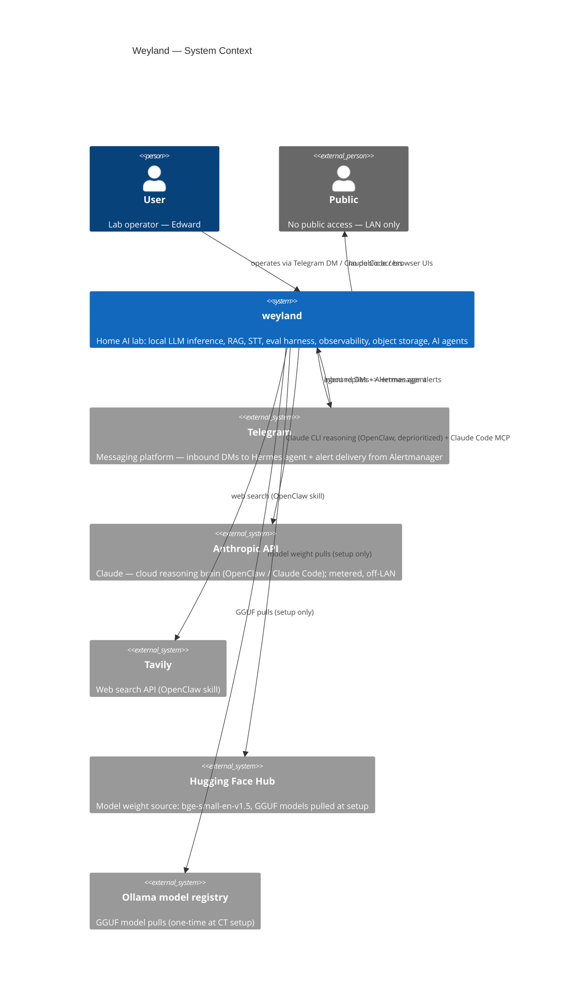
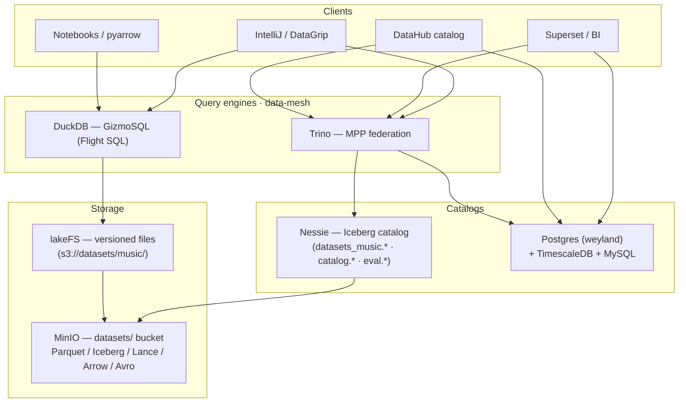
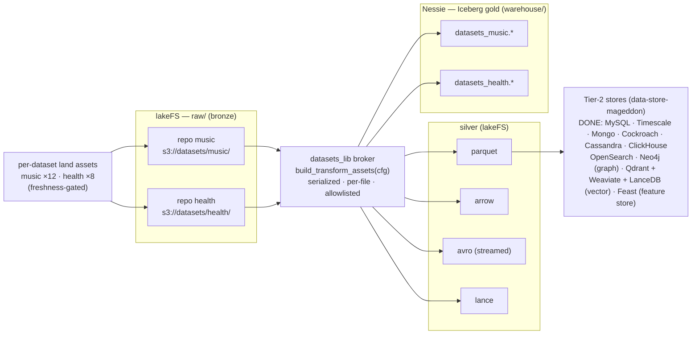
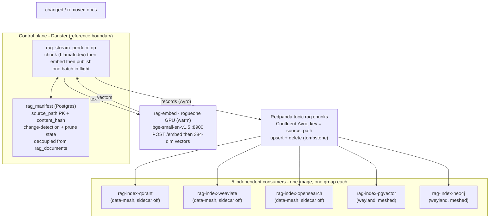

# Weyland — Architecture

**Living architecture document.** What Weyland is, what runs on it, how the pieces fit, and how data
flows through the validated paths. This is the synthesis layer above the registries and runbooks —
when they disagree, the registries ([hosts.md](hosts.md), [api.md](api.md)) are the source of truth
for *values*; this doc owns the *picture and the why*. Keep it current as the system evolves.

**Companion docs:** [hosts.md](hosts.md) · [api.md](api.md) · roadmap [backlog.md](backlog.md) ·
runbooks: [b6-minio](runbooks/storage-minio.md) · [b7-ollama](runbooks/model-serving-ollama.md) ·
[b11-whisper](runbooks/transcription-whisper.md) · [b4-eval](runbooks/eval-harness.md) ·
[trino](runbooks/trino.md) · [gizmosql](runbooks/gizmosql.md) · [superset](runbooks/superset.md) ·
[timescaledb](runbooks/timescaledb.md) · [datasets-lake](runbooks/datasets-lake.md) · [argocd](runbooks/argocd.md) ·
concepts: [llm-inference-cpu-vs-gpu](concepts/llm-inference-cpu-vs-gpu.md) · ops: [test.md](validation/test-commands.md)

**Diagrams:** [C4 Context](diagrams/c4-context.md) · [C4 Container](diagrams/c4-container.md) · Components: [mother](diagrams/c4-component-mother.md) · [hermes](diagrams/c4-component-hermes.md) · [ollama](diagrams/c4-component-ollama.md) · [whisper](diagrams/c4-component-whisper.md) · [openclaw](diagrams/c4-component-openclaw.md) · [rogueone](diagrams/c4-component-rogueone.md) · Flows (see §9 for the grouped table): [ingestion](diagrams/flow-ingestion.md) · [RAG query](diagrams/flow-rag-query.md) · [RAG stream indexer](diagrams/flow-rag-stream.md) · [backend dispatch](diagrams/flow-backend-dispatch.md) · [voice chat](diagrams/flow-voice-chat.md) · [eval pipeline](diagrams/flow-eval.md) · [eval scoring](diagrams/flow-eval-scoring.md) · [semantic/consumption](diagrams/flow-semantic-consumption.md) · [health/status](diagrams/flow-health-status.md) · [pipeline trigger](diagrams/flow-pipeline-trigger.md) · [agent MCP](diagrams/flow-agent-mcp.md) · [mesh mTLS](diagrams/flow-mesh-mtls.md) · [tracing](diagrams/flow-tracing.md) · [guardrails](diagrams/flow-guardrails.md) · [act-tool](diagrams/flow-act-tool.md) · [ingress/TLS](diagrams/flow-ingress-tls.md) · [model gateway](diagrams/flow-model-gateway.md) · [model catalog](diagrams/flow-model-catalog.md) · [roadmap-sync](diagrams/flow-roadmap-sync.md) · [alerting](diagrams/flow-alerting.md) · [deploy](diagrams/flow-deploy.md) · [MLflow](diagrams/flow-mlflow.md)

---

## 1. Overview

Weyland is a **home AI lab** for experimentation and learning — not production. It runs local LLM
inference, speech-to-text, multi-backend retrieval (RAG), pipeline orchestration, an evaluation
harness, observability, and object storage, all on a LAN, with Claude as the primary reasoning brain
behind an agent layer.

The design rests on **four clear roles** and one hardware principle:

```text
weyland   = bare-metal Proxmox host (the iron)
mother    = k3s AI platform (the shared services)
hermes    = primary agent (Telegram front door + system-view)
rogueone  = GPU inference + dev workstation (the muscle + the keyboard)
```

**Hardware principle (B7):** *CPU = capacity (big, cheap, slow); GPU = speed (small, dear, fast).*
~~weyland's CPU serves big models via Ollama~~ **(B79, 2026-07-12: ALL Ollama inference moved to rogueone's GPU; the freed 32 GB grew mother 50→64 GB)**; rogueone's GPU serves
ones via vLLM. See [concepts/llm-inference-cpu-vs-gpu.md](concepts/llm-inference-cpu-vs-gpu.md).

---

## 2. System context (C4 Level 1)



For the full internal container breakdown see [diagrams/c4-container.md](diagrams/c4-container.md). For component detail see the component diagrams linked above.

---

## 3. Topology

Everything physical lives on one box — **weyland**, a Minisforum MS-A2 running Proxmox bare-metal —
plus **rogueone**, an external laptop on the same LAN. weyland hosts two VMs and three unprivileged
LXC containers:

```text
weyland (MS-A2, Proxmox, 192.168.1.232)
├── vm-100  openclaw   192.168.1.169   agent control plane (Docker) — DEPRIORITIZED (B28)
├── vm-101  mother     192.168.1.243   k3s AI platform
├── ct-102  ollama     RETIRED (B79 → moved to rogueone; 32 GB reclaimed → mother 50→64 GB)
├── ct-103  whisper    192.168.1.246   whisper.cpp CPU STT
└── ct-104  hermes     192.168.1.247   Hermes agent (qwen3-coder MoE) — primary agent + MCP client
rogueone (laptop, 192.168.1.230, RTX 5000 Ada 16 GB) — external; vLLM + dev + Claude Code
```

---

## 4. Hosts & roles

| Host | What | IP | Access | Role |
|---|---|---|---|---|
| **weyland** | MS-A2, Proxmox bare-metal (Ryzen 9 9955HX 16C, 96 GB) | .232 | `root@weyland` | The iron: VM/CT lifecycle, snapshots, storage. *Stays infrastructure* — no app sprawl. |
| **mother** | VM vm-101, k3s | .243 | `emangini@mother` | Shared AI platform: tool-server, vector/graph stores, Dagster, UIs, observability, MinIO, DNS, ingress. |
| **openclaw** | VM vm-100, Docker | .169 | `emangini@openclaw` | DEPRIORITIZED (B28). Was interaction/control plane: OpenClaw + Telegram; Claude CLI brain. |
| **rogueone** | Laptop, RTX 5000 Ada 16 GB | .230 | `edwardmangini@rogueone` | GPU inference (vLLM) + **Ollama** (B79 — moved off CT-102 2026-07-12; `:11434` LAN-bound, serves the eval-judge panel + tool-server/open-webui/Hermes) + dev workstation + Claude Code (MCP client) + **permanent native Ray edge worker** (`ray-worker.service` → mother's Ray head) + remote model training (`genre-trainer`). Not always-on. |
| ~~**ollama** (CT 102)~~ **RETIRED B79** | — | — | — | Moved to rogueone (`.230:11434`, 2026-07-12) → 32 GB reclaimed → mother 50→64 GB. |
| **whisper** | LXC CT 103 | .246 | via `weyland` host | CPU STT (whisper.cpp + OpenAI shim). |
| **hermes** | LXC CT 104 | .247 | via `weyland` host | **Primary agent** (B2): Hermes on `qwen3-coder` (MoE); MCP client of the tool-server system-view; Telegram front door (live 2026-06-14). |

**Boundaries (intentional):** the **VM boundary** = lifecycle / blast-radius / rollback; the
**k8s boundary** = deployable services; the **tool-server boundary** = the stable interface between
agents/workflows and platform state. Agents call the tool-server, *not* databases directly.

---

## 5. Networking & naming

- **One flat LAN** (`192.168.1.0/24`). All hosts/CTs are first-class on it (CTs bridge `vmbr0`).
- **CoreDNS** (on mother `:53`) is authoritative for **`weyland.lab`**: a wildcard maps `*.weyland.lab`
  -> mother (Traefik), with specific zones overriding it for the standalone CTs
  (`ollama.weyland.lab` -> .244, `whisper.weyland.lab` -> .246). Everything else forwards to 1.1.1.1/9.9.9.9.
- **Traefik** (k3s ingress) terminates **TLS** for the `*.weyland.lab` UIs using an mkcert wildcard cert.
- **rogueone** also keeps `/etc/hosts` entries for `*.weyland.lab` (it isn't pointed at CoreDNS).
- **DHCP reservations** pin the CTs (`.244`, `.246`) so endpoint URLs stay stable.
- **Addressing convention:** k3s services -> `mother:<NodePort>` or `*.weyland.lab` (Traefik);
  standalone CTs -> reserved IP / `*.weyland.lab`; in-cluster-only -> `*.weyland.svc`.

---

## 6. Component inventory

### mother (k3s, namespace `weyland` unless noted)
| Component | Endpoint | Purpose |
|---|---|---|
| weyland-tool-server (v0.4.0) | `mother:30080` | RAG retrieval (4 backends) + `/context/ask` (RAG gen) + `/evals/*` + `/pipeline/trigger` + health, **+ `/mcp` system-view MCP server** (read-only tools, `fastapi-mcp` Streamable HTTP), **+ B14 guardrail layer** (shadow-mode validators on `/context/*`, verdicts → `/metrics` + `guardrail_verdicts` table). Consumers: Hermes (CT 104) + **Claude Code** (rogueone, validated 2026-06-14). The platform's HTTP boundary. |
| Postgres + pgvector | `weyland-postgres.weyland.svc:5432` | `rag_documents`/`rag_chunks` (vector 384-dim) + `eval_*` tables. In-cluster only. |
| Qdrant | `mother:30083` (HTTP), `:30084` (gRPC) | vector store, collection `weyland_chunks`. |
| Weaviate | `mother:30087` (gRPC 50051) | vector store, class `WeylandChunk`. |
| Neo4j | `mother:30085` (HTTP), `:30086` (Bolt) | graph + vector index (GraphRAG foundation), APOC + **GDS** (PageRank/Louvain). B37 **AIDLC `:Entry` graph** (`RELATED_TO`/`SURFACES_AT`/`TAGGED`/`IN_VERTICAL` from frontmatter). |
| NeoDash | `mother:30088` | Neo4j dashboard/viz UI (free Bloom-alternative; browser connects to Bolt `:30086`). `k8s/neodash.yaml`. |
| Dagster | `dagster.weyland.lab` (3 pods) | ingestion job + eval jobs (`weyland_eval_job`, `weyland_eval_score_job`) + **model-catalog job** (`weyland_catalog_schedule`, 6h → `model_catalog` table) + **AIDLC-KB ingest** (`weyland_aidlc_kb_job`, on-demand → MinIO `aidlc-kb` → 4 backends + frontmatter graph, B37) + **TechDocs publish** (`weyland_techdocs_job`, hourly: `mkdocs build` → MinIO `techdocs` bucket, keeps the IDP docs in sync, B41). |
| LiteLLM model gateway | `mother:30400`, `litellm.weyland.lab` | OpenAI-compatible proxy fronting **all Gemini + OpenRouter** models (wildcard); human-gated off-LAN egress (valve) + spend alerts. [runbooks/model-gateway.md](runbooks/model-gateway.md). |
| Open WebUI | `chat.weyland.lab` | browser voice/chat -> Ollama (chat) + whisper (STT). |
| n8n | `n8n.weyland.lab` | workflow automation (ingestion role retired -> Dagster; retained for other automation). |
| GlitchTip | `glitchtip.weyland.lab` | **B51** error tracking (Sentry-SDK-compatible; web + worker + Valkey, meshed Postgres). tool-server + Dagster push errors via the Sentry SDK; issues → Port `glitchtip_issue` via webhook. Sibling alerting: **Loki ruler** LogQL rules → Alertmanager→Telegram (one pipeline for metric + log alerts). [runbooks/glitchtip.md](runbooks/glitchtip.md). |
| OpenCost | `opencost.weyland.lab` | **B55** k8s cost allocation (CNCF). Reads the existing Prometheus; **custom on-prem pricing** (bare-metal MS-A2, no cloud bill) → ~$48/mo box, k3s slice ~$15/mo. Feeds the Port **Cloud Cost** category: `cost` blueprint (Claude $200 + infra $48 + LiteLLM $0 ≈ $248/mo) + a Cost dashboard; OpenCost in the Launcher for live detail. [runbooks/opencost.md](runbooks/opencost.md). |
| Woodpecker CI | `woodpecker.weyland.lab` | **B56** CI/CD (kubernetes backend — pipeline steps run as cluster pods, can build/deploy the apps). GitHub OAuth; LAN-only → manual/cron triggers (GitHub can't push-webhook the lab). A `notify-port` step → Port `ci_pipeline`; Woodpecker in the Launcher. Shared build farm (Stud.IO migrates on later, B57). [runbooks/woodpecker.md](runbooks/woodpecker.md). |
| Argo CD | `argocd.weyland.lab` | **B58 (IaC, k8s lane)** GitOps CD — reconciles the k8s layer from the public repo (pull-based → LAN-safe). app-of-apps root + **28 apps onboarded** (20 raw auto-sync + 8 helm multi-source). Deploy flow is now **push to git → Argo reconciles** (rsync retired). Chosen over Flux (UI). [runbooks/argocd.md](runbooks/argocd.md). |
| OpenTofu | (CLI on rogueone) | **B58 (IaC, non-k8s lane)** Terraform-fork for what Argo can't reconcile — SaaS + Proxmox. **State in MinIO** (`s3.weyland.lab/tofu-state`). **Port's 7 blueprints + all 5 Proxmox guests codified** (`tofu/port/` + `tofu/proxmox/`, brownfield CLI import; mother's passthrough disk frozen via `ignore_changes`); GitHub/DNS + Port entities next. [runbooks/opentofu.md](runbooks/opentofu.md). |
| Prometheus + Grafana | `grafana.weyland.lab` (ns `monitoring`) | observability (cluster/node/pod dashboards). |
| MinIO | `s3.weyland.lab` (S3), Filestash `files.weyland.lab` (ns `minio`) | object storage (8 TB USB -> mother). |
| APISIX | `mother:30090` (gateway, API/data plane), `apisix.weyland.lab` (dashboard, Keycloak SSO) | **Active API/data-plane gateway** — live routes front the tool-server `/context` + `/pipeline` and the qdrant/weaviate/neo4j backends (the API-client front door; browsers go via Traefik instead). Gateway itself is API-auth'd, not Keycloak. |
| Headlamp | `headlamp.weyland.lab` | Kubernetes UI. |
| weyland IDP (B3) | — (retired) | **RETIRED 2026-06-22 (B59)** — Backstage torn down: app + 12 `backstage_plugin_*` DBs + `weyland_idp` role + the `weyland_techdocs_job` Dagster asset + MinIO `techdocs` bucket, all removed. Replaced by **Port.io** (catalog parity — domain/systems/components/resources/APIs + live `k8s_workload` links, codified in `tofu/port/`) + **`docs.weyland.lab`** (MkDocs Material — browsable + searchable, Mermaid renders, closing B40). |
| **Port.io** (IDP replacement) | `app.port.io` (SaaS, EU org `org_KyCTEN4PVUv1D3TM`) | Internal Developer Platform — zero-maintenance SaaS; **replaced Backstage (retired 2026-06-22, B59)**. **Live integrations:** K8s exporter (`weyland-cluster`), Istio (Gateway/VirtualService CRDs), GitHub exporter (`github-weyland`, 6 repos), **Linear** (roadmap — status tracking; issues/teams/labels), **Unleash** webhook (`feature_flag` blueprint — OSS feature flags, `unleash.weyland.lab`, [runbooks/unleash.md](runbooks/unleash.md)), **SonarQube/Trivy/Semgrep** webhooks (`code_quality` + `security_scan` blueprints — code quality + SAST/IaC, [runbooks/code-quality.md](runbooks/code-quality.md)). **Port = launcher/catalog, not a status board:** the `endpoint` blueprint (31 entities) + a **Launcher** dashboard give one-click access to every UI/API; the `uptime_monitor` flow was **retired** (status went stale event-only) — **Uptime Kuma** (`kuma.weyland.lab`, 25 monitors, Telegram paging) is the live status board. In-cluster agent: `port-k8s-exporter` ns. **Roadmap split:** `docs/backlog.md` = design/rationale (git, ordered source); **Linear** (`emangini` workspace, projects Weyland Lab/Stud.IO/Service Transformation) = task status; Claude updates Linear via MCP ad-hoc (no auto-sync); Port ingests Linear for catalog tracking. **Categories wired (all of B43):** Kubernetes, Istio, GitHub, Incident Mgmt (Kuma), Project Mgmt (Linear), Feature Mgmt (Unleash), Code Quality (SonarQube/Trivy/Semgrep), **Cloud Cost (OpenCost, B55), CI/CD (Woodpecker, B56), Error Tracking (GlitchTip, B51)**. **Deploy/IaC:** Argo CD GitOps + OpenTofu (B58) codify the platform. **Catalog parity DONE (B59):** the Backstage catalog is mirrored into Port (domain/systems/components/resources/APIs + live `k8s_workload` links, codified in `tofu/port/catalog.tf`); **Backstage retired 2026-06-22**, docs now at `docs.weyland.lab` (standalone MkDocs Material). **B60 buildout (2026-06-24):** sidebar audited + pruned (9 redundant stock scorecards, the empty AI-Adoption dashboard, a dead Slack automation); **6 `service` entities** (all your repos) owned by **Weyland Team**; `production_readiness` scorecard **customized for a public lab** (B61); **`ai_session` "AI-Dev Usage" data product** (B62 — Claude Code telemetry via a B37-pattern Dagster pipeline: rogueone producer → MinIO → `ai_session_ingest`). **Decision (revised 2026-07-02): Port can now "do" too.** The LAN-reach blocker is solved — the self-hosted **port-agent** (outbound polling) claims Port action runs and forwards them to an in-cluster **store-scaler**; first self-service action "Scale data-mesh store" is live (see the *Port actions → cluster* row + [runbooks/port-agent-easy-button.md](runbooks/port-agent-easy-button.md)). Hermes stays the conversational/ops "do" layer; Port actions are the click-a-button lane for a fixed set of cluster ops. |
| **Keycloak** (B1.1 — IdP / SSO) | `keycloak.weyland.lab` · `auth.weyland.lab` | **Central identity** — replaced the scattered dev-password logins (2026-06-24). k8s + meshed Postgres, `weyland` realm; realm + OIDC clients codified in `tofu/keycloak/`. **Every browser UI is behind it** (extended 2026-06-25): OIDC native (Grafana, GlitchTip, Open WebUI — true single login) + **forward-auth** via `traefik-forward-auth` (`auth.weyland.lab`) for everything else (MLflow, Kiali, filestash, Nessie, lakeFS, Unleash, SonarQube, Uptime-Kuma, Dagster, LiteLLM, docs-site, APISIX-dashboard, OpenCost, n8n, Woodpecker, Argo CD, Headlamp; cookie domain `weyland.lab`, single logout `/_oauth/logout`). Forward-auth gates *access* but keeps each app's own login (double-login on own-login apps). **NOT gated by design** (API-auth, not browser SSO): the S3 API, the data backends (qdrant/weaviate/neo4j NodePorts), and the APISIX gateway. Gotchas: Python OIDC apps need a combined CA bundle (system + mkcert root) for the back-channel; cross-ns Traefik middleware refs are blocked (local Middleware per ns); in-cluster pods reach `*.weyland.lab` via the `coredns-custom` forward; GlitchTip's allauth fought it → SSO via a DB-precreated social link (see memory). |
| **Data mesh — L1 storage** (B1.2) | `nessie.weyland.lab` · `lakefs.weyland.lab` | **Lakehouse storage foundation** (2026-06-25), ns `data-mesh`. **Nessie** = Iceberg catalog + git-branch table versioning (Postgres `nessie`, warehouse = MinIO `warehouse`, Iceberg REST `/iceberg`). **lakeFS** = git-style versioning for file/dataset products (Postgres `lakefs`, blockstore = MinIO `lakefs`). Both meshed to STRICT Postgres; forward-auth UIs, but pipelines/CLI hit the in-cluster svc directly (forward-auth is browser-only). Iceberg itself = the table format (no service; lands with Trino/Dagster writes). `k8s/data-mesh/`. Gotcha: Nessie STATIC S3 creds = flat URN ref + hyphen-free secret name — see memory `data-mesh-b1.2-storage`. |
| **Superset** (B65 Tier-2 #3) | `superset.weyland.lab` | **BI / SQL exploration** — Helm 0.17.2 / Superset 6.1.0, ns `data-mesh`. Keycloak OIDC (native, not forward-auth). Shared Valkey cache (Celery broker + results). Connected to: Trino (primary query engine), 11 Postgres databases, TimescaleDB. 48 datasets + charts + "Weyland Platform Overview" dashboard. DataHub native source ingestion. `k8s/superset/`. See [runbooks/superset.md](runbooks/superset.md). |
| **Valkey** (shared cache) | `valkey.data-mesh.svc:6379` | BSD open-source Redis fork (post-2024 SSPL relicense). Shared data-mesh cache — Superset Celery broker + results backend. Ephemeral (no persistence). RESP-compatible (DataGrip "Redis" datasource via port-forward). `k8s/data-mesh/valkey.yaml`. |
| **TimescaleDB** (B65 Tier-2 #4) | `timescaledb.data-mesh.svc:5432` | **Time-series** Postgres extension (`timescale/timescaledb-ha:pg16`), ns `data-mesh`. db `timeseries`. 5 hypertables fed hourly by Dagster `weyland_timeseries_job`: `eval_scores_ts` ← eval_scores, `guardrail_verdicts_ts` ← guardrail_verdicts, `dagster_run_durations` ← Dagster runs, `unleash_feature_metrics` ← client_metrics_env, `datahub_ingestion_runs` ← DataHub GMS GraphQL. **+ 8 `who_gho_*` dataset hypertables** (WHO GHO country/year, hydrated 2026-07-01 by `datasets_health_timescaledb_load`; time axis derived from `TimeDim`/year; Last.fm skipped — no per-listen timestamps). Grafana datasource + Superset 10 charts. DataHub `emit_timescaledb`. `k8s/data-mesh/timescaledb.yaml`. See [runbooks/timescaledb.md](runbooks/timescaledb.md). |
| **MySQL** (B65 Tier-2 #5) | `mysql.data-mesh.svc:3306` | **Health** datasets, ns `data-mesh`. **Hydrated 2026-07-01** from silver Parquet by `datasets_health_mysql_load` — **6 databases** (grid `MySQL=Y`): `nhanes` (biomarkers), `big_five` (OCEAN personality), `who_gho` (population health), `cdc_physical_activity`, `brfss` (health behaviors), `nhis` — **32 tables** (dataset→db, parquet file→table). `k8s/data-mesh/mysql.yaml`. See [runbooks/datasets-hydration.md](runbooks/datasets-hydration.md). |
| **MusicBrainz Postgres** (B65 Tier-2 #6) | `musicbrainz-postgres.data-mesh.svc:5432` | Grid **Postgres** cell (MusicBrainz only). Dedicated **`postgres:18`**, ns `data-mesh`, db `musicbrainz_db` / schema `musicbrainz`. **Loaded 2026-07-01** with the **full native `mbdump`** (2.9M artists / 39.3M recordings / 1.1M links) via **musicbrainz-docker's** importer as a k8s Job (`recreatedb.sh -fetch`), NOT stale mbslave. Isolated from core weyland Postgres. `k8s/data-mesh/musicbrainz-postgres.yaml`. See [runbooks/musicbrainz-postgres.md](runbooks/musicbrainz-postgres.md). |
| **MongoDB** (B65 Tier-2 #7) | `mongodb.data-mesh.svc:27017` | Grid **MongoDB** cell — document store. Always-on `mongo:8`, ns `data-mesh`, authSource `admin`. **Loaded 2026-07-02**: `who_gho` (8 collections) + `open_food_facts` (4.5M docs) from silver Parquet by `datasets_health_mongodb_load` (temp-file + 20k batches — memory-safe after a whole-file OOM), **plus aidlc-kb** (511 frontmatter docs, `aidlc_kb_mongo`) so the methodology is queryable by frontmatter. DataHub native Mongo source. `k8s/data-mesh/mongodb.yaml`. See [runbooks/datasets-hydration.md](runbooks/datasets-hydration.md). |
| **CockroachDB** (B65 Tier-2 #8) | `cockroachdb.data-mesh.svc:26257` | Grid **CockroachDB** cell — distributed SQL. Single-node **insecure** `cockroach:v24.2.4`, ns `data-mesh`; Admin UI `cockroachdb.weyland.lab` (Keycloak forward-auth). **Loaded 2026-07-02**: `brfss` (6 tables, ~3M rows) + `nhis` (db per dataset, pg-wire `to_sql`) by `datasets_health_cockroachdb_load`. Uses the **`cockroachdb://` dialect** (plain pg dialect can't parse Cockroach's version string). DataHub native source. Single-node = no real geo-partitioning (aspirational). `k8s/data-mesh/cockroachdb.yaml`. See [runbooks/datasets-hydration.md](runbooks/datasets-hydration.md). |
| **Cassandra** (B65 Tier-2 #9) | `cassandra.data-mesh.svc:9042` | Grid **Cassandra** cell — wide-column store. Single-node `cassandra:5.0` StatefulSet, ns `data-mesh` (3G heap / 6Gi limit — the JVM store; mother bumped 44→50Gi to fit it, reclaimed from the shelved openclaw VM). **Loaded 2026-07-02**, keyspace per domain: `datasets_music` (uci_year_prediction, **lastfm ~17M rows** partition=`user_id`) + `datasets_health` (big_five partition=`country`, who_gho 8 tables partition=`spatialdim`) by `datasets_{music,health}_cassandra_load`. Query-first modeling: partition = a natural column + synthetic `row_id uuid` clustering (nothing collides); empty/null partition values → `__UNKNOWN__` sentinel (Cassandra forbids empty partition keys). DataHub native `cassandra` source (table-level profiling, **lastfm excluded** — a `COUNT` is a full scan). `k8s/data-mesh/cassandra.yaml`. See [runbooks/datasets-hydration.md](runbooks/datasets-hydration.md). |
| **ClickHouse** (B65 Tier-2 #10) | `clickhouse.data-mesh.svc:8123` (HTTP) / `:9000` (native) · `clickhouse.weyland.lab/play` | Grid **ClickHouse** cell — columnar OLAP. Single-node `clickhouse:24.8`, ns `data-mesh` (8Gi limit — OFF's 211-col ingest OOM'd at 4Gi). **Loaded 2026-07-02**, db per domain: `datasets_music` (fma_tracks, uci, musicbrainz **HF-subset**, lp_musiccaps, audioset) + `datasets_health` (usda_fooddata — ~30 tables incl. `food_nutrient` 26.8M, open_food_facts) via `datasets_{music,health}_clickhouse_load`. **Native `s3()` ingest:** ClickHouse reads the parquet straight from the lakeFS S3 gateway (`CREATE TABLE … MergeTree ORDER BY tuple() AS SELECT * FROM s3(…, Parquet)`, schema inferred, columnar-fast — no Python row loop; the anti-Cassandra). `/play` web UI at `clickhouse.weyland.lab` (Keycloak forward-auth). **Auth gotcha:** DataHub's clickhouse-sqlalchemy can't do no-auth → gave `default` a password via a `users.d` Secret; IntelliJ needs `databaseTerm=schema`; skip-null-type-columns + memory bump were needed for OFF/usda. `k8s/data-mesh/clickhouse.yaml`. See [runbooks/datasets-hydration.md](runbooks/datasets-hydration.md). |
| **Port actions → cluster** (port-agent + store-scaler, 2026-07-02) | `port-agent` ns · `store-scaler.data-mesh.svc` | Execution path so a **Port self-service action can act on the cluster** despite LAN-only (Port cloud can't reach inbound). **port-agent** (Helm `port-labs/port-agent`, outbound-only, **POLLING** streamer) claims runs from Port → POSTs to **store-scaler** (FastAPI, least-priv SA → `deployments/scale`). First action: "Scale data-mesh store" (wake/sleep the idle Tier-2 stores). **Reusable** for any future Port→cluster button (restart a svc, kick a job). Gotcha chain (EU org → `api.port.io`, **ORG** creds not Personal, action needs a templated `body`) in [runbooks/port-agent-easy-button.md](runbooks/port-agent-easy-button.md). **Sleep-feature PARKED:** Argo selfHeal reverts `replicas:0` → button non-sticky pending a `/spec/replicas` carve-out; the execution plumbing is the keeper. `k8s/port-agent/` + `services/store-scaler/`. |
| MLflow (B10+B16) | `mlflow.weyland.lab` | Experiment tracking + model registry. **Postgres** backend store + **MinIO** `mlflow` artifact bucket. Meshed (STRICT Postgres); **Keycloak SSO** (forward-auth, B1.1) + a **LAN NodePort `192.168.1.243:30500`** (`mlflow-lan`, `externalTrafficPolicy: Local`, iptables-pinned to rogueone) so the **external Ray worker** can log runs + register models. `k8s/mlflow/`. **Two-plane note:** metadata (params/metrics/registry) goes via the server; big model **artifacts upload direct to MinIO** (experiment `artifact_location=s3://…`) — the `--serve-artifacts` proxy times a multi-GB `model.pkl` out through the 1Gi pod. See remote-training below. |
| **Container registry** (2026-07-06) | `registry.weyland.lab` | **MinIO-backed OCI registry** (`distribution/registry`, blobs in MinIO `registry` bucket → stateless, no PVC). **No auth** (LAN-only). The platform's private Docker registry (reusable; the in-cluster registry B57 wanted). Docker API; **web UI at `registry-ui.weyland.lab`** (joxit, nginx-proxy → the registry svc; Keycloak SSO). `k8s/registry/`. |
| **Capability UIs + Ray metrics** (2026-07-07) | `feast-ui.weyland.lab` · `registry-ui.weyland.lab` · Grafana `Dashboards → Ray` | Giving the API-only capabilities a face + observability. **Feast UI** (`feast ui` registry browser — feature views/entities/services + SavedDatasets; a launcher serves a `registry.json` dump to dodge feast 0.58's empty-UI bug where the bundled frontend predates its own REST backend; `k8s/data-mesh/feast-ui.yaml`). **Registry UI** (joxit, above). **Ray metrics** → the kube-prometheus-stack: head + **rogueone worker** both export `--metrics-export-port=8080` (the task/actor metrics live on the worker, so a static scrape of `.230:8080` is required — head-only is empty); Ray's Grafana dashboards imported via a ConfigMap (`ServerSideApply` — 465 KB > the 256 KB annotation limit); the Ray dashboard Metrics-tab embed works via `RAY_GRAFANA_IFRAME_HOST` + Grafana `allow_embedding` (same-site SSO cookie carries). `k8s/registry/registry-ui.yaml`, `k8s/data-mesh/feast-ui.yaml`, `k8s/ray/servicemonitor.yaml`, `k8s/monitoring/ray-grafana-dashboards.yaml`. |
| **Remote training** (2026-07-06) | rogueone (compute) → `registry.weyland.lab` → `mlflow.weyland.lab` | Heavy model training runs **on rogueone** (RAM + RTX 5000 Ada), not the k3s box. Two forms: **(1)** a **self-contained container** in the registry — given only a mounted kubeconfig it self-fetches creds from k8s Secrets + opens its own port-forwards (`kubectl`), reads lakeFS silver, trains, logs to MLflow with the **artifact direct to MinIO**; **(2)** a **persistent Ray cluster** you *submit jobs to* — an always-on **Ray head** on mother (`ray.weyland.lab`, `k8s/ray/`, plain Ray) + **rogueone as a permanent native systemd edge worker** (`ray-worker.service`; not-always-up, auto-rejoins on wake). **`--tune`** = a **Ray Tune** HP sweep across the cluster; the **winner retrains + registers on the worker** (a `@ray.remote` task — no head OOM). First consumer: `genre-trainer` (`genre_classifier`, ~v7), with **two feature sources** — `--source silver` (read lakeFS silver direct) and `--source feast` (a meshed Dagster asset `genre_feast_training_set` runs Feast's point-in-time `get_historical_features` → lakeFS training set, since the offline store is STRICT-mTLS Postgres the external trainer can't reach); Ray-Tune-best f1 ~0.31, parity across sources. Hardening: MLflow LAN NodePort `:30500` iptables-pinned to rogueone; MinIO TLS **verified via `AWS_CA_BUNDLE`** (mkcert root). This is B1.8's Ray/data-science tier — **plain Ray, not KubeRay** (KubeRay only manages in-cluster pod workers; edge/external nodes need a plain `ray start` cluster). **Gotchas:** Docker Desktop caps container RAM at the VM's allocation (hides rogueone's 128 GB); the native worker must **exactly match** the head's Ray + full Python version **incl. patch** (Ray *rejects* a mismatch — a 3.11.12 worker was refused by a 3.11.14 head), and the head's conda `pip freeze` is **unusable** off-image (`@ file:///home/conda/…` build paths) so install the worker deps explicitly (via pyenv for the exact python). **B47 upgrade (2026-07-16, security):** MLflow 2.18→**3.14** (major — `mlflow db upgrade` migration, 4Gi OOM, `--allowed-hosts` middleware), Ray 2.37→**2.56** + **token auth** (`RAY_AUTH_MODE=token`, k8s Secret `ray-auth`, enforced — no-token → 401; head uses an exec readiness probe with the token). See [[cve-remediation-mlflow3-ray256]]. [runbooks/remote-training.md](runbooks/remote-training.md), [runbooks/mlflow-training.md](runbooks/mlflow-training.md). `services/genre-trainer/`, `services/ray-head/`, `k8s/ray/`. |
| **JupyterHub** (B1.8 L8, 2026-07-12) | `jupyter.weyland.lab` (ns `jupyterhub`) | **Data-science notebook layer** — completes B1.8 (Feast + Ray were the ML tiers; this is the interactive one). Zero-to-JupyterHub; hub+proxy tiny always-on + **KubeSpawner singleuser pods on-demand** (1h idle-cull → scale-to-zero). Keycloak OIDC (`GenericOAuthenticator`; mkcert-CA back-channel or the token exchange 500s). Custom **`weyland-jupyter:local`** image (polars/s3fs/pylance/duckdb) built + `ctr import`ed (pullPolicy Never); singleuser NetworkPolicy `egressAllowRules.privateIPs:true` so notebooks reach the mesh (lakeFS/Trino/Cube — Z2JH blocks private IPs by default). Seed notebook queries all 4 lakeFS silver formats (Parquet/Arrow/Avro/Lance) + polars/DuckDB; the full notebook **library = B81**. Needed the node **max-pods 110→250** bump. `k8s/jupyterhub/`, [runbooks/jupyterhub.md](runbooks/jupyterhub.md). |
| CoreDNS | `mother:53` | LAN DNS resolver for `weyland.lab`. |
| Traefik | (ingress) | TLS front door for `*.weyland.lab`. |
| Istio service mesh (B8 — ✅ done) | `istio-system` ns; Kiali `kiali.weyland.lab` (**Keycloak SSO**, forward-auth B1.1; Jaeger retired B48) | Sidecar mesh, minimal profile (no Istio gateway — Traefik stays ingress). Meshed: tool-server + 4 vector/graph backends + Dagster, **PERMISSIVE mTLS**; **Postgres STRICT** (proven enforcing — vector backends stay PERMISSIVE by design, they have un-meshed Prometheus/NodePort clients). TCP backends (neo4j Bolt / Postgres) need `appProtocol: tcp`. Mesh metrics + tracing consolidated onto the kube-prometheus-stack + Grafana (addon Prometheus dropped). Kiali read-only + RBAC-tightened. See [runbooks/service-mesh-istio.md](runbooks/service-mesh-istio.md). |

### weyland CTs
| Component | Endpoint | Purpose |
|---|---|---|
| Ollama (rogueone, **B79**) | `ollama.weyland.lab:11434/v1` (.230) | **GPU** LLM serving on rogueone — moved off CT-102 2026-07-12 (freed 32 GB → mother 50→64 GB); 6 models; serves the eval-judge panel + tool-server/open-webui/Hermes. `OLLAMA_HOST=0.0.0.0`. |
| whisper-server (CT 103) | `whisper.weyland.lab:8080/inference` (.246) | native whisper.cpp STT (multipart). |
| whisper OpenAI shim (CT 103) | `whisper.weyland.lab:9000/v1/audio/transcriptions` (.246) | OpenAI-compatible STT adapter -> whisper-server. |
| Hermes (CT 104) | `192.168.1.247` (agent; no served API) | **Primary agent** (B2). Brain -> Ollama `qwen3-coder` (MoE); **MCP client** of the tool-server `/mcp` system-view (read-only v1); **Telegram gateway front door** (live 2026-06-14, allowlisted DM -> agent). **B27 Kanban** (native SQLite): self-management + a `weyland-roadmap` board mirroring `backlog.md` (one-way, 6h); planning on Gemini-free via the LiteLLM gateway, workers local. Runbook [runbooks/agent-hermes.md](runbooks/agent-hermes.md). |

### rogueone
| Component | Endpoint | Purpose |
|---|---|---|
| vLLM | `rogueone:8000/v1` | GPU LLM serving (Qwen), on-demand. |
| Obsidian vault | (local) | personal notes — **no longer a RAG source** (retired in B25b). The RAG now ingests the GitHub repo (`docs/` + `nodes/`) via Dagster git-pull. |
| Claude Code | (local CLI) | Dev assistant; MCP client of tool-server `/mcp` (validated 2026-06-14). |
| Ray edge worker | `ray-worker.service` → mother `:6379` | **Permanent native systemd Ray worker** — joins the always-on Ray head for heavy training / HP-sweep compute. Not-always-up (laptop): drops from the cluster on sleep, systemd auto-rejoins on wake. `services/ray-head/ray-worker.service`. |
| genre-trainer | (Docker Desktop, `registry.weyland.lab`) | Remote model-training container — reads lakeFS silver, trains, logs to MLflow (artifact direct to MinIO). `services/genre-trainer/`. |

---

## 7. Data stores

> **Companion:** [data-mesh-guide.md](data-mesh-guide.md) is the single-page navigational map of the ~20
> data technologies — every store's role, a "I need to…" decision matrix, and the workflows that move data
> between them. This section is the *architecture* (the why + the wiring); the guide is the *index* (which
> store do I reach for). Read the guide to orient, this section to go deep.

- **Postgres / pgvector** — the spine. `rag_documents` + `rag_chunks` (384-dim `bge` vectors) is the
  primary RAG store; `eval_runs / eval_questions / eval_results / eval_scores` + `eval_leaderboard`
  view back the eval harness (B4). Reused (not a new DB) for evals by design.
- **Qdrant / Weaviate / Neo4j** — parallel vector/graph backends, all written in the *same* Dagster
  run and all queryable via the tool-server (`?backend=`). Neo4j adds a vector index + graph edges
  (GraphRAG foundation).
- **AIDLC knowledge corpus (B37)** — ~510 brand-neutral entries from the AIDLC knowledge repos, ingested
  from a private MinIO bucket by the on-demand `weyland_aidlc_kb_job` into the *same* 4 stores under an
  `aidlc-kb/` `source_path` namespace (KB-scoped hash-gate + prune; the docs-pipeline prunes are guarded to
  never touch it). Neo4j also holds a deterministic **frontmatter graph** — `(:Entry)` linked by
  `RELATED_TO`/`SURFACES_AT`/`TAGGED`/`IN_VERTICAL` (no LLM; fuzzy extraction is deferred to B38).
- **MinIO** — S3-compatible object storage (model artifacts, datasets, backups). Filestash is the UI
  (the community console is stripped). See [runbooks/storage-minio.md](runbooks/storage-minio.md).
- **Datasets lakehouse (B72/B75)** — a **bronze→silver→gold→stores** lakehouse over public **music** (12
  datasets) and **health** (8 datasets) sources, on a shared **`datasets_lib`** platform: a domain is a
  `DomainConfig` + three asset factories (`build_transform_assets` → `build_asset_checks` →
  `build_store_load_assets`). Per-dataset **land** assets write lakeFS `raw/` (bronze); a **brokered**
  fan-out — *one asset per format, process-isolated*, serialized (memory) — produces silver/gold. The
  reader dispatches on extension (csv · csv.gz · xpt · json), column names normalize + null-types coerce,
  tables are **per-file** (multi-file folders don't clobber), oversized tables **defer**. **Each format
  earns a distinct workload, not redundancy:**
  - **Parquet** — batch columnar analytics (Trino / DuckDB). The default query format.
  - **Lance** — ML / vector: fast random access, versioning, LanceDB. (Native AVX-512 — required the
    `cpu: host` Proxmox fix; see [[proxmox-vm-cpu-host-avx]].)
  - **Avro** — row-oriented + schema-evolution: the (streamed) format you'd push through **Kafka**.
  - **Arrow / Feather** — in-memory / IPC, zero-copy loads. *Transport, not a storage layer — kept for
    fast local loads + learning.*
  - **Iceberg** — ACID **gold** table (time-travel, schema evolution) over Parquet, in Nessie; per-file tables.

  A **quality gate** (`build_asset_checks` — native `@asset_check`: no-failures / expected-tables /
  valid-column-names) runs with the transform; **`build_store_load_assets`** then hydrates the grid's Tier-2
  stores (**MySQL done** — 6 health DBs, 32 tables; roadmap in
  [runbooks/datasets-hydration.md](runbooks/datasets-hydration.md)). Cataloged in DataHub by **custom-emit**
  (`emit_file_dataset` — typed Arrow schema + lineage) for raw + the four silver formats; the **iceberg
  source** handles gold. The DataHub **s3 source is unusable** here (PySpark run crashes on the executor JDK
  — `Subject.getSubject` gone in Java 18+), so one emit path covers everything. Full design:
  [runbooks/datasets-lake.md](runbooks/datasets-lake.md).
- **Trino (B65 Tier-2, 1st)** — single-node **federation query engine** in `data-mesh`; the keystone
  Superset / dbt / the B73 "use the data" work ride on. Catalogs: **`iceberg`** (the Nessie lake — via
  Trino's *native* Nessie connector, `iceberg.catalog.type=nessie`, NOT the generic REST which 403s
  [[trino-nessie-native-catalog]]) + **`postgresql`** (weyland DB, over the mesh). Query via CLI /
  IntelliJ (`jdbc:trino://…:8080`) / Superset; the web UI (`trino.weyland.lab`) is monitoring-only.
  Cataloged in DataHub as the query layer with sibling/upstream lineage to iceberg. **dbt-trino WRITES to it**
  (materializes marts as Iceberg tables in `iceberg.dbt` on Nessie `main`) — bumped to a **4G heap / 6Gi limit**
  (2026-07-08; the old 2G + `-XX:+ExitOnOutOfMemoryError` OOM-crashlooped under dbt's aggregations).
- **dbt Core (B1.5 L3 Transform — ✅ 2026-07-08)** — the analytics-engineering layer ON the Iceberg gold (does
  NOT re-ingest; `datasets_lib` does land→silver→gold). `dbt-trino` compiles SQL → Trino writes **7 tested marts**
  (`iceberg.dbt.mart_*` — music: spotify_audio/genre_audio_profile/fma_genre_tree/artist_popularity; health:
  state_health_trends/country_health/personality_by_country) to Nessie; **`dagster-dbt`** orchestrates
  (`weyland_dbt_assets`, manifest baked at image build); tested with dbt-utils/dbt-expectations. Staging is
  ephemeral; sources = the gold tables. Project `services/weyland-dagster/dbt/`. See [[dbt-transform-tier]].
  [runbooks/trino.md](runbooks/trino.md).
- **Cataloging the dbt tier — two complementary paths (2026-07-08).** The marts are surfaced in DataHub two
  ways that *converge onto the same URNs* rather than duplicate. **(a) The custom emitter** `emit_dbt`
  (`weyland_pipeline/datahub_emit.py`, run by the Dagster `datahub_catalog_emit_job`) walks the baked
  `manifest.json` — no live DB needed — and emits each of the 7 marts as a Trino/Iceberg dataset
  `iceberg.dbt.mart_*` with a `dbt` tag and an `UpstreamLineage` that walks *through* the ephemeral staging
  models to the real `gold` source tables (emitted too, as thin tagged stubs, so the lineage nodes aren't
  bare). This is the offline, version-proof baseline — it always draws the gold→mart edge even if the native
  connector is down. **As of 2026-07-13 the custom path also owns column + run lineage** (the OpenLineage tail —
  the last B1 item): `emit_dbt` attaches **FineGrainedLineage** (per-column mart→gold edges) by parsing each mart's
  *compiled* SQL with **sqlglot** (compiled manifest + `catalog.json` pulled from MinIO), landing on the same Trino
  URNs — no dbt-platform sibling needed. Ephemeral staging inlines as CTEs so it traces straight to the gold
  columns; mart-on-mart reads resolve *transitively*; a **>3-source guard** drops the `mart_country_health`
  union/pivot hairball a SQL parser can't disambiguate (6/7 marts, ~107 clean field edges). Separately,
  **`emit_dbt_openlineage`** posts real **OpenLineage** RunEvents (dbt-ol `DbtLocalArtifactProcessor` → DataHub's
  `/openapi/openlineage/api/v1/lineage`) → a **dbt DataFlow + per-model DataJobs + DataProcessInstances** (run
  history), whose input/output datasets are the same Trino marts. Three DataHub-OL 500 traps cracked: the event
  `producer` must carry an `/integration/<name>` DataHub's `getOrchestrator` knows; the whole path goes in the OL
  transport `endpoint` (its `urljoin` drops multi-segment `url` tails); and the null-typed dbt `schema` facet is
  stripped (else `setNativeDataType(null)` NPEs). **(b) The native DataHub dbt source recipe** (`k8s/data-mesh/datahub-ingestion/dbt.recipe.yaml`)
  reads `manifest.json` **+** `catalog.json` from `s3://warehouse/_dbt_artifacts/` and, with
  `target_platform: trino`, **siblings** the dbt-platform nodes onto the *same* `iceberg.dbt.mart_*` Trino URNs
  the custom emitter created — merging into one entity while adding what the hand-rolled path can't: dbt
  **tests-as-assertions**, model/column docs, and **column-level** lineage. Those artifacts are published by
  the `weyland_dbt_assets` run (`publish_dbt_artifacts`, `dbt_assets.py`): it runs `dbt docs generate` against
  **live Trino** then uploads both files with the pod's `ICEBERG_S3_*` creds. Gotcha history baked into the
  recipe comments: `catalog.json` *can't* come from the dbt-docs pod (its boot-time generate races Trino →
  the connector died on a missing catalog / JSONDecodeError), so it is published from the asset instead; the
  read needs the shared `MINIO_ACCESS_KEY/SECRET` DataHub Secrets (the nessie-secret S3 creds that own the
  `warehouse` bucket) and **path-style** S3 addressing (MinIO has no virtual-host DNS). A second custom
  emitter, `emit_feast`, adds the **cross-system** edge the dbt connector can't draw — it points each Feast
  offline source table's `UpstreamLineage` at the mart `feast_setup` loads it from:
  `feast.public.track_audio_features ← iceberg.dbt.mart_spotify_audio` (and `state_health_risk ←
  mart_state_health_trends`), plus a `feast` tag. Net effect: gold → dbt mart → Feast source is one connected
  lineage graph in the catalog.
- **The marts are the source of truth — cleaning lives once.** The whole point of the transform tier is that
  three downstream consumers all read the *tested* `iceberg.dbt.mart_*` tables instead of each re-cleaning
  silver: **(1) Feast** offline sources — `feast_setup` reads the marts straight from Trino (the meshed
  Dagster pod reaches the in-cluster coordinator) and just adds Feast's `event_timestamp`; **(2) the genre
  trainer** — `train_genre.py --source mart` consumes the `mart_spotify_audio_export` asset (which reads
  `iceberg.dbt.mart_spotify_audio` via Trino and writes a training set to lakeFS, since the forward-auth-gated
  Trino is unreachable from the external trainer); **(3) DataHub** — via the two paths above. So the
  dedup/aggregation logic is defined once in dbt and the lineage graph reads gold → dbt mart → {Feast source,
  trainer, DataHub}.
- **DataHub governance & discovery layer (2026-07-09).** On top of the raw catalog (datasets + lineage), a full
  governance model was built — all of it emitted from git, none of it hand-typed in the UI. Each piece is a
  function in `weyland_pipeline/datahub_emit.py`, wired into the Dagster `datahub_catalog_emit_job` (every 6h),
  and picks the DataHub surface that matches the *question a user is asking*:
    - **Domains** (`emit_domains`) — 6 brand-neutral business areas (Music, Health, AIDLC Knowledge, Docs & RAG,
      Platform & Ops, ML & Modeling). Every dataset/chart/dashboard **auto-assigns** to one by URN pattern
      (first-match-wins) → ~2,330 assets classified; new assets self-classify each run. Answers *"who owns this?"*
    - **Data Products** (`emit_data_products`) — 9 mesh bundles (Spotify Audio, Artist Popularity, Chronic Health
      Trends, Genre Classifier…), each gathering its assets by URN pattern and filed under its domain. Answers
      *"what shippable bundle is this part of?"*
    - **Two Glossaries.** *AIDLC KB* (`emit_glossary` + `aidlc_glossary.py`): 17 nodes / 480 terms **generated at
      build time** from the `.methodaidlc` source repos (industry verticals, consulting tools, AIDLC stages, and
      396 engineering entries nested by frontmatter tag) — the source files aren't in the image, so the taxonomy
      is baked into a data module. *Data Mesh* (`emit_mesh_glossary` + `mesh_vocabulary.py`): 6 nodes / 44
      **hand-authored** terms with canonical definitions (11 Spotify audio features, Big-Five/OCEAN, medallion
      layers, cryptic source-schema columns — MusicBrainz `entity0_credit`/`gid`, WHO GHO `dim1`, CDC `op`).
      Answers *"what does this concept mean?"*
    - **Structured Properties** (`emit_structured_properties`) — typed enum facets `data_layer`
      (bronze/silver/gold/mart/…), `source_system` (spotify/musicbrainz/brfss/…), `store_tier`
      (lakehouse/tier2/vector/…), inferred per dataset from its URN and assigned as **search filters**. Answers
      *"let me filter/report by this facet."* (Domain = owner, Product = bundle, these = the filter facets.)
    - **Field descriptions** — the ~70 mart columns are described **upstream in dbt `schema.yml`** (source of
      truth); `dbt parse` bakes them into the manifest and `emit_dbt` lifts them onto the `iceberg.dbt.mart_*`
      datasets. Answers *"what is this specific column?"*
    - **Documentation Links** (`emit_docs_links`) — `institutionalMemory` links each of ~1,386 datasets **out** to
      its doc-site runbook + the Data Mesh guide + the **Tools launchpad** (`docs.weyland.lab/tools/`). DataHub is
      the discovery layer that points **home** to the canonical (git-backed) docs — prose is never duplicated into
      DataHub. DataHub "Documents" is deliberately left empty: it's UI-authored with no git emit path, so it can't
      obey the durability rule.
  Two principles run through all of it. **(1) Define once, attach everywhere.** The catalog re-materializes the
  same logical data across ~15 stores, so 50k schema fields are only a few hundred distinct names (`id` ×1,253,
  `danceability` ×13…). A glossary term or structured-property value is defined once and **attached to every
  matching field/dataset by name** — 44 mesh terms collapsed onto 1,968 field occurrences across 666 datasets;
  attaching read-merges `editableSchemaMetadata` so overlays don't clobber each other. **(2) Everything lives in
  git.** This DataHub has **no durable UI layer** (managed-ingestion, UI field-edits, and Documents all die on a
  GMS rebuild), so every governance aspect is either authored upstream (dbt) or emitted from a committed function
  — reproducible from source, re-applied each catalog cycle.
- **DuckDB via GizmoSQL (B65 Tier-2, 2nd)** — DuckDB served over **Arrow Flight SQL** by **GizmoSQL**, in
  `data-mesh`. This exists because DuckDB's own JDBC is **embedded-only** (`jdbc:duckdb:<file>`, no
  `host:port`), so there's nothing for a client to connect to — GizmoSQL wraps the in-process engine in a
  Flight SQL *server*. **Persisted DuckDB** on a PVC (`DATABASE_FILENAME`); the silver is materialised as
  **base tables** — one per current lakeFS Parquet file, schema-per-domain (`datasets_music`/`datasets_health`)
  — by `scripts/gen_gizmosql_init.py tables`. Tables not views because GizmoSQL's Flight SQL **`GetTables`
  surfaces base tables but NOT views** → tables browse in DataGrip/IntelliJ (views were queryable-by-name but
  invisible to the IDE tree), and queries hit native columnar storage instead of re-reading Parquet. Embedded
  **single-node OLAP** — fast on columnar files (Parquet/Arrow/Lance) + the pyarrow bridge for the B72 formats;
  the IDE/notebook analytics engine.
  Meshed (Istio **mTLS**; the app runs `TLS_ENABLED=0` plaintext so clients drop `TLS_SKIP_VERIFY` — the
  mesh provides transport security). IDEA connects via the Arrow Flight SQL JDBC driver
  (`jdbc:arrow-flight-sql://mother:31337`). Cataloged in DataHub (platform `duckdb`, lineage ← `parquet`)
  by `emit_duckdb`. Runbook + gRPC-TLS ingress for external clients land at gate-close.
- **`model_catalog`** (Postgres) — current-state lookup of reachable hosted models (OpenRouter / Gemini /
  Ollama, with free flag + pricing + context), refreshed every 6h by Dagster (replace-by-source). Distinct
  from the normalized `models` infra-inventory table. See [runbooks/model-gateway.md](runbooks/model-gateway.md).
- **Embeddings** — `BAAI/bge-small-en-v1.5` (384-dim), baked into both the tool-server and Dagster
  images so ingestion and query embed identically.

- **Superset (B65 Tier-2 #3)** — BI/SQL exploration at `superset.weyland.lab`. Connects to Trino
  (primary), 11 Postgres databases, and TimescaleDB. 48 datasets, charts, and the "Weyland Platform
  Overview" dashboard. Keycloak OIDC (not forward-auth — avoids double-login). Shared Valkey cache.
  See [runbooks/superset.md](runbooks/superset.md).
- **Lightdash (deployed 2026-07-08)** — the **dbt-native** BI face, complementing Superset: where Superset does
  ad-hoc SQL over any Trino catalog, Lightdash builds its dimensions + metrics **from the dbt project** so it
  surfaces the tested marts (`iceberg.dbt.mart_*`) and any `meta.metrics` declared in the dbt `schema.yml` —
  the governed/curated side of the same lakehouse. Argo multi-source Helm app in `data-mesh` (helm 2.9.1),
  metadata in the lab Postgres `lightdash` DB, own login; dbt project pulled from the git repo via a PAT.
  **Trino wrinkle:** Lightdash's connector forces a password → HTTP Basic auth, which no-auth Trino 401s, so
  Lightdash connects through a small **`trino-noauth` nginx proxy** that strips the `Authorization` header
  (`k8s/lightdash/trino-noauth-proxy.yaml`). The marts' 44 `meta.metrics` (schema.yml) surface as governed
  metrics; starter charts/dashboards are seeded via `scripts/lightdash_seed.py` and codified via
  `lightdash download`. See [runbooks/lightdash.md](runbooks/lightdash.md).
- **Cube (B1.7 L6 — deployed 2026-07-12)** — the **serving semantic / metrics layer**. Where Lightdash/Superset
  are BI *UIs* for humans, Cube is a headless **API**: metrics defined once as *cubes* over the marts, served over
  **SQL (`:15432` pg-wire) + REST + GraphQL (`:4000`)**. Its distinctive value vs the rest of the stack is a
  *governed metrics API for non-BI consumers* — an app, an **agent (Hermes)**, or an LLM gets the same governed
  number a dashboard would, which BI UIs can't provide; plus Cube-Store pre-aggregation. Overlaps dbt-marts +
  Lightdash's dbt-native metrics + MetricFlow by design (the design doc keeps Cube + dbt-SL side by side). Connects
  through the same **`trino-noauth`** proxy (catalog `iceberg`, user `dbt`); 7 cubes over `iceberg.dbt.mart_*`;
  `cube.weyland.lab` behind Keycloak forward-auth. Playground is a dev tool (heavy client-side) — headless SQL/REST
  is the real surface. Manifests `k8s/cube/cube.yaml`. See [runbooks/cube.md](runbooks/cube.md).
- **TimescaleDB (B65 Tier-2 #4)** — time-series Postgres extension in `data-mesh`. 5 hypertables
  for temporal analysis of platform operational data (eval performance trends, guardrail decision
  rates, pipeline run durations, feature flag usage, catalog ingestion health). Fed hourly by the
  `weyland_timeseries_job` Dagster schedule. Grafana datasource registered; Superset has 10 charts.
  See [runbooks/timescaledb.md](runbooks/timescaledb.md).
- **MySQL (B65 Tier-2 #5)** — relational store for health/wellness/personality datasets in `data-mesh`,
  **hydrated 2026-07-01** from silver Parquet by `datasets_health_mysql_load` (the first
  `build_store_load_assets` arm). **6 databases** = the grid `MySQL=Y` set — NHANES, Big Five, WHO GHO, CDC
  Physical Activity, BRFSS, NHIS — **32 tables** (dataset→database, parquet file→table; USDA + Open Food
  Facts are `MySQL=N`, NHIS replaced UK Biobank). The intent: join personality profiles against dietary
  patterns and health behaviors. See [runbooks/datasets-hydration.md](runbooks/datasets-hydration.md).
- **MusicBrainz Postgres (B65 Tier-2 #6)** — the grid's **Postgres** cell (MusicBrainz only), a **dedicated
  `postgres:18`** instance in `data-mesh`, **loaded 2026-07-01** with the **full native `mbdump`** (2.9M
  artists / 39.3M recordings / 1.1M `link` rows — the real normalized relational graph, not the flat HF
  silver). Isolated from the core weyland Postgres. Loaded by **musicbrainz-docker's own importer** run as a
  k8s Job (`recreatedb.sh -fetch`), *not* community mbslave (stale — stuck on 2024's schema, can't ingest
  current dumps). This is the one store where relational fidelity + FKs are the point. See
  [runbooks/musicbrainz-postgres.md](runbooks/musicbrainz-postgres.md).
- **MongoDB (B65 Tier-2 #7)** — the grid's **document store** cell, always-on `mongo:8` in `data-mesh`,
  **loaded 2026-07-02**: `who_gho` (nested JSON, 8 collections) + `open_food_facts` (doc-per-product, 4.5M) from
  the silver Parquet, **plus the aidlc-kb methodology corpus** (511 docs, frontmatter flattened to queryable
  fields — the structured-lookup the vector RAG and Neo4j graph don't serve). Two enabling pieces landed here:
  a **streamed transform** for OFF (its ~9GB TSV OOMed the whole-table broker — `datasets_health_open_food_facts_parquet`
  streams it to parquet, which also unblocked OFF for DuckDB), and a **memory-safe loader** (temp-file +
  20k-row batches, after the naive whole-file approach OOMKilled user-code). See
  [runbooks/datasets-hydration.md](runbooks/datasets-hydration.md).
- **CockroachDB (B65 Tier-2 #8)** — the grid's **distributed-SQL** cell (`brfss` + `nhis`, geo-partitioned in
  intent), single-node insecure in `data-mesh`, **loaded 2026-07-02** db-per-dataset over pg-wire. A single node
  can't actually geo-partition (needs multi-region), so this is Cockroach-as-a-distributed-SQL-*store* + its
  built-in Admin UI (`cockroachdb.weyland.lab`, forward-auth). Gotcha worth remembering: Cockroach is pg-*wire*
  but NOT pg-*dialect* — SQLAlchemy's postgres dialect AssertionErrors on its version string, so the loader uses
  the `cockroachdb://` dialect. Cataloged via a DataHub native source. See
  [runbooks/datasets-hydration.md](runbooks/datasets-hydration.md).

### 7a. Query layer — Trino vs DuckDB (`data-mesh`)

Two SQL engines sit over the same lakehouse; they are **not redundant** — each owns a different job, and
picking the wrong one is slow or impossible:

| | **Trino** | **DuckDB (GizmoSQL)** |
|---|---|---|
| Shape | Distributed MPP (coordinator + workers) | Embedded single-node OLAP |
| Superpower | **Federation** — join *across* sources in one query | **Speed** on columnar files, one node |
| Reaches | Iceberg/Nessie **+** Postgres (+ more catalogs) | lakeFS Parquet via `httpfs` (+ Arrow/Lance/Avro via pyarrow) |
| Run mode | Always-on service | In-memory, lightweight, served via Flight SQL |
| Client URL | `jdbc:trino://…:8080` · Superset · CLI | `jdbc:arrow-flight-sql://…:31337` |
| Reach for it when… | cross-source joins, big federated scans, BI | fast single-node file analytics, the B72 format playground |

**Rule of thumb:** *need to federate many sources →* **Trino**; *need to go fast on the lake's files (or the
Lance/Avro/Arrow formats) →* **DuckDB**. Both live in `data-mesh`, both are cataloged in DataHub, and both
read the same MinIO-backed storage — they differ in *how* they reach it and *what* they're good at.



### 7b. Data domain structure

Weyland organizes data into **domain-scoped stores** — **music** and **health** (both live;
bronze→silver→gold), plus future domains, each own their own storage path, lakeFS repo, and Nessie
namespace. The `datasets/` MinIO bucket is the top-level envelope; domain data lives in subfolders.

Both domains run on a shared **`datasets_lib`** platform (`weyland_pipeline/assets/datasets_lib/`): a
per-dataset **land** asset writes lakeFS `raw/` (bronze), then `build_transform_assets(cfg)` — an asset
factory — fans each raw table out to five silver formats + Iceberg gold. A domain is a `DomainConfig`
(repo, namespace, per-format allowlists), not a new module. See [runbooks/datasets-lake.md](runbooks/datasets-lake.md).

**MinIO layout:**
```
datasets/              ← top-level bucket (domain envelope)
  music/               ← lakeFS repo `music` (s3://datasets/music/) — 12 datasets
    raw/               ← bronze: per-dataset land assets (HF, FMA zip, CSV) — csv
    parquet/ arrow/ avro/ lance/  ← silver: <table>/<file> per source file
  health/              ← lakeFS repo `health` (s3://datasets/health/) — 8 datasets (LIVE)
    raw/               ← bronze: NHANES (.xpt), WHO GHO (.json), Open Food Facts (.csv.gz), BRFSS/NHIS/… (.csv)
    parquet/ arrow/ avro/ lance/  ← silver (multi-format reader: csv / csv.gz / xpt / json)

warehouse/             ← Nessie Iceberg warehouse (separate bucket, all domains)
  datasets_music/      ← Iceberg gold — per-file tables (spotify_tracks, audioset_train, musicbrainz_artist, …)
  datasets_health/     ← Iceberg gold — per-file tables (nhanes_2017_2020_DEMO_J, who_gho_life_expectancy, …)
  catalog/             ← model_catalog
  eval/                ← eval_scores (Iceberg data product)
```

**Iceberg tables are named per source file** (`ice_ident`: `<table>` for single-file folders, `<table>_<file>`
otherwise). Naming by folder alone made multi-file folders (usda's 30 CSVs, musicbrainz splits, audioset
train/test) overwrite one table. Oversized tables (>15M rows, e.g. usda `food_nutrient` ~24M) are *deferred*
from Iceberg (they'd stall the warehouse write) but still land in the file formats.

**Iceberg namespace convention:** flat underscore-prefixed (`datasets_music`, `datasets_health`).
Trino's native Nessie connector (`catalog.type=nessie`) does **not** expose nested namespaces —
`TrinoNessieCatalog.listSchemas()` only returns top-level entries and there is no config flag to
enable recursion. The Trino 463 nested-namespace fix applies only to `catalog.type=rest`.
Workaround: flat underscore prefixes keep the domain signal without nesting.



**Neo4j — the graph store (grid Neo4j=Y, B1).** Every other Tier-2 store is one-file-one-container; Neo4j is
**selective + modeled** — only relationship-shaped datasets become graphs, and they *share node labels* so
separate datasets fuse into one connected graph rather than four islands. The `datasets_lib` **GraphSpec**
loader (per-dataset `neo4j_allow`: `nodes[] + edges[]`) creates a uniqueness constraint per key, clean-rebuilds
only its own `clear_labels` (protecting shared labels), then batch-loads nodes `MERGE` + edges `MATCH…CREATE`
(MERGE-relationship into a supernode is O(degree) — fatal at lastfm's ~14M edges). Loaded: **lastfm**
`(:User)-[:PLAYS {play_count}]->(:Artist)` ~13.85M, **fma_genres** `:Genre` taxonomy tree, **fma_tracks**
`(:Track)-[:BY]->(:Artist)`/`-[:ON]->(:Album)`/`-[:IN_GENRE]->(:Genre)`, **audioset** `(:Clip)-[:HAS_LABEL]->(:Label)`.
`:Artist` (lastfm ↔ fma_tracks) and `:Genre` (tree ↔ fma_tracks) are the fusion points → one graph:
*listeners → artists ← tracks → albums, tracks → genre tree*. musicbrainz is N (flat, no edges). Neo4j stays
meshed via a `neo4j-bolt` DestinationRule (TCP keepalive — long Bolt bulk-load connections half-open behind
Envoy otherwise). Full data model: [diagrams/graph-music-model.md](diagrams/graph-music-model.md); queries:
[query/neo4j.md](query/neo4j.md). (The same DB also holds the RAG `:Document`/`:Chunk` and AIDLC `:Entry` graphs.)

**Qdrant + Weaviate — the vector stores (grid=Y, identical sets, B1).** Where Neo4j models *relationships*, these
hold the **feature** slice — one vector per row, similarity-searchable — so they're near-complementary to the
graph, not redundant. Both backends get the **same** vectors (built once, upserted to each: collection per
dataset in Qdrant, class per dataset in Weaviate; dims differ so separate spaces). The `datasets_lib` vector
loader's `vector_spec` is either **numeric** (assemble feature columns, **z-score normalized** — raw features
span wild scales, so cosine similarity is meaningless without it) or **text** (concat columns → embed with
bge-small, 384-dim, the same model the RAG uses). Loaded (9): audio-feature vectors — fma_features (518d),
fma_echonest (~244d), uci (90d), spotify (11d), **gtzan** (~53d, after fixing its land to extract librosa
features — the silver was label-only); text vectors — lp_musiccaps ×2, audioset (`human_labels`); big_five (50
OCEAN items). fma_tracks dropped (metadata, not features — sound-similarity is fma_features/echonest via
`track_id`); open_food_facts → B78 (4.5M docs, capped). Queries: [query/qdrant.md](query/qdrant.md) ·
[query/weaviate.md](query/weaviate.md). The FMA family literally **splits by file** — `tracks`/`genres` → graph,
`features`/`echonest` → vector, joined by `track_id`.

**LanceDB (grid LanceDB) — the embedded vector store.** A *third* backend over the same `_build_vectors` output,
but architecturally distinct from server-based Qdrant/Weaviate: **embedded** (a library, no pod), **Lance-format
-native**, backed by the **lakeFS S3 gateway** (object storage, not RAM) — so it scales past memory and is the
natural future home for OFF. Query is **in-process** (`scripts/lancedb_query.py` + cookbook), cataloged via the
`emit_lancedb` custom emitter. Because there's no server, browsing needs the **Lance Data Viewer**
(`lancedb.weyland.lab`, filesystem-only) fed by an **event-triggered mirror**: a Dagster multi-asset sensor fires
`mc mirror` (lakeFS → a viewer PVC) whenever a `lancedb_load` materializes (6h CronJob as backstop). Full flow:
[diagrams/flow-lancedb.md](diagrams/flow-lancedb.md); queries: [query/lancedb.md](query/lancedb.md).

**Feast (grid Feast) — the feature store.** Not another copy of the data — a *new access pattern*: the same
feature *defined once*, served **online** (low-latency by entity key, from Valkey) and **offline**
(point-in-time-correct training retrieval, from Postgres), with a **registry** (Postgres) of definitions.
Capabilities nothing else provides — vector stores do *similarity*, OLAP does *aggregates*; Feast does "give me
THIS entity's features, fast" + "build a leakage-free training set." Two views exercise both halves:
`track_audio_features` (entity `track`, Spotify audio features — the serving half) and `state_health_risk`
(entity `state`, BRFSS chronic-condition prevalence per year — the point-in-time half, where CA-2013 ≠ CA-2019).
Stores: registry + offline = Postgres (`feast` DB), online = Valkey. `scripts/feast_setup.py` shapes silver →
offline tables → `feast apply` → `feast materialize`. Served over REST by **feast-server** (`feast.weyland.lab`,
`/docs` Swagger; slim image, **meshed** in data-mesh for STRICT-mTLS Postgres). Diagram:
[diagrams/flow-feast.md](diagrams/flow-feast.md); queries: [query/feast.md](query/feast.md). (Built as a
capability — like Redpanda gave streaming before the streaming apps — the consuming model, e.g. Stud.IO
recommendation, is the future extension.)

### 7c. Streaming (Redpanda / CDC, B1.5)

The other stores hold **state** (silver → table/collection/graph); the streaming tier holds **events** (topics).
**Redpanda** (`redpanda.data-mesh.svc`, single-node, KRaft, sidecar off) is the Kafka-wire broker + a built-in
Confluent-compatible **Schema Registry** in one binary — chosen over Strimzi/Apache-Kafka for lab weight, and
kept isolated from DataHub's *internal* Kafka (its metadata bus) so a DataHub reset can't nuke our topics
(mirrors the "ES as its own service" B1.3 call). Two producers feed it, both Avro in **Confluent wire format**
(5-byte magic-byte + schema-id prefix → schema by reference, not embedded):

- **Event replay** — `datasets_<dom>_stream_produce` (Dagster) replays stream-shaped silver (lastfm, big_five,
  brfss, nhis) → `datasets.<dom>.<ds>` topics via confluent-kafka's AvroSerializer.
- **CDC** — a **Debezium** Postgres connector on a **Kafka Connect** worker captures `musicbrainz-postgres`
  changes (`public.cdc_demo`) → `cdc.musicbrainz.public.cdc_demo`, streaming insert/update/delete with full
  before/after images. Safety rests on `wal_level=logical` + the `max_slot_wal_keep_size=4GB` **seatbelt** (a
  stalled slot self-invalidates instead of filling the disk) + `REPLICA IDENTITY FULL` (complete old-row image);
  CDC runs only on the *isolated, reproducible* MusicBrainz instance, never the core control-plane Postgres.

**DataHub** catalogs it via the native `kafka` source pointed at Redpanda (topics + registered schemas — closed
the last B65 target). Diagrams: [diagrams/flow-streaming.md](diagrams/flow-streaming.md) (producer + CDC +
catalog) · [diagrams/flow-cdc.md](diagrams/flow-cdc.md) (the CDC internals). Runbook:
[runbooks/streaming.md](runbooks/streaming.md). Queries: [query/redpanda.md](query/redpanda.md). Follow-ons:
Strimzi on-demand learning lane + a KEDA consumer-lag scaler (recorded, not built).

---

### 7c′. Stream processing — Flink (B83)

Redpanda + Debezium (7c) *produce* events; nothing *consumed* them. **Apache Flink 1.20** on the **Flink
Kubernetes Operator** is the processing engine — chosen over Kafka Streams (JVM-library-only, no SQL/Python, no
managed lifecycle) and Spark Structured Streaming (micro-batch, heavier, and Spark's executor-JDK problems already
bit the DataHub s3 source) for its true event-at-a-time model, first-class **Iceberg** sink onto the *same* Nessie
catalog Trino/dbt use, and four authoring surfaces from one runtime. One long-lived **session cluster**
(`weyland-flink`, ns `data-mesh`, sidecar off, JM+TM, state/checkpoints/HA on MinIO `s3://warehouse/_flink`) hosts
the submitted jobs; the operator handles reconcile + Kubernetes-HA (running jobs survive JM restarts — the
continuous CDC materializer depends on it). Four jobs, one per surface:

- **RTA — trending artists** (Flink SQL, bounded): `datasets.music.lastfm` → 1-min tumbling window → **append**
  Iceberg `analytics.trending_artists`. Bounded replay emits a MAX watermark on end-of-input so every window
  closes.
- **CDC → lakehouse** (Flink SQL, continuous): `cdc.musicbrainz.public.cdc_demo` → **upsert** (Iceberg v2
  equality-deletes) `datasets_music.cdc_demo_live` — the Debezium changelog materialized into a queryable mirror.
- **health — state risk** (Java DataStream + keyed state): `datasets.health.brfss` → per-state running mean →
  Kafka `analytics.health.state_risk`. Proves the DataStream/keyed-state surface.
- **music — popularity tier** (PyFlink + Python UDF): `datasets.music.lastfm` → `SUM(play_count)`/artist → a
  Python UDF buckets the total into a tier → upsert-kafka `analytics.music.artist_tier`.

**Two architectural calls.** (1) **Session vs application mode.** Jobs 1–3 run as declarative `FlinkSessionJob`s
on the shared cluster; a session-mode jarURI must be operator-fetchable (**http/s3, never `local://`**), so a tiny
nginx **jar server** (`flink-jars`) serves `sql-runner.jar` (runs the SQL files) + `health-job.jar` (the shaded
Java fat jar) out of the image. Job 4 runs in its **own application-mode `FlinkDeployment`** (`weyland-flink-py`
image) — PyFlink's ~1 GB python + `apache-flink` runtime would otherwise bloat the shared image and force a
restart of the running CDC job; application mode also lets it use `local://` (no jar server). (2) **Classpath
isolation.** The Java DataStream job must **relocate** its bundled `flink-avro-confluent-registry` (Flink loads
`org.apache.flink.*` parent-first, so the dist's shaded-Avro SQL variant otherwise shadows it → `NoSuchMethodError`).

**Observability:** Prometheus reporter on `:9249` (JM+TM, scraped via the `weyland-flink` `ServiceMonitor`), a
standalone **History Server** (`flink-history.weyland.lab`, archives to `s3://warehouse/_flink/completed-jobs`,
serves at `/jobs/overview`) so finished bounded jobs stay investigable, plus per-operator flame graphs +
async-profiler. The two SQL jobs' Iceberg outputs are auto-cataloged by DataHub's iceberg source and queryable in
Trino/Superset; the analytics Kafka topics are read with `rpk`. Diagram:
[diagrams/flow-flink.md](diagrams/flow-flink.md). Demo: [demos/flink.md](demos/flink.md). Runbook:
[runbooks/flink.md](runbooks/flink.md). Design:
[../aidlc-docs/construction/flink-streaming-design.md](../aidlc-docs/construction/flink-streaming-design.md).

---

### 7d. Governance & security — the L5 enforcement layer (B1.6)

The DataHub layer (§7, "governance & discovery") is **descriptive** — it records *who owns* a dataset and *what a
column means*. L5 is **enforcement** — it decides *who may read* data, *what may run*, and *whether the data is
even correct*. Three independent planes, deliberately kept separate because they fail differently and are operated
by different roles:

| Plane | Tool (slice) | Enforces | Enforcement point | Default posture | UI |
|---|---|---|---|---|---|
| **Control-plane authz** | OPA / **Gatekeeper** (B) | *what workloads may exist* (no `:latest`, mem-limits, owner labels) | k8s **admission webhook** | dry-run (audit-only) | GPM Report `gatekeeper.weyland.lab` + Grafana |
| **Data-plane authz** | Apache **Ranger** (A) | *who may read which column/row* | **Trino** native plugin (per-query) | **default-deny** | `ranger.weyland.lab` |
| **Data quality** | **Soda** (C) | *whether published data honors its contract* | post-publish **scan** over marts | fail-closed (op fails on breach) | Dagster logs + DataHub **Assertions** |

Two more planes were already standing before B1.6 and complete the picture: **PodSecurity Admission** (the built-in
`restricted` floor every namespace enforces — a *different, complementary* engine to Gatekeeper: PSA is the baked-in
pod-hardening baseline, Gatekeeper is custom org policy) and **Keycloak SSO / forward-auth** (identity at the edge,
§10). L5 layers authz-and-quality *on top of* identity.

**Slice A — Ranger (data-plane authz).** `mr3project/ranger:2.6.0` (Admin on `weyland-postgres`), driving Trino
468's **native** `access-control.name=ranger` plugin — every query is authorized per-catalog/schema/column against
Ranger policies. The engine runs **default-deny**, which is the whole point (a data lake that's open-by-default
isn't governed) but is also its sharpest edge: enabling the plugin **locked out every existing client** (dbt,
Lightdash, Superset, DataHub all connect as different users) until `public` was added to Trino's 13 default
policies *before* flipping enforcement on. Column **masking** is proven (`MASK_NULL` → an `analyst` user sees
`NULL` where `dbt` sees the value). Bring-up is codified in `scripts/ranger_setup.py` (idempotent REST). Runbook:
[runbooks/ranger.md](runbooks/ranger.md).

**Slice B — OPA / Gatekeeper (control-plane authz).** Gatekeeper 3.17 (Argo helm app) admission-controls the
cluster with three **dry-run** ConstraintTemplates + Constraints — *disallow `:latest`*, *require memory limits*,
*require an owner label* — chosen as the highest-signal hygiene rules. Dry-run (audit, not deny) is the right lab
posture: it surfaces the ~14 existing violations without wedging deploys. The audit drove a real **remediation
pass** (every always-on pod now carries mem-limits + digest-pinned images + owner labels; standalone Jobs left
immutable). Two read surfaces: **Gatekeeper Policy Manager** (`gatekeeper.weyland.lab`, the per-resource violation
Report) and a 6-panel **Grafana** dashboard (violation trend / audit duration / webhook rate, off a ServiceMonitor).
Gotcha worth remembering: GPM's own pod was **rejected by PodSecurity** (`restricted`) until given a compliant
`securityContext` — the policy engine's UI had to obey a *different* policy engine.

**Slice C — Soda (data quality).** An **independent** contract scan over the 7 dbt marts — 53 checks (row presence,
key uniqueness/completeness, value-range bounds, plus per-column *emptiness tripwires*). Two architecture calls
carry it: (1) **isolated venv** — `soda-core`'s pins (opentelemetry/click/ruamel) can't co-exist with
dagster+dbt+datahub, so it lives in `/opt/soda-venv` and `soda_scan_op` **shells out** to it; (2) it reaches Trino
through the **`trino-noauth` proxy** (Soda's connector forces HTTP Basic auth, which Trino rejects over plaintext —
the same proxy Lightdash needed). Results emit to **DataHub Assertions** (`emit_soda_assertions`, one `_NATIVE_`
assertion + run-event per check on the mart's Trino URN) → a green/red Quality tab next to each mart's
schema/lineage, without paying for Soda Cloud.

The **payoff** of an independent scan (its reason to exist alongside dbt's in-transform tests): on its first real
run Soda caught **7 all-NULL columns** in `mart_country_health` that dbt's range tests passed **vacuously** —
`expect_column_values_to_be_between` null-filters before checking, so an empty column trivially "passes." Root
cause was a **code-vs-label** mismatch: the mart filtered WHO GHO `dim1` by human labels (`'both sexes'`) but WHO
stores **codes** — `SEX_BTSX` (sex-split indicators) and `ALCOHOLTYPE_SA_TOTAL` (alcohol, which disaggregates by
*beverage type*, not sex). The design lesson is baked into the check suite: **"build correctly" (dbt row-level
tests) and "verify the output" (Soda aggregate scan) are different jobs** — a `min`/`missing_percent(col) < 100`
aggregate is a cheap emptiness tripwire that catches what row-level range checks structurally cannot. Runbook:
[runbooks/soda.md](runbooks/soda.md).

---

### 7e. RAG streaming indexer (B-RAG-STREAM)

The RAG index (the `rag_documents`/`rag_chunks` spine from the top of this section, plus the parallel
Qdrant/Weaviate/Neo4j/OpenSearch copies) is now built by a **streaming fan-out**, not an in-process Dagster asset
chain. It is the same "streaming tier carries events" principle as §7c, applied to the RAG **write** path. Design:
[../aidlc-docs/construction/rag-streaming-indexer-design.md](../aidlc-docs/construction/rag-streaming-indexer-design.md);
flow: [diagrams/flow-rag-stream.md](diagrams/flow-rag-stream.md); demo: [demos/rag-stream.md](demos/rag-stream.md).

**What it replaced, and why streaming won.** The old path was an in-process chain
(`source_document -> chunks -> embeddings -> {qdrant,weaviate,pgvector,neo4j,opensearch}_write`). `embeddings` was
a single `list[dict]` holding **every** chunk's text and its 384-dim vector; Dagster's IO manager pickled it whole
and re-loaded it into RAM **once per writer**. The sentence-transformer plus the full vector set lived inside the
orchestrator process, so the `dagster-user-code` pod OOMKilled during ingestion (and, under a single concurrency
slot, starved the cheap catalog-emit run queued behind it). The root cause was a **category error**: Dagster is a
control plane (trigger, schedule, lineage, retry, observe), but the bulk chunks and vectors were flowing *through*
it as a data plane. Batching the payload shrinks the symptom; only moving the data plane **out** of the
orchestrator removes the cause.

| Aspect | Retired in-process chain | Streaming reference-boundary |
|---|---|---|
| Where embedding runs | in the orchestrator process (model loaded per run) | warm GPU service `rag-embed` (loaded once) |
| Payload path | pickled `list[dict]`, re-read 5x | one batch in flight, published then dropped |
| Peak memory | the whole corpus of vectors | bounded by one batch |
| Fan-out | 5 `*_write` assets in one run | 5 independent consumers, own consumer groups |
| One store fails | fails the whole run | isolated; reset that group's offset to rebuild it |
| Prune | per-writer whole-state scan | replayable tombstone records |
| Dagster carries | chunks + vectors (data plane) | only the manifest (control plane) |

**The six invariants (the design's acceptance criteria) and how the streaming design meets each:**

| # | Invariant | How it is met |
|---|---|---|
| I1 | **Embed exactly once** | the producer embeds each batch once via `rag-embed`; vectors travel as records and are never re-embedded per store |
| I2 | **Stream, never materialize whole** | one batch is in flight at a time; vectors are published then dropped, so peak memory is constant regardless of corpus size |
| I3 | **Reference boundary at the orchestrator** | Dagster carries only the manifest (paths + hashes + current-path set); no chunk or vector crosses it |
| I4 | **Per-store failure isolation + independent retry** | one consumer group per store, committing offsets independently; rebuild-one-store = reset that group's offset |
| I5 | **Whole-state orphan prune** | the producer diffs the current-path set against `rag_manifest` and emits one tombstone per removed doc; each consumer deletes-by-`source_path`, so there is no per-store scan |
| I6 | **Warm model** | `rag-embed` holds `bge-small-en-v1.5` resident on the GPU; model + CUDA context load once at startup, so every request is warm |

**The pieces.**
- **Producer** = the Dagster op/asset `rag_stream_produce` (self-contained: clone + hash + chunk with LlamaIndex
  primitives -> embed via `rag-embed` -> publish). For each changed `source_path` it publishes a delete-clear then
  one upsert per chunk; for each removed path, a tombstone. **`rag_manifest`** (`source_path` PRIMARY KEY +
  `content_hash`, its **own** small Postgres table) is its change-detection + prune state, **decoupled** from the
  pgvector store's `rag_documents` so it never races the pgvector consumer (design §3.2b). Because `source_document`
  never yields `aidlc-kb/` paths **and** the manifest query filters `source_path NOT LIKE 'aidlc-kb/%'`, the
  producer **structurally cannot** tombstone the KB corpus - the old prune-exclusion guard is now a property of the
  data model, not a runtime check.
- **Embed** = **`rag-embed`**, a warm native systemd GPU service on **rogueone** (`192.168.1.230:8900`,
  `bge-small-en-v1.5`, `POST /embed` returning L2-normalized 384-dim vectors). ~1-1.5 GB VRAM reserved warm next to
  Ollama; the standing reservation is the only real cost.
- **Bus** = the Redpanda topic **`rag.chunks`** (Confluent-Avro via Redpanda's built-in schema registry, subject
  `rag.chunks-value` = the `RagChunk` record; partition key `source_path` so a doc's chunks are ordered and its
  tombstone is ordered after its upserts). One schema, two record types via an `op` discriminator: `upsert` (text +
  vector + metadata) and `delete` (tombstone / replace-clear). At-least-once delivery + idempotent keys
  (`(source_path, chunk_index)` for upserts, delete-by-`source_path` for tombstones) = **effectively-once**, with no
  Kafka transactions to operate.
- **Consumers** = five independent Deployments off **one image** (`weyland-rag-index:local`, `STORE` env dispatch),
  one consumer group each: `rag-index-{qdrant,weaviate,opensearch}` in ns **`data-mesh`** (**sidecar OFF** - the
  long-lived Kafka connection is to the un-meshed Redpanda, and the permissive-meshed stores accept plaintext) and
  `rag-index-{pgvector,neo4j}` in ns **`weyland`** (**sidecar ON** - Postgres is STRICT mTLS and neo4j Bolt is
  meshed - with Kafka + registry ports `9092,8081` excluded from the sidecar so the Redpanda connection bypasses
  Envoy). The consumer ensures the topic on startup, so a fresh store can replay-rebuild from the retained topic.

**Dagster keeps** the sensor/hash incrementality, run history, lineage (now derived from the returned
manifest/counts, with `rag.chunks` as the fan-out hub in place of the old `embeddings` node - arguably a truer
lineage picture: one source stream to five stores), scheduling, and retry of the producer trigger. **Retired**:
the in-process `chunks` / `embeddings` / `hash_check` assets and the five `*_write` assets, plus the
in-orchestrator sentence-transformer load.



---

## 8. Model serving

| Path | Where | Engine | Use |
|---|---|---|---|
| **Large LLMs (capacity)** | weyland CT 102 (CPU) | Ollama (llama.cpp/GGUF) | RAG generation, eval, batch — 6 models, ~13-89 s/RAG-call. Prefer MoE (low active params). |
| **STT** | weyland CT 103 (CPU) | whisper.cpp `large-v3` | voice -> text, faster-than-real-time; OpenAI-shim for drop-in clients. |
| **Small fast LLMs (speed)** | rogueone (GPU) | vLLM | low-latency utility inference (Qwen), on-demand. |
| **Hosted models (escalation)** | (cloud) via mother **LiteLLM** | Gemini + OpenRouter (free tiers) | stronger-than-local brains on demand; API-key (no subscription/ToS issue); human-gated egress. |

All inference speaks the **OpenAI `/v1` shape**, so clients are engine-agnostic. The eval harness
(B4) found **gpt-oss:20b** the most defensible RAG model across a 3-judge panel. **Claude brain note:**
B26's Hermes+Claude path was *declined* — a Claude Pro/Max subscription via a proxy is a ToS gray area,
metered API wasn't wanted; Claude-in-lab is instead **you driving Claude Code** (B29, already MCP-wired).

---

## 9. Key flows

Grouped by plane. **Data** = the RAG/eval data path; **Security/mesh** = how requests are protected and
observed; **Control/ops** = scheduled and operational paths.

| Plane | Flow | Diagram |
|---|---|---|
| Data | Ingestion (repo -> 4 vector backends) | [flow-ingestion.md](diagrams/flow-ingestion.md) |
| Data | RAG query (`/context/ask`) | [flow-rag-query.md](diagrams/flow-rag-query.md) |
| Data | RAG streaming indexer (B-RAG-STREAM) | [flow-rag-stream.md](diagrams/flow-rag-stream.md) |
| Data | Backend selection / dispatch (one of four) | [flow-backend-dispatch.md](diagrams/flow-backend-dispatch.md) |
| Data | Voice chat (Open WebUI -> whisper -> Ollama) | [flow-voice-chat.md](diagrams/flow-voice-chat.md) |
| Data | Evaluation pipeline (run -> panel -> leaderboard) | [flow-eval.md](diagrams/flow-eval.md) |
| Data | Eval scoring + leaderboard | [flow-eval-scoring.md](diagrams/flow-eval-scoring.md) |
| Data | Health / status aggregation (U12) | [flow-health-status.md](diagrams/flow-health-status.md) |
| Data | Pipeline trigger (`/pipeline/trigger` -> Dagster) | [flow-pipeline-trigger.md](diagrams/flow-pipeline-trigger.md) |
| Data | MLflow tracking + artifacts (B10+B16) | [flow-mlflow.md](diagrams/flow-mlflow.md) |
| Data | **Semantic + consumption** — marts -> Cube (L6) / MetricFlow -> Superset/Lightdash/JupyterHub (B1.7+B1.8) | [flow-semantic-consumption.md](diagrams/flow-semantic-consumption.md) |
| Data | **Data-mesh L1 storage** — Nessie (Iceberg catalog + table versioning) + lakeFS (file/dataset versioning) on MinIO + Postgres (B1.2) | *foundation only — active read/write flows arrive with Trino (B1.4) + transform (B1.5); see §6 inventory* |
| Security/mesh | Agent system-view (Hermes / Claude Code -> MCP) | [flow-agent-mcp.md](diagrams/flow-agent-mcp.md) |
| Security/mesh | Service-mesh request path + mTLS (B8) | [flow-mesh-mtls.md](diagrams/flow-mesh-mtls.md) |
| Security/mesh | Distributed tracing pipeline (B8) | [flow-tracing.md](diagrams/flow-tracing.md) |
| Security/mesh | Guardrail validation (B14) | [flow-guardrails.md](diagrams/flow-guardrails.md) |
| Security/mesh | Audited act-tool (`/mcp-act`, B14) | [flow-act-tool.md](diagrams/flow-act-tool.md) |
| Security/mesh | Ingress / TLS front door | [flow-ingress-tls.md](diagrams/flow-ingress-tls.md) |
| Control/ops | Model-gateway routing (B26) | [flow-model-gateway.md](diagrams/flow-model-gateway.md) |
| Control/ops | model_catalog refresh (B26) | [flow-model-catalog.md](diagrams/flow-model-catalog.md) |
| Control/ops | Roadmap-sync -> Hermes Kanban (B27) | [flow-roadmap-sync.md](diagrams/flow-roadmap-sync.md) |
| Control/ops | Alerting (B5) | [flow-alerting.md](diagrams/flow-alerting.md) |
| Control/ops | Deploy / redeploy (build<->runtime isolation) | [flow-deploy.md](diagrams/flow-deploy.md) |

---

## 10. Cross-cutting concerns

- **DNS + TLS (the "cellular" front door, U9):** CoreDNS + Traefik + an mkcert wildcard give every UI
  a trusted `https://<name>.weyland.lab`. **Two front-door planes: Traefik fronts browser UIs; APISIX
  (`mother:30090`) is the API/data-plane gateway** (routes for context/pipeline + the vector/graph
  backends). Data/serving endpoints also stay directly reachable on NodePorts / CT IPs.
- **Secrets & creds:** most browser UIs are now **Keycloak SSO** (B1.1; OIDC or forward-auth) — `weyland_dev_password` is the Keycloak login + a fallback for the remaining own-login apps, supplied via k8s Secrets
  (never committed); DB/Neo4j passwords via `secretKeyRef`; default-SA token automount disabled
  (least privilege). LAN-only posture.
- **Storage:** RWO single-instance Deployments (pgvector/qdrant/weaviate/neo4j/n8n/open-webui) use
  `strategy: Recreate` to avoid volume-lock deadlocks. Model/eval data on NVMe (rpool); MinIO bulk on
  the 8 TB USB.
- **Observability:** Prometheus + Grafana (B5 — done). Alertmanager -> Telegram alerts live. App metrics via
  ServiceMonitors: qdrant, weaviate, apisix, coredns, **tool-server (B14 guardrails)**, **minio** (full
  scrape-target list in [api.md](api.md#metrics--scrape-targets-b5-phase-2b)).
- **Guardrails (B14 — shadow):** a pluggable validator layer at the tool-server seam runs on `/context/*`
  — `input` hook (LLM Guard prompt-injection) + `output` hook (LLM Guard toxicity, in-process NLI
  grounding). Ships **shadow-mode** (record-only, never blocks; per-validator `off|shadow|flag|block` via
  env); verdicts go to Prometheus (`/metrics`) + the `guardrail_verdicts` Postgres table (a future B1 data
  product). PII deferred (coded, unbaked → B34). Full spec: `aidlc-docs/construction/b14-guardrails-design.md`.
  The `act` hook (`policy.audit`, shadow) audits the `/mcp-act` action tools (`pipeline/trigger`,
  `evals/run`, `evals/score`) to `guardrail_verdicts.actor` (trusted `X-Forwarded-Consumer` header, NULL
  until the B17+B19 gateway). Enforcing policy gate deferred to the B35 pairing.
- **Deploy model:** manual `rsync` -> build on the node -> import to k3s/containerd -> `kubectl rollout`
  (tool-server, Dagster, Open WebUI). No GitOps yet (deliberate, until stable).

---

## 11. Operational lessons (why the CTs are tuned the way they are)

Both stem from the **same root: an LXC exposes the *host's* resources, not the container's cgroup**,
so Ollama mis-sizes against 96 GB / 16 cores instead of the CT's limits. (Details in
[runbooks/model-serving-ollama.md](runbooks/model-serving-ollama.md).)

- **`num_thread 8`** — llama.cpp defaulted to 16 threads (host core count), oversubscribing the
  14-CPU cpuset; spin-wait barriers collapsed throughput to ~0.15 tok/s. Pinning 8 -> ~25 tok/s (~160x).
- **`OLLAMA_MAX_LOADED_MODELS=1`** — Ollama kept multiple models resident (sized vs the host's 96 GB),
  blew past the 48 GB cgroup, and got OOM-killed mid-eval. One model resident keeps it bounded.
- **Non-thinking models for structured output** — thinking models (qwen3) intermittently return empty
  content under `json_object`; eval generation/judging use non-thinking models for reliable JSON.

---

## 12. Design principles

- **Adaptive, lab-weighted:** built for experimentation/learning/flexibility, not production SLAs.
  High latency tolerance; don't over-engineer; cheap/used hardware over workstation-grade.
- **Capacity vs speed:** CPU (big/cheap/slow) for capacity, GPU (small/dear/fast) for speed; route by
  *"is something waiting?"* and *"does it fit?"*.
- **Engine-agnostic via OpenAI `/v1`:** every model endpoint speaks the same contract; clients don't
  care which engine is behind it.
- **Reuse over new infra:** evals reused Postgres + Dagster + Ollama rather than standing up new
  databases/orchestrators; Ragas rejected for being heavy + broken (see [runbooks/eval-harness.md](runbooks/eval-harness.md)).
- **Tool-server as the seam:** agents/workflows depend on the tool-server's stable HTTP contract, not
  on databases — so internals can change without breaking consumers.
- **Build↔runtime anti-corruption layer:** images cross from the build context into the cluster's runtime
  store only via an explicit `docker save | k3s ctr images import` — a deliberate isolation boundary, not just
  plumbing. (Why nerdctl's build-straight-into-k3s was declined at B24: it collapses this ACL.)
- **GitOps owns desired state — cede out-of-band fields explicitly.** A Deployment whose replicas are set by
  a button / HPA / KEDA gets reverted by Argo selfHeal unless you carve out `/spec/replicas`
  (`ignoreDifferences`). You can't have both "git enforces N" and "something else sets N" — decide per field,
  in the open. (Learned building the store wake/sleep button; the sleep half is parked on exactly this
  trade — [runbooks/port-agent-easy-button.md](runbooks/port-agent-easy-button.md).)
- **Measure, don't assume:** the eval harness exists to replace vibes with data (and even revealed that
  single-judge LLM eval is itself untrustworthy -> judge panel).

---

## 13. Roadmap & maintenance

Forward priorities live in [backlog.md](backlog.md). Recently done: B10+B16 (MLflow), B3 (Backstage IDP — slices A+B; **⚠️ decommission in progress → Port.io**), B41 (self-syncing IDP), B26, B27, B8 (Istio mesh), B37 (AIDLC KB ingest). **Port.io IDP — DONE** (B43/B59 migration; B60 full buildout 2026-06-24): catalog + 6 services + scorecards customized for a public lab + the `ai_session` AI-Dev Usage data product; **Port = "see", Hermes = "do"** (self-service actions deferred). Backstage retired. **B48 done: full LGTM observability** — Loki (logs) + Alloy + Tempo (traces) on MinIO, all in Grafana (Explore/Drilldown); Istio + Kiali repointed to Tempo; **Jaeger retired**. Also added: **KEDA**, **Proxmox metrics** (pve-exporter → Grafana), mother raised to 44GB/12vCPU (2026-06-28). **B1.1 done (2026-06-24): Keycloak SSO** — central IdP replacing the dev-password logins; **6 apps cut over** initially (OIDC: Grafana/GlitchTip/Open WebUI; forward-auth: MLflow/Kiali/filestash), then **extended 2026-06-25 to EVERY browser UI** (forward-auth added to Unleash/SonarQube/Uptime-Kuma/Dagster/n8n/Woodpecker/Argo CD/Headlamp/OpenCost/LiteLLM/docs-site/APISIX-dash + Nessie/lakeFS). The data/API plane (S3 API, NodePort backends, APISIX gateway) stays API-auth'd — can't browser-SSO it. B1 data mesh **sequenced into slices B1.1–B1.9** (see backlog); **B1.2 done (2026-06-25): L1 storage foundation** — Nessie (Iceberg catalog + table versioning) + lakeFS (file/dataset versioning) in ns `data-mesh`, on MinIO + Postgres. **B65 Tier-2 datastores (2026-06-27/28, in progress):** Trino ✅ · DuckDB/GizmoSQL ✅ · Superset ✅ · TimescaleDB ✅ · MySQL ✅ (health, **hydrated 2026-07-01** — `datasets_lib` `build_store_load_assets`, the start of data-store-mageddon; 6 DBs / 32 tables). **Datasets platform refactor (2026-06-30/07-01):** the two domain transforms collapsed onto a shared **`datasets_lib`** (3 factories: transform → asset-checks → store-load); health domain fully landed; musicbrainz via parquet-direct. **Data domain restructure (2026-06-28):** MinIO `datasets/` bucket reorganized to domain subfolders (`datasets/music/`, `datasets/health/`); lakeFS `music` repo moved to `s3://datasets/music/`; Iceberg namespace renamed to `datasets_music` (Trino native Nessie connector limitation — nested namespaces not surfaced). Deferred: B38, B40, Tempo metrics-generator (span-metrics/service-graph).

**Maintaining this doc:** update it (and [hosts.md](hosts.md)/[api.md](api.md)) whenever a host,
service, endpoint, port, DNS name, or major flow changes — same "done" bar as a runbook.
