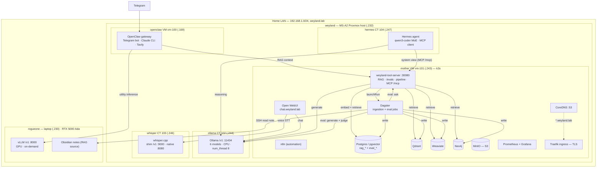
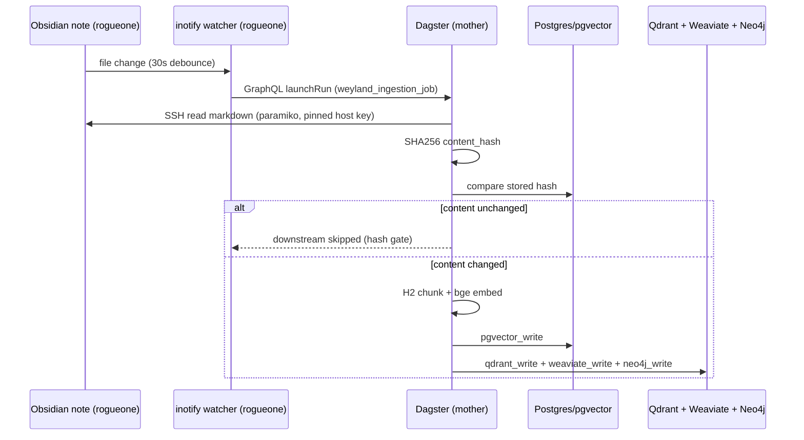
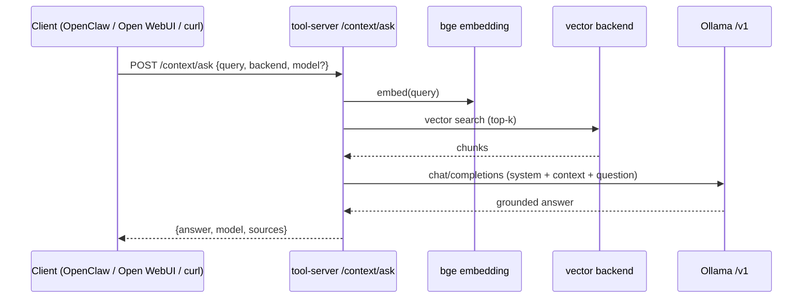
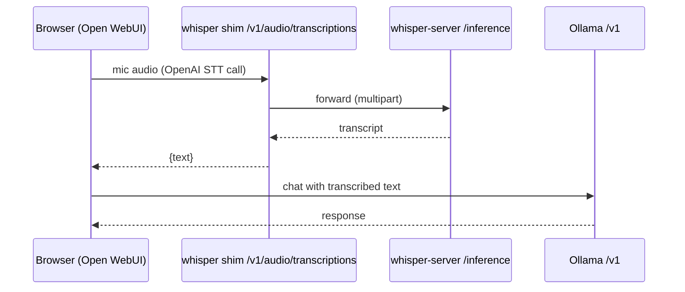
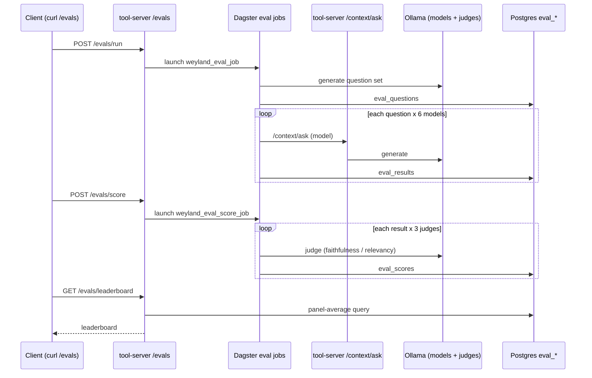
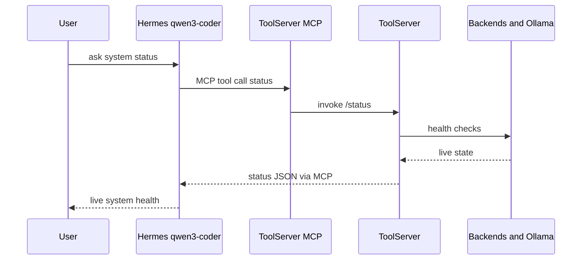

# Weyland — Architecture

**Living architecture document.** What Weyland is, what runs on it, how the pieces fit, and how data
flows through the validated paths. This is the synthesis layer above the registries and runbooks —
when they disagree, the registries ([hosts.md](hosts.md), [api.md](api.md)) are the source of truth
for *values*; this doc owns the *picture and the why*. Keep it current as the system evolves
(see [[feedback-keep-api-hosts-updated]]).

**Companion docs:** [hosts.md](hosts.md) · [api.md](api.md) · roadmap `aidlc-docs/backlog.md` ·
runbooks: [b6-minio](b6-minio-storage.md) · [b7-ollama](b7-ollama-runbook.md) ·
[b11-whisper](b11-whisper-runbook.md) · [b4-eval](b4-eval-runbook.md) ·
concepts: [llm-inference-cpu-vs-gpu](b7-llm-inference-cpu-vs-gpu.md) · ops: [test.md](test.md)

---

## 1. Overview

Weyland is a **home AI lab** for experimentation and learning — not production. It runs local LLM
inference, speech-to-text, multi-backend retrieval (RAG), pipeline orchestration, an evaluation
harness, observability, and object storage, all on a LAN, with Claude as the primary reasoning brain
behind an agent layer.

The design rests on **four clear roles** and one hardware principle:

```text
weyland   = bare-metal Proxmox host (the iron)
openclaw  = interaction / control plane (the agent + Telegram)
mother    = k3s AI platform (the shared services)
rogueone  = GPU inference + dev workstation (the muscle + the keyboard)
```

**Hardware principle (B7):** *CPU = capacity (big, cheap, slow); GPU = speed (small, dear, fast).*
weyland's CPU (Ryzen 9 9955HX, 96 GB) serves big models via Ollama; rogueone's GPU serves small fast
ones via vLLM. See [b7-llm-inference-cpu-vs-gpu.md](b7-llm-inference-cpu-vs-gpu.md).

---

## 2. Topology

Everything physical lives on one box — **weyland**, a Minisforum MS-A2 running Proxmox bare-metal —
plus **rogueone**, an external laptop on the same LAN. weyland hosts two VMs and two unprivileged
LXC containers:

```text
weyland (MS-A2, Proxmox, 192.168.1.232)
├── vm-100  openclaw   192.168.1.169   agent control plane (Docker)
├── vm-101  mother     192.168.1.243   k3s AI platform
├── ct-102  ollama     192.168.1.244   Ollama CPU LLM serving
├── ct-103  whisper    192.168.1.246   whisper.cpp CPU STT
└── ct-104  hermes     192.168.1.247   Hermes agent (qwen3-coder MoE) — system-view MCP client
rogueone (laptop, 192.168.1.230, RTX 5000 Ada 16 GB) — external; vLLM + dev + source notes
```

### Component map



---

## 3. Hosts & roles

| Host | What | IP | Access | Role |
|---|---|---|---|---|
| **weyland** | MS-A2, Proxmox bare-metal (Ryzen 9 9955HX 16C, 96 GB) | .232 | `root@weyland` | The iron: VM/CT lifecycle, snapshots, storage. *Stays infrastructure* — no app sprawl. |
| **mother** | VM vm-101, k3s | .243 | `emangini@mother` | Shared AI platform: tool-server, vector/graph stores, Dagster, UIs, observability, MinIO, DNS, ingress. |
| **openclaw** | VM vm-100, Docker | .169 | `emangini@openclaw` | Interaction/control plane: OpenClaw + Telegram; Claude CLI as primary brain; calls the tool-server + models. |
| **rogueone** | Laptop, RTX 5000 Ada 16 GB | .230 | `edwardmangini@rogueone` | GPU inference (vLLM) + dev workstation + Obsidian source notes. Not always-on. |
| **ollama** | LXC CT 102 | .244 | via `weyland` host | CPU LLM serving (Ollama, 6 models). |
| **whisper** | LXC CT 103 | .246 | via `weyland` host | CPU STT (whisper.cpp + OpenAI shim). |
| **hermes** | LXC CT 104 | .247 | via `weyland` host | Agent platform (B2): Hermes on `qwen3-coder` (MoE); MCP client of the tool-server's read-only system-view. |

**Boundaries (intentional):** the **VM boundary** = lifecycle / blast-radius / rollback; the
**k8s boundary** = deployable services; the **tool-server boundary** = the stable interface between
agents/workflows and platform state. Agents call the tool-server, *not* databases directly.

---

## 4. Networking & naming

- **One flat LAN** (`192.168.1.0/24`). All hosts/CTs are first-class on it (CTs bridge `vmbr0`).
- **CoreDNS** (on mother `:53`) is authoritative for **`weyland.lab`**: a wildcard maps `*.weyland.lab`
  → mother (Traefik), with specific zones overriding it for the standalone CTs
  (`ollama.weyland.lab` → .244, `whisper.weyland.lab` → .246). Everything else forwards to 1.1.1.1/9.9.9.9.
- **Traefik** (k3s ingress) terminates **TLS** for the `*.weyland.lab` UIs using an mkcert wildcard cert.
- **rogueone** also keeps `/etc/hosts` entries for `*.weyland.lab` (it isn't pointed at CoreDNS).
- **DHCP reservations** pin the CTs (`.244`, `.246`) so endpoint URLs stay stable.
- **Addressing convention:** k3s services → `mother:<NodePort>` or `*.weyland.lab` (Traefik);
  standalone CTs → reserved IP / `*.weyland.lab`; in-cluster-only → `*.weyland.svc`.

---

## 5. Component inventory

### mother (k3s, namespace `weyland` unless noted)
| Component | Endpoint | Purpose |
|---|---|---|
| weyland-tool-server (v0.4.0) | `mother:30080` | RAG retrieval (4 backends) + `/context/ask` (RAG gen) + `/evals/*` + `/pipeline/trigger` + health, **+ `/mcp` system-view MCP server** (read-only tools for agents, `fastapi-mcp` Streamable HTTP). The platform's HTTP boundary. |
| Postgres + pgvector | `weyland-postgres.weyland.svc:5432` | `rag_documents`/`rag_chunks` (vector 384-dim) + `eval_*` tables. In-cluster only. |
| Qdrant | `mother:30083` (HTTP), `:30084` (gRPC) | vector store, collection `weyland_chunks`. |
| Weaviate | `mother:30087` (gRPC 50051) | vector store, class `WeylandChunk`. |
| Neo4j | `mother:30085` (HTTP), `:30086` (Bolt) | graph + vector index (GraphRAG foundation), APOC. |
| Dagster | `dagster.weyland.lab` (3 pods) | ingestion job + eval jobs (`weyland_eval_job`, `weyland_eval_score_job`). |
| Open WebUI | `chat.weyland.lab` | browser voice/chat → Ollama (chat) + whisper (STT). |
| n8n | `n8n.weyland.lab` | workflow automation (ingestion role retired → Dagster; retained for other automation). |
| Prometheus + Grafana | `grafana.weyland.lab` (ns `monitoring`) | observability (cluster/node/pod dashboards). |
| MinIO | `s3.weyland.lab` (S3), Filestash `files.weyland.lab` (ns `minio`) | object storage (8 TB USB → mother). |
| APISIX | `mother:30090` (gateway), `apisix.weyland.lab` (dashboard) | API gateway. |
| Headlamp | `headlamp.weyland.lab` | Kubernetes UI. |
| CoreDNS | `mother:53` | LAN DNS resolver for `weyland.lab`. |
| Traefik | (ingress) | TLS front door for `*.weyland.lab`. |

### weyland CTs
| Component | Endpoint | Purpose |
|---|---|---|
| Ollama (CT 102) | `ollama.weyland.lab:11434/v1` (.244) | CPU LLM serving — 6 models, `num_thread 8`, one model resident (`OLLAMA_MAX_LOADED_MODELS=1`). |
| whisper-server (CT 103) | `whisper.weyland.lab:8080/inference` (.246) | native whisper.cpp STT (multipart). |
| whisper OpenAI shim (CT 103) | `whisper.weyland.lab:9000/v1/audio/transcriptions` (.246) | OpenAI-compatible STT adapter → whisper-server. |
| Hermes (CT 104) | `192.168.1.247` (agent; no served API) | Agent platform (B2). Brain → Ollama `qwen3-coder` (MoE); **MCP client** of the tool-server `/mcp` system-view (read-only v1). Runbook [b2-hermes-runbook.md](b2-hermes-runbook.md). |

### rogueone
| Component | Endpoint | Purpose |
|---|---|---|
| vLLM | `rogueone:8000/v1` | GPU LLM serving (Qwen), on-demand. |
| Obsidian vault | (local) | the RAG source document(s); read by Dagster over SSH. |

---

## 6. Data stores

- **Postgres / pgvector** — the spine. `rag_documents` + `rag_chunks` (384-dim `bge` vectors) is the
  primary RAG store; `eval_runs / eval_questions / eval_results / eval_scores` + `eval_leaderboard`
  view back the eval harness (B4). Reused (not a new DB) for evals by design.
- **Qdrant / Weaviate / Neo4j** — parallel vector/graph backends, all written in the *same* Dagster
  run and all queryable via the tool-server (`?backend=`). Neo4j adds a vector index + graph edges
  (GraphRAG foundation).
- **MinIO** — S3-compatible object storage (model artifacts, datasets, backups). Filestash is the UI
  (the community console is stripped). See [b6-minio-storage.md](b6-minio-storage.md).
- **Embeddings** — `BAAI/bge-small-en-v1.5` (384-dim), baked into both the tool-server and Dagster
  images so ingestion and query embed identically.

---

## 7. Model serving

| Path | Where | Engine | Use |
|---|---|---|---|
| **Large LLMs (capacity)** | weyland CT 102 (CPU) | Ollama (llama.cpp/GGUF) | RAG generation, eval, batch — 6 models, ~13–89 s/RAG-call. Prefer MoE (low active params). |
| **STT** | weyland CT 103 (CPU) | whisper.cpp `large-v3` | voice → text, faster-than-real-time; OpenAI-shim for drop-in clients. |
| **Small fast LLMs (speed)** | rogueone (GPU) | vLLM | low-latency utility inference (Qwen), on-demand. |
| **Reasoning brain** | (cloud) | Claude (via Claude CLI in OpenClaw) | the primary high-quality reasoning backend. |

All inference speaks the **OpenAI `/v1` shape**, so clients (tool-server, Open WebUI, future agents)
are engine-agnostic — Ollama today, vLLM if a GPU is added, same endpoint contract. The eval harness
(B4) found **gpt-oss:20b** the most defensible RAG model across a 3-judge panel.

---

## 8. Key flows

### 8.1 Ingestion (Obsidian note → 4 vector backends)


### 8.2 RAG query (`/context/ask`)


### 8.3 Voice chat (Open WebUI → whisper → Ollama)


### 8.4 Evaluation (single-path eval → panel → leaderboard)


### 8.5 Agent path (Telegram → OpenClaw)
Telegram → OpenClaw gateway → **Claude CLI** (primary reasoning) with tools: the `weyland-context`
skill calls the tool-server (`/context/search`) for semantic RAG; the `rogueone-vllm` skill calls
vLLM for local utility inference. (Voice-note STT through OpenClaw is deferred — see
[b11-whisper-runbook.md](b11-whisper-runbook.md); Open WebUI is the working voice path today.)

### 8.6 Agent system-view (Hermes → MCP → tool-server)
B2 v1, validated 2026-06-14: the agent answers about the *live system* by calling read-only MCP tools
over Streamable HTTP — never touching databases directly. One MCP URL; OpenClaw registers the same
line (N+M). Write/act tools are excluded (gated on B14).


---

## 9. Cross-cutting concerns

- **DNS + TLS (the "cellular" front door, U9):** CoreDNS + Traefik + an mkcert wildcard give every UI
  a trusted `https://<name>.weyland.lab`. UIs go through Traefik; data/serving endpoints stay on
  NodePorts / CT IPs.
- **Secrets & creds:** lab dev password (`weyland_dev_password`) for UIs, supplied via k8s Secrets
  (never committed); DB/Neo4j passwords via `secretKeyRef`; default-SA token automount disabled
  (least privilege). LAN-only posture.
- **Storage:** RWO single-instance Deployments (pgvector/qdrant/weaviate/neo4j/n8n/open-webui) use
  `strategy: Recreate` to avoid volume-lock deadlocks. Model/eval data on NVMe (rpool); MinIO bulk on
  the 8 TB USB.
- **Observability:** Prometheus + Grafana (B5 Phase 1). Phase 2 (app ServiceMonitors + Alertmanager →
  Telegram) pending.
- **Deploy model:** manual `scp` → build on the node → import to k3s/containerd → `kubectl rollout`
  (tool-server, Dagster, Open WebUI). No GitOps yet (deliberate, until stable).

---

## 10. Operational lessons (why the CTs are tuned the way they are)

Both stem from the **same root: an LXC exposes the *host's* resources, not the container's cgroup**,
so Ollama mis-sizes against 96 GB / 16 cores instead of the CT's limits. (Details in
[b7-ollama-runbook.md](b7-ollama-runbook.md).)

- **`num_thread 8`** — llama.cpp defaulted to 16 threads (host core count), oversubscribing the
  14-CPU cpuset; spin-wait barriers collapsed throughput to ~0.15 tok/s. Pinning 8 → ~25 tok/s (~160×).
- **`OLLAMA_MAX_LOADED_MODELS=1`** — Ollama kept multiple models resident (sized vs the host's 96 GB),
  blew past the 48 GB cgroup, and got OOM-killed mid-eval. One model resident keeps it bounded.
- **Non-thinking models for structured output** — thinking models (qwen3) intermittently return empty
  content under `json_object`; eval generation/judging use non-thinking models for reliable JSON.

---

## 11. Design principles

- **Adaptive, lab-weighted:** built for experimentation/learning/flexibility, not production SLAs.
  High latency tolerance; don't over-engineer; cheap/used hardware over workstation-grade.
- **Capacity vs speed:** CPU (big/cheap/slow) for capacity, GPU (small/dear/fast) for speed; route by
  *"is something waiting?"* and *"does it fit?"*.
- **Engine-agnostic via OpenAI `/v1`:** every model endpoint speaks the same contract; clients don't
  care which engine is behind it.
- **Reuse over new infra:** evals reused Postgres + Dagster + Ollama rather than standing up new
  databases/orchestrators; Ragas rejected for being heavy + broken (see [b4-eval-runbook.md](b4-eval-runbook.md)).
- **Tool-server as the seam:** agents/workflows depend on the tool-server's stable HTTP contract, not
  on databases — so internals can change without breaking consumers.
- **Measure, don't assume:** the eval harness exists to replace vibes with data (and even revealed that
  single-judge LLM eval is itself untrustworthy → judge panel).

---

## 12. Roadmap & maintenance

Forward priorities live in `aidlc-docs/backlog.md` (wave-prioritized). Near-term threads: B5 Phase 2
(alerting), B2 (Hermes agent platform), B12 (API catalog), B15 (local-model coding agents). Tentative:
weyland eGPU, audio-generation (TTS/music) GPU eval, 70B CPU benchmark.

**Maintaining this doc:** update it (and [hosts.md](hosts.md)/[api.md](api.md)) whenever a host,
service, endpoint, port, DNS name, or major flow changes — same "done" bar as a runbook.
