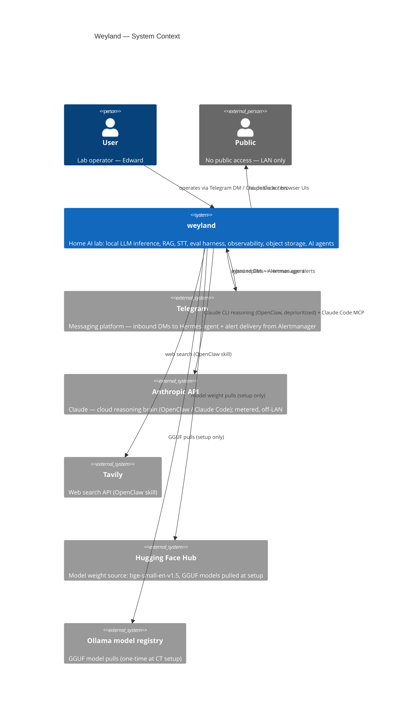
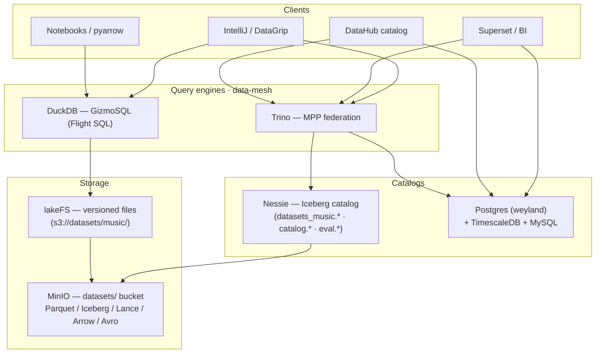
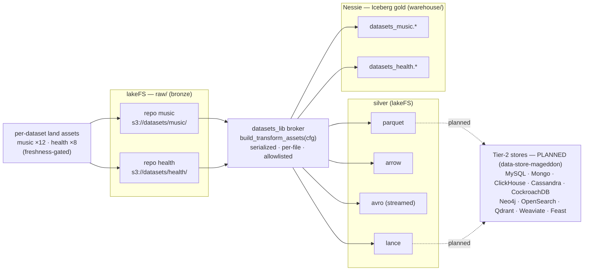

# Weyland — Architecture

**Living architecture document.** What Weyland is, what runs on it, how the pieces fit, and how data
flows through the validated paths. This is the synthesis layer above the registries and runbooks —
when they disagree, the registries ([hosts.md](hosts.md), [api.md](api.md)) are the source of truth
for *values*; this doc owns the *picture and the why*. Keep it current as the system evolves.

**Companion docs:** [hosts.md](hosts.md) · [api.md](api.md) · roadmap [backlog.md](backlog.md) ·
runbooks: [b6-minio](runbooks/storage-minio.md) · [b7-ollama](runbooks/model-serving-ollama.md) ·
[b11-whisper](runbooks/transcription-whisper.md) · [b4-eval](runbooks/eval-harness.md) ·
[trino](runbooks/trino.md) · [gizmosql](runbooks/gizmosql.md) · [superset](runbooks/superset.md) ·
[timescaledb](runbooks/timescaledb.md) · [datasets-lake](runbooks/datasets-lake.md) · [argocd](runbooks/argocd.md) ·
concepts: [llm-inference-cpu-vs-gpu](concepts/llm-inference-cpu-vs-gpu.md) · ops: [test.md](validation/test-commands.md)

**Diagrams:** [C4 Context](diagrams/c4-context.md) · [C4 Container](diagrams/c4-container.md) · Components: [mother](diagrams/c4-component-mother.md) · [hermes](diagrams/c4-component-hermes.md) · [ollama](diagrams/c4-component-ollama.md) · [whisper](diagrams/c4-component-whisper.md) · [openclaw](diagrams/c4-component-openclaw.md) · [rogueone](diagrams/c4-component-rogueone.md) · Flows (see §9 for the grouped table): [ingestion](diagrams/flow-ingestion.md) · [RAG query](diagrams/flow-rag-query.md) · [backend dispatch](diagrams/flow-backend-dispatch.md) · [voice chat](diagrams/flow-voice-chat.md) · [eval pipeline](diagrams/flow-eval.md) · [eval scoring](diagrams/flow-eval-scoring.md) · [health/status](diagrams/flow-health-status.md) · [pipeline trigger](diagrams/flow-pipeline-trigger.md) · [agent MCP](diagrams/flow-agent-mcp.md) · [mesh mTLS](diagrams/flow-mesh-mtls.md) · [tracing](diagrams/flow-tracing.md) · [guardrails](diagrams/flow-guardrails.md) · [act-tool](diagrams/flow-act-tool.md) · [ingress/TLS](diagrams/flow-ingress-tls.md) · [model gateway](diagrams/flow-model-gateway.md) · [model catalog](diagrams/flow-model-catalog.md) · [roadmap-sync](diagrams/flow-roadmap-sync.md) · [alerting](diagrams/flow-alerting.md) · [deploy](diagrams/flow-deploy.md) · [MLflow](diagrams/flow-mlflow.md)

---

## 1. Overview

Weyland is a **home AI lab** for experimentation and learning — not production. It runs local LLM
inference, speech-to-text, multi-backend retrieval (RAG), pipeline orchestration, an evaluation
harness, observability, and object storage, all on a LAN, with Claude as the primary reasoning brain
behind an agent layer.

The design rests on **four clear roles** and one hardware principle:

```text
weyland   = bare-metal Proxmox host (the iron)
mother    = k3s AI platform (the shared services)
hermes    = primary agent (Telegram front door + system-view)
rogueone  = GPU inference + dev workstation (the muscle + the keyboard)
```

**Hardware principle (B7):** *CPU = capacity (big, cheap, slow); GPU = speed (small, dear, fast).*
weyland's CPU (Ryzen 9 9955HX, 96 GB) serves big models via Ollama; rogueone's GPU serves small fast
ones via vLLM. See [concepts/llm-inference-cpu-vs-gpu.md](concepts/llm-inference-cpu-vs-gpu.md).

---

## 2. System context (C4 Level 1)



For the full internal container breakdown see [diagrams/c4-container.md](diagrams/c4-container.md). For component detail see the component diagrams linked above.

---

## 3. Topology

Everything physical lives on one box — **weyland**, a Minisforum MS-A2 running Proxmox bare-metal —
plus **rogueone**, an external laptop on the same LAN. weyland hosts two VMs and three unprivileged
LXC containers:

```text
weyland (MS-A2, Proxmox, 192.168.1.232)
├── vm-100  openclaw   192.168.1.169   agent control plane (Docker) — DEPRIORITIZED (B28)
├── vm-101  mother     192.168.1.243   k3s AI platform
├── ct-102  ollama     192.168.1.244   Ollama CPU LLM serving
├── ct-103  whisper    192.168.1.246   whisper.cpp CPU STT
└── ct-104  hermes     192.168.1.247   Hermes agent (qwen3-coder MoE) — primary agent + MCP client
rogueone (laptop, 192.168.1.230, RTX 5000 Ada 16 GB) — external; vLLM + dev + Claude Code
```

---

## 4. Hosts & roles

| Host | What | IP | Access | Role |
|---|---|---|---|---|
| **weyland** | MS-A2, Proxmox bare-metal (Ryzen 9 9955HX 16C, 96 GB) | .232 | `root@weyland` | The iron: VM/CT lifecycle, snapshots, storage. *Stays infrastructure* — no app sprawl. |
| **mother** | VM vm-101, k3s | .243 | `emangini@mother` | Shared AI platform: tool-server, vector/graph stores, Dagster, UIs, observability, MinIO, DNS, ingress. |
| **openclaw** | VM vm-100, Docker | .169 | `emangini@openclaw` | DEPRIORITIZED (B28). Was interaction/control plane: OpenClaw + Telegram; Claude CLI brain. |
| **rogueone** | Laptop, RTX 5000 Ada 16 GB | .230 | `emangini@rogueone` | GPU inference (vLLM) + dev workstation + Claude Code (MCP client). Not always-on. |
| **ollama** | LXC CT 102 | .244 | via `weyland` host | CPU LLM serving (Ollama, 6 models). |
| **whisper** | LXC CT 103 | .246 | via `weyland` host | CPU STT (whisper.cpp + OpenAI shim). |
| **hermes** | LXC CT 104 | .247 | via `weyland` host | **Primary agent** (B2): Hermes on `qwen3-coder` (MoE); MCP client of the tool-server system-view; Telegram front door (live 2026-06-14). |

**Boundaries (intentional):** the **VM boundary** = lifecycle / blast-radius / rollback; the
**k8s boundary** = deployable services; the **tool-server boundary** = the stable interface between
agents/workflows and platform state. Agents call the tool-server, *not* databases directly.

---

## 5. Networking & naming

- **One flat LAN** (`192.168.1.0/24`). All hosts/CTs are first-class on it (CTs bridge `vmbr0`).
- **CoreDNS** (on mother `:53`) is authoritative for **`weyland.lab`**: a wildcard maps `*.weyland.lab`
  -> mother (Traefik), with specific zones overriding it for the standalone CTs
  (`ollama.weyland.lab` -> .244, `whisper.weyland.lab` -> .246). Everything else forwards to 1.1.1.1/9.9.9.9.
- **Traefik** (k3s ingress) terminates **TLS** for the `*.weyland.lab` UIs using an mkcert wildcard cert.
- **rogueone** also keeps `/etc/hosts` entries for `*.weyland.lab` (it isn't pointed at CoreDNS).
- **DHCP reservations** pin the CTs (`.244`, `.246`) so endpoint URLs stay stable.
- **Addressing convention:** k3s services -> `mother:<NodePort>` or `*.weyland.lab` (Traefik);
  standalone CTs -> reserved IP / `*.weyland.lab`; in-cluster-only -> `*.weyland.svc`.

---

## 6. Component inventory

### mother (k3s, namespace `weyland` unless noted)
| Component | Endpoint | Purpose |
|---|---|---|
| weyland-tool-server (v0.4.0) | `mother:30080` | RAG retrieval (4 backends) + `/context/ask` (RAG gen) + `/evals/*` + `/pipeline/trigger` + health, **+ `/mcp` system-view MCP server** (read-only tools, `fastapi-mcp` Streamable HTTP), **+ B14 guardrail layer** (shadow-mode validators on `/context/*`, verdicts → `/metrics` + `guardrail_verdicts` table). Consumers: Hermes (CT 104) + **Claude Code** (rogueone, validated 2026-06-14). The platform's HTTP boundary. |
| Postgres + pgvector | `weyland-postgres.weyland.svc:5432` | `rag_documents`/`rag_chunks` (vector 384-dim) + `eval_*` tables. In-cluster only. |
| Qdrant | `mother:30083` (HTTP), `:30084` (gRPC) | vector store, collection `weyland_chunks`. |
| Weaviate | `mother:30087` (gRPC 50051) | vector store, class `WeylandChunk`. |
| Neo4j | `mother:30085` (HTTP), `:30086` (Bolt) | graph + vector index (GraphRAG foundation), APOC + **GDS** (PageRank/Louvain). B37 **AIDLC `:Entry` graph** (`RELATED_TO`/`SURFACES_AT`/`TAGGED`/`IN_VERTICAL` from frontmatter). |
| NeoDash | `mother:30088` | Neo4j dashboard/viz UI (free Bloom-alternative; browser connects to Bolt `:30086`). `k8s/neodash.yaml`. |
| Dagster | `dagster.weyland.lab` (3 pods) | ingestion job + eval jobs (`weyland_eval_job`, `weyland_eval_score_job`) + **model-catalog job** (`weyland_catalog_schedule`, 6h → `model_catalog` table) + **AIDLC-KB ingest** (`weyland_aidlc_kb_job`, on-demand → MinIO `aidlc-kb` → 4 backends + frontmatter graph, B37) + **TechDocs publish** (`weyland_techdocs_job`, hourly: `mkdocs build` → MinIO `techdocs` bucket, keeps the IDP docs in sync, B41). |
| LiteLLM model gateway | `mother:30400`, `litellm.weyland.lab` | OpenAI-compatible proxy fronting **all Gemini + OpenRouter** models (wildcard); human-gated off-LAN egress (valve) + spend alerts. [runbooks/model-gateway.md](runbooks/model-gateway.md). |
| Open WebUI | `chat.weyland.lab` | browser voice/chat -> Ollama (chat) + whisper (STT). |
| n8n | `n8n.weyland.lab` | workflow automation (ingestion role retired -> Dagster; retained for other automation). |
| GlitchTip | `glitchtip.weyland.lab` | **B51** error tracking (Sentry-SDK-compatible; web + worker + Valkey, meshed Postgres). tool-server + Dagster push errors via the Sentry SDK; issues → Port `glitchtip_issue` via webhook. Sibling alerting: **Loki ruler** LogQL rules → Alertmanager→Telegram (one pipeline for metric + log alerts). [runbooks/glitchtip.md](runbooks/glitchtip.md). |
| OpenCost | `opencost.weyland.lab` | **B55** k8s cost allocation (CNCF). Reads the existing Prometheus; **custom on-prem pricing** (bare-metal MS-A2, no cloud bill) → ~$48/mo box, k3s slice ~$15/mo. Feeds the Port **Cloud Cost** category: `cost` blueprint (Claude $200 + infra $48 + LiteLLM $0 ≈ $248/mo) + a Cost dashboard; OpenCost in the Launcher for live detail. [runbooks/opencost.md](runbooks/opencost.md). |
| Woodpecker CI | `woodpecker.weyland.lab` | **B56** CI/CD (kubernetes backend — pipeline steps run as cluster pods, can build/deploy the apps). GitHub OAuth; LAN-only → manual/cron triggers (GitHub can't push-webhook the lab). A `notify-port` step → Port `ci_pipeline`; Woodpecker in the Launcher. Shared build farm (Stud.IO migrates on later, B57). [runbooks/woodpecker.md](runbooks/woodpecker.md). |
| Argo CD | `argocd.weyland.lab` | **B58 (IaC, k8s lane)** GitOps CD — reconciles the k8s layer from the public repo (pull-based → LAN-safe). app-of-apps root + **28 apps onboarded** (20 raw auto-sync + 8 helm multi-source). Deploy flow is now **push to git → Argo reconciles** (scp retired). Chosen over Flux (UI). [runbooks/argocd.md](runbooks/argocd.md). |
| OpenTofu | (CLI on rogueone) | **B58 (IaC, non-k8s lane)** Terraform-fork for what Argo can't reconcile — SaaS + Proxmox. **State in MinIO** (`s3.weyland.lab/tofu-state`). **Port's 7 blueprints + all 5 Proxmox guests codified** (`tofu/port/` + `tofu/proxmox/`, brownfield CLI import; mother's passthrough disk frozen via `ignore_changes`); GitHub/DNS + Port entities next. [runbooks/opentofu.md](runbooks/opentofu.md). |
| Prometheus + Grafana | `grafana.weyland.lab` (ns `monitoring`) | observability (cluster/node/pod dashboards). |
| MinIO | `s3.weyland.lab` (S3), Filestash `files.weyland.lab` (ns `minio`) | object storage (8 TB USB -> mother). |
| APISIX | `mother:30090` (gateway, API/data plane), `apisix.weyland.lab` (dashboard, Keycloak SSO) | **Active API/data-plane gateway** — live routes front the tool-server `/context` + `/pipeline` and the qdrant/weaviate/neo4j backends (the API-client front door; browsers go via Traefik instead). Gateway itself is API-auth'd, not Keycloak. |
| Headlamp | `headlamp.weyland.lab` | Kubernetes UI. |
| weyland IDP (B3) | — (retired) | **RETIRED 2026-06-22 (B59)** — Backstage torn down: app + 12 `backstage_plugin_*` DBs + `weyland_idp` role + the `weyland_techdocs_job` Dagster asset + MinIO `techdocs` bucket, all removed. Replaced by **Port.io** (catalog parity — domain/systems/components/resources/APIs + live `k8s_workload` links, codified in `tofu/port/`) + **`docs.weyland.lab`** (MkDocs Material — browsable + searchable, Mermaid renders, closing B40). |
| **Port.io** (IDP replacement) | `app.port.io` (SaaS, EU org `org_KyCTEN4PVUv1D3TM`) | Internal Developer Platform — zero-maintenance SaaS; **replaced Backstage (retired 2026-06-22, B59)**. **Live integrations:** K8s exporter (`weyland-cluster`), Istio (Gateway/VirtualService CRDs), GitHub exporter (`github-weyland`, 6 repos), **Linear** (roadmap — status tracking; issues/teams/labels), **Unleash** webhook (`feature_flag` blueprint — OSS feature flags, `unleash.weyland.lab`, [runbooks/unleash.md](runbooks/unleash.md)), **SonarQube/Trivy/Semgrep** webhooks (`code_quality` + `security_scan` blueprints — code quality + SAST/IaC, [runbooks/code-quality.md](runbooks/code-quality.md)). **Port = launcher/catalog, not a status board:** the `endpoint` blueprint (31 entities) + a **Launcher** dashboard give one-click access to every UI/API; the `uptime_monitor` flow was **retired** (status went stale event-only) — **Uptime Kuma** (`kuma.weyland.lab`, 25 monitors, Telegram paging) is the live status board. In-cluster agent: `port-k8s-exporter` ns. **Roadmap split:** `docs/backlog.md` = design/rationale (git, ordered source); **Linear** (`emangini` workspace, projects Weyland Lab/Stud.IO/Service Transformation) = task status; Claude updates Linear via MCP ad-hoc (no auto-sync); Port ingests Linear for catalog tracking. **Categories wired (all of B43):** Kubernetes, Istio, GitHub, Incident Mgmt (Kuma), Project Mgmt (Linear), Feature Mgmt (Unleash), Code Quality (SonarQube/Trivy/Semgrep), **Cloud Cost (OpenCost, B55), CI/CD (Woodpecker, B56), Error Tracking (GlitchTip, B51)**. **Deploy/IaC:** Argo CD GitOps + OpenTofu (B58) codify the platform. **Catalog parity DONE (B59):** the Backstage catalog is mirrored into Port (domain/systems/components/resources/APIs + live `k8s_workload` links, codified in `tofu/port/catalog.tf`); **Backstage retired 2026-06-22**, docs now at `docs.weyland.lab` (standalone MkDocs Material). **B60 buildout (2026-06-24):** sidebar audited + pruned (9 redundant stock scorecards, the empty AI-Adoption dashboard, a dead Slack automation); **6 `service` entities** (all your repos) owned by **Weyland Team**; `production_readiness` scorecard **customized for a public lab** (B61); **`ai_session` "AI-Dev Usage" data product** (B62 — Claude Code telemetry via a B37-pattern Dagster pipeline: rogueone producer → MinIO → `ai_session_ingest`). **Decision: Port = the "see" layer, Hermes = the "do" layer** — self-service actions + workflows deferred (Port's cloud can't reach the LAN, and Hermes already does ops). |
| **Keycloak** (B1.1 — IdP / SSO) | `keycloak.weyland.lab` · `auth.weyland.lab` | **Central identity** — replaced the scattered dev-password logins (2026-06-24). k8s + meshed Postgres, `weyland` realm; realm + OIDC clients codified in `tofu/keycloak/`. **Every browser UI is behind it** (extended 2026-06-25): OIDC native (Grafana, GlitchTip, Open WebUI — true single login) + **forward-auth** via `traefik-forward-auth` (`auth.weyland.lab`) for everything else (MLflow, Kiali, filestash, Nessie, lakeFS, Unleash, SonarQube, Uptime-Kuma, Dagster, LiteLLM, docs-site, APISIX-dashboard, OpenCost, n8n, Woodpecker, Argo CD, Headlamp; cookie domain `weyland.lab`, single logout `/_oauth/logout`). Forward-auth gates *access* but keeps each app's own login (double-login on own-login apps). **NOT gated by design** (API-auth, not browser SSO): the S3 API, the data backends (qdrant/weaviate/neo4j NodePorts), and the APISIX gateway. Gotchas: Python OIDC apps need a combined CA bundle (system + mkcert root) for the back-channel; cross-ns Traefik middleware refs are blocked (local Middleware per ns); in-cluster pods reach `*.weyland.lab` via the `coredns-custom` forward; GlitchTip's allauth fought it → SSO via a DB-precreated social link (see memory). |
| **Data mesh — L1 storage** (B1.2) | `nessie.weyland.lab` · `lakefs.weyland.lab` | **Lakehouse storage foundation** (2026-06-25), ns `data-mesh`. **Nessie** = Iceberg catalog + git-branch table versioning (Postgres `nessie`, warehouse = MinIO `warehouse`, Iceberg REST `/iceberg`). **lakeFS** = git-style versioning for file/dataset products (Postgres `lakefs`, blockstore = MinIO `lakefs`). Both meshed to STRICT Postgres; forward-auth UIs, but pipelines/CLI hit the in-cluster svc directly (forward-auth is browser-only). Iceberg itself = the table format (no service; lands with Trino/Dagster writes). `k8s/data-mesh/`. Gotcha: Nessie STATIC S3 creds = flat URN ref + hyphen-free secret name — see memory `data-mesh-b1.2-storage`. |
| **Superset** (B65 Tier-2 #3) | `superset.weyland.lab` | **BI / SQL exploration** — Helm 0.17.2 / Superset 6.1.0, ns `data-mesh`. Keycloak OIDC (native, not forward-auth). Shared Valkey cache (Celery broker + results). Connected to: Trino (primary query engine), 11 Postgres databases, TimescaleDB. 48 datasets + charts + "Weyland Platform Overview" dashboard. DataHub native source ingestion. `k8s/superset/`. See [runbooks/superset.md](runbooks/superset.md). |
| **Valkey** (shared cache) | `valkey.data-mesh.svc:6379` | BSD open-source Redis fork (post-2024 SSPL relicense). Shared data-mesh cache — Superset Celery broker + results backend. Ephemeral (no persistence). RESP-compatible (DataGrip "Redis" datasource via port-forward). `k8s/data-mesh/valkey.yaml`. |
| **TimescaleDB** (B65 Tier-2 #4) | `timescaledb.data-mesh.svc:5432` | **Time-series** Postgres extension (`timescale/timescaledb-ha:pg16`), ns `data-mesh`. db `timeseries`. 5 hypertables fed hourly by Dagster `weyland_timeseries_job`: `eval_scores_ts` ← eval_scores, `guardrail_verdicts_ts` ← guardrail_verdicts, `dagster_run_durations` ← Dagster runs, `unleash_feature_metrics` ← client_metrics_env, `datahub_ingestion_runs` ← DataHub GMS GraphQL. Grafana datasource + Superset 10 charts. DataHub `emit_timescaledb`. `k8s/data-mesh/timescaledb.yaml`. See [runbooks/timescaledb.md](runbooks/timescaledb.md). |
| **MySQL** (B65 Tier-2 #5) | `mysql.data-mesh.svc:3306` | **Health** datasets, ns `data-mesh`. **Hydrated 2026-07-01** from silver Parquet by `datasets_health_mysql_load` — **6 databases** (grid `MySQL=Y`): `nhanes` (biomarkers), `big_five` (OCEAN personality), `who_gho` (population health), `cdc_physical_activity`, `brfss` (health behaviors), `nhis` — **32 tables** (dataset→db, parquet file→table). `k8s/data-mesh/mysql.yaml`. See [runbooks/datasets-hydration.md](runbooks/datasets-hydration.md). |
| MLflow (B10+B16) | `mlflow.weyland.lab` | Experiment tracking + model registry. **Postgres** backend store + **MinIO** `mlflow` artifact bucket (proxied via `--serve-artifacts`). Meshed (STRICT Postgres); **Keycloak SSO** (forward-auth, B1.1). `k8s/mlflow/`. |
| CoreDNS | `mother:53` | LAN DNS resolver for `weyland.lab`. |
| Traefik | (ingress) | TLS front door for `*.weyland.lab`. |
| Istio service mesh (B8 — ✅ done) | `istio-system` ns; Kiali `kiali.weyland.lab` (**Keycloak SSO**, forward-auth B1.1; Jaeger retired B48) | Sidecar mesh, minimal profile (no Istio gateway — Traefik stays ingress). Meshed: tool-server + 4 vector/graph backends + Dagster, **PERMISSIVE mTLS**; **Postgres STRICT** (proven enforcing — vector backends stay PERMISSIVE by design, they have un-meshed Prometheus/NodePort clients). TCP backends (neo4j Bolt / Postgres) need `appProtocol: tcp`. Mesh metrics + tracing consolidated onto the kube-prometheus-stack + Grafana (addon Prometheus dropped). Kiali read-only + RBAC-tightened. See [runbooks/service-mesh-istio.md](runbooks/service-mesh-istio.md). |

### weyland CTs
| Component | Endpoint | Purpose |
|---|---|---|
| Ollama (CT 102) | `ollama.weyland.lab:11434/v1` (.244) | CPU LLM serving — 6 models, `num_thread 8`, one model resident (`OLLAMA_MAX_LOADED_MODELS=1`). |
| whisper-server (CT 103) | `whisper.weyland.lab:8080/inference` (.246) | native whisper.cpp STT (multipart). |
| whisper OpenAI shim (CT 103) | `whisper.weyland.lab:9000/v1/audio/transcriptions` (.246) | OpenAI-compatible STT adapter -> whisper-server. |
| Hermes (CT 104) | `192.168.1.247` (agent; no served API) | **Primary agent** (B2). Brain -> Ollama `qwen3-coder` (MoE); **MCP client** of the tool-server `/mcp` system-view (read-only v1); **Telegram gateway front door** (live 2026-06-14, allowlisted DM -> agent). **B27 Kanban** (native SQLite): self-management + a `weyland-roadmap` board mirroring `backlog.md` (one-way, 6h); planning on Gemini-free via the LiteLLM gateway, workers local. Runbook [runbooks/agent-hermes.md](runbooks/agent-hermes.md). |

### rogueone
| Component | Endpoint | Purpose |
|---|---|---|
| vLLM | `rogueone:8000/v1` | GPU LLM serving (Qwen), on-demand. |
| Obsidian vault | (local) | personal notes — **no longer a RAG source** (retired in B25b). The RAG now ingests the GitHub repo (`docs/` + `nodes/`) via Dagster git-pull. |
| Claude Code | (local CLI) | Dev assistant; MCP client of tool-server `/mcp` (validated 2026-06-14). |

---

## 7. Data stores

- **Postgres / pgvector** — the spine. `rag_documents` + `rag_chunks` (384-dim `bge` vectors) is the
  primary RAG store; `eval_runs / eval_questions / eval_results / eval_scores` + `eval_leaderboard`
  view back the eval harness (B4). Reused (not a new DB) for evals by design.
- **Qdrant / Weaviate / Neo4j** — parallel vector/graph backends, all written in the *same* Dagster
  run and all queryable via the tool-server (`?backend=`). Neo4j adds a vector index + graph edges
  (GraphRAG foundation).
- **AIDLC knowledge corpus (B37)** — ~510 brand-neutral entries from the AIDLC knowledge repos, ingested
  from a private MinIO bucket by the on-demand `weyland_aidlc_kb_job` into the *same* 4 stores under an
  `aidlc-kb/` `source_path` namespace (KB-scoped hash-gate + prune; the docs-pipeline prunes are guarded to
  never touch it). Neo4j also holds a deterministic **frontmatter graph** — `(:Entry)` linked by
  `RELATED_TO`/`SURFACES_AT`/`TAGGED`/`IN_VERTICAL` (no LLM; fuzzy extraction is deferred to B38).
- **MinIO** — S3-compatible object storage (model artifacts, datasets, backups). Filestash is the UI
  (the community console is stripped). See [runbooks/storage-minio.md](runbooks/storage-minio.md).
- **Datasets lakehouse (B72/B75)** — a **bronze→silver→gold→stores** lakehouse over public **music** (12
  datasets) and **health** (8 datasets) sources, on a shared **`datasets_lib`** platform: a domain is a
  `DomainConfig` + three asset factories (`build_transform_assets` → `build_asset_checks` →
  `build_store_load_assets`). Per-dataset **land** assets write lakeFS `raw/` (bronze); a **brokered**
  fan-out — *one asset per format, process-isolated*, serialized (memory) — produces silver/gold. The
  reader dispatches on extension (csv · csv.gz · xpt · json), column names normalize + null-types coerce,
  tables are **per-file** (multi-file folders don't clobber), oversized tables **defer**. **Each format
  earns a distinct workload, not redundancy:**
  - **Parquet** — batch columnar analytics (Trino / DuckDB). The default query format.
  - **Lance** — ML / vector: fast random access, versioning, LanceDB. (Native AVX-512 — required the
    `cpu: host` Proxmox fix; see [[proxmox-vm-cpu-host-avx]].)
  - **Avro** — row-oriented + schema-evolution: the (streamed) format you'd push through **Kafka**.
  - **Arrow / Feather** — in-memory / IPC, zero-copy loads. *Transport, not a storage layer — kept for
    fast local loads + learning.*
  - **Iceberg** — ACID **gold** table (time-travel, schema evolution) over Parquet, in Nessie; per-file tables.

  A **quality gate** (`build_asset_checks` — native `@asset_check`: no-failures / expected-tables /
  valid-column-names) runs with the transform; **`build_store_load_assets`** then hydrates the grid's Tier-2
  stores (**MySQL done** — 6 health DBs, 32 tables; roadmap in
  [runbooks/datasets-hydration.md](runbooks/datasets-hydration.md)). Cataloged in DataHub by **custom-emit**
  (`emit_file_dataset` — typed Arrow schema + lineage) for raw + the four silver formats; the **iceberg
  source** handles gold. The DataHub **s3 source is unusable** here (PySpark run crashes on the executor JDK
  — `Subject.getSubject` gone in Java 18+), so one emit path covers everything. Full design:
  [runbooks/datasets-lake.md](runbooks/datasets-lake.md).
- **Trino (B65 Tier-2, 1st)** — single-node **federation query engine** in `data-mesh`; the keystone
  Superset / dbt / the B73 "use the data" work ride on. Catalogs: **`iceberg`** (the Nessie lake — via
  Trino's *native* Nessie connector, `iceberg.catalog.type=nessie`, NOT the generic REST which 403s
  [[trino-nessie-native-catalog]]) + **`postgresql`** (weyland DB, over the mesh). Query via CLI /
  IntelliJ (`jdbc:trino://…:8080`) / Superset; the web UI (`trino.weyland.lab`) is monitoring-only.
  Cataloged in DataHub as the query layer with sibling/upstream lineage to iceberg.
  [runbooks/trino.md](runbooks/trino.md).
- **DuckDB via GizmoSQL (B65 Tier-2, 2nd)** — DuckDB served over **Arrow Flight SQL** by **GizmoSQL**, in
  `data-mesh`. This exists because DuckDB's own JDBC is **embedded-only** (`jdbc:duckdb:<file>`, no
  `host:port`), so there's nothing for a client to connect to — GizmoSQL wraps the in-process engine in a
  Flight SQL *server*. **Persisted DuckDB** on a PVC (`DATABASE_FILENAME`); the silver is materialised as
  **base tables** — one per current lakeFS Parquet file, schema-per-domain (`datasets_music`/`datasets_health`)
  — by `scripts/gen_gizmosql_init.py tables`. Tables not views because GizmoSQL's Flight SQL **`GetTables`
  surfaces base tables but NOT views** → tables browse in DataGrip/IntelliJ (views were queryable-by-name but
  invisible to the IDE tree), and queries hit native columnar storage instead of re-reading Parquet. Embedded
  **single-node OLAP** — fast on columnar files (Parquet/Arrow/Lance) + the pyarrow bridge for the B72 formats;
  the IDE/notebook analytics engine.
  Meshed (Istio **mTLS**; the app runs `TLS_ENABLED=0` plaintext so clients drop `TLS_SKIP_VERIFY` — the
  mesh provides transport security). IDEA connects via the Arrow Flight SQL JDBC driver
  (`jdbc:arrow-flight-sql://mother:31337`). Cataloged in DataHub (platform `duckdb`, lineage ← `parquet`)
  by `emit_duckdb`. Runbook + gRPC-TLS ingress for external clients land at gate-close.
- **`model_catalog`** (Postgres) — current-state lookup of reachable hosted models (OpenRouter / Gemini /
  Ollama, with free flag + pricing + context), refreshed every 6h by Dagster (replace-by-source). Distinct
  from the normalized `models` infra-inventory table. See [runbooks/model-gateway.md](runbooks/model-gateway.md).
- **Embeddings** — `BAAI/bge-small-en-v1.5` (384-dim), baked into both the tool-server and Dagster
  images so ingestion and query embed identically.

- **Superset (B65 Tier-2 #3)** — BI/SQL exploration at `superset.weyland.lab`. Connects to Trino
  (primary), 11 Postgres databases, and TimescaleDB. 48 datasets, charts, and the "Weyland Platform
  Overview" dashboard. Keycloak OIDC (not forward-auth — avoids double-login). Shared Valkey cache.
  See [runbooks/superset.md](runbooks/superset.md).
- **TimescaleDB (B65 Tier-2 #4)** — time-series Postgres extension in `data-mesh`. 5 hypertables
  for temporal analysis of platform operational data (eval performance trends, guardrail decision
  rates, pipeline run durations, feature flag usage, catalog ingestion health). Fed hourly by the
  `weyland_timeseries_job` Dagster schedule. Grafana datasource registered; Superset has 10 charts.
  See [runbooks/timescaledb.md](runbooks/timescaledb.md).
- **MySQL (B65 Tier-2 #5)** — relational store for health/wellness/personality datasets in `data-mesh`,
  **hydrated 2026-07-01** from silver Parquet by `datasets_health_mysql_load` (the first
  `build_store_load_assets` arm). **6 databases** = the grid `MySQL=Y` set — NHANES, Big Five, WHO GHO, CDC
  Physical Activity, BRFSS, NHIS — **32 tables** (dataset→database, parquet file→table; USDA + Open Food
  Facts are `MySQL=N`, NHIS replaced UK Biobank). The intent: join personality profiles against dietary
  patterns and health behaviors. See [runbooks/datasets-hydration.md](runbooks/datasets-hydration.md).

### 7a. Query layer — Trino vs DuckDB (`data-mesh`)

Two SQL engines sit over the same lakehouse; they are **not redundant** — each owns a different job, and
picking the wrong one is slow or impossible:

| | **Trino** | **DuckDB (GizmoSQL)** |
|---|---|---|
| Shape | Distributed MPP (coordinator + workers) | Embedded single-node OLAP |
| Superpower | **Federation** — join *across* sources in one query | **Speed** on columnar files, one node |
| Reaches | Iceberg/Nessie **+** Postgres (+ more catalogs) | lakeFS Parquet via `httpfs` (+ Arrow/Lance/Avro via pyarrow) |
| Run mode | Always-on service | In-memory, lightweight, served via Flight SQL |
| Client URL | `jdbc:trino://…:8080` · Superset · CLI | `jdbc:arrow-flight-sql://…:31337` |
| Reach for it when… | cross-source joins, big federated scans, BI | fast single-node file analytics, the B72 format playground |

**Rule of thumb:** *need to federate many sources →* **Trino**; *need to go fast on the lake's files (or the
Lance/Avro/Arrow formats) →* **DuckDB**. Both live in `data-mesh`, both are cataloged in DataHub, and both
read the same MinIO-backed storage — they differ in *how* they reach it and *what* they're good at.



### 7b. Data domain structure

Weyland organizes data into **domain-scoped stores** — **music** and **health** (both live;
bronze→silver→gold), plus future domains, each own their own storage path, lakeFS repo, and Nessie
namespace. The `datasets/` MinIO bucket is the top-level envelope; domain data lives in subfolders.

Both domains run on a shared **`datasets_lib`** platform (`weyland_pipeline/assets/datasets_lib/`): a
per-dataset **land** asset writes lakeFS `raw/` (bronze), then `build_transform_assets(cfg)` — an asset
factory — fans each raw table out to five silver formats + Iceberg gold. A domain is a `DomainConfig`
(repo, namespace, per-format allowlists), not a new module. See [runbooks/datasets-lake.md](runbooks/datasets-lake.md).

**MinIO layout:**
```
datasets/              ← top-level bucket (domain envelope)
  music/               ← lakeFS repo `music` (s3://datasets/music/) — 12 datasets
    raw/               ← bronze: per-dataset land assets (HF, FMA zip, CSV) — csv
    parquet/ arrow/ avro/ lance/  ← silver: <table>/<file> per source file
  health/              ← lakeFS repo `health` (s3://datasets/health/) — 8 datasets (LIVE)
    raw/               ← bronze: NHANES (.xpt), WHO GHO (.json), Open Food Facts (.csv.gz), BRFSS/NHIS/… (.csv)
    parquet/ arrow/ avro/ lance/  ← silver (multi-format reader: csv / csv.gz / xpt / json)

warehouse/             ← Nessie Iceberg warehouse (separate bucket, all domains)
  datasets_music/      ← Iceberg gold — per-file tables (spotify_tracks, audioset_train, musicbrainz_artist, …)
  datasets_health/     ← Iceberg gold — per-file tables (nhanes_2017_2020_DEMO_J, who_gho_life_expectancy, …)
  catalog/             ← model_catalog
  eval/                ← eval_scores (Iceberg data product)
```

**Iceberg tables are named per source file** (`ice_ident`: `<table>` for single-file folders, `<table>_<file>`
otherwise). Naming by folder alone made multi-file folders (usda's 30 CSVs, musicbrainz splits, audioset
train/test) overwrite one table. Oversized tables (>15M rows, e.g. usda `food_nutrient` ~24M) are *deferred*
from Iceberg (they'd stall the warehouse write) but still land in the file formats.

**Iceberg namespace convention:** flat underscore-prefixed (`datasets_music`, `datasets_health`).
Trino's native Nessie connector (`catalog.type=nessie`) does **not** expose nested namespaces —
`TrinoNessieCatalog.listSchemas()` only returns top-level entries and there is no config flag to
enable recursion. The Trino 463 nested-namespace fix applies only to `catalog.type=rest`.
Workaround: flat underscore prefixes keep the domain signal without nesting.



---

## 8. Model serving

| Path | Where | Engine | Use |
|---|---|---|---|
| **Large LLMs (capacity)** | weyland CT 102 (CPU) | Ollama (llama.cpp/GGUF) | RAG generation, eval, batch — 6 models, ~13-89 s/RAG-call. Prefer MoE (low active params). |
| **STT** | weyland CT 103 (CPU) | whisper.cpp `large-v3` | voice -> text, faster-than-real-time; OpenAI-shim for drop-in clients. |
| **Small fast LLMs (speed)** | rogueone (GPU) | vLLM | low-latency utility inference (Qwen), on-demand. |
| **Hosted models (escalation)** | (cloud) via mother **LiteLLM** | Gemini + OpenRouter (free tiers) | stronger-than-local brains on demand; API-key (no subscription/ToS issue); human-gated egress. |

All inference speaks the **OpenAI `/v1` shape**, so clients are engine-agnostic. The eval harness
(B4) found **gpt-oss:20b** the most defensible RAG model across a 3-judge panel. **Claude brain note:**
B26's Hermes+Claude path was *declined* — a Claude Pro/Max subscription via a proxy is a ToS gray area,
metered API wasn't wanted; Claude-in-lab is instead **you driving Claude Code** (B29, already MCP-wired).

---

## 9. Key flows

Grouped by plane. **Data** = the RAG/eval data path; **Security/mesh** = how requests are protected and
observed; **Control/ops** = scheduled and operational paths.

| Plane | Flow | Diagram |
|---|---|---|
| Data | Ingestion (repo -> 4 vector backends) | [flow-ingestion.md](diagrams/flow-ingestion.md) |
| Data | RAG query (`/context/ask`) | [flow-rag-query.md](diagrams/flow-rag-query.md) |
| Data | Backend selection / dispatch (one of four) | [flow-backend-dispatch.md](diagrams/flow-backend-dispatch.md) |
| Data | Voice chat (Open WebUI -> whisper -> Ollama) | [flow-voice-chat.md](diagrams/flow-voice-chat.md) |
| Data | Evaluation pipeline (run -> panel -> leaderboard) | [flow-eval.md](diagrams/flow-eval.md) |
| Data | Eval scoring + leaderboard | [flow-eval-scoring.md](diagrams/flow-eval-scoring.md) |
| Data | Health / status aggregation (U12) | [flow-health-status.md](diagrams/flow-health-status.md) |
| Data | Pipeline trigger (`/pipeline/trigger` -> Dagster) | [flow-pipeline-trigger.md](diagrams/flow-pipeline-trigger.md) |
| Data | MLflow tracking + artifacts (B10+B16) | [flow-mlflow.md](diagrams/flow-mlflow.md) |
| Data | **Data-mesh L1 storage** — Nessie (Iceberg catalog + table versioning) + lakeFS (file/dataset versioning) on MinIO + Postgres (B1.2) | *foundation only — active read/write flows arrive with Trino (B1.4) + transform (B1.5); see §6 inventory* |
| Security/mesh | Agent system-view (Hermes / Claude Code -> MCP) | [flow-agent-mcp.md](diagrams/flow-agent-mcp.md) |
| Security/mesh | Service-mesh request path + mTLS (B8) | [flow-mesh-mtls.md](diagrams/flow-mesh-mtls.md) |
| Security/mesh | Distributed tracing pipeline (B8) | [flow-tracing.md](diagrams/flow-tracing.md) |
| Security/mesh | Guardrail validation (B14) | [flow-guardrails.md](diagrams/flow-guardrails.md) |
| Security/mesh | Audited act-tool (`/mcp-act`, B14) | [flow-act-tool.md](diagrams/flow-act-tool.md) |
| Security/mesh | Ingress / TLS front door | [flow-ingress-tls.md](diagrams/flow-ingress-tls.md) |
| Control/ops | Model-gateway routing (B26) | [flow-model-gateway.md](diagrams/flow-model-gateway.md) |
| Control/ops | model_catalog refresh (B26) | [flow-model-catalog.md](diagrams/flow-model-catalog.md) |
| Control/ops | Roadmap-sync -> Hermes Kanban (B27) | [flow-roadmap-sync.md](diagrams/flow-roadmap-sync.md) |
| Control/ops | Alerting (B5) | [flow-alerting.md](diagrams/flow-alerting.md) |
| Control/ops | Deploy / redeploy (build<->runtime isolation) | [flow-deploy.md](diagrams/flow-deploy.md) |

---

## 10. Cross-cutting concerns

- **DNS + TLS (the "cellular" front door, U9):** CoreDNS + Traefik + an mkcert wildcard give every UI
  a trusted `https://<name>.weyland.lab`. **Two front-door planes: Traefik fronts browser UIs; APISIX
  (`mother:30090`) is the API/data-plane gateway** (routes for context/pipeline + the vector/graph
  backends). Data/serving endpoints also stay directly reachable on NodePorts / CT IPs.
- **Secrets & creds:** most browser UIs are now **Keycloak SSO** (B1.1; OIDC or forward-auth) — `weyland_dev_password` is the Keycloak login + a fallback for the remaining own-login apps, supplied via k8s Secrets
  (never committed); DB/Neo4j passwords via `secretKeyRef`; default-SA token automount disabled
  (least privilege). LAN-only posture.
- **Storage:** RWO single-instance Deployments (pgvector/qdrant/weaviate/neo4j/n8n/open-webui) use
  `strategy: Recreate` to avoid volume-lock deadlocks. Model/eval data on NVMe (rpool); MinIO bulk on
  the 8 TB USB.
- **Observability:** Prometheus + Grafana (B5 — done). Alertmanager -> Telegram alerts live. App metrics via
  ServiceMonitors: qdrant, weaviate, apisix, coredns, **tool-server (B14 guardrails)**, **minio** (full
  scrape-target list in [api.md](api.md#metrics--scrape-targets-b5-phase-2b)).
- **Guardrails (B14 — shadow):** a pluggable validator layer at the tool-server seam runs on `/context/*`
  — `input` hook (LLM Guard prompt-injection) + `output` hook (LLM Guard toxicity, in-process NLI
  grounding). Ships **shadow-mode** (record-only, never blocks; per-validator `off|shadow|flag|block` via
  env); verdicts go to Prometheus (`/metrics`) + the `guardrail_verdicts` Postgres table (a future B1 data
  product). PII deferred (coded, unbaked → B34). Full spec: `aidlc-docs/construction/b14-guardrails-design.md`.
  The `act` hook (`policy.audit`, shadow) audits the `/mcp-act` action tools (`pipeline/trigger`,
  `evals/run`, `evals/score`) to `guardrail_verdicts.actor` (trusted `X-Forwarded-Consumer` header, NULL
  until the B17+B19 gateway). Enforcing policy gate deferred to the B35 pairing.
- **Deploy model:** manual `scp` -> build on the node -> import to k3s/containerd -> `kubectl rollout`
  (tool-server, Dagster, Open WebUI). No GitOps yet (deliberate, until stable).

---

## 11. Operational lessons (why the CTs are tuned the way they are)

Both stem from the **same root: an LXC exposes the *host's* resources, not the container's cgroup**,
so Ollama mis-sizes against 96 GB / 16 cores instead of the CT's limits. (Details in
[runbooks/model-serving-ollama.md](runbooks/model-serving-ollama.md).)

- **`num_thread 8`** — llama.cpp defaulted to 16 threads (host core count), oversubscribing the
  14-CPU cpuset; spin-wait barriers collapsed throughput to ~0.15 tok/s. Pinning 8 -> ~25 tok/s (~160x).
- **`OLLAMA_MAX_LOADED_MODELS=1`** — Ollama kept multiple models resident (sized vs the host's 96 GB),
  blew past the 48 GB cgroup, and got OOM-killed mid-eval. One model resident keeps it bounded.
- **Non-thinking models for structured output** — thinking models (qwen3) intermittently return empty
  content under `json_object`; eval generation/judging use non-thinking models for reliable JSON.

---

## 12. Design principles

- **Adaptive, lab-weighted:** built for experimentation/learning/flexibility, not production SLAs.
  High latency tolerance; don't over-engineer; cheap/used hardware over workstation-grade.
- **Capacity vs speed:** CPU (big/cheap/slow) for capacity, GPU (small/dear/fast) for speed; route by
  *"is something waiting?"* and *"does it fit?"*.
- **Engine-agnostic via OpenAI `/v1`:** every model endpoint speaks the same contract; clients don't
  care which engine is behind it.
- **Reuse over new infra:** evals reused Postgres + Dagster + Ollama rather than standing up new
  databases/orchestrators; Ragas rejected for being heavy + broken (see [runbooks/eval-harness.md](runbooks/eval-harness.md)).
- **Tool-server as the seam:** agents/workflows depend on the tool-server's stable HTTP contract, not
  on databases — so internals can change without breaking consumers.
- **Build↔runtime anti-corruption layer:** images cross from the build context into the cluster's runtime
  store only via an explicit `docker save | k3s ctr images import` — a deliberate isolation boundary, not just
  plumbing. (Why nerdctl's build-straight-into-k3s was declined at B24: it collapses this ACL.)
- **Measure, don't assume:** the eval harness exists to replace vibes with data (and even revealed that
  single-judge LLM eval is itself untrustworthy -> judge panel).

---

## 13. Roadmap & maintenance

Forward priorities live in [backlog.md](backlog.md). Recently done: B10+B16 (MLflow), B3 (Backstage IDP — slices A+B; **⚠️ decommission in progress → Port.io**), B41 (self-syncing IDP), B26, B27, B8 (Istio mesh), B37 (AIDLC KB ingest). **Port.io IDP — DONE** (B43/B59 migration; B60 full buildout 2026-06-24): catalog + 6 services + scorecards customized for a public lab + the `ai_session` AI-Dev Usage data product; **Port = "see", Hermes = "do"** (self-service actions deferred). Backstage retired. **B48 done: full LGTM observability** — Loki (logs) + Alloy + Tempo (traces) on MinIO, all in Grafana (Explore/Drilldown); Istio + Kiali repointed to Tempo; **Jaeger retired**. Also added: **KEDA**, **Proxmox metrics** (pve-exporter → Grafana), mother raised to 44GB/12vCPU (2026-06-28). **B1.1 done (2026-06-24): Keycloak SSO** — central IdP replacing the dev-password logins; **6 apps cut over** initially (OIDC: Grafana/GlitchTip/Open WebUI; forward-auth: MLflow/Kiali/filestash), then **extended 2026-06-25 to EVERY browser UI** (forward-auth added to Unleash/SonarQube/Uptime-Kuma/Dagster/n8n/Woodpecker/Argo CD/Headlamp/OpenCost/LiteLLM/docs-site/APISIX-dash + Nessie/lakeFS). The data/API plane (S3 API, NodePort backends, APISIX gateway) stays API-auth'd — can't browser-SSO it. B1 data mesh **sequenced into slices B1.1–B1.9** (see backlog); **B1.2 done (2026-06-25): L1 storage foundation** — Nessie (Iceberg catalog + table versioning) + lakeFS (file/dataset versioning) in ns `data-mesh`, on MinIO + Postgres. **B65 Tier-2 datastores (2026-06-27/28, in progress):** Trino ✅ · DuckDB/GizmoSQL ✅ · Superset ✅ · TimescaleDB ✅ · MySQL ✅ (health, **hydrated 2026-07-01** — `datasets_lib` `build_store_load_assets`, the start of data-store-mageddon; 6 DBs / 32 tables). **Datasets platform refactor (2026-06-30/07-01):** the two domain transforms collapsed onto a shared **`datasets_lib`** (3 factories: transform → asset-checks → store-load); health domain fully landed; musicbrainz via parquet-direct. **Data domain restructure (2026-06-28):** MinIO `datasets/` bucket reorganized to domain subfolders (`datasets/music/`, `datasets/health/`); lakeFS `music` repo moved to `s3://datasets/music/`; Iceberg namespace renamed to `datasets_music` (Trino native Nessie connector limitation — nested namespaces not surfaced). Deferred: B38, B40, Tempo metrics-generator (span-metrics/service-graph).

**Maintaining this doc:** update it (and [hosts.md](hosts.md)/[api.md](api.md)) whenever a host,
service, endpoint, port, DNS name, or major flow changes — same "done" bar as a runbook.
