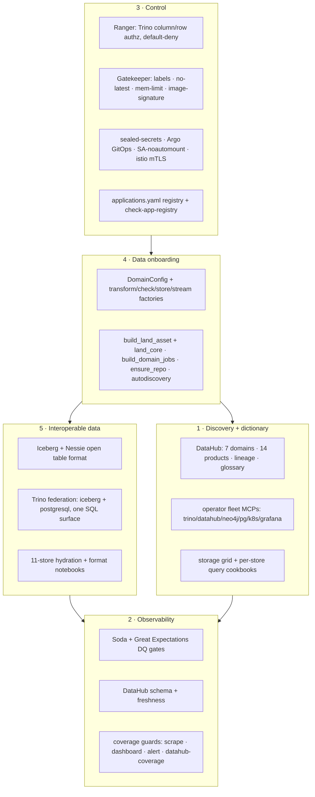

# The five data-platform capabilities — a coverage audit (B156)

Nick Tune, in *Architecture Modernization*, names five capabilities a self-serve data platform must
provide for a data mesh to actually function: **discovery + dictionary**, **observability** (source and
source-schema availability plus data quality), **control** (onboarding and data-store control),
**data onboarding** (the paved path for a new source/dataset), and **interoperable data** (usable across
engines). This page audits the weyland mesh against those five, maps each capability to the concrete
service(s) that provide it, grades every surface, and records the residual gaps. It is the B156
deliverable.

This is the **capability lens**; its sibling is [self-serve-platform-planes.md](self-serve-platform-planes.md)
(B158), which audits the same estate against Dehghani's three self-serve *planes*. The two overlap by
design — B158's plane-1 (infra) is this audit's *interoperable-data* + *onboarding* foundation, its
plane-2 (product experience) is *data onboarding*, its plane-3 (mesh experience) is *discovery* +
*observability* — but they cut differently: Nick Tune's **control** capability (authz, admission,
secrets, GitOps) is barely visible in the plane lens and is graded in full here. The mesh's design of
record is [design/data-mesh-design.md](../design/data-mesh-design.md).

**Method.** One evidence pass per capability over the repo + the live cluster, grading each named surface
**coherent / partial / gap** against that capability's defining question. Live spot-checks were run on
2026-09-07 (kubectl against the k3s control plane on `mother`, and the operator fleet Trino MCP) rather
than trusting the repo alone. Cheap gaps are fixed in this pass (fix-don't-file); structural gaps are
recorded below as dispositioned follow-ups, most already tracked under B158/B88.

## Verdict at a glance

| # | Capability | Defining question | Verdict |
|---|---|---|---|
| 1 | **Discovery + dictionary** | Can a consumer *find* a dataset and understand what it means? | **Strong.** DataHub catalog/glossary/lineage + fleet MCPs + cookbooks; the only weak spot is MCP-side search reachability. |
| 2 | **Observability** | Is source + schema availability + data quality *visible and enforced*? | **Strong.** Soda/GE quality gates + DataHub schema/freshness + the coverage-guard quartet governing the estate by CI. |
| 3 | **Control** | Is onboarding + data-store access *governed*, not ad-hoc? | **Strong.** Ranger authz, Gatekeeper admission, sealed-secrets, Argo GitOps, the `applications.yaml` registry, istio mTLS. Admission still audits-only (by design). |
| 4 | **Data onboarding** | Is there a *paved path* for a new source/dataset? | **Strong at core, source-specific at the fetch edge.** `DomainConfig`→factories + B158's land/operate/repo/registration paving; fetch+parse stay per-source by nature. |
| 5 | **Interoperable data** | Is data usable *across engines*, not siloed per store? | **Strong.** Iceberg/Nessie open format + Trino federation + 11-store hydration + format notebooks. |

**Bottom line: B156's premise holds — all five capabilities are already satisfied.** This is a
verification audit, not a build. Every residual gap is either already tracked (B158 plane leaks, B88
supply-chain promotion) or a known operator-plane degradation (DataHub MCP token). No new blocking gap
was found; one ripe *promotion* (image-signature dryrun→deny) is recorded.

## Capability → service map

---

## Capability 1 — Discovery + dictionary

**Defining question: can a consumer find a dataset and understand what it means?**

| Surface | Verdict | Evidence |
|---|---|---|
| **DataHub catalog** | Coherent | `datahub_emit.py` (~35 `emit_*` fns) emits **7 domains** (3 bounded data + 4 operational), **14 data products**, table + dbt column lineage, a glossary (concepts + terms), structured properties/tags, and `emit_siblings` merging each mart's trino/dbt/iceberg twins into one governed entity. GMS + frontend + actions **all Running** (verified live 2026-09-07, `data-mesh` ns, 9d uptime). |
| **Glossary / dictionary** | Coherent | Business glossary emitted per domain (e.g. Finance Concepts + 4 terms); the DataHub governance layer is codified, git-emitted (memory `datahub-governance-layer`). |
| **Operator fleet MCPs** | Coherent | 6 read-only MCP servers (trino/datahub/neo4j/postgres/k8s/grafana) behind the FastMCP compositor; an operator answers cross-product *where-does-X-live* / lineage / quality. Trino MCP verified live (`list_catalogs` → `iceberg, postgresql, system`; `list_schemas iceberg` → all three domains). |
| **Storage grid + query cookbooks** | Coherent | The storage-grid table + per-store query cookbooks (trino/dbt-marts/neo4j/timescaledb/clickhouse/gizmosql/cassandra/cockroach/mysql/mongodb/weaviate) tell a consumer *how to read each surface* — the dictionary's how-to half. |

**Gaps:**
1. **DataHub *search* over the fleet MCP times out** *(LOW, known — tracked)* — `datahub_search` timed out (30s) during this audit. This is the documented GMS-token-on-the-gateway degradation from B113, not a catalog failure: GMS/frontend are up and the UI at `datahub.weyland.lab` serves discovery directly. Fixing it is a gateway-token config change (memory `datahub-ingestion-secrets-durable`), left as a recorded operator-plane follow-up.

---

## Capability 2 — Observability (source + schema availability + data quality)

**Defining question: is source availability, schema availability, and data quality visible and enforced?**

| Surface | Verdict | Evidence |
|---|---|---|
| **Data quality — Soda** | Coherent | `soda/configuration.yml` + `soda/checks/` per domain; last runs green (finance **22/22**, B157/B158). Runs shell-out from the `/opt/soda-venv` (memory `soda-dq-l5-slice-c`). |
| **Data quality — Great Expectations** | Coherent | `k8s/ge-docs/` deployed (GE 0.18 isolated venv, memory `ge-great-expectations-b77b`) with its own `prometheusrule.yaml`. |
| **Schema + freshness availability** | Coherent | DataHub carries per-dataset schema + freshness; Dagster `@asset_check` + the 30-day freshness gate guard staleness at materialize time; ODCS contracts (B157) pin the schema and are live column-vs-Trino conformance-checked. |
| **Governance-by-CI (estate completeness)** | Coherent | The coverage quartet — `check-servicemonitor-coverage.sh` / `check-dashboard-coverage.sh` / `check-alert-coverage.sh` (the infra trilogy) **plus `check-datahub-coverage.sh`** (B158-A, every mesh table Trino exposes is catalogued). The last is a nightly CronJob `datahub-coverage` (verified live: ran 21h ago, `America/New_York` 03:05). 16 `check-*.sh` guards total. |
| **DQ contracts** | Coherent | ODCS DQ rules + `check-odcs-contracts.sh` gate (B157) make the quality rules a versioned contract, not just runtime checks. |

**Gaps:**
1. **Column-level lineage covers dbt marts only** *(MEDIUM, by design — tracked in B158)* — non-tabular assets carry no schema; table lineage is complete.
2. **No source-*availability* alerting distinct from freshness** *(LOW)* — a dead upstream source surfaces as a stale-data freshness failure at the next run, not as a live "source unreachable" signal. Acceptable for a $0 lab on static snapshots; noted for a future live-refresh domain.

---

## Capability 3 — Control (onboarding + data-store control)

**Defining question: is onboarding and data-store access governed, not ad-hoc?** *(the capability the plane lens barely sees — graded in full here.)*

| Surface | Verdict | Evidence |
|---|---|---|
| **Data authz — Ranger** | Coherent | `k8s/data-mesh/ranger.yaml` + `trino-ranger.yaml`; `ranger-admin` pod **Running** (verified live, 49d). Native-Ranger Trino authz is **default-deny** (memory `ranger-trino-authz-b-l5`) — access is granted, not assumed. |
| **Admission control — Gatekeeper** | Coherent (audit mode) | 4 constraint templates **live** (verified 2026-09-07): `k8srequiredlabels`, `k8snolatesttag`, `k8srequirememlimit`, `k8simagesignature`. All in `enforcementAction: dryrun` (the house rule — audit first), with real audited counts: no-latest **26**, mem-limit **3**, ns-owner-label **1**, image-signature **0**. Policy-as-code (Rego) for the control plane (B88 Phase 3). |
| **Secrets — sealed-secrets** | Coherent | `k8s/sealed-secrets/` with committed `sealed/*.yaml`; allow-list model, controller key is the bricking risk (memory `sealed-secrets-b69`). Credentials never live in git plaintext. |
| **GitOps — Argo** | Coherent | `k8s/argocd/`; every workload is Argo-managed with `selfHeal: true` — the cluster's desired state IS git (memory `argocd-gitops-gotchas`). The one control leak: user-code image deploy is *not* GitOps for code (baked image + `ctr import`, tracked in B158 plane-1 gap 3). |
| **Onboarding registry** | Coherent | `applications.yaml` (the canonical registry) + `check-app-registry` guard (Argo↔registry) + `emit_port_components` reconciling registry→Port on every catalog emit. A new service is *declared*, then guarded. |
| **Workload identity** | Coherent | `rbac-default-sa-noautomount.yaml` (default SA can't auto-mount a token — memory `k8s-sa-token-vs-rbac-split`); istio **STRICT mTLS** + forward-auth on the data-mesh surfaces. |

**Gaps / promotions:**
1. **Image-signature admission is dryrun, not deny** — **RIPE for promotion; its invariant prerequisite is now built (2026-09-07).** The constraint sits at **0 violations**, meaning every running image already comes from `registry.weyland.lab` or a reviewed publisher (the honest prefix-check the Rego can do without egress). But a Gatekeeper *audit* is transient — it never sees a non-running CronJob, a scaled-to-zero store, or a chart-rendered image. This audit surfaced that gap and it was **closed in the same B156 follow-on** (fix-don't-file): two guards now enforce *every declared image is from a reviewed source* against the same policy — `scripts/check-image-provenance.sh` (CI, pre-merge, in `repo-guards`) and the nightly `image-provenance` CronJob (live, enumerates all declared workloads incl. chart-rendered ones). Both verified 2026-09-07: the CI git scan clears all 120 declared images, the enumerator clears **569** live across every declared workload. The estate now *provably* conforms — at commit time and nightly — the precondition the `deny` flip rested on. The flip itself remains a **B88 supply-chain follow-up**, deliberately not made here: it needs the actual *signing* of images not rebuilt since `supply-chain.sh` landed + two clean audit cycles (the policy file documents dryrun→deny as "the single most destructive change"). See [supply-chain.md § the provenance invariant](../runbooks/supply-chain.md#the-provenance-invariant--what-makes-0-violations-trustworthy).
2. **User-code deploy is not GitOps for code** *(LOW–MED, tracked in B158 plane-1)* — the one place the Argo control story leaks.

---

## Capability 4 — Data onboarding (the paved path for a new source/dataset)

**Defining question: is there a paved path for a new source/dataset, or is each one hand-assembled?**

| Surface | Verdict | Evidence |
|---|---|---|
| **Declarative core** | Coherent | One `DomainConfig` fed to four factories (`build_transform_assets` / `build_asset_checks` / `build_store_load_assets` / `build_stream_produce_assets`): from ~80 declared lines a domain gets silver (5 formats) + Iceberg gold + a blocking quality gate + fan-out to 11 Tier-2 stores + vector embedding + streaming, all generated. Adding a store target is one allowlist entry. |
| **Ingestion scaffold** | Coherent (B158-B) | `datasets_lib.landers.build_land_asset` + the dagster-free `land_core` generate the land wrapper (freshness skip, fail-closed on zero rows, minio client, per-table parquet write, metadata) from one `produce()` callable; the four finance landers migrated to it. |
| **Operate plane** | Coherent (B158-C) | `build_domain_jobs(cfg)` generates land/transform/hydrate jobs + a STOPPED land schedule from the config; land/transform split single-sourced from `cfg.land_deps` (cannot drift). |
| **Storage bootstrap** | Coherent (B158-D) | `lakefs_repo.ensure_repo` self-provisions a domain's lakeFS repo on first land (idempotent, `s3://datasets/<repo>`); Iceberg namespace + table auto-provision from `cfg.namespace`. |
| **Registration** | Coherent (B158-F) | `all_assets` / `all_asset_checks` derived from imports (autodiscovery); the `AssetChecksDefinition`-subclass footgun is regression-guarded (`_collect.py` + `test_collect.py`). |
| **Catalog onboarding** | Coherent | `datahub_emit.py` emits the new domain's catalog entities; ODCS contract + `gen_odcs_contract.py` produce the contract from the substance. |

**Gaps:**
1. **Fetch + `*_parse` stay source-specific** *(inherent, not a gap — tracked in B158 plane-2)* — a FRED JSON, an EDGAR XBRL payload and a yfinance frame share no structure, so the *irreducible* source-specificity is hand-written; the factory removed the reducible boilerplate. Honest scope, not a paving miss.
2. **New-store/new-env onboarding still touches k8s** *(MEDIUM, tracked in B158 plane-1)* — a genuinely new store or credential means editing/pushing `user-code.yaml`.

---

## Capability 5 — Interoperable data (usable across engines)

**Defining question: is data usable across engines, or siloed per store?**

| Surface | Verdict | Evidence |
|---|---|---|
| **Open table format** | Coherent | Iceberg + Nessie: gold tables are Iceberg with Nessie catalog/branching; no engine-proprietary lock-in. Trino reads the Nessie `main` ref through one shared `iceberg` catalog. |
| **Federation** | Coherent | Trino federates heterogeneous sources behind one SQL surface — verified live: `list_catalogs` → `iceberg, postgresql, system`; `iceberg` exposes `datasets_finance`, `datasets_health`, `datasets_music`, `dbt`, `analytics`, `eval` with **no per-namespace catalog file edit**. |
| **Multi-store hydration** | Coherent | The same silver dataset fans out to 11 Tier-2 stores (Timescale, ClickHouse, Cassandra, CockroachDB, MySQL, MongoDB, Neo4j, Qdrant/Weaviate/LanceDB, GizmoSQL) — the data is usable in whatever engine a consumer's workload needs. |
| **Format portability** | Coherent | Silver written in 5 formats (parquet/arrow/avro/lance + Iceberg gold); the format notebooks demonstrate reading each. |
| **Semantic + BI reach** | Coherent | Cube semantic layer + Lightdash + Superset all read the marts; the data reaches BI and semantic engines, not just SQL. |

**Gaps:** none material. Interoperability is the mesh's strongest capability — it is the whole point of the Iceberg/Nessie/Trino foundation.

---

## Consolidated gap register + disposition

No gap in this audit is a new blocking defect. Dispositions:

| Gap | Capability | Size | Disposition |
|---|---|---|---|
| DataHub search over fleet MCP times out (GMS token on gateway) | 1 | Low | **Tracked** — known B113 operator-plane degradation; UI discovery unaffected. |
| Column lineage covers dbt marts only | 2 | Med | **By design** — tracked in B158 plane-3; non-tabular assets carry no schema. |
| No live source-*availability* signal distinct from freshness | 2 | Low | **Accepted** — static snapshots; revisit for a live-refresh domain. |
| Image-signature admission still dryrun | 3 | — | **Ripe promotion, not a defect** — estate already conforms (0 violations); dryrun→deny is a B88 supply-chain follow-up gated on signing not-recently-rebuilt images. |
| User-code deploy not GitOps for code | 3 | Low–Med | **Tracked** — B158 plane-1 gap 3. |
| Fetch/parse source-specific | 4 | — | **Inherent, not a gap** — irreducible source-specificity; B158 plane-2. |
| New store/env forces a k8s edit | 4 | Med | **Tracked** — B158 plane-1 gap 2. |

**Nothing fixed in-pass** because nothing surfaced that was both new and a cheap safe fix: the two candidate "actions" (image-signature deny; DataHub MCP token) are respectively destructive-if-rushed and a gateway config change, and the rest are already tracked. This is the correct outcome for a verification audit whose premise was "likely already satisfied."

## Definition of Done (8 pillars, applied)

This is an audit doc that deploys nothing; the DoD's repo-tooling lens governs.

1. **Docs** — this page (auto-navved under Concepts); cross-linked from/to B158. **Done.**
2. **Diagrams** — LikeC4 placement **N/A** (no new deployed component). A separate `flow-*.md` is not warranted — the audit is a capability→service *mapping*, not a non-obvious decision/fallback/refusal path; the inline capability-map mermaid suffices. **N/A (inline diagram present).**
3. **Demos** — the audit **is** its own evidence: the capability→service claims were live-verified 2026-09-07 (kubectl: Gatekeeper templates + constraint violation counts, Ranger pod, DataHub GMS, `datahub-coverage` cron; fleet Trino MCP: catalogs + schemas). No UI to UAT beyond the standing `datahub.weyland.lab` eyes-on. **Done (audit/CLI).**
4. **Cleanup** — read-only audit; no data or cluster state created. **Done.**
5. **Tracking** — B156 flipped to DONE on close (backlog + Linear EMA-213); residual gaps dispositioned above against existing items (B158/B88), not auto-filed. **On close.**
6. **Ops** — N/A (no deployed workload, no new guard script). The live checks are by-hand audit spot-checks; the governance-by-CI they confirm (`datahub-coverage`, coverage quartet) already runs on its own timers. **N/A.**
7. **Scan** — no code/deps added (pure doc). **N/A.**
8. **Cascade** — no shared symbol touched; reverse-sweep: verified this audit's cross-refs to B158 and the storage-grid/cookbook surfaces resolve, and that no capability claim contradicts the live cluster. **Done.**
