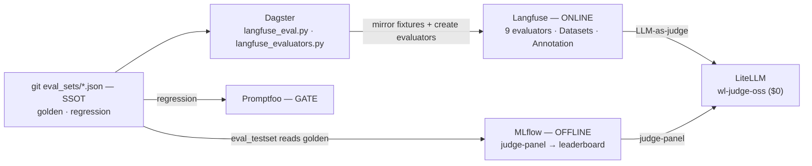

# Federated Evals

**One exam, many graders.** weyland grades its RAG/agents three ways — an offline benchmark, an online live-traffic
lane, and a CI gate — and they all draw from *one* git-owned set of fixtures. This page is the whole shape: the source
of truth for the questions, the tools that grade, who owns what, and why each grader exists rather than another.

## The problem it solves

Evaluation fragments fast: each tool wants its own question set, so a "score went down" could mean the *system* got
worse OR the *exam* changed (this exact confound burned a real B96 investigation on 2026-07-20 — run 5 scored ~0.30
below neighbours across all six models because the questions differed, not the system). Federation fixes it: **git owns
the questions; every grader reads the same file.** A score delta then means system quality, by construction.

## Source of truth

**git `weyland_pipeline/eval_sets/*.json` is the SSOT for eval fixtures.** Each set is one JSON —
`{name, description, questions:[{type, q}]}`:

- **`golden.json`** — the B96 benchmark: 10 conceptual + 10 lexical, pinned. A pinned exam *is a git commit*.
- **`regression.json`** — the Promptfoo gate set: a few targeted questions incl. a deliberate off-corpus honest-negative.

Everything downstream *reads* these files. Nothing forks them.

## The tools and what each does

| Tool | Lane | What it actually does |
|---|---|---|
| **git `eval_sets/`** | **SSOT** | Defines the exams; a commit is the pin |
| **MLflow** (B84) | **OFFLINE benchmark** | Judge-panel + `mlflow.evaluate` over `golden`, pre-deploy → `eval_leaderboard` (which model/prompt wins) |
| **Langfuse** (B103) | **ONLINE live-traffic** | 9 native LLM-as-judge evaluators score real `rag-generate` traces per-trace → Scores; + Datasets + Human Annotation |
| **Promptfoo** | **CI regression GATE** | Small assertion-carrying set (`regression`) — "did editing the prompt break something" |
| **LiteLLM** | **judge model** | Serves `wl-judge-oss` (gpt-oss:20b, $0) — the model every judge runs on |
| **Dagster** | **the engine** | `langfuse_eval.py` (mirror fixtures → Datasets), `langfuse_evaluators.py` (create native evaluators), `eval_testset`→`eval_run_matrix`→`eval_scores` (offline pipeline) |

## Who owns what (source vs mirror)

- **git owns the exam** (`eval_sets/`). Source of truth.
- **Langfuse owns online scoring** — the 9 native evaluators, the Scores/Sessions views, the Annotation queue. Its
  Datasets (`weyland-golden`, `weyland-regression`) are **mirrors** of the git sets, never the source.
- **MLflow owns the offline leaderboard** (`eval_leaderboard`) — the pre-deploy benchmark result.
- **Promptfoo owns the CI gate** — its `tests:` block mirrors `regression.json`.
- **LiteLLM owns the judge model**; the apps own nothing (they're what's being graded).

## The three lanes, side by side (what makes them different)

| | **Offline (MLflow / B84)** | **Online (Langfuse / B103)** | **Gate (Promptfoo)** |
|---|---|---|---|
| When | pre-deploy benchmark | continuous, on live traffic | CI, on prompt edit |
| Grades | RAG × models over `golden` | every `rag-generate` trace | a small targeted set |
| Judge | judge-panel (MLflow) | 9 native evaluators (Langfuse) | deterministic + llm-rubric |
| Output | `eval_leaderboard` | Langfuse **Scores** on traces | pass/fail gate |
| Fixture | `golden` | `golden` (mirrored) | `regression` |

Benchmark answers "which model/prompt is best?"; the online lane answers "how is production doing *right now*?"; the
gate answers "did this change regress?". Same questions, different jobs.

## The 9 online evaluators

Created programmatically via Langfuse's `/api/public/unstable/evaluation-rules` API, judged by `wl-judge-oss` ($0):
**7 managed** (Relevance, Helpfulness, Hallucination, Conciseness, Toxicity, Contextrelevance, Faithfulness) +
**2 custom** (`citation` — does it cite sources?; `refusal` — does it decline when the context lacks the answer?).

## The flow

## Gotchas

- **Native evaluators are programmatic** — under `/api/public/unstable/evaluators` + `/evaluation-rules`, NOT
  `/api/public/eval-configs` (which 404s). Rules have **no per-rule model** → all share the LLM connection's default, so
  we run everything on `wl-judge-oss`.
- **SSRF block:** private-IP LLM connections are refused ("Blocked IP address detected") — fix is
  `LANGFUSE_LLM_CONNECTION_WHITELISTED_HOST`, not the no-op `LANGFUSE_UNSAFE_TRUSTED_PRIVATE_IPS` (langfuse#13097).
- All of it is codified as Dagster `registrations` assets, so a Langfuse DB reset rebuilds the evaluators + dataset
  mirrors by re-materializing.

Runbook: [../runbooks/langfuse.md](../runbooks/langfuse.md) § Evaluation · Demo:
[../demos/langfuse-evaluation.md](../demos/langfuse-evaluation.md) · Design: `aidlc-docs/langfuse-evaluation-design.md` ·
Memory `langfuse-evaluation-b103`. Related: the B84 offline suite, B96 golden set.
