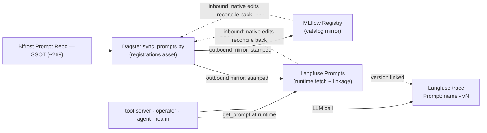

# Federated Prompts

**One place to author a prompt; every tool that needs it stays in sync; every LLM call is traceable to the exact
version that produced it.** This page is the whole shape of prompt federation in weyland — the source of truth, the
tools, who owns what, and why each tool is in the picture rather than another.

## The problem it solves

weyland had **three** prompt stores drifting apart: the **Bifrost Prompt Repository** (the reusable gateway library),
the **MLflow Prompt Registry** (app-integrated prompts), and **Langfuse** (needed for runtime trace linkage). Editing a
prompt in one left the others stale, and there was no way to tie a production answer back to the prompt version that
generated it. Federation makes **Bifrost the single source of truth (SSOT)** and flows every prompt out to the others,
then wires the apps to fetch at runtime so each trace carries its prompt version.

## Source of truth

**Bifrost Prompt Repository is the SSOT.** ~269 prompts, authored/managed there (UI, or the git-committed
`register_bifrost_prompts.py` for the durable set; app prompts live in the `app-integrated` folder). Bifrost is
model-agnostic — `{{var}}` mustache variables, auto-extracted. A prompt exists in the federation only if it exists in
Bifrost.

Exception by design: the **Realm of Agents** owns its own per-agent role prompts (`roster.py`/`roles.py`); those are
*pulled into* Bifrost as `role-<key>` so the Realm stays the source for its own prompts without duplication.

## The tools and what each does

| Tool | Role in federation | What it actually does |
|---|---|---|
| **Bifrost** | **SSOT + management surface** | Author/version/organize every prompt; also the MCP gateway + LLM egress |
| **Dagster** (`sync_prompts.py`, asset `prompt_federation_synced`) | **the sync engine** | Reconciles inbound (native Langfuse/MLflow edits → Bifrost) then mirrors outbound (Bifrost → Langfuse + MLflow); weekly + on-demand |
| **Langfuse** | **runtime fetch + trace linkage** | Apps `get_prompt()` here at runtime; every LLM trace shows a `Prompt: <name> - vN` chip |
| **MLflow** | **catalog mirror** | Keeps the ML Prompt Registry in step for MLflow-native workflows |
| **The apps** (tool-server, operator, agent, realm) | **consumers** | Fetch `production` from Langfuse at runtime (TTL-cached) + attach the prompt object to the trace (`_lf_generation`, `prompt=`) |
| **LiteLLM / Bifrost egress** | **model routing** | Unrelated to prompt storage — carries the actual LLM call |

## Who owns what (source vs mirror)

- **Bifrost owns authoring + versioning.** Everything else is downstream.
- **Langfuse is a MIRROR** (runtime fetch + linkage) — never the source. A Langfuse edit is *reconciled back* to Bifrost,
  not treated as authoritative.
- **MLflow is a MIRROR** (catalog) — same.
- **The Realm owns its role prompts**, which flow *into* Bifrost.
- **The apps own nothing** — they consume the Langfuse mirror at runtime.

The key insight: **linkage is created at FETCH time, not author time.** That decouples the source of truth (Bifrost)
from where the linkage lives (Langfuse) — you get one management surface *and* prompt→trace linkage in the observability
tool.

## The flow

## What makes the tools different

- **Bifrost vs Langfuse/MLflow:** Bifrost is a *management* surface (author, organize, version) and the SoT; Langfuse is
  an *observability* surface (traces, linkage); MLflow is an *ML registry*. Same prompt, three purposes.
- **Bidirectional, not one-way:** a native edit in the Langfuse playground or MLflow flows *back* to Bifrost
  (`reconcile_inbound()` runs first, then outbound). Loop-safe via a content-hash + a `synced-from-bifrost:<hash>`
  provenance stamp; conflict = last-write-wins by timestamp.
- **The normalizer:** the stores model prompts differently — Bifrost + Langfuse use chat messages `[{role,content}]`
  with `{{var}}`; MLflow uses a flat string template with `{var}` (`str.format`). `sync_prompts.py` translates both
  directions — it's a normalizer, not a copy.
- **Automatic:** the sync is the `prompt_federation_synced` Dagster `registrations` asset (weekly + on-demand), not a
  manual step.

## Gotchas

- **Native-edit detection keys on the version-level `commitMessage`, not Langfuse `tags`** — tags are prompt-level
  (sticky across versions), so a native edit inherits v1's stamp and would be falsely skipped.
- The Dagster sync uses the **Langfuse REST API** (httpx), not the langfuse SDK — the SDK's `packaging<26` pin clashes
  with the dagster lockfile.

Runbook: [../runbooks/prompt-federation.md](../runbooks/prompt-federation.md) · Demo:
[../demos/prompt-federation.md](../demos/prompt-federation.md) · Design: `aidlc-docs/prompt-federation-design.md`.
