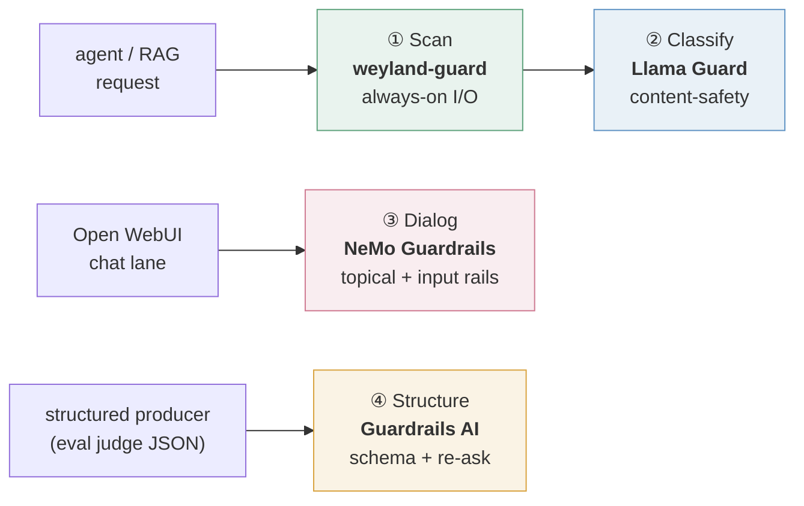

# The Guardrails Platform (B115 — defense-in-depth)

**Status:** ✅ **LIVE (2026-08-03)** — all four paths deployed and verified. Every path is OSS / self-hosted → **$0**.

No single guardrail catches everything. A prompt-injection scanner says nothing about whether an answer is *on-topic*;
a topical rail says nothing about whether a JSON blob *matches its schema*; none of them classify *content safety* the
way a purpose-trained model does. So the lab runs **four complementary, industry-standard tools**, each doing one job,
composed as **defense-in-depth** — the same pattern production stacks use (they typically run two or three of these).
They're **complementary, not competing.**

---

## The four paths

| # | Path | Tool | The one job it does | Where it sits |
|---|------|------|---------------------|---------------|
| ① | **Scan** | **weyland-guard** (Prompt Guard 2 · Presidio · NLI) | fast **I/O sanitization** — injection · PII · grounding · act-policy (toxicity via the Classify layer) | the always-on first layer, at the agent edge + the MCP gateway |
| ② | **Classify** | **Llama Guard** (Meta) | model-based **content-safety classification** (safe / unsafe + category) | a classifier the Scan layer calls — **1B on CPU** (default) → **8B on-demand GPU** (escalation) |
| ③ | **Dialog** | **NeMo Guardrails** (NVIDIA) | **topical / conversational** control — keep the assistant in scope | the guarded **`weyland-operator`** chat model in Open WebUI |
| ④ | **Structure** | **Guardrails AI** | **output-schema validation** — validate + **re-ask** the model to repair | structured-output producers (the eval LLM-as-judge) |

---

## How they compose

Each guard runs on the surface where it earns its keep — not every layer on every request.

- **Scan** is the always-on baseline every agent request passes through (fire-and-forget SHADOW → ~zero added latency).
- **Classify** is the model-based second opinion the Scan layer can call — the 1B answers by default; the 8B is spun up
  on the GPU only when a heavier verdict is wanted.
- **Dialog** wraps only the **conversational** surface — a dedicated guarded chat model, so general chat stays unguarded.
- **Structure** wraps only **structured-output** producers — where a malformed blob silently breaks a downstream consumer.

Alongside these sit the lab's **pre-action authorization** (the operator's confirm-rails + the enforcing `policy.gate`)
and **offline eval** (the B84 LLM-judge lane) — the act-safety and quality lanes that complete the picture.

---

## Why four tools, not one

Each addresses a **distinct failure mode** a single tool can't:

- **Scan** stops the *input/output* attacks and leaks (injection, PII) — fast, on every request (toxicity moved to Classify).
- **Classify** catches *content-policy* violations a keyword/embedding scanner misses (weapons, self-harm, CSAM, toxicity) with a
  model trained for exactly that — and grades them by category (the 8B binned a request S9/*weapons* where the 1B said
  S1/*violent crime*: the sharper call is why the stronger tier exists).
- **Dialog** keeps a *conversation* in scope — refuse off-domain requests, resist jailbreaks — which the stateless I/O
  scanners have no notion of.
- **Structure** guarantees a *machine-readable contract* — valid JSON matching a schema, re-generated on failure — so a
  producer's output can't silently corrupt what reads it.

---

## Engineering realities (the honest part)

- **Fail-open, everywhere.** Every guard degrades to "not guarded", never "no answer" — a guard outage must never take a
  response offline. Scan/Classify verdicts ship **SHADOW** (record-only) first; you measure the false-positive rate on
  real traffic *before* promoting anything to `block`.
- **Dependency isolation forced services.** Classify, Structure, and Dialog each run as their **own** service, not
  in-process — Guardrails AI pins `click<=8.2.0` (irreconcilable with the Dagster/dbt/huggingface stack), and NeMo's tree
  is just as opinionated. The tool's *dependency politics* dictated the architecture as much as any design argument did.
- **The reliable primitive beats the elegant one.** NeMo's signature **Colang** topical rail would not fire (across two
  builds and the original trial); the fix was to route topicality through the **`self check input`** LLM-judge that
  *does* fire, with a custom refusal message for identical UX. When an elegant primitive won't cooperate after honest
  attempts, switching to the proven-but-plainer one is the engineering call.

---

Full design + decision record: `../design/guardrails-platform.md`. Operations, per-layer tuning, and the demo:
[runbooks/guardrails.md](../runbooks/guardrails.md) · [demos/guardrails.md](../demos/guardrails.md). Sequence flows:
[flow-guardrails](../diagrams/flow-guardrails.md) (Scan/Classify) · [flow-eval-scoring](../diagrams/flow-eval-scoring.md) (Structure).
