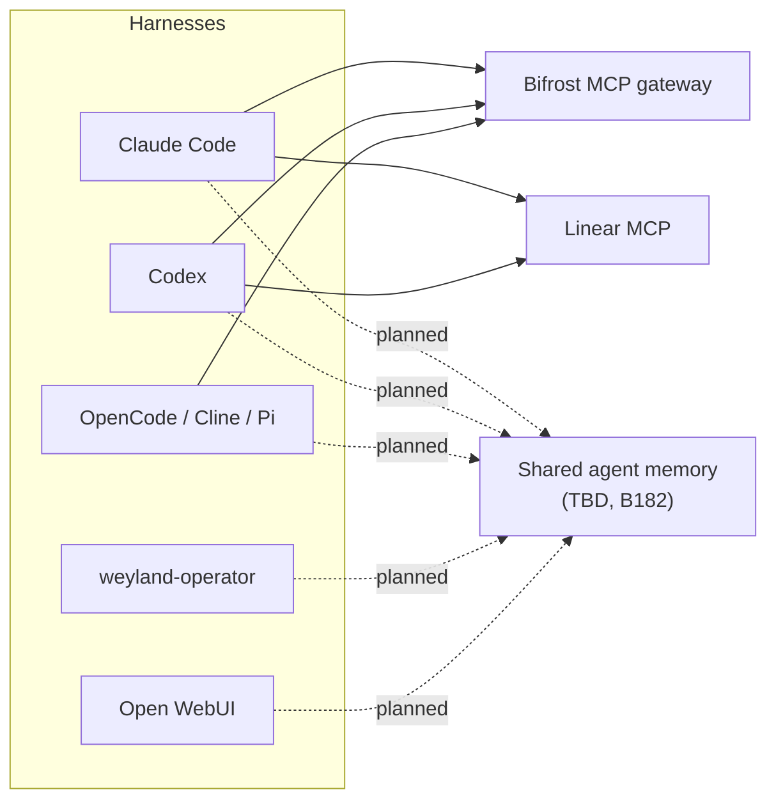

# Multi-Harness Agents

**weyland is not a Claude Code lab — it is a multi-harness lab.** Several agent front-ends ("harnesses") drive the
same repos and the same platform, and each can be swapped for another. This page is the shape of that layer: which
harnesses exist, what they share, what is still per-harness, and the one missing shared component — **memory**.

## The harnesses

| Harness | Where | Model / brain | Reaches the platform through | Reads its instructions from |
|---|---|---|---|---|
| **Claude Code** | rogueone (terminal) | Anthropic (Claude) | MCP: tool-server, **Bifrost**, **Linear**, CodeScene, Context7, Serena, Figma | `CLAUDE.md` (imports `AGENTS.md`); AIDLC in `.claude/` |
| **Codex** (CLI + ChatGPT desktop) | rogueone | GPT-5.5 via ChatGPT sign-in (sub-included) | MCP: **Bifrost**, **Linear**, Keploy; Linear "Work on issue" launcher (`codex://`) | `AGENTS.md` |
| **OpenCode** | rogueone (TUI) | free hosted (Gemini / Mistral / OpenRouter / Groq), direct | MCP: **Bifrost** | `AGENTS.md` |
| **Cline** | rogueone (IDE) | ChatGPT sign-in or free keyed providers | (per its own config) | its rules + `AGENTS.md` |
| **Pi** | rogueone (TUI) | free hosted, direct | no MCP configured | `AGENTS.md` |
| **Open WebUI** | mother — `chat.weyland.lab` | Ollama (rogueone) + the guarded `weyland-operator` lane | Ollama `/v1`, nemo-guardrails | its own system prompts |
| **weyland-operator** | mother — Telegram | local `qwen2.5:7b` (Haiku failover via LiteLLM) | tool-server `/mcp` + `/mcp-act`, the governed MCP gateway, the Realm of Agents | its own prompts (Bifrost-federated) |

Coding harnesses call hosted models **directly**, not through the MLflow AI Gateway (it cannot carry a multi-turn tool
loop — see [arch.md §8a](../arch.md)). Model choice is a driver, not an architecture: the harness was never the
bottleneck ([runbooks/coding-agents.md](../runbooks/coding-agents.md)).

## Editors — where the harnesses run

The IDEs are **hosts, not harnesses**: they run the harnesses above rather than being a separate agent layer.

| Editor | Harnesses it hosts | Linear / MCP reach | Notes |
|---|---|---|---|
| **IntelliJ IDEA** (primary, 2026.2) | **Agent-agnostic.** AI Assistant's **ACP agent registry** (`~/.local/share/JetBrains/acp-agents/installed.json`) has 11 installed: Claude Agent, **Codex**, **OpenCode**, **Cline**, Junie, Gemini CLI, GitHub Copilot, Grok Build, Kimi CLI, Mistral Vibe, Qwen Code. Plus plugins: **Claude Code**, **Codex launcher**, ProxyAI (→ LiteLLM), Copilot | each agent brings its own config (Claude Code / Codex already reach Linear + Bifrost) | also runs IntelliJ's own **MCP server** plugin (exposes the IDE to agents) and CodeScene / Sourcery (B106) |
| **VS Code** (1.139, secondary) | **Codex** extension (`openai.chatgpt`) — reads `~/.codex/config.toml`, so Linear + Bifrost come with it; **Claude Code** extension (`anthropic.claude-code`, installed 2026-09-25) | via the harness extensions; also a native `linear` entry in `~/.config/Code/User/mcp.json` (used only by Copilot Chat) | Copilot Chat stays available but is not the path |

Rule of thumb: pick the harness first, then open it in whichever editor is at hand. Configuration lives with the
harness (`~/.codex/`, Claude Code's `.mcp.json`), never per editor — so switching editors changes nothing about what
the agent can reach.

## What is shared (harness-neutral)

| Concern | Shared component | Status |
|---|---|---|
| **Tools** | **Bifrost** MCP gateway (aggregates the MCP fleet + compositor) and the tool-server | live |
| **Work tracking** | **Linear** (hosted MCP) + `docs/backlog.md` | live — Claude Code and Codex both read/write issues |
| **Skills** | Bifrost skill marketplace (`register_bifrost_skills.py` = git source of truth) | live |
| **Prompts** | Bifrost Prompt Repository (federated to Langfuse/MLflow) | live |
| **Retrieval** | `context_ask` / `context_search` (the lab RAG) | live |
| **Model egress** | LiteLLM / Bifrost (agentic), MLflow AI Gateway (chat/eval) | live |
| **Rules & conventions** | `AGENTS.md` (harness-neutral; `CLAUDE.md` imports it), `docs/`, AIDLC rule files | live |
| **Memory** (lessons, decisions, corrections) | **Shared agent memory — TBD** | **planned (B182)** |

## What is still per-harness

- **Memory.** Durable working memory lives only in Claude Code's auto-memory, and only Claude Code writes it.
  Interim (2026-09-25): `AGENTS.md` tells harnesses on rogueone to read its `MEMORY.md` index read-only — a stopgap,
  not sharing (no writes, not reachable from mother). This is the gap B182 closes.
- **Instructions — fixed 2026-09-25.** Codex, OpenCode and Pi read `AGENTS.md`; Claude Code reads `CLAUDE.md`, which
  now just imports `AGENTS.md` plus Claude-only specifics. The lab's conventions and hard rules moved into `AGENTS.md`
  (it previously held the upstream AI-DLC contributor guide, archived at `design/aidlc-upstream-agents-guide.md`), so
  every harness gets the same rules. Until B182 lands, `AGENTS.md` also points non-Claude harnesses at Claude's memory
  index (read-only).
- **MCP wiring.** Each harness has its own config file (`~/.claude.json`/`.mcp.json`, `~/.codex/config.toml`,
  `~/.config/opencode/opencode.json`). Bifrost keeps that down to one entry per harness.

## Shared agent memory (planned — every component TBD)

One store that every harness reads and writes. Nothing is decided; the design record holds the options and criteria:
[../design/shared-agent-memory-design.md](../design/shared-agent-memory-design.md).

- **Store:** TBD — candidates Basic Memory (Markdown + wikilinks, the format Claude's memory already uses), the MCP
  reference `memory` server, mem0 OpenMemory, Graphiti. ContextStream rejected (a second, proprietary store).
- **Gateway:** TBD — Bifrost is the leading candidate because Claude Code, Codex and OpenCode already connect to it.
- **Host / transport / source of truth / migration:** TBD.
- **Fixed constraints:** $0 (cloud acceptable if free), **one store not two**, reachable over MCP, human-readable
  notes, fail closed, no secrets in memory.



The C4 placement is the `harnesses` view of the LikeC4 model (`docs/architecture/weyland.likec4`), where
`sharedMemory` sits at the model root until its host is decided:

```likec4-view
harnesses
```

Sequence: [diagrams/flow-multi-harness.md](../diagrams/flow-multi-harness.md).

Related: [arch.md §8b](../arch.md) (coding agents), [runbooks/coding-agents.md](../runbooks/coding-agents.md),
[federated-prompts.md](federated-prompts.md) (the same "one source, many consumers" pattern for prompts),
[linear-evaluation.md](linear-evaluation.md) (Codex + Linear, B181).
