# The Realm of Agents (B17 — Agent-to-Agent)

**Status:** Design — roster locked, first wave next.

The lab has the raw material for agents sitting in **Bifrost** (B111): 241 prompts, 583 skills, and a
232-tool MCP surface. What it lacks is *agents* that wield those as **peers**. B17 (Agent-to-Agent) is that
second axis — **MCP is agent↔tools; A2A is agent↔agent.**

The **Realm of Agents** is 24 small, single-purpose agents in five groups. Each is a thin composition:

> **agent = a role prompt + a skill family + a slice of MCP tools + a `wl-*` brain.**

All $0 — every brain is a local/hosted `wl-*` lane. A supervisor discovers each agent via its **Agent Card**
and delegates to it.

→ **[Open the Realm of Agents map](../realm-of-agents-map.html)** — internal only (not published to Pages yet)

---

## The decoder ring — who does what

Plain-English job on the left, the reason for the mythic name on the right, so a name never costs a lookup.

| Agent | Realm | What it does (plain English) | Why the name |
|---|---|---|---|
| **the Operator** | Root | Top boss. Takes your Telegram request, decides who handles it, runs the confirm rails. | Odin's high seat *Hlidskjalf* — sees into every realm. |
| **Gná** | Root | Dispatcher. Given a task, picks which agent should do it. | Frigg's swift messenger who rides everywhere. |
| **Odin** | Valhalla | Engineering lead. Breaks a goal into steps, delegates, merges results, owns the outcome. | The Allfather, master of Valhalla. |
| **Mímir** | Valhalla | Architect. Decides structure, interfaces, and tradeoffs *before* code. | The well of wisdom Odin consults. |
| **Brokkr** | Valhalla | Engineer. Writes the actual code. | The dwarf-smith who forged the gods' weapons. |
| **Forseti** | Valhalla | Test. Verifies behavior, edge cases, regressions, acceptance. | God of justice who settles every dispute. |
| **Hermóðr** | Valhalla | DevOps. Deploy, environments, observability, operational flow. | The messenger who *rides* to deliver. |
| **Heimdall** | Valhalla | Security. Guards boundaries; authz/authn, exposure, vulnerabilities. | Guardian of the **Bifröst** — literally our gateway's name. |
| **Huginn** | Valhalla | Code review. Correctness and architectural alignment. | Odin's raven **Thought** — flies out and reports back. |
| **Muninn** | Valhalla | Code quality. Consistency, simplification, conventions. | Odin's raven **Memory** — flies out and reports back. |
| **Kvasir** | Vanaheim | Strategy. Applies the consulting frameworks; synthesizes insight. | The wisest being, born of the gods' truce. |
| **Njörðr** | Vanaheim | AIDLC delivery. Runs the delivery-lifecycle stages methodically. | Vanir god of order and safe passage. |
| **Freyja** | Vanaheim | Industry lens. Analyzes a problem through a vertical's lens. | Vanir seeress who sees across the worlds. |
| **Bragi** | Vanaheim | Prompt engineering. Writes and critiques prompts. | God of poetic craft and eloquence. |
| **Verðandi** | Midgard | Observability. What's happening *right now* in metrics/logs/traces. | The Norn of the present — "that which is happening." |
| **Vör** | Midgard | Data quality. Is the data true and correct? DQ contracts. | Goddess from whom **nothing can be concealed**. |
| **Sága** | Midgard | SQL / analytics. Queries the data for answers. | Seeress who drinks wisdom from the deep. |
| **Yggdrasil** | Midgard | Graph / lineage. Relationships and lineage across the estate. | The world-tree that connects everything. |
| **Fulla** | Midgard | Catalog steward. Keeps the catalog, descriptions, lineage tidy. | Keeper of Frigg's casket and secrets. |
| **Tyr** | the Well | Eval judge. Scores the quality of an output. | God of law and oaths. |
| **Óðrœrir** | the Well | RAG. Grounded answers from the corpus *(= the existing weyland-agent, B70)*. | The vessel holding the mead of knowledge. |
| **Ratatoskr** | the Well | Web research. Fetches and synthesizes information from the web. | The squirrel messenger who runs Yggdrasil carrying news. |
| **Snotra** | the Well | Scribe. Summaries, changelogs, release notes, postmortems. | Goddess of eloquence and good order. |
| **Syn** | the Well | Safety. PII / injection / grounding guard on inputs and outputs. | Goddess who guards the door and **denies entry**. |

---

## Supervision model

The **Operator** (B66) is the root supervisor — the seat that sees all realms — and already owns Telegram
in/out plus the 4-rail act confirmation. **Gná** dispatches. Each realm has a lead that can run solo or fan
out to its members; **Odin** leads Valhalla and reports up to the Operator.

```mermaid
flowchart TD
  OP["the Operator · root supervisor"]
  GNA["Gná · skill-router / dispatch"]
  OP --> GNA

  OP --> ODIN
  subgraph VALHALLA["Valhalla · Engineering"]
    ODIN["Odin · orchestrator"]
    ODIN --> MIMIR["Mímir · architect"]
    ODIN --> BROKKR["Brokkr · engineer"]
    ODIN --> FORSETI["Forseti · test"]
    ODIN --> HERMODR["Hermóðr · devops"]
    ODIN --> HEIMDALL["Heimdall · security"]
    ODIN --> HUGINN["Huginn · code review"]
    ODIN --> MUNINN["Muninn · code quality"]
  end

  OP --> KVASIR
  subgraph VANAHEIM["Vanaheim · Knowledge"]
    KVASIR["Kvasir · strategy"]
    NJORDR["Njörðr · AIDLC delivery"]
    FREYJA["Freyja · industry lens"]
    BRAGI["Bragi · prompt engineering"]
  end

  OP --> VERDANDI
  subgraph MIDGARD["Midgard · Data & Platform"]
    VERDANDI["Verðandi · observability"]
    VOR["Vör · data quality"]
    SAGA["Sága · SQL / analytics"]
    YGG["Yggdrasil · graph / lineage"]
    FULLA["Fulla · catalog steward"]
  end

  OP --> TYR
  subgraph WELL["Mímisbrunnr · the Well"]
    TYR["Tyr · eval judge"]
    ODRERIR["Óðrœrir · RAG"]
    RATATOSKR["Ratatoskr · web research"]
    SNOTRA["Snotra · scribe"]
    SYN["Syn · safety"]
  end
```

---

## How it gets built

- **Framework split:** `LangGraph` inside a realm (supervisor fan-out among a lead and its members); the
  **A2A Protocol** (Agent Cards) between realms and up to the Operator. LangGraph is already in-lab (B66, B70).
- **Two-mode leads:** each realm lead runs *solo* (skill-swapping through phases) for small work, or
  *delegates* to its members for real work. Odin's loop is **spec → plan → build → test → review → secure → ship**.
- **First wave** (proves discovery → delegate → reconcile across both in-process and cross-service):
  **Gná** + **Kvasir** (pure-corpus peer) + **Verðandi** (tool-bound peer; first job = the B109 dashboard audit)
  + **Odin** with **Mímir** and **Brokkr** (intra-realm LangGraph fan-out).

Full backing (prompt/skill/tool/`wl-*` per agent), eval criteria, and build order live in the design doc:
`aidlc-docs/a2a-agent-roster.md`.
