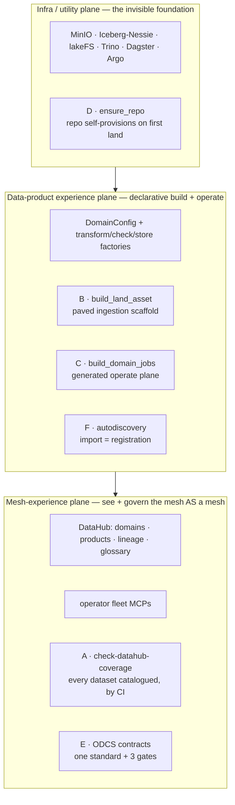

# The three self-serve data-platform planes — a coverage audit (B158)

A data mesh is only *self-serve* if the platform beneath it exposes the three planes Zhamak Dehghani
names in *Data Mesh*: an **infrastructure/utility plane** the product author never has to operate, a
**data-product experience plane** that lets them build and run a product declaratively, and a **mesh
experience plane** that lets you see and govern all products *as one mesh*. This page audits the weyland
mesh against those three planes, grades every named surface, and records the gaps. It is the B158
deliverable; the mesh's design of record is [design/data-mesh-design.md](../design/data-mesh-design.md),
and the sibling capability lens is B156 (Nick Tune's five data-platform capabilities).

**Method.** Three independent evidence passes (one per plane) over the repo + live cluster, each grading
its surfaces **coherent self-serve / partial / gap** against that plane's defining question. Cheap gaps
were fixed in this same pass (per the fix-don't-file rule); structural gaps are recorded below as
recommended follow-ups, not silently filed.

## Verdict at a glance

| Plane | Defining question | Verdict |
|---|---|---|
| **1 — Infrastructure / utility** | Is it *invisible* to a product author? | **Strong.** Invisible at use; leaks only at provisioning/bootstrap. |
| **2 — Data-product experience** | Is onboarding *declarative* or hand-assembly? | **Partial.** A declarative core bracketed by hand-assembly at the ingestion and operate edges. The weakest plane. |
| **3 — Mesh experience** | Can you *see + govern* the mesh as a mesh? | **Strong on see, weak on govern-by-CI.** DataHub + fleet MCPs deliver discovery/lineage/query; nothing in CI asserts data-estate governance completeness, and contracts aren't unified (ODCS/B157). |

The pattern across all three: **abstraction at *use* is excellent; the leaks are at *provisioning*, *ingestion*, and *governance-completeness* — the edges the paved path was never extended to.**

## The three planes, and where the follow-ups (A–F) landed

A–D pave the *product* planes (provisioning + the build/operate edges); A, E, F govern the *mesh* plane
(catalog completeness, contracts, registration). Each is placed in its plane's grade table below.

---

## Plane 1 — Infrastructure / utility

The whole plane is consumed through **one declarative object**, a `DomainConfig`, fed to four factories
(`build_transform_assets` / `build_asset_checks` / `build_store_load_assets` / `build_stream_produce_assets`).
A new domain reaches storage, table format, catalog, and query by declaring strings — no bucket, catalog,
or schema plumbing.

| Surface | Verdict | Evidence |
|---|---|---|
| **MinIO** | Coherent | Writes go through `datasets_lib/io.py` (endpoint env-defaulted); the author names an object, never a bucket/endpoint. |
| **Iceberg + Nessie** | Coherent | `writers.py:hydrate_iceberg` auto-provisions namespace + table from `cfg.namespace`; one `RestCatalog` in `iceberg_publish._catalog()`. No hand DDL or branch management. |
| **Trino** | Coherent (zero-touch) | One shared `iceberg` catalog reads the Nessie `main` ref (`k8s/data-mesh/trino.yaml`); a new namespace appears as `iceberg.datasets_<domain>` with **no catalog file edit**. Verified live: `iceberg.datasets_finance` lists all six finance tables. |
| **Dagster** | Coherent | The author's console, not hidden infra; it hides orchestration (the `broker.py` factory generates the asset graph from config). |
| **lakeFS** | Coherent (as of follow-up D) | Invisible for read/write/versioning (writes through the S3 gateway; `_commit` auto-commits one version/run). Repo creation is **now automated** — `build_land_asset` calls the idempotent `lakefs_repo.ensure_repo(repo)` before the first write (follow-up D), so a new domain's repo self-provisions on first land instead of failing at runtime. The shared `s3://datasets` storage bucket already exists across all domains. |
| **k8s / Argo** | Partial | Invisible for a pure new domain (finance Phase 1 added only Python). Leaks when a domain needs new creds/env (hand-edit + push `k8s/dagster/user-code.yaml`) or a new store; and **code itself is not GitOps** — the user-code image is `rsync` + rebuild + `ctr import` with `imagePullPolicy: Never`. |

**Plane-1 gaps (all at provisioning/bootstrap, none at use):**
1. ~~**lakeFS repo + MinIO bucket bootstrap is unautomated**~~ **— CLOSED by follow-up D (2026-09-05).** `lakefs_repo.ensure_repo(repo)` (called from `build_land_asset` before the first write) creates the repo idempotently at `s3://datasets/<repo>` — the convention every existing repo follows. The create-repo contract was live-validated against lakeFS (201 create · 409-idempotent · async delete); the shared `datasets` bucket already exists so no bucket creation is needed.
2. **New-store/new-env onboarding forces the author into k8s** *(MEDIUM)* — editing/pushing `user-code.yaml` env.
3. **User-code deploy is not GitOps for code** *(LOW–MED)* — baked image, `ctr import`, `imagePullPolicy: Never` (intersects the known image-prune hazard).
4. **Iceberg S3 secret is a manual one-time step** *(LOW)*.

---

## Plane 2 — Data-product experience  *(the weakest plane)*

**Verdict: PARTIAL — a genuinely declarative core, bracketed by hand-assembly at both edges.** The
`DomainConfig → factories` middle is real and powerful: from ~72 lines of `FINANCE_CFG` declaration plus
**8 lines** of factory wiring, a domain gets silver (5 formats) + Iceberg gold + a blocking quality gate +
fan-out to **11 Tier-2 stores** + vector embedding + streaming — all generated. Adding a store target is
one allowlist entry (finance got Cassandra from `cassandra_allow={"price_daily": "ticker"}`).

But the paved path is paved only in the **middle**. The two ends a domain author actually spends effort on
are still hand-written:

- **Ingestion edge — 100% hand-written per source.** No factory. Finance's four slices needed **~659 lines
  of `*_parse.py`** + **~514 lines of `datasets_finance_*_land.py`** bespoke fetch/retry/parse assets +
  a `finance_common.py` facade that is an explicit copy of `health_common.py`. Onboarding tally: **~80
  declared config lines vs ~1,200 hand-written**. The "declare a spec, get a product" promise holds only
  *downstream of tidy parquet*.
- **Operate edge — not generated, and for finance not wired at all.** `finance` appears in **zero** jobs,
  schedules, or sensors — a finance product can only be run by manually materializing assets in the
  Dagster UI. Jobs enumerate assets by hardcoded string lists, so they don't track config.
- **Manual registration** in `assets/__init__.py` — every symbol hand-imported and hand-listed twice; no
  autodiscovery (miss one and the product silently doesn't load — which happened once at B113: `edgar_land`
  was briefly unregistered).

**Live defect found + FIXED this pass:** the `weyland_ingestion_job` 15-min cron is `AssetSelection.all()`
minus a **hand-maintained** exclusion of the land/store groups (they re-download external sources and "must
NOT run on the 15-min cron"). `datasets_music` / `datasets_health` were excluded; **`datasets_finance` /
`datasets_finance_stores` were never added** at B113 onboarding, so finance's FRED/SEC/yfinance land assets
were being swept into the 15-min cron, masked only by the 30-day freshness gate. Added both to the exclusion
(`schedules/__init__.py`), aligning finance with music/health.

**Plane-2 gaps (ranked by onboarding friction):**
1. ~~**Landing + parsing has no factory**~~ **— the SCAFFOLD is now paved (follow-up B, 2026-09-05).** `datasets_lib.landers.build_land_asset` generates the whole land wrapper — freshness skip, fail-closed on zero rows, minio client, per-table parquet write, Output+metadata — from one `produce(context) -> (tables, detail)` callable; the pure write/fail-closed core is the dagster-free, unit-tested `land_core`. A new source now writes `produce()` + one factory call, not the ~25-line `@asset` scaffold; the four finance landers were migrated to prove it. **Honest scope:** the *fetch* and the `*_parse` shaping stay source-specific by nature (a FRED JSON, an EDGAR XBRL payload and a yfinance frame share no structure) — the factory removes the *reducible* boilerplate, not the irreducible source-specificity. The parse leaves keep their own isolated tests.
2. ~~**Operate plane is not generated**~~ **— DONE (follow-up C, 2026-09-05).** `datasets_lib.domain_jobs.build_domain_jobs(cfg)` generates a domain's land / transform / hydrate jobs + a (STOPPED) land schedule from the DomainConfig; finance — which had *none* — now has all three, wired into `definitions.py`. The land job and the transform-job exclusion are BOTH derived from the one `cfg.land_deps` list (the same tuple the transform assets already `deps` on), so the land/transform split that let finance's land slip into the 15-min cron is now **single-sourced and cannot drift** (unit-tested in the dagster-free `domain_job_plan`, 4 pytest).
3. ~~**No asset autodiscovery**~~ **— DONE (follow-up F, 2026-09-05).** `all_assets` and `all_asset_checks` are now DERIVED from the imports in `assets/__init__.py` (every imported `AssetsDefinition` / list of them; every `*_checks` list) — the manual second list that drifted at B113 is gone. **The first cut was NOT equivalent:** dagster's `AssetChecksDefinition` subclasses `AssetsDefinition`, so the naive `isinstance` collector swept every `*_checks` list into `all_assets` AS WELL AS `all_asset_checks`, defining each check key twice → `Duplicate asset check key` at code-server load, which took the code server down (shipped `git-07e5d637`). That is exactly the loud code-server-load failure this design counts on — caught by the ship SMOKE/TXN gate, not silently. Fixed by excluding checks (`_is_asset`) in the dagster-free `_collect.py`, regression-guarded by `tests/test_collect.py` (reproduces the subclass trap with fakes so it runs in the no-dagster lane the bug slipped past), re-shipped `git-f5659901` and code-server-verified. The registration guard (`tests/test_asset_registration.py`) keeps the imports honest.
4. **Per-domain `<domain>_common.py` + allowlist-union boilerplate** *(LOW)*.

---

## Plane 3 — Mesh experience

**Verdict: strong on *see*, weak on *govern-by-CI* for the data estate.**

| Surface | Verdict | Evidence |
|---|---|---|
| **DataHub catalog** | Coherent | `datahub_emit.py` (~35 `emit_*` fns): **7 catalog domains** (3 bounded data domains + 4 operational), **14 data products**, table + dbt column lineage, glossary, structured properties/tags, and `emit_siblings` merging each mart's trino/dbt/iceberg twins into one governed entity. |
| **Operator fleet MCPs** | Coherent | 6 read-only MCP servers (trino/datahub/neo4j/postgres/k8s/grafana) behind a FastMCP compositor at the gateway; an operator can answer cross-product where-does-X-live / lineage / quality. |
| **Coverage guards** | Coherent (as of follow-up A) | 14 `check-*.sh` — the infra trilogy (scrape/dashboard/alert) + registry/secrets, **now joined by `check-datahub-coverage.sh`** (follow-up A) which asserts every mesh dataset Trino exposes is catalogued in DataHub. The data estate is governed by CI, not just eyes-on. |
| **ODCS contracts** | Coherent (follow-up E) | ODCS adopted (a lab subset — [decision doc](data-contracts-odcs.md)); **all 3 domains** contracted (10 `*.odcs.yaml`, music/health generated from substance), a structural CI gate + a live column-vs-Trino `--check-schema` + a products-without-contracts check, and dbt `contract: enforced` on the finance marts. |

**Plane-3 gaps:**
1. ~~**No governance-by-CI for the data estate**~~ **— CLOSED by follow-up A (2026-09-05).** `check-datahub-coverage.sh` now reconciles the mesh tables Trino exposes against the datasets DataHub holds and fails CI on drift (nightly CronJob `datahub-coverage` + `bats scripts/tests/datahub-coverage.bats`, live baseline 111/111). Datasets-without-contracts stays a phase-2 for E/ODCS. *(The gap was demonstrated live during this audit: the mesh-map product tile had drifted from the emit's real `_PRODUCTS` and nothing caught it — the new guard is exactly that missing check.)*
2. ~~**Contracts not unified under one standard**~~ **— DONE (follow-up E / B157, 2026-09-05).** ODCS adopted (lab subset); **all three domains** contracted (10 `*.odcs.yaml`), gated in CI by `check-odcs-contracts.sh` (10 bats) + a live `--check-schema` column-vs-Trino pass + a products-without-contracts pytest, with a `gen_odcs_contract.py` generator that produces contracts from the substance and dbt `contract: enforced` on the finance marts. See the [decision doc](data-contracts-odcs.md).
3. **Column lineage covers dbt marts only** *(MEDIUM)* — by design (non-tabular assets carry no schema); table lineage is complete.

---

## Consolidated gap register + disposition

**Fixed this pass** (defects the audit surfaced + the first follow-up):
- **Plane 2** — finance land/store groups added to the `weyland_ingestion_job` exclusion (`schedules/__init__.py`); ships with the next user-code image.
- **Plane 3 (self-inflicted)** — `data-mesh-map.html` product count corrected to the real 14 (was a stale 13).
- **Follow-up A — DONE (2026-09-05):** `check-datahub-coverage.sh` shipped — the data-estate governance-by-CI guard (nightly `datahub-coverage` CronJob, 12 bats, live 111/111). See the runbook in [observability.md](../runbooks/observability.md#datahub-catalog-coverage--the-guard-b158-follow-up-a-2026-09-05).
- **Follow-up B — DONE (2026-09-05):** `datasets_lib.landers.build_land_asset` + the dagster-free `land_core` (5 pytest) pave the land-asset scaffold; the four finance landers migrated to it (ruff clean, full suite 95 passed). Ingestion-edge boilerplate is now generated; fetch/parse stay source-specific.
- **Follow-up C — DONE (2026-09-05):** `datasets_lib.domain_jobs.build_domain_jobs(cfg)` generates finance's land/transform/hydrate jobs + a STOPPED land schedule (wired into `definitions.py`), single-sourced from `cfg.land_deps` (dagster-free `domain_job_plan`, 4 pytest; full suite 99 passed).
- **Follow-up D — DONE (2026-09-05):** `datasets_lib.lakefs_repo.ensure_repo` self-provisions a domain's lakeFS repo on first land (idempotent, `s3://datasets/<repo>`); create-repo contract live-validated against lakeFS, pure namespace helper 2 pytest (full suite 101 passed).
- **Follow-up E — DONE (2026-09-05, B157):** ODCS adopted (lab subset — [decision doc](data-contracts-odcs.md)); **all three domains** contracted — 10 `*.odcs.yaml` (finance hand-authored, music/health via `scripts/gen_odcs_contract.py` from Trino+Soda+dbt substance) — with `check-odcs-contracts.sh` (structural, CI) + `--check-schema` (live column-vs-Trino, validated) + a products-without-contracts pytest + dbt `contract: enforced` on the finance marts.
- **Follow-up F — DONE (2026-09-05):** full autodiscovery — `all_assets`/`all_asset_checks` are derived from the imports (`assets/__init__.py`). The first cut mis-collected asset checks as assets (`AssetChecksDefinition` subclasses `AssetsDefinition`) → duplicate-key crash at code-server load, caught by the ship SMOKE/TXN gate and fixed in `_collect.py` (`_is_asset`) + regression-guarded by `tests/test_collect.py`; re-shipped `git-f5659901`. The registration guard (`tests/test_asset_registration.py`) keeps the imports honest.

**All six follow-ups (A–F) shipped, including every deferred tail (2026-09-05).** The mesh's self-serve planes are now: infra invisible at use *and* self-provisioning (D); the product-experience edges paved (B ingestion, C operate) with the split single-sourced and registration auto-derived (F); and the mesh-experience plane governable by CI (A catalog-coverage) with all products under one contract standard, schema-conformance-checked (E). The two deploy-time validators remain: the `dbt build` confirms the mart contracts, and the code-server load confirms the autodiscovery — both fail loud, not silent.

**Remaining follow-ups** (structural — each its own body of work; being worked in order):

| # | Gap | Plane | Size | Note |
|---|---|---|---|---|
| A | ~~`check-datahub-coverage.sh` — govern the data estate by CI~~ | 3 | Medium | **DONE 2026-09-05.** |
| B | ~~A landing factory — pave the ingestion-edge scaffold~~ | 2 | Med | **DONE 2026-09-05** — `build_land_asset` + `land_core`; 4 finance landers migrated. Fetch/parse stay source-specific by nature. |
| C | ~~`build_domain_jobs(cfg)` — generate the operate-plane jobs from config~~ | 2 | Med | **DONE 2026-09-05** — land/transform/hydrate + STOPPED schedule generated for finance; land/transform split single-sourced from `cfg.land_deps`. |
| D | ~~`ensure_repo` bootstrap — automate lakeFS repo creation~~ | 1 | Small | **DONE 2026-09-05** — `lakefs_repo.ensure_repo` in `build_land_asset`; create-repo contract live-validated. |
| E | ~~ODCS adoption — unify contracts under one standard + conformance gate~~ | 3 | Large | **DONE 2026-09-05** (B157) — subset adopted; **all 3 domains** contracted (10 contracts via the generator); structural gate + live `--check-schema` + products-without-contracts check + dbt `contract: enforced`. |
| F | ~~Asset autodiscovery — close the silent-load footgun~~ | 2 | Small | **DONE 2026-09-05** — full autodiscovery: `all_assets`/`all_asset_checks` derived from the imports; first cut's `AssetChecksDefinition`-as-asset duplicate-key crash caught at code-server load + fixed (`_collect.py` + `tests/test_collect.py`), re-shipped `git-f5659901`. |

The mesh's self-serve story is **strong at use, thin at the edges**: a product author consumes infra
invisibly and the mesh is genuinely governable *to look at*, but they still hand-write ingestion, hand-wire
operations, and nothing in CI proves the data estate stays cataloged. Follow-ups A–D are the highest-value
closes; E is B157; F is a quick footgun removal.

## Definition of Done (8 pillars, applied)

This is repo/audit tooling that deploys nothing; five pillars evaluate to N/A by the DoD's own repo-tooling rule.

1. **Docs** — this page (auto-navved under Concepts); the two inline fixes are noted in-file. **Done.**
2. **Diagrams** — N/A (no new deployed component; the audit references the existing `data-mesh-map` + LikeC4). **N/A.**
3. **Demos** — the audit *is* its own evidence (three plane passes + live checks); no UI to UAT. **Done (CLI/audit).**
4. **Cleanup** — read-only audit + two idempotent doc/code edits; no data created. **Done.**
5. **Tracking** — B158 flipped on completion; follow-ups A–F presented for a priority call, not auto-filed. **On close.**
6. **Ops** — N/A (no deployed workload); the ingestion-cron fix ships via the normal user-code image path. **N/A.**
7. **Scan** — the code change is a Dagster `AssetSelection` edit (no new deps/surface); rides the standard scan gate. **On ship.**
8. **Cascade** — the fix touches `schedules/__init__.py` only (no shared symbol); the map-count correction is the reverse-sweep of a surface this audit found stale. **Done.**
