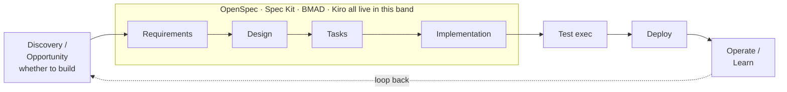

# Spec-Driven Dev Frameworks vs the Method (B86)

**Four external spec-driven / agentic-development frameworks — OpenSpec, GitHub Spec Kit, BMAD-METHOD, and AWS Kiro —
evaluated against weyland's own AIDLC *Method*.** This is a *research/maturity* evaluation (B86): map what each does, where
it overlaps or diverges from the Method's stages, and decide whether any patterns are worth cross-pollinating. **No
commitment to adopt any tool** — the output is this comparison + a decision matrix.

> Data current as of **2026-08-11** (four parallel web-research passes). Versions/stars/prices move fast — see
> [Provenance & freshness](#provenance--freshness) for the caveats.

## Bottom line up front

- **They solve a *smaller* problem than the Method.** All four are **coding workflows** that live in the
  **requirements → design → tasks → implementation** middle of the arc. The Method is a **delivery lifecycle** that also
  owns the **discovery front-end** (whether to build) and the **operations/telemetry/continuous-discovery tail** (learn →
  loop back). None of the four touch either end.
- **So the payoff is *cross-pollination, not migration*.** The interesting borrow is their **artifact discipline** — not
  their lifecycle. Four concrete candidates: **delta specs** (OpenSpec), a **machine-checked constitution + consistency
  gates** (Spec Kit), **EARS-notation requirements + steering files** (Kiro), and **self-contained story files /
  context-engineering** (BMAD).
- **$0 / self-host fit:** OpenSpec, Spec Kit, BMAD are **MIT, agent-agnostic, self-hostable** → trial-friendly on a $0 LAN
  lab. **Kiro is disqualified as a *tool*** — managed AWS, Bedrock-locked, no BYOK, capped free tier — though its
  *patterns* still travel.
- **Recommendation:** keep the Method as the spine; **adopt the artifact notations** (delta-spec sections, EARS, a
  checkable baseline "constitution"); optionally **trial OpenSpec or Spec Kit on one small unit** to feel the discipline.
  Do **not** narrow the Method to match these tools, and do **not** adopt Kiro.

## The contenders

| | One-liner | Origin | License / cost | Self-host? |
|---|---|---|---|---|
| **The Method** (AIDLC) | Full consulting-delivery lifecycle: discovery → construction → operations, looped | weyland (user IP, `.methodaidlc/`) | private IP | ✅ (it's local rules) |
| **OpenSpec** | Spec-first change proposals with **delta specs**, agent-agnostic | Fission-AI | MIT, $0 | ✅ |
| **GitHub Spec Kit** | `/specify → /plan → /tasks → /implement` pipeline with a **constitution** | GitHub | MIT, $0 | ✅ |
| **BMAD-METHOD** | **Role-agents** (analyst/PM/architect/SM/dev/QA) + sharded story files | BMad Code, LLC | MIT, $0 | ✅ |
| **Kiro** | Agentic **IDE** with spec flow + **steering files** + **agent hooks** | AWS | **paid tiers, Bedrock-locked** | ❌ |

## The core finding: coverage asymmetry

The Method spans the whole arc and loops; the four external tools cluster tightly in the middle.

The Method covers the entire arc (Discovery → Operate) **and** the loop back; the four external tools all cluster in the
boxed middle band:

**Lifecycle coverage** (✅ owned · ⚠️ partial · — absent):

| Stage of the arc | OpenSpec | Spec Kit | BMAD | Kiro | **Method** |
|---|:---:|:---:|:---:|:---:|:---:|
| Discovery / Opportunity (*whether* to build) | — | — | ⚠️ analyst brief | — | **✅✅** |
| Requirements | ✅ | ✅ | ✅ | ✅ (EARS) | ✅ |
| Design (tech + UX/service) | ✅ | ✅ | ✅ | ✅ | ✅ (UX **+** service) |
| Tasks / decomposition | ✅ | ✅ | ✅ | ✅ | ✅ (units) |
| Implementation | ✅ | ✅ | ✅ | ✅ | ✅ |
| Test **execution** / QA | ⚠️ spec-validate only | ⚠️ encouraged, not run | ⚠️ QA *review*, not exec | ⚠️ via hooks | ✅ Build & Test |
| Deploy / release | — | — | — | ⚠️ AWS deploy actions | ✅ Deployment |
| Operate / telemetry / **learn-loop** | — | — | — | — | **✅✅** Outcome Telemetry → Continuous Discovery |

The pattern is unambiguous: **the externals are coding workflows; the Method is a delivery lifecycle.** BMAD reaches
slightly upstream (an analyst "brief") and Kiro slightly downstream (AWS deploy actions), but neither owns the *whether-to-
build* decision or the *learn-and-loop* tail.

## Decision matrix

| Axis | OpenSpec | Spec Kit | BMAD | Kiro | **Method** |
|---|---|---|---|---|---|
| **Named stages** | explore→propose→review→apply→verify→archive | constitution→specify→(clarify)→plan→(checklist)→tasks→(analyze)→implement→converge | v6: Analysis→Planning→Solutioning→Implementation (SM→Dev→QA loop) | Requirements→Design→Tasks→Implementation | Pre-Inception→Inception→Construction→Operations (many sub-stages) |
| **Agent / role model** | single agent + human gate | single agent + human gate | **role-agents** hand off 1 doc each | single agent, spec/vibe + supervised/autopilot modes | **human team ownership** per stage + PM gates |
| **Human gates** | review-before-code | clarify/checklist/analyze | PO-validate + per-story approval | per-phase approval (skippable in Quick Spec) | **"Wait for Explicit Approval"** at every stage |
| **Iteration / change model** | **delta specs** (ADDED/MODIFIED/REMOVED) | new numbered feature branch/dir | new epic/stories | new spec dir | **Iteration 0 (full) vs N (delta-only)** |
| **Governance / standards** | forkable workflow *schemas* | **constitution** (machine-checked) | checklists/templates | **steering files** (mode-scoped) | always-enforced baseline + **3 knowledge repos** + extensions |
| **Tooling surface** | CLI + injected slash-cmds (30+ assistants) | `specify` CLI + slash-cmds (30+) | `npx bmad-method` + persona invokes + web bundles | **full IDE** (Code-OSS fork) + CLI (ACP) | Markdown rules driving any assistant (here: Claude Code) |
| **Brownfield strength** | **strong** (delta model) | moderate | weaker (greenfield-leaning) | moderate | strong (Reverse-Engineering stage) |
| **Audit trail / traceability** | spec files | artifacts + branches | doc chain (no trace DB) | `.kiro/` markdown | **`audit.md` + `aidlc-state.md` + plan checkboxes** |
| **$0 / self-host** | ✅ MIT, self-host | ✅ MIT, self-host | ✅ MIT, self-host | ❌ AWS/Bedrock, paid | ✅ local |
| **Distinctive** | delta specs; forkable schemas | constitution; consistency gates | role-agent orchestration; context-engineered story files; expansion modules | steering files; agent hooks; EARS; IDE-native persisted specs | full lifecycle + discovery + ops loop + team ownership + knowledge repos |

## Per-framework notes

### OpenSpec (Fission-AI · MIT · v1.8.0, ~64k★)
Spec-first change workflow: `/opsx:propose` generates a change folder (`proposal.md` / `design.md` / `tasks.md` + **delta
specs**), a human reviews before code, `/opsx:apply` implements, `/opsx:archive` merges the deltas into the canonical
`specs/`. **Distinctive: delta specs** — sections `ADDED` / `MODIFIED` / `REMOVED Requirements` describe only what changes,
purpose-built for brownfield. Covers requirements→implementation; **skips test-exec, deploy, ops.** Single-agent + human
gate.

### GitHub Spec Kit (GitHub · MIT · v0.16.x, ~120k★)
The most-adopted of the four. Command pipeline `constitution → specify → (clarify) → plan → (checklist) → tasks →
(analyze) → implement → converge`, writing `spec.md` / `plan.md` / `research.md` / `data-model.md` / `contracts/` /
`tasks.md` under numbered feature dirs. **Distinctive: the `constitution`** — persistent, versioned project principles that
every later phase is *checked against* — plus dedicated **clarify / analyze consistency gates**. Covers
requirements→implementation; **skips deploy/ops**; doesn't run tests.

### BMAD-METHOD (BMad Code, LLC · MIT · v6.x, ~52k★)
The closest structural cousin to the Method. **Role-agents** — Analyst → PM → Architect → PO → Scrum Master → Dev → QA/Test
Architect — each emitting **one hand-off document** (`brief.md` → `prd.md` → `architecture.md` → sharded epics/stories →
code). **Distinctive: context-engineered story files** (the SM bakes full context + architecture into each story so the Dev
agent needs no other memory) + **document sharding** + **expansion modules**. Human gates at PO-validation and per-story
approval. **Thin on test-exec/CI/deploy.** (v6 is a four-phase rewrite of the v4 two-phase model; the planning→story-loop
mechanic is unchanged.)

### Kiro (AWS · paid, Bedrock-locked · GA 2026)
An agentic **IDE** (Code-OSS fork): spec flow `requirements.md` (**EARS notation**) → `design.md` → `tasks.md` under
`.kiro/specs/`, plus **steering files** (`.kiro/steering/*.md`, mode-scoped Always/Conditional/Manual/Auto) as persistent
project memory and **agent hooks** (`.kiro/hooks/*.json`, event-triggered automation that can *block* actions). Widest
coverage of the four (reaches into AWS deploy), but **disqualified for a $0 lab**: managed AWS, **no BYOK**, Bedrock-locked,
capped 50-credit free tier, real use $20–200/mo. Its *patterns* (steering, EARS, hooks) are the takeaway, not the tool.

## Cross-pollination: what's worth borrowing into the Method

The Method already *has* a stage for everything these do — the value is in **sharper artifact conventions**:

1. **Delta-spec notation (OpenSpec) → the Method's Iteration-N delta.** The Method already runs Iteration N as
   delta-only; borrowing explicit **`ADDED` / `MODIFIED` / `REMOVED`** sections in the Requirements/Application-Design
   artifacts would make each iteration's change surface machine-diffable and unambiguous. Lowest-friction, highest-fit
   borrow. See [[feedback-track-live-state]].
2. **A checkable "constitution" (Spec Kit) + consistency gates.** The Method's always-enforced **baseline** + knowledge
   repos are the equivalent of a constitution, but they're enforced by prose review. Adding a Spec-Kit-style **`analyze`
   pass** (cross-artifact consistency: requirements ↔ design ↔ units) and a *checklist* rendering of the baseline rules
   would harden the gates without changing the workflow.
3. **EARS notation (Kiro) in Requirements Analysis.** A near-free formalism ("WHEN <trigger> THE SYSTEM SHALL <response>")
   that improves testability/traceability — a natural fit for the Method's Requirements Analysis stage.
4. **Context-engineered unit files (BMAD).** The Method's Units/User-Stories could bake full context + design references
   into each unit file so an implementing agent needs no external memory — directly useful for agentic code-generation.

## What NOT to adopt — where the Method already wins

- **Don't narrow the Method to a coding workflow.** Its unique value is exactly what none of the four have: the
  **discovery front-end** (Opportunity Framing → Validated Intent — *whether* to build), the **operations/telemetry →
  continuous-discovery loop**, **engagement archetypes**, the **three knowledge repositories**, and the **audit trail**
  (`audit.md` / `aidlc-state.md`). These are delivery-lifecycle concerns the tools simply don't model.
- **Don't replace human team ownership with AI role-agents wholesale.** BMAD's persona hand-offs are attractive, but the
  Method's per-stage **team ownership + Program-Management gates** are a *governance* model, not an execution trick. BMAD
  could optionally be instantiated *inside* a stage to draft an artifact, but it isn't a substitute for the gate model.
- **Don't adopt Kiro.** $0 violation + Bedrock lock-in + not self-hostable — a hard no for this lab. Borrow the patterns,
  not the product. See [[feedback-zero-budget]].

## Recommendation

1. **Keep the Method as the spine.** It is a superset — a delivery lifecycle, not a coding workflow.
2. **Adopt the artifact notations** (items 1–4 above) into the relevant Method stages — cheap, additive, no workflow change.
3. **Optionally trial OpenSpec or Spec Kit on a single small unit** to feel the artifact discipline first-hand ($0, MIT,
   agent-agnostic, reversible). Prefer OpenSpec for its brownfield delta model on an existing codebase; Spec Kit for its
   constitution + consistency gates.
4. **No tool migration, no Kiro.**

## Provenance & freshness

Compiled from four parallel web-research passes (2026-08-11). Figures move fast — verify before quoting:

- **OpenSpec** v1.8.0, ~64.6k★ (two fetches agreed, but high for a ~1-yr repo — sanity-check). MCP support *unconfirmed*
  (CLI + injected slash-commands is the delivery path). Workflow recently rebuilt into the `/opsx:` namespace — older
  tutorials may show legacy commands.
- **Spec Kit** v0.16.x (~Aug 2026), ~120k★. Commands recently renamed to the **`speckit.`** prefix; the "9-article
  constitution" is a *customizable template*, not fixed rules.
- **BMAD** v6.x (~v6.8.0, ~May 2026), ~52k★. **v4 two-phase** framing (widely cited) vs **v6 four-phase** scale-adaptive —
  pin the matrix to v6; the underlying planning→story-loop is unchanged. "QA" is v6's "Test Architect" module.
- **Kiro** GA in 2026 (exact date conflicts: ~Mar–May 2026), Pro tier **$20/user/mo** (some reviews cite $19 — trust $20).
  Model lineup shifts fast; treat version numbers as point-in-time.

Related: [[methodaidlc-user-authored]] (the Method is the user's own IP), [[feedback-aidlc-not-superpowers]],
[[feedback-zero-budget]]. Backlog: B86.
