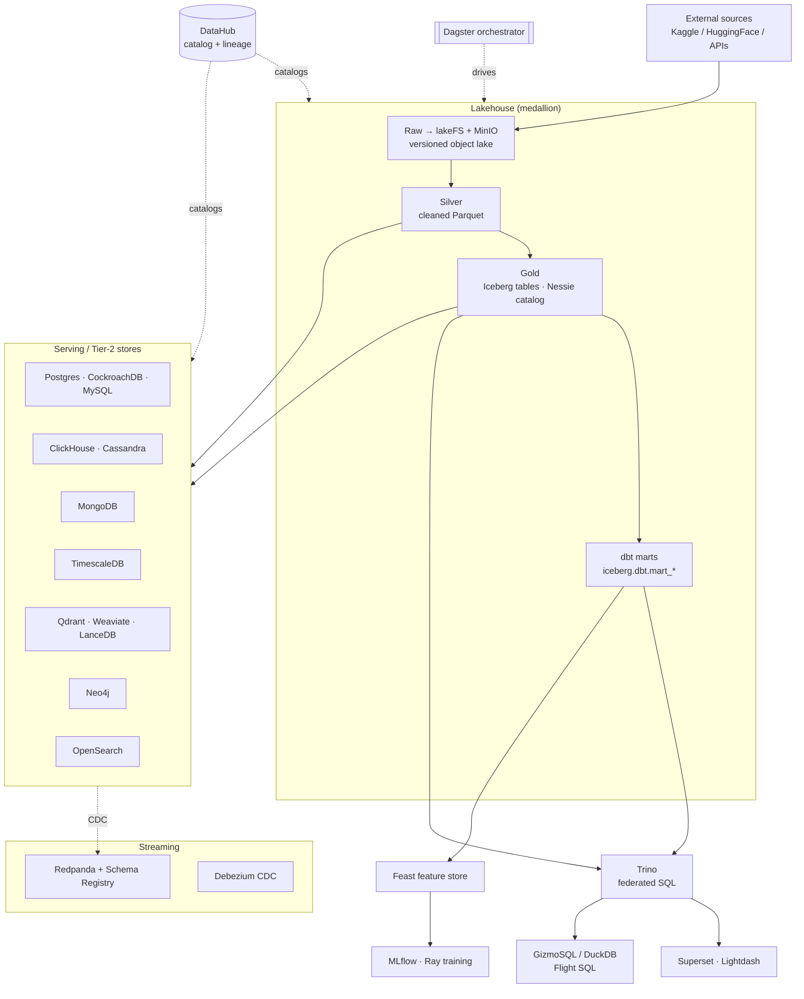

# Data Mesh — Stores & Workflows (the single source)

**What this is:** one page that answers *"what are all these stores, what job does each one do, and which one do I
reach for?"* The lab runs ~20 data technologies; this differentiates them by **layer** and **purpose**, gives a
**decision matrix**, and maps the **workflows** that move data between them. For *which dataset lives in which
store* see the coverage matrix [`data-domain-storage-grid.csv`](data-domain-storage-grid.csv); for *how to query*
each, the per-store [query cookbooks](query/README.md); for *how each is operated*, the
[runbooks](runbooks/); for deep architecture, [`arch.md`](arch.md).

The spine is a **medallion lakehouse**: raw → silver → gold → marts, all versioned in object storage, queried by
Trino, and fanned out to specialized "Tier-2" stores that each do one thing well. **dbt** produces the curated
marts that are the source of truth; **Dagster** orchestrates every step; **DataHub** catalogs it all.

## The layers at a glance

## Every store, its role, and when to reach for it

### Lakehouse & query layer

| Store | Role | Reach for it when… | Cookbook / runbook |
|---|---|---|---|
| **MinIO** | Object store — the physical lake | You need raw bytes / the S3 backend everything sits on | [runbook](runbooks/storage-minio.md) |
| **lakeFS** | Git-for-data over MinIO (branch/commit/rollback) | You want versioned, reproducible data experiments | [runbook](runbooks/datasets-lake.md) |
| **Nessie** | Iceberg catalog — git-for-tables (native REST) | Table-level branching/versioning of the gold layer | [trino runbook](runbooks/trino.md) |
| **Iceberg** | Open table format for the gold layer | Big analytical tables with schema evolution + time-travel | [trino cookbook](query/trino.md) |
| **Trino** | Federated SQL engine over all catalogs | Ad-hoc SQL, cross-catalog joins, the BI backend | [cookbook](query/trino.md) |
| **dbt** | Transform tier — SQL → tested marts (Iceberg) | The curated, tested, source-of-truth analytics tables | [cookbook](query/dbt-marts.md) · [runbook](runbooks/dbt.md) |
| **GizmoSQL / DuckDB** | Embedded OLAP served over Arrow Flight SQL | Fast local analytics, ADBC clients, no cluster round-trip | [cookbook](query/gizmosql.md) · [runbook](runbooks/gizmosql.md) |

### Serving / Tier-2 (hydrated from silver + gold)

| Store | Role | Reach for it when… | Cookbook |
|---|---|---|---|
| **Postgres (weyland)** | Platform relational — RAG corpus (pgvector), eval harness, Feast offline | App data, pgvector similarity, structured OLTP | [cookbook](query/postgres.md) |
| **CockroachDB** | Distributed/HA SQL (pg-wire) | You want horizontally-scalable, resilient SQL | [cookbook](query/cockroachdb.md) |
| **MySQL** | Classic relational | A MySQL-dialect target / tool compatibility | [cookbook](query/mysql.md) |
| **ClickHouse** | Columnar OLAP | Fast aggregations over wide/large tables | [cookbook](query/clickhouse.md) |
| **Cassandra** | Wide-column, high-write | Partition-key lookups, write-heavy, denormalized | [cookbook](query/cassandra.md) |
| **MongoDB** | Document store | Nested/semi-structured JSON, flexible schema | [cookbook](query/mongodb.md) |
| **TimescaleDB** | Time-series (Postgres hypertables) | Metrics, event time-series, windowed queries | [cookbook](query/timescaledb.md) |
| **OpenSearch** | Lexical / BM25 full-text search | Keyword search, log/text retrieval | [cookbook](query/opensearch.md) |
| **Qdrant / Weaviate** | Dense vector search | Semantic / similarity search (two backends) | [qdrant](query/qdrant.md) · [weaviate](query/weaviate.md) |
| **LanceDB** | Embedded vector store on object storage | In-process vector search, no server | [cookbook](query/lancedb.md) |
| **Neo4j** | Graph database | Relationships, path traversal, GDS | [cookbook](query/neo4j.md) |

### Streaming, features, ML, BI, catalog

| Store | Role | Reach for it when… | Cookbook / runbook |
|---|---|---|---|
| **Redpanda** | Kafka-compatible broker + Schema Registry | Event streaming, Avro topics, CDC sink | [cookbook](query/redpanda.md) · [runbook](runbooks/streaming.md) |
| **Debezium CDC** | Change-data-capture → Redpanda | Stream row changes off a source DB | [runbook](runbooks/streaming.md) |
| **Feast** | Feature store — online (Valkey) + offline (Postgres) | Serving ML features by entity key + point-in-time training | [cookbook](query/feast.md) · [[feast-feature-store-b1]] |
| **MLflow** | Model registry + experiment tracking | Versioning models, tracking training runs | [runbook](runbooks/mlflow.md) · [training](runbooks/remote-training.md) |
| **Superset** | Ad-hoc SQL BI over Trino | Free-form charts/dashboards on any catalog | [runbook](runbooks/superset.md) |
| **Lightdash** | dbt-native BI (metrics from the marts) | Curated, governed metrics/explores over the marts | [runbook](runbooks/lightdash.md) |
| **DataHub** | Metadata catalog + lineage | "Where did this come from / what's downstream" | (every store emits) |
| **Dagster** | Pipeline orchestrator | Scheduling/triggering every land/transform/hydrate job | [schedules](schedules.md) |

## Decision matrix — "I need to…"

| I need to… | Reach for |
|---|---|
| Run ad-hoc SQL across everything | **Trino** (+ Superset for charts) |
| Publish curated, tested metrics/dashboards | **dbt marts** → **Lightdash** |
| Aggregate fast over big wide tables | **ClickHouse** |
| Do write-heavy / partition-key lookups | **Cassandra** |
| Get resilient, distributed relational SQL | **CockroachDB** |
| Semantic / similarity ("find things like this") | **Qdrant** or **Weaviate** (server) · **LanceDB** (embedded) |
| Keyword / full-text search | **OpenSearch** |
| Traverse relationships / shortest-path | **Neo4j** |
| Store nested/flexible documents | **MongoDB** |
| Query metrics over time | **TimescaleDB** |
| Serve ML features (online + point-in-time) | **Feast** |
| Track/version models | **MLflow** |
| Stream events / capture DB changes | **Redpanda** + **Debezium** |
| Branch/roll back a dataset experiment | **lakeFS** (data) · **Nessie** (tables) |
| Fast embedded analytics via Flight SQL | **GizmoSQL / DuckDB** |
| Find lineage / provenance | **DataHub** |

## The workflows

**1 · Ingestion → medallion (the backbone).** Dagster lands external sources into **lakeFS/MinIO** (raw, versioned),
transforms to **silver** Parquet, promotes to **gold** Iceberg tables (Nessie catalog), and **dbt** builds the
tested **marts** (`iceberg.dbt.mart_*`) on top. See [`data-pipeline-flows.md`](data-pipeline-flows.md),
[[dbt-transform-tier]].

**2 · Store hydration (fan-out).** Dagster hydrate jobs load silver/gold into the Tier-2 stores — each dataset
lands in the stores that suit its access pattern (the [grid CSV](data-domain-storage-grid.csv) is the coverage
map). Static data → on-demand hydration, not nightly. See [runbook](runbooks/datasets-hydration.md).

**3 · Serving.** Retrieval reads the serving stores: **RAG** hits Postgres/pgvector + Qdrant/Weaviate + OpenSearch
+ Neo4j; **BI** hits Trino via Superset/Lightdash; **features** come from Feast; **embedded analytics** from
GizmoSQL.

**4 · dbt as source of truth (this is the point of the transform tier).** The marts feed three consumers so the
cleaning/dedup logic lives **once** in dbt: **Feast** offline sources load from the marts, the **genre trainer**
reads a mart export (`--source mart`), and **DataHub** catalogs the marts (+ their tests + lineage) via the dbt
connector. See [training](runbooks/remote-training.md).

**5 · Streaming / CDC.** Debezium captures row changes off the source Postgres into **Redpanda** (Avro + Schema
Registry); consumers read `cdc.*` / `datasets.*` topics. See [runbook](runbooks/streaming.md).

**6 · Cataloging (cross-cutting).** Every store emits datasets + lineage to **DataHub** — custom REST emitters for
the Dagster/store side, native source recipes (iceberg, postgres, trino, dbt, …) for the rest — so gold → mart →
Feast/trainer lineage is one graph. See [`datahub-ingestion/`](https://github.com/edtbl76/weyland-lab/blob/main/nodes/mother/lab/weyland-platform/k8s/data-mesh/datahub-ingestion/README.md).

**7 · Governance & discovery (DataHub).** On top of datasets + lineage sits a full governance layer, all emitted
from git via `datahub_emit.py` (Dagster `datahub_catalog_emit_job`, every 6h) — each surface answers a different
question: **Domains** (who owns it — 6 areas, ~2,330 assets auto-classified), **Data Products** (what bundle — 9
mesh products), **Glossaries** (what a concept means — AIDLC KB 480 terms + Data Mesh 44 authored terms attached
to ~1,968 fields), **Structured Properties** (filter facets — `data_layer`/`source_system`/`store_tier`), **field
descriptions** (this specific column — authored upstream in dbt `schema.yml`), and **Documentation Links** (where's
the doc — ~1,386 datasets link out to their runbook + this guide + the [Tools launchpad](tools.md)). Two rules:
*define once, attach everywhere* (one term/facet attached to every matching field across the ~15 store copies) and
*everything lives in git* (DataHub's UI layer isn't durable). Full detail in [`arch.md`](arch.md#7b-data-domain-structure).

## See also

- [Tools launchpad](tools.md) — clickable directory of every running tool UI
- [query cookbooks](query/README.md) — one file per store, real copy-paste queries
- [runbooks](runbooks/) — how each store is deployed/operated
- [`data-domain-storage-grid.csv`](data-domain-storage-grid.csv) — dataset × store coverage
- [`data-pipeline-flows.md`](data-pipeline-flows.md) · [`arch.md`](arch.md) · [`schedules.md`](schedules.md)
