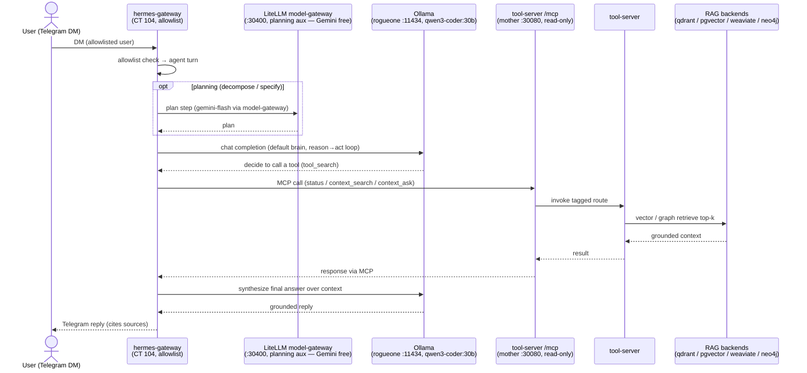

# Demo — Agent end-to-end (Telegram DM → Hermes → LiteLLM plan / Ollama → MCP → tool-server → RAG → reply)

> **Pending live end-to-end validation run.** Every command below is real and pulled from the Hermes runbook and
> the MCP flow, but this cross-system walkthrough has **not** yet been executed straight through against live infra.

The resident-operator arc: an inbound Telegram DM drives one Hermes agent turn that reaches into the platform's
read-only system-view and answers, grounded in the RAG backends. It threads:

1. **[runbooks/agent-hermes.md](../runbooks/agent-hermes.md)** — the Hermes agent (CT 104): the headless
   `hermes-gateway` front door (Telegram, allowlist, polling), the model split (planning aux → the LiteLLM
   model-gateway; default brain → local `qwen3-coder:30b` on Ollama, **rogueone**), and the `/mcp` registration.
2. **[flow-agent-mcp.md](../diagrams/flow-agent-mcp.md)** — the read-only MCP path into the tool-server (`status`,
   `context_search`, `context_ask`, `list_models`), which fans out to the RAG backends + Ollama.

Nothing here is new mechanism — it is the Hermes runbook's front-door + MCP legs threaded into one Telegram-to-reply
arc. **`/mcp` is read-only**; the act tools live on the separate `/mcp-act` mount (Hermes-only, audited).

## Sequence diagram

From [../diagrams/flow-e2e-agent.md](../diagrams/flow-e2e-agent.md):



## Prerequisites

The union of the Hermes runbook + MCP flow prerequisites:

- **Hermes CT 104** (`192.168.1.247`, unprivileged LXC on the weyland Proxmox host) — `hermes-gateway` systemd
  unit `active`, `NRestarts=0`; `~/.hermes/.env` carries `TELEGRAM_BOT_TOKEN` + `TELEGRAM_ALLOWED_USERS`; home
  channel set (`/sethome`).
- **Ollama** — **rogueone** (`192.168.1.230:11434`, moved off the retired CT-102 in B79), `qwen3-coder:30b`
  resident (`OLLAMA_KEEP_ALIVE=-1`, `OLLAMA_CONTEXT_LENGTH=65536`). Provider block `weyland-ollama` →
  `http://192.168.1.230:11434/v1`.
- **LiteLLM model-gateway** — `http://192.168.1.243:30400/v1` (planning aux lanes `kanban_decomposer` /
  `triage_specifier` pinned to `gemini-flash`; the executing brain stays local Ollama).
- **tool-server** — `http://192.168.1.243:30080/mcp` (read-only MCP, `mount_http()` Streamable HTTP), registered
  in `~/.hermes/config.yaml` under `mcp_servers.weyland`.
- **RAG backends** — qdrant / pgvector / weaviate / neo4j reachable from the tool-server (the `status` +
  `context_search` routes fan out to them).
- **Access:** no direct login to CT 104 — reach it via the weyland host: `ssh <host>` → `pct enter 104`. Ollama
  box is `ssh edwardmangini@rogueone`. `kubectl` runs on **mother**.

## UI walkthrough

**Step 1 — send the DM.**
1. From the **allowlisted** Telegram account, DM the dedicated Hermes bot (separate from `@weyland_alerts_bot`)
   something that needs the system view, e.g. *"What's the Weyland system status?"*.
2. Hermes shows **"typing"**, then a `⏳ Working — iteration 1/150…` status ping. First DM after a (re)start
   cold-prefills the ~17K base prompt (~3.5 min); subsequent turns are warm (~6-17 s).

**Step 2 — watch it reason + call the tool.**
3. The agent searches for the `status` tool (`tool_search`), calls it over `/mcp`, the tool-server checks backend
   health + the live Ollama models, and Hermes synthesizes the reply.

**Step 3 — read the grounded answer.**
4. The reply lands in the Telegram chat — live backend health (pgvector/qdrant/weaviate/neo4j) + the resident
   Ollama models. Read status pings in the **mobile/desktop** app (web.telegram.org renders them as *"not
   supported on the web version"* — cosmetic).

## CLI walkthrough

**Step 0 — the two remote services are up:**
```
[hermes] pct exec 104 -- systemctl is-active hermes-gateway
[hermes] pct exec 104 -- curl -s http://192.168.1.230:11434/v1/models
[rogueone] ollama ps
[mother] curl -s http://192.168.1.243:30080/status | head -c 400 ; echo
```
> The `pct exec 104` lines run from the weyland Proxmox host (the LXC has no direct login). `ollama ps` should
> show `qwen3-coder:30b` with `UNTIL=Forever` (KEEP_ALIVE=-1 held it resident).

**Step 1 — confirm the MCP mount answers the agent handshake** (a raw `curl /mcp` that only streams `event:
endpoint` does NOT prove it — but the deployed transport can be checked):
```
[mother] kubectl exec -n weyland deploy/weyland-tool-server -- grep -n 'mcp.mount' /app/main.py
```
Expect `mount_http()` (Streamable HTTP) — `mount()`/`mount_sse()` would 405 the agent's `initialize` POST → 0
tools.

**Step 2 — the planning aux lane reaches the LiteLLM model-gateway:**
```
[mother] curl -s http://192.168.1.243:30400/v1/models | head -c 300 ; echo
```

**Step 3 — the same retrieval the agent triggers, straight against the tool-server** (swap `backend=` to prove
each store answers):
```
[mother] curl -s -X POST "http://192.168.1.243:30080/context/search?backend=pgvector" -H 'Content-Type: application/json' -d '{"query":"How does the mesh enforce mTLS?","limit":5}'
[mother] curl -s -X POST http://192.168.1.243:30080/context/ask -H 'Content-Type: application/json' -d '{"query":"How does the mesh enforce mTLS?","backend":"pgvector"}'
```
> `TODO: verify` the exact `/context/search` body against `http://192.168.1.243:30080/docs` — carried from
> [tracing.md](tracing.md) / [rag-e2e.md](rag-e2e.md).

**Step 4 — measure the turn on the Ollama host** (why-slow / warm-vs-cold ground truth):
```
[rogueone] journalctl -u ollama --no-pager -n 40 | grep -iE 'prompt eval|progress'
```
`progress=` climbing with the rate decaying (O(n) attention) = prefilling; a reply lands ~1 min after it hits
1.0. Warm turns reuse the cached prefix.

## Expected result

- The allowlisted DM produces a **typing** indicator, a `⏳ Working` ping, then a grounded reply naming live
  backend health + the resident Ollama models — end-to-end proof of Telegram → gateway → Ollama → `/mcp` →
  tool-server → RAG → reply.
- `systemctl is-active hermes-gateway` → `active`, `NRestarts=0`; `ollama ps` shows the pinned model resident.
- The deployed tool-server has `mount_http()` (not `mount()`), so the agent handshake yields the 4 read tools.
- The direct `/context/ask` returns `{answer, model, backend, sources}` grounded in the corpus — the same
  retrieval the agent turn triggers.
- First turn cold-prefills (~3.5 min); later turns are warm (~6-17 s) — don't churn Ollama (restart / model swap
  invalidates the cached prefix).

## Cleanup / teardown

Read-only demo — the agent turn calls only the **read** MCP tools (`status` / `context_search` / `context_ask`);
nothing is created or mutated. No teardown required. (The act tools that would create data live on the separate
`/mcp-act` mount and are not exercised here.)
