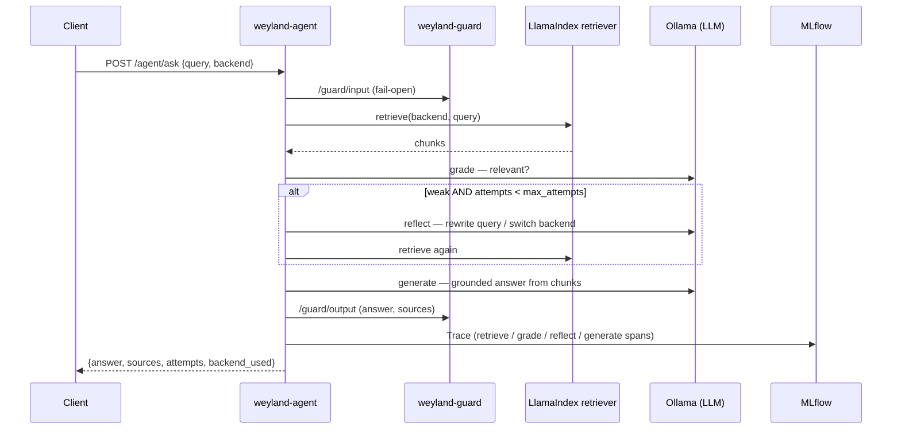

# Demo — Agentic RAG (`weyland-agent`, B70)

The self-reflective RAG loop: **retrieve → grade → reflect/re-retrieve → generate**, over the 4 vector backends,
guarded by the shared `weyland-guard` service and captured per-step as an **MLflow Trace**. More capable than the
tool-server's single-shot `/context/ask`. Validated live 2026-07-23.

Grounded in [runbooks/agentic-rag.md](../runbooks/agentic-rag.md) and the `/agent/ask` surface in [api.md](../api.md).

## Sequence diagram



## Prerequisites

- **mother** — `weyland-agent` (Deployment, ns `weyland`, `agent.weyland.lab`), `weyland-guard`, pgvector/Qdrant/
  Weaviate/Neo4j (populated by the RAG-stream indexer), and `mlflow` (tracking `agentic-rag` experiment).
- **rogueone** — Ollama (`gpt-oss:20b`) for grade/reflect/generate. The loop makes 3+ LLM calls per query, so a
  single ask takes ~a minute.
- `langchain` must be in the agent image (`mlflow.langchain.autolog()` needs it — see the runbook gotcha).

## UI walkthrough

- **MLflow Traces** — `https://mlflow.weyland.lab` → Experiments → **`agentic-rag`** → **Traces** tab → open a trace:
  it shows nested **retrieve / grade / (reflect) / generate** spans with the prompt/context/answer at each step —
  the GenAI observability Tempo's mesh traces can't give.
- **Agent API docs** — `https://agent.weyland.lab/docs` (Keycloak forward-auth) — `/agent/ask`.

## CLI walkthrough

Run in-cluster (the ingress is forward-auth'd; `kubectl exec` reaches the pod directly). A **well-covered** query —
grade passes on the first pull, so `attempts=1`, no reflect:

```
[mother] kubectl -n weyland exec deploy/weyland-agent -- python -c "import urllib.request,json; r=urllib.request.Request('http://localhost:8080/agent/ask',data=json.dumps({'query':'What is the weyland data mesh?','backend':'pgvector'}).encode(),headers={'Content-Type':'application/json'}); d=json.loads(urllib.request.urlopen(r,timeout=600).read()); print('attempts',d['attempts'],'backend_history',d['backend_history'],'answer_chars',len(d['answer']),'sources',len(d['sources']))"
```

An **off-corpus** query — grade returns weak → reflect rewrites/reroutes → `attempts=2` (the loop firing):

```
[mother] kubectl -n weyland exec deploy/weyland-agent -- python -c "import urllib.request,json; r=urllib.request.Request('http://localhost:8080/agent/ask',data=json.dumps({'query':'What is the airspeed velocity of an unladen swallow?','backend':'pgvector'}).encode(),headers={'Content-Type':'application/json'}); d=json.loads(urllib.request.urlopen(r,timeout=600).read()); print('attempts',d['attempts'],'backend_history',d['backend_history'])"
```

Confirm the guards flowed to `weyland-guard` (the agent is a second consumer of the shared service):

```
[mother] kubectl -n weyland exec deploy/weyland-guard -- python -c "import urllib.request; print([l for l in urllib.request.urlopen('http://localhost:8080/metrics').read().decode().splitlines() if 'guardrail_verdicts_total' in l and not l.startswith('#')])"
```

Confirm the run landed an **MLflow Trace** (the headline):

```
[mother] kubectl -n weyland exec deploy/weyland-agent -- python -c "import mlflow; mlflow.set_tracking_uri('http://mlflow.weyland.svc.cluster.local:5000'); from mlflow import MlflowClient; e=MlflowClient().get_experiment_by_name('agentic-rag'); print('traces', len(mlflow.search_traces(experiment_ids=[e.experiment_id])))"
```

**Optional — fail-open proof** (a guard outage must never take an answer offline): scale the guard to 0, re-ask, restore:

```
[mother] kubectl -n weyland scale deploy/weyland-guard --replicas=0
```
```
[mother] kubectl -n weyland exec deploy/weyland-agent -- python -c "import urllib.request,json; r=urllib.request.Request('http://localhost:8080/agent/ask',data=json.dumps({'query':'What is the weyland data mesh?','backend':'pgvector'}).encode(),headers={'Content-Type':'application/json'}); print('FAIL-OPEN OK — answer_chars', len(json.loads(urllib.request.urlopen(r,timeout=600).read())['answer']))"
```
```
[mother] kubectl -n weyland scale deploy/weyland-guard --replicas=1
```

## Expected result

- Well-covered query → `attempts 1`, a grounded ~800-char answer + 5 sources. Off-corpus → `attempts 2` (reflect fired).
- `guardrail_verdicts_total` shows the agent's `injection` (input) + `toxicity`/`grounding` (output) verdicts, all
  `pass` for a benign, grounded answer.
- `traces >= 1` in the `agentic-rag` experiment, with per-step spans visible in the MLflow UI.
- Fail-open: with `weyland-guard` at 0 replicas, `/agent/ask` **still answers**.

## Cleanup / teardown

Mostly read-only. It **creates**: MLflow traces in `agentic-rag` (retained as observability history — no cleanup
needed) and `guardrail_verdicts` rows (shared-service telemetry; increments in-memory counters that reset on pod
restart). If the fail-open step was run, confirm the guard is back:

```
[mother] kubectl -n weyland get deploy weyland-guard
```
