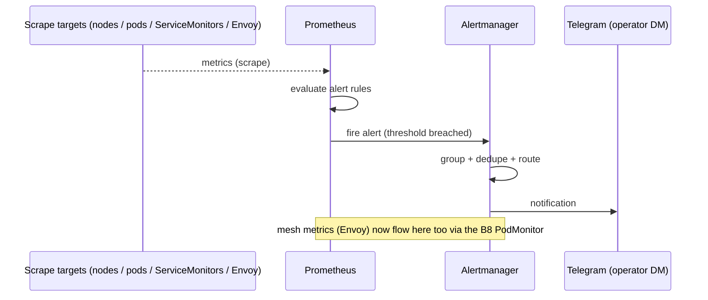

# Demo — Alerting (Prometheus → Alertmanager → Telegram)

Prometheus evaluates alert rules over scraped metrics; Alertmanager groups/dedupes/routes;
the operator gets a Telegram DM from the **Weyland Alerts** bot (`@weyland_alerts_bot`).
Native Alertmanager → Telegram was chosen over Alertmanager→n8n→Telegram to keep the
failure-detection path dependency-minimal. The `Watchdog` always-firing alert routes to
`null`; the bot token lives only in a Secret so the values file stays committable. Log
alerts (Loki ruler, LogQL) ride the **same** Alertmanager → Telegram pipeline.

## Sequence diagram

Reused from [../diagrams/flow-alerting.md](../diagrams/flow-alerting.md):



## Prerequisites
- kube-prometheus-stack up in ns `monitoring` (release name **`monitoring`**), Alertmanager configured for the `telegram` receiver.
- Secret `weyland-alerts-telegram` (bot token) mounted into Alertmanager (`bot_token_file`).
- The **Weyland Alerts** Telegram bot + your chat ID configured.
- `grafana.weyland.lab` (Keycloak OIDC) with the **Alertmanager** datasource for viewing firing alerts.

## UI walkthrough
1. Open `https://grafana.weyland.lab` (Keycloak login).
2. Go to **Alerting** (Alertmanager datasource, `implementation: prometheus`) to see currently firing/grouped alerts. Routing itself stays Alertmanager→Telegram.
3. On your phone, watch the **Weyland Alerts** Telegram chat for the paging DM (and the resolve when the condition clears).

## CLI walkthrough
[mother] Fire a test alert by applying the canned test rule — it fires `WeylandTelegramTest` to the Weyland Alerts chat within ~1-2 min:
```
kubectl apply -f ~/lab/weyland-platform/k8s/monitoring/telegram-test-rule.yaml
```
[mother] Remove it to send the **resolve** notification (proves `send_resolved`):
```
kubectl delete -f ~/lab/weyland-platform/k8s/monitoring/telegram-test-rule.yaml
```
[mother] Inspect currently firing alerts straight from Alertmanager (resolve the pod by label so the exact statefulset name doesn't matter):
```
kubectl -n monitoring exec $(kubectl -n monitoring get pod -l app.kubernetes.io/name=alertmanager -o jsonpath='{.items[0].metadata.name}') -c alertmanager -- wget -qO- http://localhost:9093/api/v2/alerts
```
[mother] (Log-alert variant) Confirm the Loki ruler is loaded and pointing at Alertmanager:
```
kubectl logs -n monitoring loki-0 -c loki | grep -iE 'ruler|rule file|alertmanager'
```

## Expected result
- The `apply` delivers a `WeylandTelegramTest` DM to the Weyland Alerts Telegram chat within ~1-2 min.
- The `delete` delivers a matching **resolved** message.
- `api/v2/alerts` lists active alerts (the test rule appears while applied; `Watchdog` is always present but routed to `null`).

## Cleanup / teardown
The test rule **must** be removed (it is the created data for this demo). The `delete` step above does exactly that:
```
kubectl delete -f ~/lab/weyland-platform/k8s/monitoring/telegram-test-rule.yaml --ignore-not-found
```
No other state is created.
