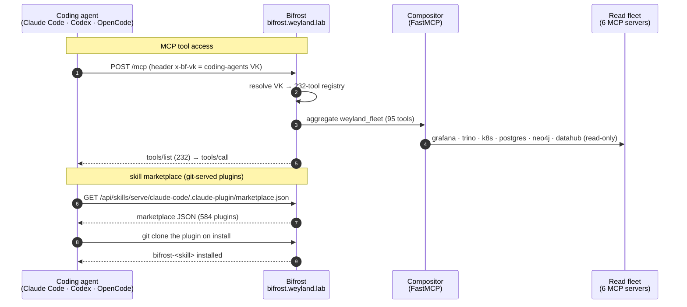

# Bifrost — agent edge (MCP + prompts + skill marketplace)

**Bifrost** (`bifrost.weyland.lab`) is the coding-agent MCP front door and closes the MCP-gateway deliverable (B17+B19,
built out as **B111**). One virtual key gives an agent the whole lab tool surface, plus a reusable prompt library and an
installable skill marketplace.

- **MCP:** the `coding-agents` VK aggregates **232 tools** — the 95-tool read fleet (via the FastMCP compositor) plus
  Context7, Linear, GitHub, Perplexity, Playwright, Hugging Face — behind one `/mcp`. Wired into **Claude Code, Codex,
  and OpenCode** with the *same* VK (scope-by-use, not per-agent).
- **Prompt Repository — 241 prompts:** hand-authored (skill-aware system prompts + a `skills` orchestration folder) plus
  144 corpus-derived (`apply-<framework>`, `run-<aidlc-stage>`, industry-lens). Model-agnostic, lane-tagged.
- **Skills Repository — 583 Agent Skills:** lab-ops runbooks + the 52 AIDLC stages + 511 knowledge-base entries — served
  as a **Claude Code / Codex plugin marketplace** so any of them installs into an agent with one command.

## How a request flows



## Try it

**Add the MCP** (already wired for the three coding agents — Claude Code shown):
```
# ~/.claude.json → mcpServers.bifrost = { type:"http", url:"https://bifrost.weyland.lab/mcp", headers:{ "x-bf-vk": "<coding-agents VK>" } }
```

**Add the skill marketplace and install one:**
```
claude plugin marketplace add https://bifrost.weyland.lab/api/skills/serve/claude-code/.claude-plugin/marketplace.json
claude plugin install bifrost-weyland-conventions@bifrost-skills
```
(Every skill installs as `bifrost-<name>` — e.g. `bifrost-deploy-via-argo`, `bifrost-systematic-debugging`, `bifrost-ct-bcg-matrix`.)

## The picture

```likec4-view
bifrostEdge
```

Durable source of truth (a PVC wipe → re-run in order): `register_bifrost_mcp_clients.py` → `attach_bifrost_vk_mcp.py` →
`rollout restart` → `register_bifrost_prompts.py` / `register_aidlc_prompts.py` → `register_bifrost_skills.py` /
`register_aidlc_skills.py` → `register_aidlc_kb_skills.py`. Full restore order in
[runbooks/mcp-gateway.md](../runbooks/mcp-gateway.md).
