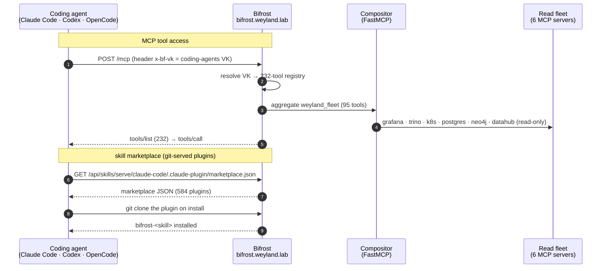

# Bifrost — agent edge (MCP + prompts + skill marketplace)

**Bifrost** (`bifrost.weyland.lab`) is the coding-agent MCP front door and closes the MCP-gateway deliverable (B17+B19,
built out as **B111**). One virtual key gives an agent the whole lab tool surface, plus a reusable prompt library and an
installable skill marketplace.

- **MCP:** the `coding-agents` VK aggregates **232 tools** — the 95-tool read fleet (via the FastMCP compositor) plus
  Context7, Linear, GitHub, Perplexity, Playwright, Hugging Face — behind one `/mcp`. Wired into **Claude Code, Codex,
  and OpenCode** with the *same* VK (scope-by-use, not per-agent).
- **Prompt Repository — 241 prompts:** hand-authored (skill-aware system prompts + a `skills` orchestration folder) plus
  144 corpus-derived (`apply-<framework>`, `run-<aidlc-stage>`, industry-lens). Model-agnostic, lane-tagged.
- **Skills Repository — 583 Agent Skills:** lab-ops runbooks + the 52 AIDLC stages + 511 knowledge-base entries — served
  as a **Claude Code / Codex plugin marketplace** so any of them installs into an agent with one command.

## How a request flows


```mermaid
sequenceDiagram
  autonumber
  participant A as Coding agent<br/>(Claude Code · Codex · OpenCode)
  participant B as Bifrost<br/>bifrost.weyland.lab
  participant C as Compositor<br/>(FastMCP)
  participant F as Read fleet<br/>(6 MCP servers)

  Note over A,B: MCP tool access
  A->>B: POST /mcp  (header x-bf-vk = coding-agents VK)
  B->>B: resolve VK → 232-tool registry
  B->>C: aggregate weyland_fleet (95 tools)
  C->>F: grafana · trino · k8s · postgres · neo4j · datahub (read-only)
  B-->>A: tools/list (232) → tools/call

  Note over A,B: skill marketplace (git-served plugins)
  A->>B: GET /api/skills/serve/claude-code/.claude-plugin/marketplace.json
  B-->>A: marketplace JSON (584 plugins)
  A->>B: git clone the plugin on install
  B-->>A: bifrost-<skill>  installed
```

## Try it

**Add the MCP** (already wired for the three coding agents — Claude Code shown):
```
# ~/.claude.json → mcpServers.bifrost = { type:"http", url:"https://bifrost.weyland.lab/mcp", headers:{ "x-bf-vk": "<coding-agents VK>" } }
```

**Add the skill marketplace and install one:**
```
claude plugin marketplace add https://bifrost.weyland.lab/api/skills/serve/claude-code/.claude-plugin/marketplace.json
claude plugin install bifrost-weyland-conventions@bifrost-skills
```
(Every skill installs as `bifrost-<name>` — e.g. `bifrost-deploy-via-argo`, `bifrost-systematic-debugging`, `bifrost-ct-bcg-matrix`.)

## v2.2.6 — the setup lock, inference auth, owned settings (B202, 2026-10-09)

Bifrost moved from v1.6.7 to **v2.2.6**. Three things changed for callers: `/api` needs the setup token (dashboard auth
stays off), every inference call needs a virtual key, and `/metrics` is whitelisted so Prometheus can scrape it.
Flow: [flow-bifrost § Who authenticates how](../diagrams/flow-bifrost.md). Runbook: [mcp-gateway.md](../runbooks/mcp-gateway.md) § Bifrost setup token.

### UI walkthrough (UAT — eyes on)

1. Open `https://bifrost.weyland.lab` and sign in through Keycloak.
2. Bifrost asks for the **setup token** (once per browser session). Paste `BIFROST_SETUP_TOKEN` from
   `/home/edwardmangini/IdeaProjects/weyland/scripts/.env`. Confirm the dashboard loads; a wrong value is refused.
3. **Setup checklist** (bottom right, or the bell): confirm **Restrict CORS origins** and **Enforce auth on inference**
   are ticked and **Add a provider key** is done. **Set up dashboard auth** stays open by decision (the setup token);
   after "I accept the risk - hide for everyone" the checklist no longer shows.
4. **Prompt Repository** shows ~280 prompts (folder `loop-library` has 11); **Skills** ~589; **MCP clients** lists 10,
   each **healthy** (v2's word for v1's "connected").
5. **Observability → Logs**: the newest rows carry the virtual key `realm-llm` (LiteLLM's hosted lanes).

### CLI walkthrough (the test)

Each command runs on rogueone; the token and the key are read inside the pods, never printed.

**1. Version and the setup lock** — expect `version v2.2.6`, then `401`, `403`, `200`:

[rogueone]
```
kubectl -n weyland exec deploy/weyland-guard -- python -c "import os,httpx;U='http://bifrost.weyland.svc.cluster.local:8080';g=lambda p,h={}:httpx.get(U+p,headers=h).status_code;print('version',httpx.get(U+'/api/version').json());print('no token',g('/api/config'),'| wrong',g('/api/config',{'X-Bifrost-Setup-Token':'wrong'}),'| token',g('/api/config',{'X-Bifrost-Setup-Token':os.environ['BIFROST_SETUP_TOKEN']}))"
```

**2. Inference needs a virtual key** — expect `no key: 401 | realm-llm key: 200` (`GET /v1/models` costs nothing):

[rogueone]
```
kubectl -n weyland exec deploy/litellm -- python -c "import os,urllib.request as u,urllib.error as e
def c(h):
  try: return u.urlopen(u.Request('http://bifrost.weyland.svc.cluster.local:8080/v1/models',headers=h),timeout=15).status
  except e.HTTPError as x: return x.code
print('no key:',c({}),'| realm-llm key:',c({'x-bf-vk':os.environ['BIFROST_REALM_VK']}))"
```

**3. `/metrics` is public and the owned settings hold** — expect `metrics 200`, then `unchanged: client_config already as owned`:

[rogueone]
```
kubectl -n weyland exec deploy/weyland-guard -- python -c "import httpx;print('metrics',httpx.get('http://bifrost.weyland.svc.cluster.local:8080/metrics').status_code)" && kubectl -n weyland exec -i deploy/weyland-guard -- env BIFROST_URL=http://bifrost.weyland.svc.cluster.local:8080 python - < /home/edwardmangini/IdeaProjects/weyland/nodes/mother/lab/weyland-platform/scripts/register_bifrost_client_config.py
```

**4. The repositories and the MCP fleet survived the migration** — expect prompts ~280, skills ~589 (the skills list pages at 100, so this reads `total`), MCP 10 all `healthy`:

[rogueone]
```
kubectl -n weyland exec deploy/weyland-guard -- python -c "import os,httpx,collections;c=httpx.Client(base_url='http://bifrost.weyland.svc.cluster.local:8080',headers={'X-Bifrost-Setup-Token':os.environ['BIFROST_SETUP_TOKEN']},timeout=30);p=c.get('/api/prompt-repo/prompts',params={'limit':1000}).json().get('prompts') or [];s=c.get('/api/skills').json().get('total');m=c.get('/api/mcp/clients').json();m=m.get('clients') if isinstance(m,dict) else m;print('prompts',len(p),'| skills',s,'| mcp',dict(collections.Counter(x.get('state') for x in m or [])))"
```

**5. A real call through the gateway chain** — expect `wl-default 200 … bifrost…/v1 fallbacks: 0`:

[rogueone]
```
kubectl -n weyland exec deploy/litellm -- python -c "import os,httpx;r=httpx.post('http://localhost:4000/v1/chat/completions',headers={'Authorization':'Bearer '+os.environ['LITELLM_MASTER_KEY']},json={'model':'wl-default','messages':[{'role':'user','content':'one word'}],'max_tokens':256},timeout=80);print('wl-default',r.status_code,r.headers.get('x-litellm-model-api-base'),'fallbacks:',r.headers.get('x-litellm-attempted-fallbacks'))"
```

Read-only apart from step 3's no-op re-run and step 5's one free-lane call; nothing to tear down.

### Key scoping through the API, and the MCP watchdog (B203, 2026-10-09)

**6. Each key's MCP grants match git** — expect `coding-agents: unchanged (8 client(s))`, `operator: unchanged (3 client(s))`,
`chat-eval: unchanged (0 client(s))`. A change applies live (no Bifrost restart since v2.2.6):

[rogueone]
```
kubectl -n weyland exec -i deploy/weyland-guard -- env BIFROST_URL=http://bifrost.weyland.svc.cluster.local:8080 python - < /home/edwardmangini/IdeaProjects/weyland/nodes/mother/lab/weyland-platform/scripts/register_bifrost_vk_mcp.py
```

**7. The watchdog sees every client healthy** — expect `checked 10 MCP client(s): 0 alert(s) fired`; then the drill
(runbooks/mcp-gateway.md § MCP watchdog) sends exactly one Telegram message starting `DRILL`:

[rogueone]
```
kubectl -n weyland create job bifrost-mcp-watchdog-now --from=cronjob/bifrost-mcp-watchdog && kubectl -n weyland wait --for=condition=complete job/bifrost-mcp-watchdog-now --timeout=180s; kubectl -n weyland logs job/bifrost-mcp-watchdog-now; kubectl -n weyland delete job bifrost-mcp-watchdog-now
```
**UAT:** Telegram shows the `DRILL — Context7 …` message; Argo CD → app **bifrost** lists CronJob `bifrost-mcp-watchdog`
(`50 3 * * *`, America/New_York). Teardown: the commands delete their Jobs; the drill alert resolves on its own.

## The picture

```likec4-view
bifrostEdge
```

**A PVC loss restores from the nightly `bifrost-backup`** (B202; [sqlite-backups.md](sqlite-backups.md), runbook
§ Bifrost backup + restore). Without a backup, rebuild in order: `register_bifrost_client_config.py` →
`register_bifrost_mcp_clients.py` → `register_bifrost_vk_mcp.py` (no restart since B203) → `register_bifrost_prompts.py` /
`register_aidlc_prompts.py` → `register_bifrost_skills.py` → `register_aidlc_kb_skills.py`
(`register_aidlc_skills.py` is retired; its 52 stage skills are only in the backup). Full order in
[runbooks/mcp-gateway.md](../runbooks/mcp-gateway.md).
