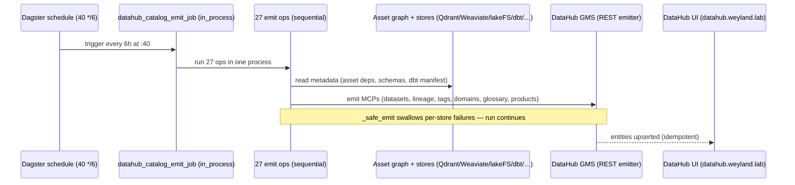

# Demo — DataHub Catalog Emit

The Dagster `datahub_catalog_emit_job` walks the asset graph + the Tier-2 stores and pushes
Datasets, lineage, tags, domains, glossary terms, and data products to **DataHub** via the REST
emitter. It replaces the dead `acryl` run-status sensor (broken on Dagster 1.13, dagster#21526).
It runs **in-process** (one process, one import — 27 emit ops run sequentially, ~1.3 GB peak
instead of an N-concurrent OOM), is idempotent (DataHub upserts), and is scheduled every 6h at
`:40` (`datahub_catalog_emit_schedule`, cron `40 */6 * * *`). Per-store failures are swallowed by
`_safe_emit` so one flaky store never sinks the whole run.

## Sequence diagram

## Prerequisites

- `mother` — k3s platform; the Dagster deployments (`dagster-user-code`, webserver, daemon) run
  here.
- DataHub GMS reachable in-cluster at `http://datahub-datahub-gms.data-mesh.svc.cluster.local:8080`
  (ns `data-mesh`); the emitter reads `DATAHUB_GMS_TOKEN` from the pod env.
- DataHub UI at `datahub.weyland.lab` (Keycloak SSO for the browser).
- Login: `emangini` / `weyland_dev_password`.

## UI walkthrough

1. Open `https://dagster.weyland.lab` and sign in via Keycloak.
2. Go to **Jobs** and open **`datahub_catalog_emit_job`**. You can also open **Automation** →
   **`datahub_catalog_emit_schedule`** to confirm it is RUNNING (cron `40 */6 * * *`).
3. Click **Materialize / Launch Run**. In the run view, watch the 27 ops execute in order
   (`emit_dagster_assets_op`, `emit_qdrant_op`, `emit_weaviate_op`, `emit_lakefs_op`,
   `emit_dbt_op`, `emit_domains_op`, `emit_data_products_op`, `emit_glossary_op`, …). Each op's
   log line reads `✓ <label> → DataHub: <result>` (or a `⚠ … SKIPPED` warning for a flaky store).
4. Open `https://datahub.weyland.lab`. Verify:
   - **Datasets** on the `dagster` platform (asset names + descriptions + `dagster_group` tag).
   - **Datasets** on the `trino` platform for the dbt marts (`iceberg.dbt.mart_*`) with column
     schemas + lineage back to the gold sources.
   - **Domains** (Music, Health, AIDLC Knowledge, Docs & RAG, Platform & Ops, ML & Modeling).
   - **Data Products** and the **Business Glossary** (Data Mesh + AIDLC KB roots).

## CLI walkthrough

Run the whole job in the user-code pod (standard Dagster CLI, module `weyland_pipeline.definitions`):

[mother] `kubectl -n weyland exec deploy/dagster-user-code -- dagster job execute -j datahub_catalog_emit_job -m weyland_pipeline.definitions`

Run a single emitter standalone (the module's `__main__` — walks the asset graph only):

[mother] `kubectl -n weyland exec deploy/dagster-user-code -- python -m weyland_pipeline.datahub_emit`

Confirm the GMS token is present in the pod (non-empty expected):

[mother] `kubectl -n weyland exec deploy/dagster-user-code -- printenv DATAHUB_GMS_TOKEN | head -c 12 ; echo`

Query GMS directly for a freshly-emitted dataset (dagster-platform asset URN):

[mother] `kubectl -n data-mesh exec deploy/datahub-datahub-gms -- curl -s -H "Authorization: Bearer $(kubectl -n weyland get secret datahub-emit -o jsonpath='{.data.DATAHUB_GMS_TOKEN}' 2>/dev/null | base64 -d)" "http://localhost:8080/entities?action=get" -X POST -d '{"urn":"urn:li:dataset:(urn:li:dataPlatform:dagster,rag_documents,PROD)"}' | head -c 400 ; echo`

> The secret name / key for the emit token (`datahub-emit` above) is `TODO: verify` — confirm with
> `kubectl -n weyland get secret | grep -i datahub`. The token itself is already in the pod env
> (`DATAHUB_GMS_TOKEN`), which the two commands above use.

## Expected result

- The Dagster run succeeds (green) with 27 ops; each logs `✓ <label> → DataHub: …`.
- DataHub shows the `dagster`-platform asset datasets, the `trino` dbt marts with lineage, the 6
  domains, the data products, and the glossary — all upserted (re-running changes nothing new,
  proving idempotency).

## Cleanup / teardown

The job is **idempotent upserts** — it creates/refreshes catalog metadata, never test rows, and a
re-run just re-asserts the same entities. There is normally nothing to tear down; leave the
catalog in place.

To remove an entity you emitted for testing (e.g. a throwaway dataset URN), soft-delete it via the
DataHub CLI in the GMS pod:

[mother] `kubectl -n data-mesh exec deploy/datahub-datahub-gms -- datahub delete --urn "urn:li:dataset:(urn:li:dataPlatform:dagster,<test-name>,PROD)" --soft`

> Whether the `datahub` CLI is on the GMS image is `TODO: verify`; if absent, use the DataHub UI
> (dataset → ⋯ → **Delete**) which is always available.
