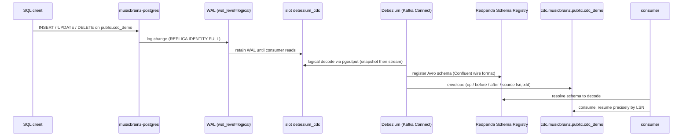

# Demo — Change Data Capture (Debezium → Redpanda)

Turns a row change in Postgres into an event in a topic — the genuinely event-driven half of the streaming tier
(the producer replay is bounded; CDC is continuous). Debezium runs on a Kafka Connect worker, tails the WAL of
**musicbrainz-postgres** (`public.cdc_demo`) via a logical-replication slot, and emits the Debezium **envelope**
(`op` / `before` / `after` / `source`.lsn) as Avro to `cdc.musicbrainz.public.cdc_demo`. Source is
musicbrainz-postgres because it is **isolated** (nothing depends on it) and **reproducible** — never the core
weyland-postgres. Runbook: [../runbooks/streaming.md](../runbooks/streaming.md). Diagram:
[../diagrams/flow-cdc.md](../diagrams/flow-cdc.md).

## Sequence diagram



## Prerequisites

- **Redpanda** (pod `redpanda-0`, ns `data-mesh`) — Kafka `:9092`, schema registry `:8081`.
- **Kafka Connect** Debezium worker (`quay.io/debezium/connect`) — deploy `kafka-connect`, ns `data-mesh`, REST
  on `:8083`. Confluent Avro converter injected via initContainer (from `cp-kafka-connect`).
- **musicbrainz-postgres** (`musicbrainz-postgres.data-mesh.svc:5432`, db `musicbrainz_db`, PG18) prepared for
  CDC: `wal_level=logical` (needs a restart) + `max_slot_wal_keep_size=4GB` (the seatbelt) + the captured table
  `public.cdc_demo` at `REPLICA IDENTITY FULL`.
- **Secret** `musicbrainz-postgres-secret` (key `POSTGRES_PASSWORD`) in ns `data-mesh`.

## UI walkthrough

1. **Register the connector** — no UI; use the REST call in the CLI section below.
2. **Watch the topic** — `https://redpanda.weyland.lab` (Redpanda Console) → Topics →
   **`cdc.musicbrainz.public.cdc_demo`** → Messages. Initial `snapshot.mode=initial` produces `op=r` rows;
   subsequent DML produces `op=c/u/d`. Console decodes the Avro envelope.
3. **Inspect the schema** — Console → Schema Registry → subjects `cdc.musicbrainz.public.cdc_demo-value` /
   `-key`.
4. **Connector status** — no dedicated UI; verified via the REST status call below.

## CLI walkthrough

Kubectl runs on **mother** (`emangini@mother`).

```
[mother] kubectl -n data-mesh get pod redpanda-0
[mother] kubectl -n data-mesh get deploy kafka-connect
```

Register the Postgres connector (the runbook's exact REST call — `jq -n --arg pw` escapes the password):

```
[mother] PW=$(kubectl -n data-mesh get secret musicbrainz-postgres-secret -o jsonpath='{.data.POSTGRES_PASSWORD}' | base64 -d)
[mother] jq -n --arg pw "$PW" '{name:"musicbrainz-cdc",config:{"connector.class":"io.debezium.connector.postgresql.PostgresConnector","database.hostname":"musicbrainz-postgres.data-mesh.svc.cluster.local","database.port":"5432","database.user":"postgres","database.password":$pw,"database.dbname":"musicbrainz_db","topic.prefix":"cdc.musicbrainz","plugin.name":"pgoutput","slot.name":"debezium_cdc","publication.name":"debezium_pub","publication.autocreate.mode":"filtered","table.include.list":"public.cdc_demo","snapshot.mode":"initial","tombstones.on.delete":"false"}}' | kubectl -n data-mesh exec -i deploy/kafka-connect -- curl -s -XPOST -H "Content-Type: application/json" --data-binary @- localhost:8083/connectors
[mother] kubectl -n data-mesh exec deploy/kafka-connect -- curl -s localhost:8083/connectors/musicbrainz-cdc/status
```

Generate a change to capture (INSERT/UPDATE/DELETE on the captured table):

```
[mother] kubectl -n data-mesh exec deploy/musicbrainz-postgres -- psql -U postgres -d musicbrainz_db -c "INSERT INTO public.cdc_demo (id, note) VALUES (1, 'hello cdc');"
[mother] kubectl -n data-mesh exec deploy/musicbrainz-postgres -- psql -U postgres -d musicbrainz_db -c "UPDATE public.cdc_demo SET note = 'changed' WHERE id = 1;"
[mother] kubectl -n data-mesh exec deploy/musicbrainz-postgres -- psql -U postgres -d musicbrainz_db -c "DELETE FROM public.cdc_demo WHERE id = 1;"
```

`TODO: verify` the `public.cdc_demo` table's exact columns and the musicbrainz-postgres workload name (`deploy/`
vs `sts/`) — the runbook names the table + connector but not the column list. Adjust the `INSERT` columns to the
real schema.

Observe the events:

```
[mother] kubectl -n data-mesh exec redpanda-0 -- rpk topic consume cdc.musicbrainz.public.cdc_demo --num 4
[mother] kubectl -n data-mesh exec redpanda-0 -- curl -s localhost:8081/subjects
```

## Expected result

- Topic `cdc.musicbrainz.public.cdc_demo` exists with the initial snapshot rows (`op=r`), then one event per DML:
  `op=c` (insert, `before=null`), `op=u` (update, `before`=old row via `REPLICA IDENTITY FULL`), `op=d` (delete,
  `after=null`).
- Subjects `cdc.musicbrainz.public.cdc_demo-value` / `-key` registered.
- Connector status `RUNNING` (both connector + task).
- The slot `debezium_cdc` + publication `debezium_pub` exist on musicbrainz-postgres.

## Cleanup / teardown

Deleting the connector does **not** drop its replication slot — the slot must be dropped manually or it keeps
retaining WAL (the seatbelt bounds it, but clean up):

```
[mother] kubectl -n data-mesh exec deploy/kafka-connect -- curl -s -XDELETE localhost:8083/connectors/musicbrainz-cdc
[mother] kubectl -n data-mesh exec deploy/musicbrainz-postgres -- psql -U postgres -d musicbrainz_db -c "SELECT pg_drop_replication_slot('debezium_cdc');"
[mother] kubectl -n data-mesh exec deploy/musicbrainz-postgres -- psql -U postgres -d musicbrainz_db -c "DROP PUBLICATION IF EXISTS debezium_pub;"
[mother] kubectl -n data-mesh exec redpanda-0 -- rpk topic delete cdc.musicbrainz.public.cdc_demo
```

If you inserted demo rows into `public.cdc_demo`, remove them (`DELETE FROM public.cdc_demo WHERE id = 1;`). The
`TODO: verify` note above applies to the workload name (`deploy/musicbrainz-postgres`).
