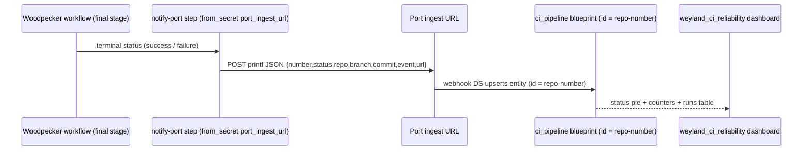

# Demo — CI reliability signal (Woodpecker → Port `ci_pipeline`, B63)

Every Woodpecker run reports its terminal status to Port's **`ci_pipeline`** blueprint, and a
`weyland_ci_reliability` dashboard aggregates pass/fail across both build farms — the weyland reliability view Port's
stock (GitHub-Actions-only) DORA boards can't give. Validated live 2026-08-19 across both backends and both outcomes:
**weyland-lab #12** (k8s backend → success) · **stud.io #14** (local backend → failure) · **stud.io #15** (local →
success). See [../diagrams/flow-ci-reliability-signal.md](../diagrams/flow-ci-reliability-signal.md) for the sequence.

## Sequence diagram

Reused from [../diagrams/flow-ci-reliability-signal.md](../diagrams/flow-ci-reliability-signal.md):



## Prerequisites
- Woodpecker repo secret **`port_ingest_url`** on each reporting repo (the Port webhook ingest URL; env `from_secret`,
  kept OUT of the public YAML). Events: weyland-lab `cron,manual`; stud.io `manual,pull_request,push`.
- Port webhook DS **`woodpecker`** (enabled) mapping `.body` → `ci_pipeline` (id `(repo|gsub "/"→"-")-number`,
  filter `.body.number != null`). Mapping must be **Saved before** the first event — Port has **no replay**.
- `ci_pipeline` blueprint with a **`status` enum** (`success`/`failure`/`running`/`pending`/`error`/`killed`/`skipped`)
  — Port silently drops an out-of-enum value (ingest returns `ok:true` but writes no entity).

## UI walkthrough (eyes-on UAT)
1. **Port** → **Catalog → `ci_pipeline`** blueprint. **UAT — confirm:** the recent runs are present as entities
   (`edtbl76-weyland-lab-<N>`, `edtbl76-stud.io-<N>`), each with `status`, `repo`, `branch`, `event`, `pipelineNumber`
   populated — and the status matches the Woodpecker run (a green run → `success`, a red run → `failure`).
2. **Port** → the **`weyland_ci_reliability`** dashboard. **UAT — put eyes on each widget:**
   - the **status pie** renders (not blank) and splits by `status` — with both a success and a failure entity present,
     it shows **more than one slice** (proof it's aggregating real outcomes, not a single happy path);
   - the **count counters** show a non-zero total;
   - the **runs table** lists entities newest-first (sorted by `pipelineNumber` desc) and every row is a real run.
3. Cross-check one row against Woodpecker: `https://woodpecker.weyland.lab` → the same repo/run number → the run's
   status matches the entity's `status`. (A green pipeline behind a blank/stale dashboard is **not** done — this step
   is the anti-"accurate-but-empty" check the B60 EI audit flagged.)

## CLI walkthrough
[rogueone] Trigger a run whose outcome will report (STUD.io, full main CI):
```
. ~/.config/studio/woodpecker-cli.env; export WOODPECKER_SERVER="http://192.168.1.243:30980"; export PATH="$HOME/.local/bin:$PATH"; woodpecker-cli pipeline create edtbl76/stud.io --branch main
```
[rogueone] Poll until the notify step settles (N = the number printed above); on a multi-workflow run confirm the
notify steps run **last** and only the matching gate fires (`notify-port-pass` on success, `notify-port-fail` on
failure — the other is `skipped`):
```
woodpecker-cli pipeline ps edtbl76/stud.io N
```
[rogueone] Verify the entity landed in Port with the right status (client-creds in `scripts/.env`; the ingest URL and
client secret never printed):
```
cd /home/edwardmangini/IdeaProjects/weyland; set -a; . ./scripts/.env; set +a; TOKEN=$(curl -sf -X POST https://api.getport.io/v1/auth/access_token -H "Content-Type: application/json" -d "{\"clientId\":\"$PORT_CLIENT_ID\",\"clientSecret\":\"$PORT_CLIENT_SECRET\"}" | python3 -c 'import sys,json;print(json.load(sys.stdin)["accessToken"])'); curl -s "https://api.getport.io/v1/blueprints/ci_pipeline/entities/edtbl76-stud.io-N" -H "Authorization: Bearer $TOKEN" | python3 -c 'import sys,json;p=json.load(sys.stdin)["entity"]["properties"];print("status:",p["status"],"| repo:",p["repo"],"| number:",p["pipelineNumber"])'
```

## Expected result
- Each triggered run produces exactly one `ci_pipeline` entity (`repo-number`) with the run's real terminal status.
- The `weyland_ci_reliability` dashboard reflects it: pie splits success vs failure, counters increment, table gains a
  row. Both backends feed the same blueprint (weyland-lab k8s single-workflow; stud.io local multi-workflow).

## Cleanup / teardown
This demo **creates entities** in the `ci_pipeline` blueprint (one per triggered run). Real runs are the intended
build history — keep them. Remove any **throwaway test** entities (e.g. a manually triggered smoke run) via the Port
API:
```
cd /home/edwardmangini/IdeaProjects/weyland; set -a; . ./scripts/.env; set +a; TOKEN=$(curl -sf -X POST https://api.getport.io/v1/auth/access_token -H "Content-Type: application/json" -d "{\"clientId\":\"$PORT_CLIENT_ID\",\"clientSecret\":\"$PORT_CLIENT_SECRET\"}" | python3 -c 'import sys,json;print(json.load(sys.stdin)["accessToken"])'); curl -s -o /dev/null -w "%{http_code}\n" -X DELETE "https://api.getport.io/v1/blueprints/ci_pipeline/entities/<repo>-<number>" -H "Authorization: Bearer $TOKEN"
```
(Used during B63 validation to delete the false-green `edtbl76-stud.io-13` and the earlier empty-status test rows.)
