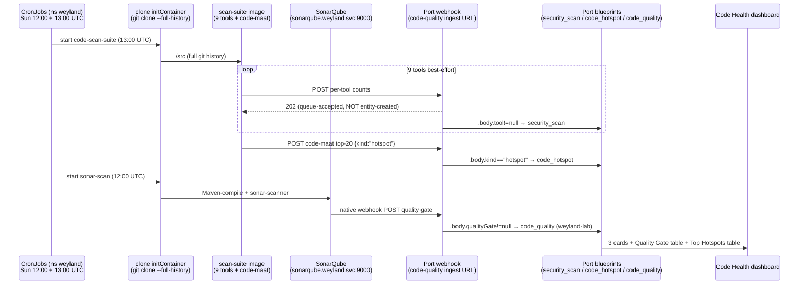

# Demo — Code quality / security scan (scan-suite → Port)

The weekly **code-health** capability (B69 scan-suite + B89 triage + B90 dashboard). Two k8s CronJobs in ns
`weyland` feed Port.io: **`code-scan-suite`** runs 9 security tools + code-maat hotspots over the cloned repo
(→ `security_scan` + `code_hotspot` blueprints), and **`sonar-scan`** Maven-compiles + runs sonar-scanner against
the in-cluster SonarQube (→ `code_quality` quality-gate). A **Code Health** Port dashboard assembles all three.
Grounded in [../runbooks/code-quality.md](../runbooks/code-quality.md), [../diagrams/flow-code-quality.md](../diagrams/flow-code-quality.md),
and [../schedules.md](../schedules.md).

> **✅ Validated — RUN live 2026-07-18.** Both smokes executed straight through: **9** `security_scan` entities
> confirmed in Port, code-maat **posted 20 hotspots**, `sonar-scan` returned **ANALYSIS SUCCESSFUL**, and the
> **Code Health** dashboard renders (Open Critical **1**, Open High **276**).

## Sequence diagram



## Prerequisites

- **Port** — `https://app.port.io`; blueprints `security_scan`, `code_hotspot`, `code_quality`
  (`tofu/port/blueprints.tf`); webhook DS `code-quality` with a **3-entry mapping array** (UI-only, `operation: create`).
- **CronJobs** (both `Sun`, `Etc/UTC`): `code-scan-suite` (`k8s/code-quality/scan-suite.yaml`, 13:00 UTC),
  `sonar-scan` (`k8s/sonarqube/sonar-scan.yaml`, 12:00 UTC).
- **scan-suite image** — `registry.weyland.lab/scan-suite` (`services/scan-suite/`); ingest URL in Secret
  `port-ingest-url` (key `url`).
- **SonarQube** — `https://sonarqube.weyland.lab`, in-cluster `sonarqube.weyland.svc:9000`, native webhook → Port.
- **Code Health dashboard** — Port Catalog → **Code Health** (built via Port MCP `upsert_dashboard_page`, Port-only, not codified).
- `kubectl` runs on **mother** (`emangini@mother`).

## UI walkthrough

1. Open `https://app.port.io` → **Catalog** → **Code Health** dashboard. Confirm the assembled page:
   - **3 number cards** — Σ `critical`, Σ `high`, Σ `medium` over `security_scan` (live values: Open Critical **1**, Open High **276**).
   - **Quality Gate table** — from `code_quality` (one row: `weyland-lab`, gate = **ERROR**).
   - **Top Hotspots table** — from `code_hotspot`, sorted by churn (`revisions`).
2. Drill into the individual catalog tables (sidebar / Catalog):
   - **Security Scans** (`security_scan`) — **9 tool entities**: gitleaks, checkov, kubescape, hadolint, bandit, osv-scanner, shellcheck, semgrep, trivy — each with its critical/high/medium/low/total and `scannedAt`.
   - **Code Hotspot** (`code_hotspot`) — top-20 hot files ranked by `revisions` (churn).
   - **Code Quality** (`code_quality`) — `weyland-lab`, `qualityGate = ERROR`, with `project` / `branch` / `analyzedAt` / `url`.
3. Cross-check the source detail in the **SonarQube UI** at `https://sonarqube.weyland.lab/dashboard?id=weyland-lab`
   (double-login: Keycloak forward-auth gate, then SonarQube's own login).

## CLI walkthrough

The canonical trigger is the weekly Sunday CronJob. To kick each on-demand instead of waiting, create a Job
`--from` the CronJob on **mother**.

[mother] Kick the scan-suite (9 tools + code-maat) and read its log:
```
kubectl -n weyland create job scan-suite-smoke --from=cronjob/code-scan-suite && kubectl -n weyland wait --for=condition=complete job/scan-suite-smoke --timeout=360s && kubectl -n weyland logs job/scan-suite-smoke
```
Expect each tool printing `= <tool>: …C / …H / …M / …L` then `POST 202`, and a final `= code-maat: posted 20 hotspots to Port`.

[mother] Kick the sonar path (clone → Maven-compile → sonar-scanner):
```
kubectl -n weyland create job sonar-scan-smoke --from=cronjob/sonar-scan && kubectl -n weyland wait --for=condition=complete job/sonar-scan-smoke --timeout=900s && kubectl -n weyland logs job/sonar-scan-smoke --tail=5
```
Expect `ANALYSIS SUCCESSFUL` and `EXECUTION SUCCESS`.

The Port entities appear within seconds of each `202` (Sonar lags a few seconds while the SonarQube CE processes
the report before its native webhook fires). Remember: a `202` is queue-acceptance, **not** proof an entity was
created — confirm in the Port catalog tables above.

## Expected result

- **9** `security_scan` entities in Port (one per tool), each with severity counts; **20** `code_hotspot` entities
  ranked by churn; **1** `code_quality` entity (`weyland-lab`, gate `ERROR`).
- The **Code Health** dashboard renders the 3 cards + 2 tables (Open Critical **1**, Open High **276** as of 2026-07-18).
- `scan-suite-smoke` log ends with `= code-maat: posted 20 hotspots to Port`; `sonar-scan-smoke` ends with `ANALYSIS SUCCESSFUL` / `EXECUTION SUCCESS`.

## Cleanup / teardown

[mother] Delete the smoke Jobs:
```
kubectl -n weyland delete job scan-suite-smoke sonar-scan-smoke --ignore-not-found
```
> The demo re-creates data, but it's **idempotent Port upserts** — the webhook mapping's `operation: create` is
> keyed by identifier (`tool` for `security_scan`, `file`-slug for `code_hotspot`, `weyland-lab` for `code_quality`),
> so re-running overwrites rather than duplicating. No teardown of Port entities is needed beyond the smoke Jobs.
