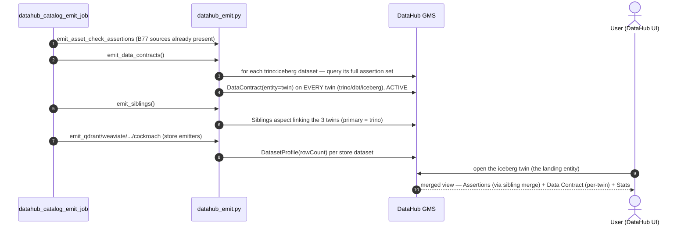

# Demo — DataHub governance maturity: contracts mesh-wide · siblings · stats (B80)

**What it shows:** the last governance-surface hardening on the catalog. Three things ship together, all emitted from
git via `datahub_emit.py` in `datahub_catalog_emit_job` (read-only, idempotent):

1. **Data Contracts, mesh-wide** — one `DataContract` per data-mesh dataset, bundling its *full* assertion set (Soda
   + `@asset_check` + GE, source-agnostic) — not just the old per-mart Soda contracts.
2. **Siblings merge** — each logical table exists as up-to-three catalog entities (`trino` / `dbt` / `iceberg`); the
   `Siblings` aspect merges them into one, so governance is visible on whichever twin a user opens.
3. **Stats-wide** — a rowCount `DatasetProfile` on every recipe-less store (qdrant/weaviate/lancedb/opensearch/duckdb/
   mysql/timescale + cockroach), so their Stats tab is no longer greyed.

## Run it

The three emitters run in the 6-hourly `datahub_catalog_emit_job`. To land them on demand — **mother:**

```
kubectl -n weyland exec deploy/dagster-user-code -- python -c 'import weyland_pipeline.datahub_emit as d; print("contracts", d.emit_data_contracts(), "| siblings", d.emit_siblings())'
```

Expect `contracts ~300` (per-twin) and `siblings ~126`.

## Verify

- **Contract + assertions on the landing entity** — DataHub → search `mart_country_health` → open the **iceberg**
  `Model` (the entity users naturally land on, *not* the trino one) → **Quality → Assertions** shows the checks
  (merged in from the trino sibling) and **Quality → Data Contract** renders the contract. Before B80 both were empty
  on this twin — all governance sat only on the `trino:iceberg.dbt.mart_country_health` entity.
- **Siblings** — the same page shows a **"Part of"** pill with the combined (merged) icon; opening any of the three
  twins lands on the same merged entity.
- **Stats** — open a `qdrant` or `mysql` dataset → **Stats** tab shows a row count (was greyed pre-B80).

## The sibling-merge gotcha (why contracts go on every twin)

DataHub's sibling merge is **not uniform across tabs**. It merges the **Assertions** tab across siblings — so the
iceberg twin shows the trino twin's assertions for free. But it resolves the **Data Contract** tab (and **Stats**)
**strictly per-URN** — it looks for a contract whose `entity` is *exactly* the viewed dataset. So a contract only on
the `trino` twin stays invisible on the `iceberg` twin users open. The fix: emit the `DataContract` on **every twin**
(same assertion set, stable `md5(twin)` URN), matching how assertions already appear everywhere via the merge.

## Honest coverage (the real ceiling)

Stats coverage after B80: **2995/3756 (79%)**. Every custom-emit store is 100% (qdrant 10/10 · weaviate 11/11 ·
lancedb 9/9 · opensearch 16/16 · duckdb 112/112 · mysql 32/32 · cockroach 9/9). The ~615 uncovered are **non-tabular
by nature** — a row count doesn't apply: grafana pseudo-datasets (373), dagster assets (97), s3/parquet/arrow/avro/
lance file pointers (~100), neo4j graph (26), kafka topics (4), mongo (source rejects profiling, 10). Exclude those
and it's **~95% of every profileable dataset** — that's the ceiling, not 100%. The remaining fillable gap is the
`dbt`/`iceberg` twin tail (stats, like contracts, don't merge across siblings) — deliberately left as low-value
fragmentation-chasing.

## Flow



See [../arch.md](../arch.md) §7d and the B77 data-quality demo [great-expectations.md](great-expectations.md).
