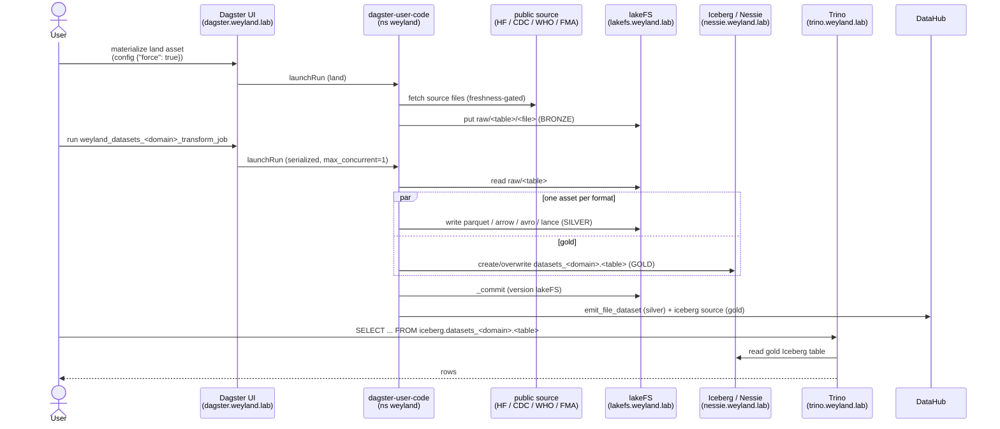

# Demo — Datasets Lakehouse (land → transform → Iceberg)

Walk the bronze → silver → gold lakehouse end-to-end for one dataset: a per-dataset **land** asset pulls a
public source into lakeFS `raw/` (bronze); the shared **transform broker** fans it out to five silver formats
(Parquet/Arrow/Avro/Lance) and hydrates an **Iceberg** gold table in Nessie; DataHub catalogs it. Grounded in
[../runbooks/datasets-lake.md](../runbooks/datasets-lake.md) and
[../diagrams/flow-datasets-lakehouse.md](../diagrams/flow-datasets-lakehouse.md).

> **Chain:** next → [dbt.md](dbt.md) (builds tested marts on the Iceberg gold this lands).

## Sequence diagram



## Prerequisites

- **Dagster** — `https://dagster.weyland.lab` (Keycloak forward-auth). Code pod: `deploy/dagster-user-code` (ns `weyland`).
- **lakeFS** — `https://lakefs.weyland.lab` (browser); in-cluster `lakefs.data-mesh.svc.cluster.local:8000`.
- **Nessie** — `https://nessie.weyland.lab` (Iceberg catalog / table versioning); in-cluster `nessie.data-mesh.svc.cluster.local:19120`.
- **Trino** — `https://trino.weyland.lab` (monitoring console only; query via CLI/IntelliJ). In-cluster `trino.data-mesh.svc:8080`.
- **MinIO browser** — `https://files.weyland.lab` (Filestash) for the underlying `lakefs` / `warehouse` buckets.
- `kubectl` runs on **mother** (`emangini@mother`).

## UI walkthrough

1. Open `https://dagster.weyland.lab` → **Assets** (or **Jobs**).
2. Filter to the group `datasets_music` (or `datasets_health`). Pick a land asset (e.g. `spotify_tracks`).
3. **Materialize** it. To re-download a fresh copy past the freshness gate, open the launchpad and set run config `{"force": true}` (the `RefreshConfig` override) — this avoids the destructive "wipe materializations" hack.
4. Confirm the raw file landed: open `https://lakefs.weyland.lab` → repo `music` (or `health`) → `main` branch → `raw/<table>/`.
5. Back in Dagster, run the job **`weyland_datasets_music_transform_job`** (or `..._health_...`). It is serialized (`max_concurrent: 1`) — the five format assets run one at a time.
6. When green, each format asset (`datasets_music_parquet`, `_arrow`, `_avro`, `_lance`) plus the Iceberg gold table and `_commit` are materialized. Browse the silver in lakeFS under `parquet/`, `arrow/`, `avro/`, `lance/`.
7. Browse the gold table versioning at `https://nessie.weyland.lab` (Nessie `main` ref).

## CLI walkthrough

Trigger the land + transform from the Dagster UI (above) — no documented CLI trigger. These commands verify the graph and inspect the result.

[mother] Gate the whole asset graph imports:
```
kubectl -n weyland exec deploy/dagster-user-code -- python -c "import weyland_pipeline.definitions as d; print('defs OK')"
```

[mother] Open the Trino CLI (no auth):
```
kubectl -n data-mesh exec -it deploy/trino -- trino
```

[mother] Discover the gold schemas and tables (in the `trino>` prompt):
```
SHOW SCHEMAS FROM iceberg;
```
```
SHOW TABLES FROM iceberg.datasets_music;
```

[mother] Query a gold Iceberg table:
```
SELECT track_genre, count(*) AS n FROM iceberg.datasets_music.spotify_tracks GROUP BY track_genre ORDER BY n DESC LIMIT 20;
```

[mother] Inspect Iceberg snapshots (each transform run `overwrite()`s → a fresh snapshot):
```
SELECT snapshot_id, committed_at, operation FROM iceberg.datasets_music."spotify_tracks$snapshots" ORDER BY committed_at DESC;
```

## Expected result

- `raw/<table>/<file>` present in the lakeFS `music`/`health` repo (bronze).
- Silver `parquet/`, `arrow/`, `avro/`, `lance/` folders populated; a `_commit` versions the lakeFS branch.
- A gold Iceberg table `iceberg.datasets_<domain>.<table>` queryable via Trino, with a fresh snapshot per run.
- The dataset appears in DataHub (custom `emit_file_dataset` for raw + silver; iceberg source for gold).

## Cleanup / teardown

Re-running land/transform is **idempotent** — the broker `overwrite()`s each Iceberg table and re-writes each silver file per run, so a demo run creates no accumulating data (prior snapshots stay via Iceberg time-travel).

To fully remove a table you created for the demo:

[mother] Drop the gold Iceberg table in-pod (matches the datasets-lake `drop_table` gotcha):
```
kubectl -n weyland exec -i deploy/dagster-user-code -- python -c "from weyland_pipeline.assets.datasets_music_transform import MUSIC_CFG; from weyland_pipeline.assets.datasets_lib.writers import _catalog; _catalog(MUSIC_CFG).drop_table('datasets_music.spotify_tracks')"
```
> TODO: verify the exact `_catalog(...)` import path / signature in `datasets_lib/writers.py` before running the drop.

To remove the silver + raw files, delete the corresponding `raw/<table>/`, `parquet/<table>/`, `lance/<table>/` (etc.) keys in `https://lakefs.weyland.lab` (repo `music`/`health`, `main` branch). lakeFS remains the source of truth, so this is the authoritative delete.
