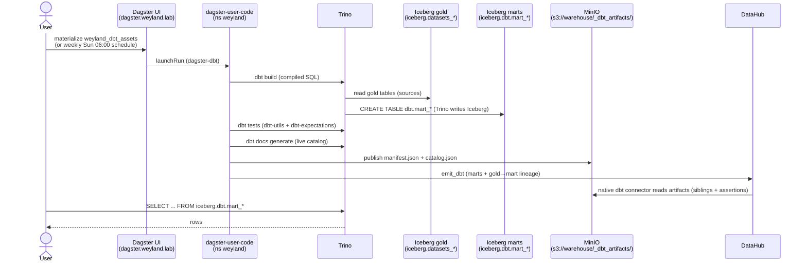

# Demo — dbt (build → 7 marts in iceberg.dbt.*)

dbt Core (via **dbt-trino**) is the analytics-engineering tier on top of the Iceberg gold: it compiles SQL to
Trino, and **Trino writes** the 7 tested marts as Iceberg tables in the `iceberg.dbt` schema on the Nessie `main`
ref. It does not re-ingest — `datasets_lib` owns land → silver → gold. Grounded in
[../runbooks/dbt.md](../runbooks/dbt.md) and [../query/dbt-marts.md](../query/dbt-marts.md).

## Sequence diagram



## Prerequisites

- **Dagster** — `https://dagster.weyland.lab`; assets `weyland_dbt_assets`, job `weyland_dbt_job` (weekly Sun 06:00 NY). Code pod `deploy/dagster-user-code` (ns `weyland`).
- **dbt-docs** — `https://dbt-docs.weyland.lab` (Keycloak forward-auth) — model DAG / lineage / test-coverage UI.
- **Trino** — write path to Iceberg; marts land in `iceberg.dbt.mart_*` (Nessie `main`). In-cluster `trino.data-mesh.svc:8080`.
- **profiles.yml** — `dbt-trino`, `host: trino.data-mesh.svc:8080`, `http_scheme: http`, `database: iceberg`, `schema: dbt`, `threads: 2` (no-auth LAN Trino).
- `kubectl` runs on **mother** (`emangini@mother`).

## UI walkthrough

1. Open `https://dagster.weyland.lab` → **Assets** → `weyland_dbt_assets` → **Materialize** (or wait for `weyland_dbt_schedule`, Sun 06:00 NY). This runs `dbt build` (models + tests) against Trino.
2. When green, open `https://dbt-docs.weyland.lab` — inspect the model DAG, gold→mart lineage, and test coverage across the 7 marts. If stale, refresh via `rollout restart deploy/dbt-docs` (CLI below).
3. Confirm the marts + tests-as-assertions surface in DataHub (native dbt connector reads `s3://warehouse/_dbt_artifacts/`, siblings onto the `iceberg.dbt.*` URNs).

## CLI walkthrough

[mother] Run `dbt build` directly in the pod (meshed → reaches Trino, no port-forward):
```
kubectl -n weyland exec deploy/dagster-user-code -- sh -c "cd /app/dbt && DBT_PROFILES_DIR=/app/dbt dbt build"
```

[mother] Publish the artifacts the native DataHub connector needs (`manifest.json` + `catalog.json` from live Trino):
```
kubectl -n weyland exec deploy/dagster-user-code -- python /app/scripts/publish_dbt_artifacts.py
```

[mother] Open the Trino CLI and confirm the 7 marts exist:
```
kubectl -n data-mesh exec -it deploy/trino -- trino
```
```
SHOW TABLES FROM iceberg.dbt;
```

[mother] Query a mart (loudest genres by audio signature):
```
SELECT track_genre, round(energy_mean, 3) AS energy, round(danceability_mean, 3) AS dance, n_tracks FROM iceberg.dbt.mart_genre_audio_profile ORDER BY energy_mean DESC LIMIT 15;
```

[mother] Refresh the dbt-docs UI against the current marts:
```
kubectl -n weyland rollout restart deploy/dbt-docs
```

## Expected result

- `weyland_dbt_assets` green; 7 marts present in `iceberg.dbt`: `mart_spotify_audio`, `mart_genre_audio_profile`, `mart_fma_genre_tree`, `mart_artist_popularity`, `mart_state_health_trends`, `mart_country_health`, `mart_personality_by_country`.
- All models tested (dbt-utils `unique`/`unique_combination` + dbt-expectations ranges).
- `manifest.json` + `catalog.json` in `s3://warehouse/_dbt_artifacts/`; DataHub shows the marts with gold→mart lineage + tests-as-assertions.
- Marts queryable via Trino; each `dbt build` overwrites (fresh Iceberg snapshot per run).

## Cleanup / teardown

`dbt build` **replaces** each mart table per run (idempotent, table materialization) — a demo run creates no accumulating data; prior versions remain via Iceberg time-travel / Nessie.

To drop a mart you built for the demo (in the Trino CLI):
```
DROP TABLE iceberg.dbt.mart_genre_audio_profile;
```
The next `weyland_dbt_assets` run recreates it. The published artifacts in `s3://warehouse/_dbt_artifacts/` are overwritten on each publish — no manual cleanup needed. Do **not** delete `s3://warehouse/dbt/` expecting to remove artifacts — that path is the Iceberg `dbt` schema's actual table data.
