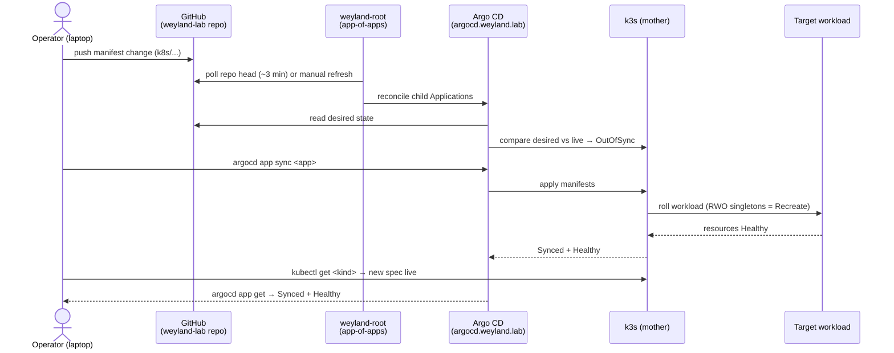

# Demo — Deploy end-to-end (git push → Argo sync → rollout → verify)

> **Pending live end-to-end validation run.** Every command below is real and pulled from the
> [deploy.md](deploy.md) component demo, but this straight-through walkthrough has **not** yet been executed end
> to end against live infra.

The full GitOps loop for one change, followed start to finish: a manifest edit becomes a live, verified workload
without any inbound webhook (Argo is pull-based, LAN-safe). It threads a single component demo end to end:

1. **[deploy.md](deploy.md)** — the manifest reconcile path: push to the public `weyland-lab` repo, `weyland-root`
   (app-of-apps) picks it up, Argo compares desired-vs-live, you sync, k3s rolls the workload.

Nothing here is new mechanism — it is the [deploy.md](deploy.md) demo run as a closed loop with an explicit
**verify** step at the end.

## Sequence diagram

From [../diagrams/flow-e2e-deploy.md](../diagrams/flow-e2e-deploy.md):



## Prerequisites

Per [deploy.md](deploy.md):

- `argocd.weyland.lab` reachable (Traefik TLS; Keycloak forward-auth in front, then Argo local admin).
- The change committed and pushed to the **public `weyland-lab` GitHub repo** — Argo reads the repo head, a
  local-only edit is invisible ("nothing to sync").
- `argocd` CLI on **mother** (drive Argo programmatically; do NOT hand-patch the Application CRD).
- The operator owns all git — you edit and push the manifest yourself; Argo does the rest.
- `kubectl` runs on **mother** (`emangini@mother`).

## UI walkthrough

1. Edit a manifest under `k8s/...` and **push** to the `weyland-lab` repo (you own git).
2. Open `https://argocd.weyland.lab` (Keycloak forward-auth, then Argo admin). Find the app tile (e.g. `dagster`)
   — after the push it flips to **OutOfSync** (within ~3 min, or hit **REFRESH**).
3. Click the app → **APP DIFF** to review desired-vs-live. A clean brownfield adoption shows only the
   `argocd.argoproj.io/tracking-id` annotation (metadata, not the pod template — sync won't restart pods).
4. Click **SYNC → SYNCHRONIZE**. Watch the resource tree go green (**Synced + Healthy**).
5. **Verify** the change is live: open the workload's own UI or check its resource in the cluster (CLI below).

## CLI walkthrough

Kubectl + `argocd` run on **mother**.

**Step 0 — log in** (server runs HTTP behind Traefik → needs `--insecure --grpc-web`):
```
[mother] argocd login argocd.weyland.lab --username admin --password "$(kubectl -n argocd get secret argocd-initial-admin-secret -o jsonpath='{.data.password}' | base64 -d)" --insecure --grpc-web
```

**Step 1 — after the push, re-pull the repo head and inspect the pending diff:**
```
[mother] argocd app get weyland-root --refresh
[mother] argocd app diff dagster
```

**Step 2 — sync the target app** (add `--prune` to remove orphaned resources):
```
[mother] argocd app sync dagster
```
If a sync wedges on *"another operation is already in progress"*, clear the blocker FIRST, then force a re-roll:
```
[mother] argocd app terminate-op dagster
[mother] argocd app sync dagster --replace --prune --force
```

**Step 3 — verify Synced + Healthy and the new spec on k3s:**
```
[mother] argocd app get dagster
[mother] kubectl -n weyland get deploy dagster -o jsonpath='{.spec.template.spec.containers[0].image}{"\n"}'
[mother] kubectl -n weyland rollout status deploy/dagster
```

## Expected result

- `argocd app get <app>` reports `Sync Status: Synced` and `Health Status: Healthy`.
- The changed resource is live on k3s — `kubectl -n <ns> get <kind>` reflects the new spec.
- Adoption syncs (tracking-id only) do **not** restart pods; spec changes roll pods per the app's strategy (RWO
  singletons use `Recreate`).

## Cleanup / teardown

Syncing an existing app is a normal deploy — nothing to tear down; the change is the intended state.

If you pushed a **test** Application to `k8s/argocd/applications/`, remove that file and push. `weyland-root` has
**prune OFF** and children carry no resources-finalizer, so deleting the child file does **not** cascade-delete the
real workload — delete the child Application in Argo explicitly if you also want the resources gone:
```
[mother] argocd app delete <test-app> --cascade
```
