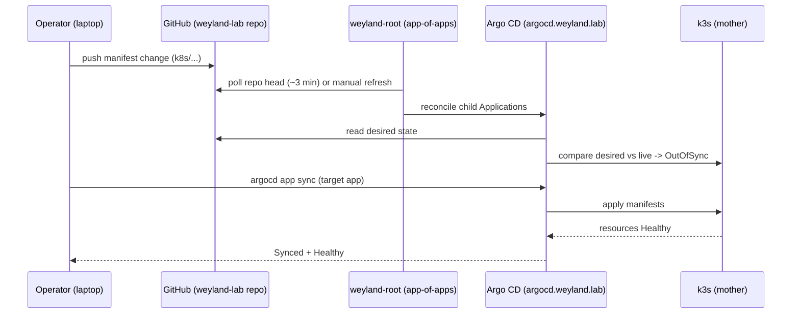

# Demo — GitOps Deploy (Argo CD)

Walk a change through the k8s GitOps lane: edit a manifest, push to GitHub, and let
Argo CD reconcile it onto mother's k3s. Argo is **pull-based** (polls the repo every
~3 min, or on manual refresh) so no inbound webhook is needed — LAN-safe. UI at
`argocd.weyland.lab`, ns `argocd`, app-of-apps with 78 apps onboarded.

Related: the image build→runtime handoff (rsync + `docker save | k3s ctr images import`)
is a separate flow — see [../diagrams/flow-deploy.md](../diagrams/flow-deploy.md). This
demo covers the manifest reconcile path.

## Sequence diagram



## Prerequisites
- `argocd.weyland.lab` reachable (Traefik TLS; Keycloak forward-auth in front, then Argo local admin).
- The change committed to the **public `weyland-lab` GitHub repo** — Argo reads the repo head, a local-only edit is invisible ("nothing to sync").
- `argocd` CLI on **mother** (drive Argo programmatically; do NOT hand-patch the Application CRD).
- For a **new** app: an Application manifest dropped in `k8s/argocd/applications/` (observe-only first — no `syncPolicy.automated`).

## UI walkthrough
1. Open `https://argocd.weyland.lab` — Keycloak forward-auth gate, then Argo CD login as `admin`.
2. Find the app tile (e.g. `dagster`, `mlflow`, `n8n`). After a push it flips to **OutOfSync**.
3. Click the app → **APP DIFF** to review desired-vs-live (a clean brownfield adoption shows only the `argocd.argoproj.io/tracking-id` annotation — lands on metadata, not the pod template, so sync does not restart pods).
4. Click **SYNC** → **SYNCHRONIZE**. Watch the resource tree go green (Synced + Healthy).
5. For a brand-new app: refresh `weyland-root` so the app-of-apps picks up the new child Application, then sync the child.

## CLI walkthrough
[mother] Log in (server runs HTTP behind Traefik → needs `--insecure --grpc-web`):
```
argocd login argocd.weyland.lab --username admin --password "$(kubectl -n argocd get secret argocd-initial-admin-secret -o jsonpath='{.data.password}' | base64 -d)" --insecure --grpc-web
```
[mother] After the push, force Argo to re-pull the repo head and inspect status:
```
argocd app get weyland-root --refresh
```
[mother] Review the pending diff for the target app:
```
argocd app diff dagster
```
[mother] Sync it (add `--prune` to remove orphaned resources):
```
argocd app sync dagster
```
[mother] If a sync wedges on *"waiting for healthy state of …"* with `another operation is already in progress`, clear the blocker FIRST, then force a re-roll:
```
argocd app terminate-op dagster
```
```
argocd app sync dagster --replace --prune --force
```

> Push step: edit the manifest and push to GitHub yourself — the operator owns all git. Argo does the rest.

## Expected result
- `argocd app get <app>` reports `Sync Status: Synced` and `Health Status: Healthy`.
- The changed resource is live on k3s (`kubectl -n <ns> get <kind>` on mother reflects the new spec).
- Adoption syncs (tracking-id only) do **not** restart pods; spec changes roll pods per the app's strategy (RWO singletons use `Recreate`).

## Cleanup / teardown
- Syncing an existing app is a normal deploy — nothing to tear down.
- If you added a **test** Application to `k8s/argocd/applications/`, remove that file and push; `weyland-root` has **prune OFF** and children carry no resources-finalizer, so deleting the child file does **not** cascade-delete the real workload — delete the child Application in Argo explicitly if you also want the resources gone.
