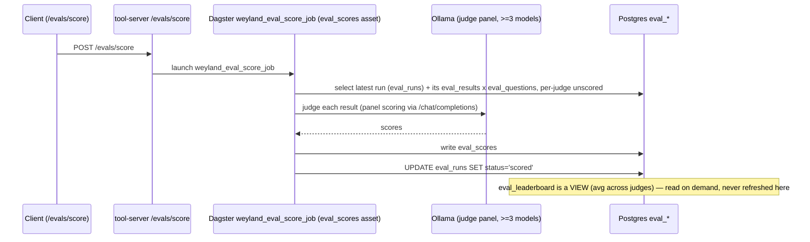

# Demo — Eval Scoring (LLM-as-judge panel -> leaderboard)

Score an existing eval run with an LLM-as-judge panel and read the panel-averaged leaderboard. This
is the **scoring** half (`weyland_eval_score_job`), split from generation so re-scoring needs **no**
matrix re-run. Assumes a run already exists (see [eval.md](eval.md)).

Grounded in [runbooks/eval-harness.md](../runbooks/eval-harness.md) and
[diagrams/flow-eval-scoring.md](../diagrams/flow-eval-scoring.md).

## Sequence diagram

Reused from [diagrams/flow-eval-scoring.md](../diagrams/flow-eval-scoring.md):



## Prerequisites

- **mother** (`192.168.1.243`) — tool-server (`30080`), `weyland-postgres`, Dagster.
- **rogueone** (`192.168.1.230`) — Ollama at `ollama.weyland.lab:11434` serves the judge panel.
- An existing eval run with `eval_results` (run the [eval](eval.md) demo first).
- Judges (per the runbook): `deepseek-coder-v2:16b` (default, fast), `mistral-small3.2:24b`
  (slower, nuanced), `qwen3-coder:30b`. Panel = average of >=3.

## UI walkthrough

- **Dagster** — `https://dagster.weyland.lab` — watch `weyland_eval_score_job` under Runs.
- **Tool-server API docs** — `http://mother:30080/docs` — `/evals/score` and `/evals/leaderboard`.

## CLI walkthrough

Score the latest run (single-judge scoring is ~15 min with deepseek, ~45-60 with mistral):

```
[mother] curl -s -X POST http://mother:30080/evals/score
```

Equivalent grounded form via the pipeline trigger:

```
[mother] curl -s -X POST http://mother:30080/pipeline/trigger -H "Content-Type: application/json" -d '{"job_name":"weyland_eval_score_job"}'
```

Read the panel-averaged leaderboard via the tool-server (latest run):

```
[mother] curl -s http://mother:30080/evals/leaderboard
```

Same leaderboard straight from Postgres (model x metric, latest run resolved inline):

```
[mother] kubectl exec -n weyland deploy/weyland-postgres -- psql -U weyland -d weyland -c "SELECT model, round(avg(score) FILTER (WHERE metric='faithfulness')::numeric,3) AS faithful, round(avg(score) FILTER (WHERE metric='answer_relevancy')::numeric,3) AS answer_rel, round(avg(score) FILTER (WHERE metric='context_relevancy')::numeric,3) AS context_rel FROM eval_results r JOIN eval_scores s ON s.result_id = r.id WHERE r.run_id = (SELECT max(id) FROM eval_runs) GROUP BY model ORDER BY faithful DESC NULLS LAST;"
```

Long-format view (per the runbook's `eval_leaderboard` view):

```
[mother] kubectl exec -n weyland deploy/weyland-postgres -- psql -U weyland -d weyland -c "SELECT * FROM eval_leaderboard WHERE run_id = (SELECT max(id) FROM eval_runs) ORDER BY metric, avg_score DESC;"
```

**Re-score with a different judge** (the split-job payoff — no matrix re-run). Clear existing scores,
swap the judge env (rolls the pod), then re-run scoring:

```
[mother] kubectl exec -n weyland deploy/weyland-postgres -- psql -U weyland -d weyland -c "DELETE FROM eval_scores WHERE result_id IN (SELECT id FROM eval_results WHERE run_id=(SELECT max(id) FROM eval_runs));"
```

```
[mother] kubectl set env deployment/dagster-user-code -n weyland EVAL_JUDGE_MODEL=mistral-small3.2:24b
```

```
[mother] kubectl rollout status deployment/dagster-user-code -n weyland
```

```
[mother] curl -s -X POST http://mother:30080/pipeline/trigger -H "Content-Type: application/json" -d '{"job_name":"weyland_eval_score_job"}'
```

## Expected result

- `eval_scores` populated (one row per result x judge x metric); `eval_runs.status = 'scored'`.
- Leaderboard rows for faithfulness / answer_relevancy / context_relevancy per model.
- Panel finding (runbook Run 3, 3-judge panel): field tightens to **0.75-0.82**; `gpt-oss:20b` is
  the most defensible RAG pick (top-2 under every judge config, and not itself a judge → zero
  self-bias). Single-judge rankings swing wildly (`qwen3:30b-a3b` went 5th↔1st on a judge swap).

## Cleanup / teardown

This demo **creates data** in `eval_scores` only (it does not touch results/questions). Remove the
demo's scores for the latest run:

```
[mother] kubectl exec -n weyland deploy/weyland-postgres -- psql -U weyland -d weyland -c "DELETE FROM eval_scores WHERE result_id IN (SELECT id FROM eval_results WHERE run_id=(SELECT max(id) FROM eval_runs));"
```

`eval_leaderboard` is a **view** — it needs no cleanup (it averages on read). If you swapped the
judge env during the demo, reset it back to the default judge:

```
[mother] kubectl set env deployment/dagster-user-code -n weyland EVAL_JUDGE_MODEL=deepseek-coder-v2:16b
```
