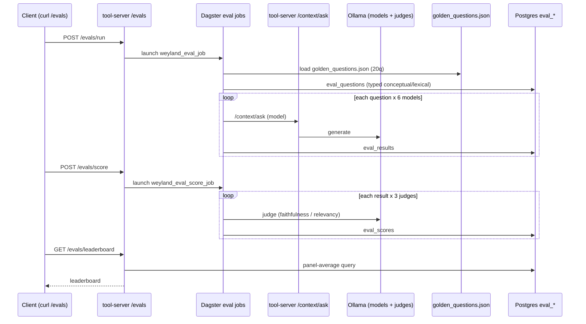

# Demo — Eval Harness (question-gen + run matrix)

Kick off a fresh LLM evaluation run end-to-end: load the **pinned golden question set** (20q — 10 conceptual + 10 lexical; `EVAL_QUESTION_SOURCE=generated` regenerates instead), then
run every question through the tool-server RAG (`/context/ask`) across all 6 local Ollama models,
landing results in Postgres. This is the **generation** half (`weyland_eval_job`); scoring is a
separate demo ([eval-scoring.md](eval-scoring.md)).

Grounded in [runbooks/eval-harness.md](../runbooks/eval-harness.md) and
[diagrams/flow-eval.md](../diagrams/flow-eval.md).

## Sequence diagram

Reused from [diagrams/flow-eval.md](../diagrams/flow-eval.md):



## Prerequisites

- **mother** (`192.168.1.243`) — k3s: tool-server (NodePort `30080`), `weyland-postgres`, Dagster.
- **rogueone** (`192.168.1.230`) — Ollama at `ollama.weyland.lab:11434` (6 models; generator +
  judges). Moved off the retired CT-102 in B79.
- The `eval_*` schema must already be applied (`scripts/eval-schema.sql`) — one-off, per the runbook.
- Eval assets (`eval_testset`, `eval_run_matrix`) live in the `weyland-dagster-user-code:local` image.

## UI walkthrough

- **Dagster** — `https://dagster.weyland.lab` (Keycloak forward-auth). Watch `weyland_eval_job`
  under Runs; the asset group `eval` is isolated from the 15-min ingestion schedule.
- **Tool-server API docs** — `http://mother:30080/docs` (FastAPI). The `/evals/*` routes are listed
  there.

## CLI walkthrough

Trigger the run (single-path `/evals/run`), one command:

```
[mother] curl -s -X POST http://mother:30080/evals/run
```

Equivalent grounded form via the reused pipeline trigger (from the runbook):

```
[mother] curl -s -X POST http://mother:30080/pipeline/trigger -H "Content-Type: application/json" -d '{"job_name":"weyland_eval_job"}'
```

Watch run progress (fresh run is ~40-60 min on CPU/GPU, 10 Q x 6 models):

```
[mother] kubectl exec -n weyland deploy/weyland-postgres -- sh -c 'PGPASSWORD=$POSTGRES_PASSWORD psql -U "$POSTGRES_USER" -d "$POSTGRES_DB" -c "SELECT id, status, question_count, notes FROM eval_runs ORDER BY id DESC;"'
```

Per-model result counts + latency + error count for the latest run:

```
[mother] kubectl exec -n weyland deploy/weyland-postgres -- sh -c 'PGPASSWORD=$POSTGRES_PASSWORD psql -U "$POSTGRES_USER" -d "$POSTGRES_DB" -c "SELECT run_id, model, count(*) AS n, round(avg(latency_ms)) AS avg_ms, count(error) AS errs FROM eval_results GROUP BY run_id, model ORDER BY run_id DESC, model;"'
```

Inspect the generated questions:

```
[mother] kubectl exec -n weyland deploy/weyland-postgres -- sh -c 'PGPASSWORD=$POSTGRES_PASSWORD psql -U "$POSTGRES_USER" -d "$POSTGRES_DB" -c "SELECT id, question_type, left(question,80) FROM eval_questions ORDER BY id DESC LIMIT 20;"'
```

List runs via the tool-server:

```
[mother] curl -s http://mother:30080/evals/runs
```

## Expected result

- A new `eval_runs` row (status advances to done; `question_count` = 10 by default).
- `eval_questions` populated with corpus-grounded questions (`question_type = direct`).
- `eval_results` with **60 rows** (10 questions x 6 models), 0 errors on a healthy run — matching
  the runbook's Run 3 baseline. No scores yet — that is the [eval-scoring](eval-scoring.md) demo.

## Cleanup / teardown

This demo **creates data** (one `eval_runs` row + its questions and results). To remove a demo run,
delete children first then the run — resolve the latest run id inline via a subquery (no placeholder):

```
[mother] kubectl exec -n weyland deploy/weyland-postgres -- sh -c 'PGPASSWORD=$POSTGRES_PASSWORD psql -U "$POSTGRES_USER" -d "$POSTGRES_DB" -c "DELETE FROM eval_scores WHERE result_id IN (SELECT id FROM eval_results WHERE run_id = (SELECT max(id) FROM eval_runs));"'
```

```
[mother] kubectl exec -n weyland deploy/weyland-postgres -- sh -c 'PGPASSWORD=$POSTGRES_PASSWORD psql -U "$POSTGRES_USER" -d "$POSTGRES_DB" -c "DELETE FROM eval_results WHERE run_id = (SELECT max(id) FROM eval_runs);"'
```

```
[mother] kubectl exec -n weyland deploy/weyland-postgres -- sh -c 'PGPASSWORD=$POSTGRES_PASSWORD psql -U "$POSTGRES_USER" -d "$POSTGRES_DB" -c "DELETE FROM eval_questions WHERE run_id = (SELECT max(id) FROM eval_runs);"'
```

> `eval_questions.run_id` linkage is assumed from the schema shape — TODO: verify the exact FK
> column before deleting questions, or keep the 10 generated questions (the runbook treats them as
> reusable across runs) and delete only `eval_results` / `eval_scores`.

```
[mother] kubectl exec -n weyland deploy/weyland-postgres -- sh -c 'PGPASSWORD=$POSTGRES_PASSWORD psql -U "$POSTGRES_USER" -d "$POSTGRES_DB" -c "DELETE FROM eval_runs WHERE id = (SELECT max(id) FROM eval_runs);"'
```
