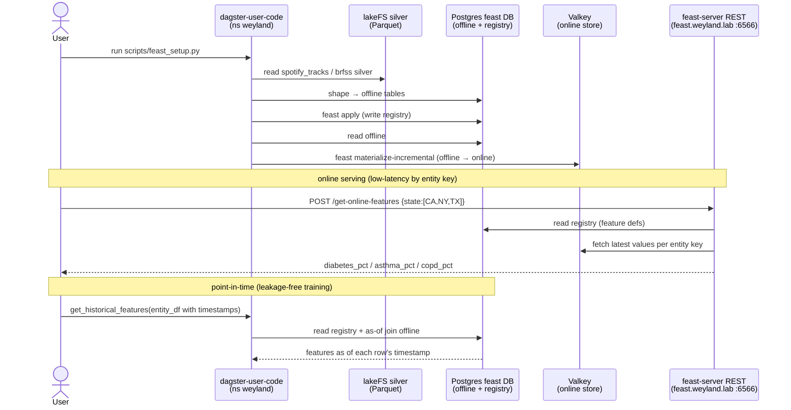

# Demo — Feast (feature store: online / offline / point-in-time)

Feast serves the same feature defined once two ways: **online** (low-latency by entity key, from Valkey) and
**historical/point-in-time** (leakage-free training sets, from the Postgres offline store), with a Postgres
**registry** read on every access. Two views — `track_audio_features` (entity `track`, Spotify audio) and
`state_health_risk` (entity `state`, BRFSS chronic-condition prevalence per year). Grounded in
[../runbooks/datasets-hydration.md](../runbooks/datasets-hydration.md),
[../query/feast.md](../query/feast.md), and [../diagrams/flow-feast.md](../diagrams/flow-feast.md).

## Sequence diagram



## Prerequisites

- **feast-server REST** — `https://feast.weyland.lab` (LAN, no auth — it's an API); `/docs` is auto Swagger. In-cluster `feast-server.data-mesh.svc:6566`.
- **feast-ui** — `https://feast-ui.weyland.lab` (Keycloak forward-auth; registry browser — feature views / entities / services).
- **SDK** — `FeatureStore(repo_path="/app/feast_repo")` inside `deploy/dagster-user-code` (ns `weyland`) — has feast + the repo.
- Stores: registry + offline = Postgres `feast` DB; online = **Valkey** (`valkey.data-mesh.svc:6379`).
- `kubectl` runs on **mother** (`emangini@mother`).

## UI walkthrough

1. Open `https://feast.weyland.lab/docs` (Swagger) — the interactive API for `feast serve`.
2. Try `POST /get-online-features` from Swagger with body:
   `{"features":["state_health_risk:diabetes_pct","state_health_risk:asthma_pct"],"entities":{"state":["CA","NY"]}}`.
3. Open `https://feast-ui.weyland.lab` (Keycloak) — browse the two feature views, their entities (`track`, `state`), and the feature services (`recommender_v1`, `health_v1`).

## CLI walkthrough

[mother] Online serving over REST (latest value by entity key, from Valkey):
```
curl -sk https://feast.weyland.lab/get-online-features -H 'Content-Type: application/json' -d '{"features":["state_health_risk:diabetes_pct","state_health_risk:asthma_pct","state_health_risk:copd_pct"],"entities":{"state":["CA","NY","TX"]}}'
```

[mother] Online serving by a **feature service** bundle instead of listing features:
```
curl -sk https://feast.weyland.lab/get-online-features -H 'Content-Type: application/json' -d '{"feature_service":"health_v1","entities":{"state":["CA","FL"]}}'
```

[mother] Point-in-time historical retrieval via the SDK (each row joined as of its own timestamp — CA-2013 ≠ CA-2019):
```
kubectl -n weyland exec -i deploy/dagster-user-code -- python -c "import pandas as pd; from feast import FeatureStore; fs=FeatureStore(repo_path='/app/feast_repo'); edf=pd.DataFrame({'state':['CA','CA','NY'],'event_timestamp':pd.to_datetime(['2013-06-01','2019-06-01','2016-06-01'],utc=True)}); print(fs.get_historical_features(entity_df=edf, features=['state_health_risk:diabetes_pct','state_health_risk:asthma_pct']).to_df())"
```

[mother] Rebuild / re-materialize after a silver change (`feast apply` + `materialize-incremental`):
```
kubectl -n weyland exec -i deploy/dagster-user-code -- python - < ~/weyland-dagster/scripts/feast_setup.py
```

## Expected result

- The REST call returns the requested prevalences per state (e.g. `diabetes_pct` for CA/NY/TX) from Valkey in ms.
- The historical retrieval returns a dataframe where each state's features match its row timestamp (no leakage from future surveys).
- `feast-ui.weyland.lab` lists both feature views and the feature services.

## Cleanup / teardown

This demo is **read-only** if you only call `/get-online-features` and `get_historical_features` — no data is created; leave it as-is.

If you re-ran `scripts/feast_setup.py`, it is idempotent: it reshapes the offline tables, re-runs `feast apply`, and `feast materialize-incremental` — replacing (not accumulating) the `feast` DB tables + Valkey online values. There is nothing to clean up beyond that. Do **not** try to delete features by editing Valkey directly (Feast stores them in binary protobuf encoding); a `feast apply` from the repo is the authoritative way to change definitions.

> Reminder: `feast_setup.py`/serve need `dagster-postgres-secret` in `data-mesh` (copied imperatively from `weyland`, not in git). Recreate it if `data-mesh` was rebuilt.
