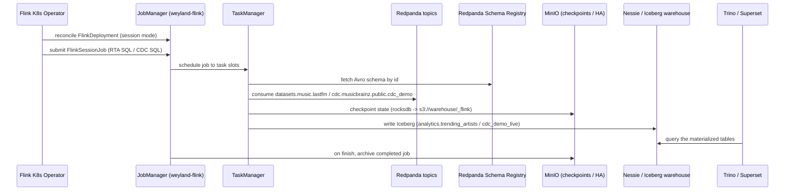

# Demo — Flink streaming-processing tier (B83)

A **Flink Kubernetes Operator** runs one long-lived **session cluster** (`weyland-flink`, ns `data-mesh`, Flink
1.20, sidecar OFF) that many jobs submit to. Two real jobs consume Redpanda and materialize to **Iceberg on the
same Nessie catalog** as Trino/dbt: the **RTA** job windows the lastfm listen stream into
`analytics.trending_artists`; the **CDC** job upserts `cdc.musicbrainz.public.cdc_demo` into
`datasets_music.cdc_demo_live`. State + checkpoints go to MinIO (`s3://warehouse/_flink`). Design:
[../../aidlc-docs/construction/flink-streaming-design.md](../../aidlc-docs/construction/flink-streaming-design.md).
Diagram: [../diagrams/flow-flink.md](../diagrams/flow-flink.md).

> **Current state (2026-07-14):** the session cluster is up (`flink.weyland.lab`), but the RTA job **finished and
> its Iceberg output is empty**. A bounded job that completes disappears from the JobManager's in-memory store,
> and the lastfm replay needs re-producing before a fresh submit. Steps marked **PENDING** below reflect this.

## Sequence diagram



## Prerequisites

- **Flink Kubernetes Operator** (Argo helm app; requires cert-manager for its admission webhook) — operator
  healthy.
- **Session cluster** `weyland-flink` (FlinkDeployment, ns `data-mesh`) up — JobManager REST/UI service
  `weyland-flink-rest:8081`, ingress `flink.weyland.lab` (Keycloak forward-auth). Custom image
  `weyland-flink:local` (ctr-imported, `imagePullPolicy: Never`).
- **Nessie** Iceberg catalog (`nessie.data-mesh.svc:19120/api/v2`, ref `main`, warehouse `s3://warehouse`) — the
  same catalog Trino/dbt use.
- **MinIO** (`minio.minio.svc:9000`) for checkpoints/HA (`s3://warehouse/_flink`), creds from `nessie-secret`.
- **Redpanda** with the source topics: `datasets.music.lastfm` (for RTA) and `cdc.musicbrainz.public.cdc_demo`
  (for CDC — see [cdc.md](cdc.md)).

## UI walkthrough

1. **Live jobs / slots** — open `https://flink.weyland.lab` (JobManager UI). With no running jobs it shows the
   cluster's task slots idle. **PENDING**: no job is currently running.
2. **Completed / historical jobs** — `https://flink-history.weyland.lab` (standalone History Server, survives JM
   restarts). `TODO: verify` this ingress is deployed — it is design step 2b (archiving + History Server) and may
   not be live yet; if absent, a finished job leaves no browsable trace (exactly the gap the History Server
   closes).
3. **Re-produce the source** — **PENDING**: the RTA job is a bounded replay of `datasets.music.lastfm`; re-run
   the producer first (see [streaming.md](streaming.md) → materialize `datasets_music_stream_produce`).
4. **Submit the RTA job** — **PENDING**: submit `k8s/flink/sql/rta_trending.sql` as a declarative
   `FlinkSessionJob` (so it persists across restarts). Once running it appends to Iceberg
   `analytics.trending_artists`.
5. **Query the output** — in Trino (`trino.weyland.lab`, monitoring UI) / Superset, run
   `SELECT * FROM iceberg.analytics.trending_artists ORDER BY plays DESC LIMIT 20;` — the native-Nessie
   `iceberg` catalog surfaces the Flink-written table. **PENDING**: currently empty.

## CLI walkthrough

Kubectl runs on **mother** (`emangini@mother`).

```
[mother] kubectl -n data-mesh get flinkdeployment weyland-flink
[mother] kubectl -n data-mesh get pods | grep weyland-flink
[mother] kubectl -n data-mesh get svc weyland-flink-rest
```

Re-produce the lastfm source (bounded replay the RTA job reads):

```
[mother] kubectl -n weyland exec deploy/dagster-user-code -- dagster asset materialize -m weyland_pipeline --select "datasets_music_stream_produce"
```

`TODO: verify` the in-pod `dagster asset materialize` invocation (module = code-location `weyland_pipeline`).

Submit the RTA SQL job. `TODO: verify` the exact submit mechanism — the design mandates a declarative
`FlinkSessionJob` (steps 3–5 PENDING; no `FlinkSessionJob` manifest exists in-repo yet, only the SQL at
`k8s/flink/sql/rta_trending.sql`). An interactive submit via the SQL client in the JM pod is:

```
[mother] kubectl -n data-mesh exec -i deploy/weyland-flink -- /opt/flink/bin/sql-client.sh -f /opt/flink/sql/rta_trending.sql
```

`TODO: verify` the JM workload name, the SQL client path, and that the SQL file is mounted in the image — these
are unconfirmed; prefer the FlinkSessionJob path once its manifest lands (design step 3).

Query the Iceberg output through Trino:

```
[mother] kubectl -n data-mesh exec deploy/trino-coordinator -- trino --execute "SELECT window_start, artist_name, plays, listeners FROM iceberg.analytics.trending_artists ORDER BY plays DESC LIMIT 20"
```

`TODO: verify` the Trino coordinator workload/pod name for the in-pod `trino` CLI.

## Expected result

- The session cluster `weyland-flink` is `READY`; JM UI reachable at `flink.weyland.lab`, task slots idle when no
  job runs.
- **After** re-producing lastfm and submitting the RTA job: it consumes `datasets.music.lastfm`, fires 1-minute
  tumbling windows (bounded replay → MAX watermark on end-of-input closes every window), appends rows
  `(window_start, window_end, artist_name, plays, listeners)` to Iceberg `analytics.trending_artists`, then
  **finishes** (bounded). The table becomes queryable in Trino/Superset and auto-cataloged by DataHub's iceberg
  source; the finished job archives to `s3://warehouse/_flink/completed-jobs`.
- The CDC job (design step 4, PENDING) continuously upserts `datasets_music.cdc_demo_live` mirroring
  `public.cdc_demo` changes.

## Cleanup / teardown

Reading the JM UI / History Server and querying Trino are **read-only** — nothing to clean up there.

If you submitted the RTA job and want to remove what it created:

```
[mother] kubectl -n data-mesh exec deploy/trino-coordinator -- trino --execute "DROP TABLE IF EXISTS iceberg.analytics.trending_artists"
```

`TODO: verify` the Trino coordinator workload name. If the job was submitted as a `FlinkSessionJob`, delete it
with `kubectl -n data-mesh delete flinksessionjob <name>` (name PENDING — no such manifest exists yet). Flink
checkpoints/savepoints under `s3://warehouse/_flink` can be pruned via `mc rm --recursive` against MinIO if a
full reset is wanted; the session cluster itself is always-on and is not torn down between demo runs.
