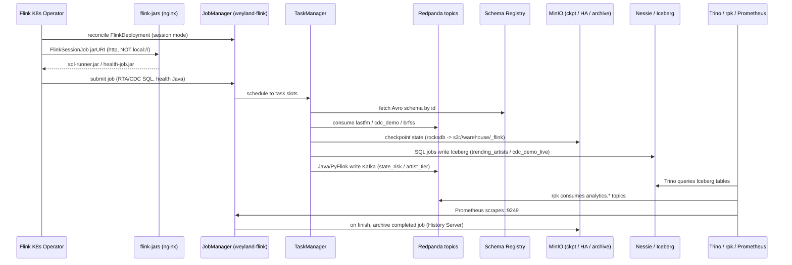

# Demo — Flink streaming-processing tier (B83)

A **Flink Kubernetes Operator** runs one long-lived **session cluster** (`weyland-flink`, ns `data-mesh`, Flink
1.20, sidecar OFF) that jobs submit to, plus one isolated **application-mode** deployment for the PyFlink job.
Four jobs cover all four Flink surfaces:

| # | Job | Surface | Source → Sink | Mode | Manifest |
|---|-----|---------|---------------|------|----------|
| 1 | **RTA — trending artists** | Flink SQL | `datasets.music.lastfm` → Iceberg `analytics.trending_artists` (append) | bounded | `flink-rta-sessionjob.yaml` |
| 2 | **CDC → lakehouse** | Flink SQL | `cdc.musicbrainz.public.cdc_demo` → Iceberg `datasets_music.cdc_demo_live` (upsert, v2 equality-deletes) | continuous | `flink-cdc-sessionjob.yaml` |
| 3 | **health — state risk** | Java DataStream + keyed state | `datasets.health.brfss` → Kafka `analytics.health.state_risk` | continuous | `flink-health-sessionjob.yaml` |
| 4 | **music — popularity tier** | PyFlink + Python UDF | `datasets.music.lastfm` → Kafka `analytics.music.artist_tier` (upsert-kafka) | bounded | `flink-pyflink.yaml` |

Jobs 1–3 run on the shared session cluster; job 4 runs in its own application-mode `FlinkDeployment`
(`weyland-flink-py:local`) because PyFlink needs a ~1 GB python + `apache-flink` runtime that would otherwise
bloat the session image and force a restart of the running CDC job. State + checkpoints go to MinIO
(`s3://warehouse/_flink`); the two SQL jobs write **Iceberg on the same Nessie catalog** as Trino/dbt. Design:
[../../aidlc-docs/construction/flink-streaming-design.md](../../aidlc-docs/construction/flink-streaming-design.md).
Diagram: [../diagrams/flow-flink.md](../diagrams/flow-flink.md). Runbook:
[../runbooks/flink.md](../runbooks/flink.md).

> **Chain:** prev ← [streaming.md](streaming.md) / [cdc.md](cdc.md) (produce the source topics this consumes).

> **State (2026-07-15):** all four jobs validated end-to-end. RTA appended to `analytics.trending_artists`
> (queried in Trino); CDC runs continuously (upsert proven with insert+delete); health emitted **95,456** records
> to `analytics.health.state_risk`; PyFlink produced **22,502** artist tiers (211 `viral`, top = the beatles at
> 210,458 plays). History Server, jar server, Prometheus metrics, and flame-graph profiling are all live.

## Sequence diagram



## Prerequisites

- **Flink Kubernetes Operator** (Argo helm app, `webhook.create: false` — no cert-manager needed) — healthy,
  watching `data-mesh`.
- **Session cluster** `weyland-flink` (FlinkDeployment) `READY` — JM REST/UI `weyland-flink-rest:8081`, ingress
  `flink.weyland.lab` (Keycloak forward-auth). Image `weyland-flink:local` (ctr-imported, `Never`).
- **flink-jars** (nginx) serving `sql-runner.jar` + `health-job.jar` at
  `http://flink-jars.data-mesh.svc.cluster.local/`. Session-mode `FlinkSessionJob`s **cannot** use a `local://`
  jarURI (the operator uploads the jar to the running cluster, so it must be http/s3) — this server closes that gap.
- **History Server** (`flink-history.weyland.lab`) — reads archived jobs from `s3://warehouse/_flink/completed-jobs`.
- **Nessie** Iceberg catalog (`nessie.data-mesh.svc:19120/api/v2`, ref `main`, warehouse `s3://warehouse`) — same
  catalog Trino/dbt use. **MinIO** (`minio.minio.svc:9000`) for checkpoints/HA/archive (creds `nessie-secret`).
- **Redpanda** source topics: `datasets.music.lastfm` (RTA + PyFlink), `cdc.musicbrainz.public.cdc_demo` (CDC —
  see [cdc.md](cdc.md)), `datasets.health.brfss` (health). Re-produce via the Dagster stream-produce assets if a
  bounded source was drained by retention.
- **PyFlink image** `weyland-flink-py:local` (ctr-imported) for job 4 only.

## UI walkthrough

1. **Live jobs / slots** — `https://flink.weyland.lab` (JobManager UI). Running Jobs shows `cdc-cdc-demo-live`
   (continuous) and `health-state-risk` (continuous) as `RUNNING`; bounded jobs (RTA, PyFlink) appear while
   running then move to history.
2. **Per-job internals** — click a job → **Overview** (operator graph, records in/out per vertex), **Checkpoints**
   (state size, completion), **BackPressure**, and **FlameGraph** (per-operator, live thread sampling —
   `rest.flamegraph.enabled`). The JM/TM **Profiler** tab (async-profiler, `rest.profiling.enabled`) gives
   CPU/alloc/lock/wall flame graphs.
3. **Completed / historical jobs** — `https://flink-history.weyland.lab` (standalone History Server, survives JM
   restarts). It serves archived jobs at `/jobs/overview` (the root `/overview` 404s — the History Server exposes
   the job list under `/jobs`). A finished bounded job (RTA, PyFlink) is browsable here after it archives.
4. **Metrics** — the Prometheus reporter exposes JM+TM metrics on `:9249`; the `weyland-flink` `ServiceMonitor`
   (ns `data-mesh`) has Prometheus scraping `flink_jobmanager_*` / `flink_taskmanager_*` series (numRecordsIn/Out,
   checkpoint duration, backpressure). Graph them in Grafana.

## CLI walkthrough

Kubectl runs on **mother** (`emangini@mother`). Session-cluster + infra health:

```
[mother] kubectl -n data-mesh get flinkdeployment
[mother] kubectl -n data-mesh get flinksessionjob
[mother] kubectl -n data-mesh get pods | grep -E 'weyland-flink|flink-jars|flink-history'
```

### Job 1 — RTA (SQL, bounded)

Re-produce the lastfm source (bounded replay), submit the session job, query the Iceberg output:

```
[mother] kubectl -n weyland exec deploy/dagster-user-code -- dagster asset materialize --select datasets_music_stream_produce -m weyland_pipeline.definitions
[mother] kubectl apply -f ~/flink-rta-sessionjob.yaml
[mother] kubectl -n data-mesh get flinksessionjob rta-trending-artists -o jsonpath='{.status.jobStatus.state}{"\n"}'
[mother] kubectl -n data-mesh exec deploy/trino-coordinator -- trino --execute "SELECT window_start, artist_name, plays, listeners FROM iceberg.analytics.trending_artists ORDER BY plays DESC LIMIT 20"
```

### Job 2 — CDC (SQL, continuous)

Already `RUNNING`. Prove upsert by mutating the source and re-querying the mirror (details in [cdc.md](cdc.md)):

```
[mother] kubectl -n data-mesh get flinksessionjob cdc-cdc-demo-live -o jsonpath='{.status.jobStatus.state}{"\n"}'
[mother] kubectl -n data-mesh exec deploy/trino-coordinator -- trino --execute "SELECT count(*) FROM iceberg.datasets_music.cdc_demo_live"
```

### Job 3 — health (Java DataStream, keyed state)

Reads `datasets.health.brfss`, keys by `Locationdesc`, keeps a per-state running mean of `Data_value`, emits JSON
to `analytics.health.state_risk`:

```
[mother] kubectl -n data-mesh get flinksessionjob health-state-risk -o jsonpath='{.status.jobStatus.state}{"\n"}'
[mother] kubectl -n data-mesh exec redpanda-0 -- rpk topic consume analytics.health.state_risk --num 8 --offset start -f '%v\n'
```

Expect `{"state":"California","n":123,"mean_risk":45.67}` — `n` climbs and `mean_risk` re-averages per key. (The
output topic must be pre-created; the KafkaSink only auto-creates on its first metadata request and flushes on
checkpoint, so records land in ~1-minute bursts, not continuously.)

### Job 4 — music (PyFlink, Python UDF)

Sums `play_count` per artist, a Python UDF buckets the total into a popularity tier, upserts
`analytics.music.artist_tier`. Bounded — runs to `FINISHED`, then torn down:

```
[mother] kubectl apply -f ~/flink-pyflink.yaml
[mother] kubectl -n data-mesh get flinkdeployment flink-pyflink -o jsonpath='{.status.jobManagerDeploymentStatus}{"  job="}{.status.jobStatus.state}{"\n"}'
[mother] HW=$(kubectl -n data-mesh exec redpanda-0 -- rpk topic describe analytics.music.artist_tier -p 2>/dev/null | awk 'NR==2{print $NF}'); [ "$HW" -gt 0 ] 2>/dev/null && kubectl -n data-mesh exec redpanda-0 -- rpk topic consume analytics.music.artist_tier -o start --num "$HW" -f '%v\n' 2>/dev/null | python3 -c "import sys,json,collections;d={};[d.__setitem__(json.loads(l)['artist_name'],json.loads(l)) for l in sys.stdin if l.strip().endswith('}')];c=collections.Counter(r['tier'] for r in d.values());print('tiers',dict(c));print('top5',[(r['artist_name'],r['plays'],r['tier']) for r in sorted(d.values(),key=lambda x:-x['plays'])[:5]])"
```

> **rpk gotcha:** `rpk topic consume --num 0` (empty topic) **tails forever**. Always gate on `HW > 0` (as above)
> so the read is bounded and can't hang.

## Expected result

- `weyland-flink` `READY`; JM UI at `flink.weyland.lab`; `flink-jars` + `flink-history` up.
- **RTA:** `analytics.trending_artists` populated with `(window_start, window_end, artist_name, plays, listeners)`;
  1-minute tumbling windows all close (bounded replay → MAX watermark on end-of-input); job `FINISHED`, archived.
- **CDC:** `cdc-cdc-demo-live` `RUNNING` continuously; `datasets_music.cdc_demo_live` mirrors `public.cdc_demo`
  inserts/updates/deletes via Iceberg v2 upsert.
- **health:** `analytics.health.state_risk` at ~95k records; per-key running means converge.
- **music:** `analytics.music.artist_tier` — 22,502 artists across `viral`(211)/`popular`(2001)/`rising`(9062)/
  `niche`(11228); the beatles/radiohead/depeche mode/coldplay/pink floyd are the top `viral` artists.
- Prometheus shows `flink_*` series; per-operator flame graphs render in the UI.

## Cleanup / teardown

Reading the UI / History Server / Prometheus and querying Trino/rpk are **read-only**.

Job 4 (PyFlink) is run-once — tear it down so it doesn't hold ~1 GB of image + a JM pod on the node:

```
[mother] kubectl -n data-mesh delete flinkdeployment flink-pyflink --ignore-not-found
```

To reset the created data:

```
[mother] kubectl -n data-mesh exec deploy/trino-coordinator -- trino --execute "DROP TABLE IF EXISTS iceberg.analytics.trending_artists"
[mother] kubectl -n data-mesh exec redpanda-0 -- rpk topic delete analytics.health.state_risk
[mother] kubectl -n data-mesh exec redpanda-0 -- rpk topic delete analytics.music.artist_tier
```

The continuous jobs (CDC, health) are left running as the live demo; delete their `FlinkSessionJob`s
(`kubectl -n data-mesh delete flinksessionjob cdc-cdc-demo-live health-state-risk`) to stop them. Flink
checkpoints/savepoints/HA under `s3://warehouse/_flink` can be pruned with `mc rm --recursive` against MinIO for a
full reset; the session cluster itself is always-on and is not torn down between demo runs.
