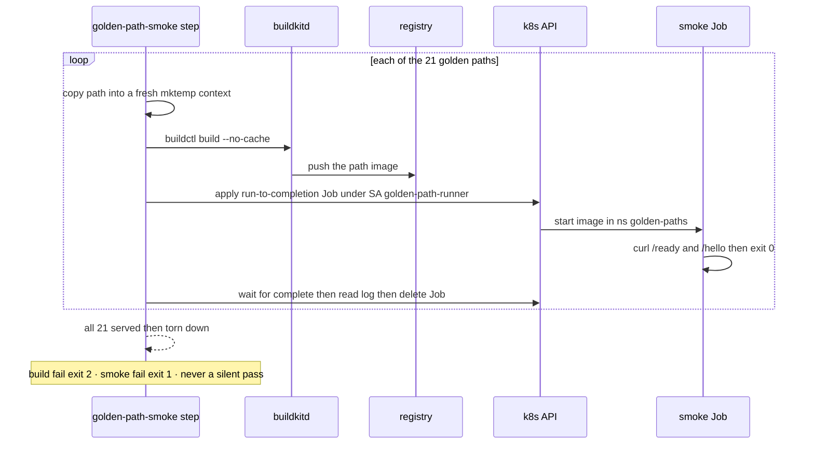

# Demo — Golden paths per language (B153)

Twenty-one **blessed, paved-road service templates** — one framework-agnostic **contract** (`GET /health` `/ready`
`/metrics` (Prometheus) `/hello`), many frameworks: Python (FastAPI/Flask/Litestar/Django) · Java
(Spring Boot/Quarkus/Micronaut) · Go (net/http/Gin/Echo/Fiber) · Rust (Axum/Actix-web/Rocket) · Node
(Express/Fastify/NestJS) · Frontend (Next.js/Remix/Vite+React/Astro). Each is **runnable + ephemeral +
extendable**: it carries a lane test + a deliberate-fail selfcheck + a coverage baseline + a non-root multi-stage
Dockerfile + a run-to-completion smoke Job + an onboarding-declaration template, so `scripts/new-service.sh
<lang>/<framework> <name>` scaffolds a service that already passes the estate's gates. The golden paths also
**replaced the B88 hello fixtures** as the CI test/scan lane fixtures (one artifact is both the template and the
build-infra probe). Design: [../design/golden-paths.md](../design/golden-paths.md).

The proof that a path is real is not "its tests pass" but "the built image SERVES the contract on the platform".
That is the **`golden-path-smoke`** CI step: for each path it builds the image against the estate's persistent
**buildkitd** (`woodpecker` ns), applies a **run-to-completion Job** in the dedicated **`golden-paths`** namespace
that starts the image and curls `/ready` + `/hello`, asserts exit 0, prints the log, and **tears the Job down** —
golden paths are never Deployments. Fail-closed: a build/apply failure is exit 2, a smoke failure exit 1.

## Sequence



## Run it

In CI it runs itself — the `.woodpecker.yml` `golden-path-smoke` step (after the test/scan lanes) invokes
`scripts/run-golden-path-jobs.sh` in a `moby/buildkit` step pod that also installs `kubectl`, under the dedicated
**`golden-path-runner`** SA (`backend_options.kubernetes.serviceAccountName`, enabled by the agent's
`WOODPECKER_BACKEND_K8S_SERVICE_ACCOUNT_NAME_ALLOW_FROM_STEP`). RBAC is least-privilege: Job management ONLY in
`golden-paths` (`k8s/golden-paths/golden-paths-rbac.yaml`, Argo app `golden-paths`). By hand from any in-cluster
context that can reach `buildkitd.woodpecker.svc:1234`:

```bash
bash scripts/run-golden-path-jobs.sh            # all paths
bash scripts/run-golden-path-jobs.sh go/echo    # one path
bash scripts/run-golden-path-jobs.sh --dry-run  # plan only, no build/apply
```

## Validated live — pipeline #95 (2026-09-08)

`golden-path-smoke` green end-to-end. Every one of the 21 paths built via buildkitd and served in-cluster:

```
== frontend/astro ==   SMOKE OK: image serves + SSR-renders
...
== python/fastapi ==   SMOKE OK: image serves — /ready ok, /hello -> {'service': 'golden-python-fastapi', 'message': 'hello, weyland'}
...
== rust/rocket ==      SMOKE OK: image serves
OK — all 21 golden path(s) served in-cluster and were torn down.
```

Getting this green flushed a chain of latent build bugs the retired hello fixtures never exercised — all fixed:
the Java lanes moved to JDK 21 (paths target release 21); the node test runner now installs deps on the
`node --test` branch (Fastify needs its module); the Go Dockerfile bases moved `golang:1.23`→`1.26`; each path now
builds from a **fresh mktemp context** (identical per-language Dockerfiles were cross-contaminating buildkit's
incremental context sync — `golden-go-fiber` had been building `golden-go-echo`'s source); and the Java runtime
stage copies `smoke.sh` from the context, not the build stage.

## Next

- **B160** — extend the suite to a second wave of languages (Angular, C#/.NET, PHP, Ruby, Elixir, Kotlin, Scala, C/C++, Clojure).
- **B163** — deepen all 21 paths to semi-exhaustively cover each framework's module capabilities (routing, middleware, validation, DI, error handling, lifecycle).
