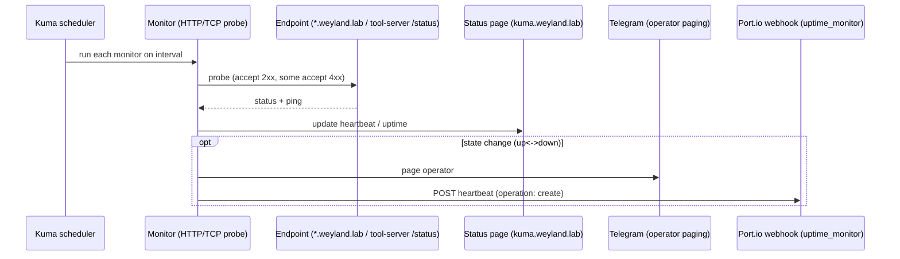

# Demo — Health / Status Board (Uptime Kuma)

Uptime Kuma probes the platform's endpoints on a schedule and surfaces a live status page
at `kuma.weyland.lab`. Two notifiers, both default-on: **direct Telegram** (active paging —
reuses the Hermes bot token; independent of any agent that could itself fail) and a **Port.io
webhook** (→ `uptime_monitor` blueprint, catalog/status). One monitor per platform endpoint;
each app's own health route (e.g. the tool-server `/status` aggregation) is what a monitor hits.

Related: the tool-server's internal `/ready` vs `/status` aggregation (what one of these
monitors actually checks) is detailed in [../diagrams/flow-health-status.md](../diagrams/flow-health-status.md).

## Sequence diagram



## Prerequisites
- Uptime Kuma up in ns `weyland` (single container, SQLite on a PVC).
- Kuma pod uses **LAN CoreDNS** (`dnsPolicy: None`, nameserver `192.168.1.243`, search `weyland.lab`) — else `*.weyland.lab` monitors are `ENOTFOUND`.
- mkcert CA mounted (`NODE_EXTRA_CA_CERTS` ← secret `weyland-mkcert-ca`) — else Node rejects the `*.weyland.lab` certs.
- `kuma.weyland.lab` reachable (Keycloak forward-auth, then Kuma's own built-in login set on first use).
- Weyland Alerts / Hermes Telegram bot token + your chat ID for paging.

## UI walkthrough
1. Open `https://kuma.weyland.lab` — Keycloak gate, then Kuma's own login.
2. The dashboard lists every monitor with live up/down + latency history. (Monitor count: **16** per the runbook, **25** per the host inventory — `TODO: verify` current live count on the board.)
3. Click a monitor (e.g. the tool-server) to see its heartbeat history, uptime %, and ping.
4. Note the deliberate accept ranges: **whisper** accepts `200-299` + `400-499` (`GET /inference` is a POST-only route → 404 but the server is up); basic-auth monitors use `admin` / `weyland_dev_password` (no trailing period).
5. **hermes** is intentionally **not** monitored (Telegram bot, outbound-only — no cluster-reachable HTTP/TCP endpoint).

## CLI walkthrough
[mother] Confirm Kuma is running:
```
kubectl get pods -n weyland -l app=uptime-kuma
```
[mother] Verify the pod resolves `*.weyland.lab` via LAN DNS (the #1 bring-up gotcha):
```
kubectl exec -n weyland deploy/uptime-kuma -- getent hosts grafana.weyland.lab
```
[mother] Spot-check the same aggregated health endpoint a monitor probes (tool-server `/status`):
```
curl -s http://mother:30080/status
```
[rogueone] Confirm the status page itself serves over TLS:
```
curl -sI https://kuma.weyland.lab
```

## Expected result
- Kuma dashboard shows monitors green with recent heartbeats; a downed endpoint flips red and pages the operator via Telegram within one probe interval.
- The pod's `getent` resolves `grafana.weyland.lab` → `192.168.1.243` (LAN DNS working inside the pod).
- `/status` returns `overall: ok` (or `degraded` with per-backend + LLM detail).

## Cleanup / teardown
Read-only demo — viewing the board and probing endpoints creates no state. If you added a **test** monitor while exploring, delete it from the Kuma UI (Monitors → the test monitor → Delete). Do **not** restore/import as cleanup — Kuma's import "Overwrite" hits a foreign-key bug; the clean reset path is nuking the PVC (see the runbook), which is overkill for a demo.
