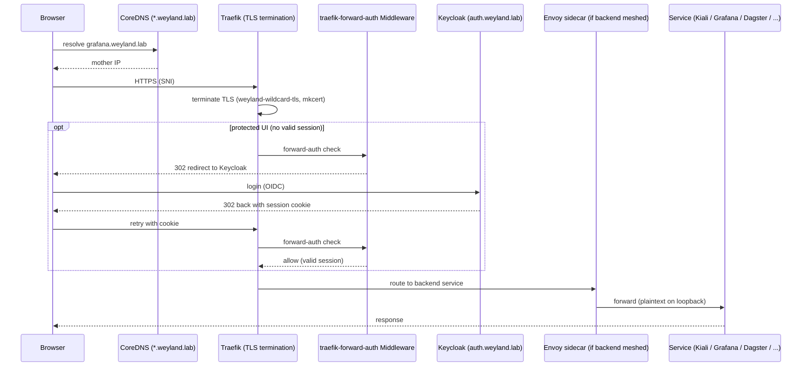

# Demo — Ingress / TLS Front Door (Traefik)

The shared path for every `*.weyland.lab` UI: CoreDNS resolves the wildcard to mother,
Traefik terminates TLS with the mkcert wildcard cert (`weyland-wildcard-tls`), protected
UIs add the `traefik-forward-auth` middleware (forward-auth → Keycloak SSO), and meshed
backends add an Envoy hop. Traefik is the **only** edge ingress — there is no Istio gateway.

## Sequence diagram

Reused from [../diagrams/flow-ingress-tls.md](../diagrams/flow-ingress-tls.md):



## Prerequisites
- CoreDNS on `mother:53` authoritative for `weyland.lab` (k3s/Traefik UIs → mother `192.168.1.243`).
- On **rogueone**: an `/etc/hosts` line per subdomain until the workstation is pointed at the wildcard LAN DNS (the browser resolves per-host, not the wildcard).
- mkcert root trusted by the browser (issues the `weyland-wildcard-tls` cert).
- Keycloak (`keycloak.weyland.lab`) + `traefik-forward-auth` (`auth.weyland.lab`) up for protected UIs. Login: `emangini` / `weyland_dev_password`.

## UI walkthrough
1. From rogueone open `https://grafana.weyland.lab` — browser shows a **trusted** lock (mkcert wildcard cert).
2. First visit to a forward-auth UI bounces through Keycloak (`auth.weyland.lab`) once, then lands. One session covers all `*.weyland.lab` (`COOKIE_DOMAIN=weyland.lab`).
3. Try a second protected UI (e.g. `https://kiali.weyland.lab`, `https://dagster.weyland.lab`) — no second login (SSO).
4. Single logout for every forward-auth app: `https://auth.weyland.lab/_oauth/logout`.

## CLI walkthrough
[rogueone] Confirm DNS resolves the subdomain to mother (use `getent`, not `dig`):
```
getent hosts grafana.weyland.lab
```
[rogueone] Verify TLS terminates and the cert is trusted:
```
curl -sI https://grafana.weyland.lab
```
[rogueone] Inspect the served certificate (wildcard SAN, mkcert issuer):
```
echo | openssl s_client -connect grafana.weyland.lab:443 -servername grafana.weyland.lab 2>/dev/null | openssl x509 -noout -subject -issuer -ext subjectAltName
```
[mother] List the ingress routes and confirm the wildcard TLS secret is present in the target namespace:
```
kubectl get ingress -A
```
```
kubectl get secret weyland-wildcard-tls -A
```

## Expected result
- `getent` returns `192.168.1.243  grafana.weyland.lab`.
- `curl -sI` returns `HTTP/2 200` or `302` with a trusted cert (protected UIs 302 to Keycloak when unauthenticated).
- `openssl` shows issuer = mkcert CA and a `*.weyland.lab` SAN.
- Browser reaches the UI with a single Keycloak login shared across subdomains.

## Cleanup / teardown
Read-only demo — nothing is created. (The `/etc/hosts` line on rogueone is durable setup, leave it in place for future access.)
