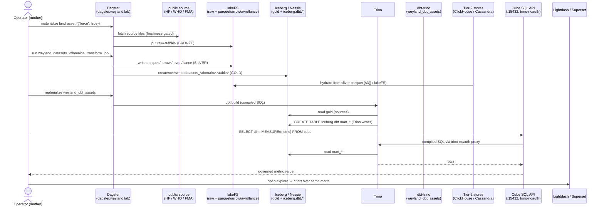

# Demo — Lakehouse end-to-end (land → silver → Iceberg gold → dbt marts → BI)

> **Pending live end-to-end validation run.** Every command below is real and pulled from the three component
> demos it threads, but this cross-system walkthrough has **not** yet been executed straight through against live
> infra.

One dataset walked the whole lakehouse in a single arc — from a public download to a governed metric a dashboard
shows. It threads three already-validated component demos:

1. **[datasets-lakehouse.md](datasets-lakehouse.md)** — a **land** asset pulls the source into lakeFS `raw/`
   (bronze); the **transform broker** fans it to five silver formats (Parquet/Arrow/Avro/Lance) and hydrates an
   **Iceberg** gold table in Nessie.
2. **[dbt.md](dbt.md)** — `dbt-trino` compiles SQL and **Trino writes** 7 tested marts into `iceberg.dbt.*` on the
   same Nessie `main` ref.
3. **[semantic-consumption.md](semantic-consumption.md)** — **Cube** (SQL/REST) + **MetricFlow** serve those
   marts as metrics-defined-once; **Lightdash**/**Superset** are the BI faces.

Nothing here is new mechanism — it is the seam between three demos made explicit, plus the **Tier-2 hydration**
fan-out that reads the **same silver** in parallel (an independent consumer, not a step in the mart chain). Read
each component demo for the per-step detail; this file is the connective tissue and the single evidence trail.

## Sequence diagram

From [../diagrams/flow-e2e-lakehouse.md](../diagrams/flow-e2e-lakehouse.md):



## Prerequisites

The union of the three component demos' prerequisites — confirm each before threading:

- **Dagster** — `https://dagster.weyland.lab`; code pod `deploy/dagster-user-code` (ns `weyland`). Assets: the
  per-domain land assets + `weyland_datasets_<domain>_transform_job`, and `weyland_dbt_assets`.
- **lakeFS** — `https://lakefs.weyland.lab`; in-cluster `lakefs.data-mesh.svc:8000`. Bronze `raw/` + silver
  `parquet/`/`arrow/`/`avro/`/`lance/`.
- **Nessie / Iceberg** — `https://nessie.weyland.lab`; `nessie.data-mesh.svc:19120`. Gold `iceberg.datasets_*`
  and marts `iceberg.dbt.*` on ref `main`.
- **Trino** — write path for dbt + read path for Cube; in-cluster `trino.data-mesh.svc:8080`, no-auth LAN. Cube/
  Lightdash reach it via `trino-noauth.data-mesh.svc:8080`.
- **dbt-docs** — `https://dbt-docs.weyland.lab` (Keycloak forward-auth).
- **Cube** — Playground `https://cube.weyland.lab`; SQL API `cube.data-mesh.svc:15432` (pg-wire, user `cube`).
- **Lightdash** — `https://lightdash.weyland.lab`; **Superset** — `https://superset.weyland.lab`.
- **Tier-2 stores** (optional parallel leg) — e.g. ClickHouse hydrated `s3()`-from-lakeFS parquet; Cassandra
  single-node. See the Tier-2 hydration runbooks/memories for the per-store loader.
- `kubectl` runs on **mother** (`emangini@mother`).

## UI walkthrough

**Step 1 — land + transform one dataset (bronze → silver → gold).**
1. Open `https://dagster.weyland.lab` → **Assets** → filter to `datasets_music`. Pick a land asset (e.g.
   `spotify_tracks`) → **Materialize**. To re-download past the freshness gate, set run config `{"force": true}`.
2. Confirm the raw file at `https://lakefs.weyland.lab` → repo `music` → `main` → `raw/spotify_tracks/`.
3. Run the job **`weyland_datasets_music_transform_job`** (serialized, `max_concurrent: 1`). When green, browse
   silver `parquet/`/`arrow/`/`avro/`/`lance/` in lakeFS and the gold table versioning at
   `https://nessie.weyland.lab`.

**Step 2 — build the tested marts (gold → marts).**
4. Dagster → **Assets** → `weyland_dbt_assets` → **Materialize** (or wait for `weyland_dbt_schedule`, Sun 06:00
   NY). This runs `dbt build` (models + tests) against Trino, and **Trino writes** the 7 marts into `iceberg.dbt`.
5. Open `https://dbt-docs.weyland.lab` — inspect the gold→mart lineage and test coverage.

**Step 3 — serve as a governed metric (marts → BI).**
6. Open `https://lightdash.weyland.lab` → explore `mart_spotify_audio` → pick `track_genre` + a governed metric
   (e.g. `avg_danceability`) → run.
7. Open `https://superset.weyland.lab` → the **"Weyland — Cube Semantic Layer"** dashboard (Cube `MEASURE()`
   virtual datasets). The number matches Lightdash's because the measure is defined once.

## CLI walkthrough

Kubectl runs on **mother**.

**Step 0 — health across the three tiers:**
```
[mother] kubectl -n weyland exec deploy/dagster-user-code -- python -c "import weyland_pipeline.definitions as d; print('defs OK')"
[mother] kubectl -n data-mesh exec deploy/trino -- trino --execute "SHOW SCHEMAS FROM iceberg"
```

**Step 1 — land + transform** (UI is the reliable trigger; CLI equivalent):
```
[mother] kubectl -n weyland exec deploy/dagster-user-code -- dagster asset materialize -m weyland_pipeline --select "spotify_tracks"
[mother] kubectl -n weyland exec deploy/dagster-user-code -- dagster job execute -m weyland_pipeline -j weyland_datasets_music_transform_job
```
> `TODO: verify` the exact in-pod `dagster` invocation (`-m weyland_pipeline` = the code-location name) — carried
> from [datasets-lakehouse.md](datasets-lakehouse.md) / [streaming.md](streaming.md). Normal cadence is the
> Dagster hydrate job, not a standalone materialize.

Confirm the gold Iceberg table + a fresh snapshot per transform run:
```
[mother] kubectl -n data-mesh exec deploy/trino -- trino --execute "SELECT track_genre, count(*) AS n FROM iceberg.datasets_music.spotify_tracks GROUP BY 1 ORDER BY n DESC LIMIT 10"
[mother] kubectl -n data-mesh exec deploy/trino -- trino --execute "SELECT snapshot_id, committed_at, operation FROM iceberg.datasets_music.\"spotify_tracks\$snapshots\" ORDER BY committed_at DESC"
```

**Step 2 — build + verify the marts:**
```
[mother] kubectl -n weyland exec deploy/dagster-user-code -- sh -c "cd /app/dbt && DBT_PROFILES_DIR=/app/dbt dbt build"
[mother] kubectl -n data-mesh exec deploy/trino -- trino --execute "SHOW TABLES FROM iceberg.dbt"
[mother] kubectl -n data-mesh exec deploy/trino -- trino --execute "SELECT track_genre, round(energy_mean,3) AS energy, n_tracks FROM iceberg.dbt.mart_genre_audio_profile ORDER BY energy_mean DESC LIMIT 10"
```

**Step 3 — query the same mart through the governed metric layer** (measures MUST be wrapped in `MEASURE()`):
```
[mother] kubectl -n data-mesh exec -i deploy/trino -- sh -c "PGPASSWORD=weyland_dev_password psql -h cube.data-mesh.svc.cluster.local -p 15432 -U cube -d cube -c \"SELECT track_genre, MEASURE(avg_danceability) FROM spotify_audio GROUP BY 1 ORDER BY 2 DESC LIMIT 5;\""
```
> `TODO: verify` `psql` is on the `deploy/trino` image; if not, run the same query from any box that can reach
> `cube.data-mesh.svc:15432` (carried from [semantic-consumption.md](semantic-consumption.md)).

MetricFlow variant (dbt Semantic Layer, in the dagster pod):
```
[mother] kubectl -n weyland exec -i deploy/dagster-user-code -- sh -c "cd /app/dbt && DBT_PROFILES_DIR=/app/dbt mf query --metrics life_expectancy --group-by metric_time__year --order metric_time__year"
```

**Tier-2 parallel leg (optional)** — the same silver parquet hydrated into a Tier-2 store proves the fan-out:
```
[mother] kubectl -n data-mesh exec deploy/trino -- trino --execute "SELECT count(*) FROM iceberg.datasets_music.spotify_tracks"
```
> The Tier-2 hydration itself is owned by its per-store runbook (ClickHouse `s3()`-from-lakeFS, Cassandra loader);
> this arc only asserts silver is the shared source both the mart chain and Tier-2 read.

## Expected result

- **Bronze/silver/gold:** `raw/spotify_tracks/` present; silver `parquet`/`arrow`/`avro`/`lance` populated; gold
  `iceberg.datasets_music.spotify_tracks` queryable with a fresh Iceberg snapshot per transform run.
- **Marts:** `weyland_dbt_assets` green; 7 marts in `iceberg.dbt` (`mart_spotify_audio`,
  `mart_genre_audio_profile`, `mart_fma_genre_tree`, `mart_artist_popularity`, `mart_state_health_trends`,
  `mart_country_health`, `mart_personality_by_country`), all tested; dbt-docs shows gold→mart lineage.
- **Governed metric:** Cube's SQL API returns the top-5 most-danceable genres — the **identical** number Lightdash/
  Superset render, because the measure is defined once. A bare measure (`SELECT ..., avg_danceability`) fails with
  "could not be resolved" — proof `MEASURE()` is required.
- **Fan-out:** the same silver parquet is independently readable by a Tier-2 store.

## Cleanup / teardown

Each leg cleans up per its own demo. The whole arc is **idempotent** — land/transform `overwrite()` each table and
re-write each silver file per run, and `dbt build` **replaces** each mart per run, so a demo run creates no
accumulating data (prior snapshots stay via Iceberg time-travel / Nessie). The semantic/BI leg is **read-only**.

To fully remove a table you created for the demo, in reverse order:
```
[mother] kubectl -n data-mesh exec deploy/trino -- trino --execute "DROP TABLE IF EXISTS iceberg.dbt.mart_genre_audio_profile"
[mother] kubectl -n weyland exec -i deploy/dagster-user-code -- python -c "from weyland_pipeline.assets.datasets_music_transform import MUSIC_CFG; from weyland_pipeline.assets.datasets_lib.writers import _catalog; _catalog(MUSIC_CFG).drop_table('datasets_music.spotify_tracks')"
```
> `TODO: verify` the `_catalog(...)` import path/signature in `datasets_lib/writers.py` before the drop (carried
> from [datasets-lakehouse.md](datasets-lakehouse.md)). The next `weyland_dbt_assets` run recreates the mart.

Remove silver + raw by deleting `raw/<table>/`, `parquet/<table>/`, etc. keys in `https://lakefs.weyland.lab`
(repo `music`, `main`) — lakeFS is the source of truth, so that is the authoritative delete. Do **not** delete
`s3://warehouse/dbt/` expecting to clear artifacts — that path is the `iceberg.dbt` schema's actual table data.
