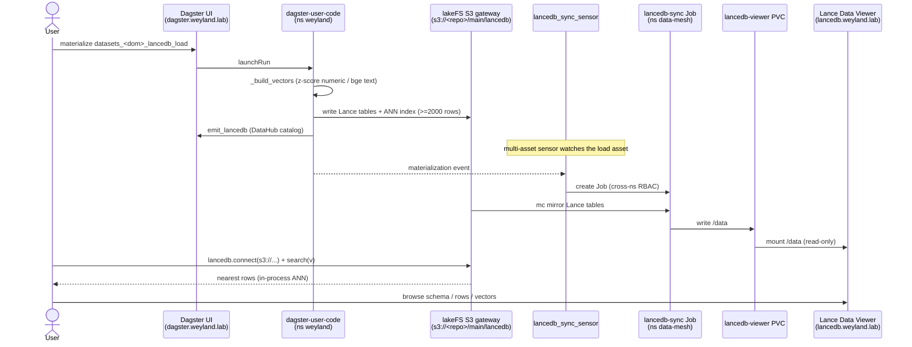

# Demo — LanceDB (embedded, Lance-native vectors)

LanceDB is the embedded vector backend: no server, no port, Lance-format-native, and backed by object storage
(the lakeFS S3 gateway). A Dagster `datasets_<domain>_lancedb_load` asset writes the Lance tables; you query
them **in-process**; a Lance Data Viewer UI browses a mirrored copy kept fresh by a Dagster sensor. Grounded in
[../runbooks/datasets-hydration.md](../runbooks/datasets-hydration.md),
[../query/lancedb.md](../query/lancedb.md), and [../diagrams/flow-lancedb.md](../diagrams/flow-lancedb.md).

## Sequence diagram



## Prerequisites

- **Dagster** — `https://dagster.weyland.lab`; code pod `deploy/dagster-user-code` (ns `weyland`) has `lancedb` + the lakeFS creds.
- **Lance Data Viewer** — `https://lancedb.weyland.lab` (Keycloak forward-auth, read-only).
- **lakeFS S3 gateway** — tables live at `s3://<repo>/main/lancedb` (repos `music`, `health`).
- `kubectl` runs on **mother** (`emangini@mother`).

## UI walkthrough

1. Open `https://dagster.weyland.lab` → **Assets**; materialize `datasets_music_lancedb_load` (or `datasets_health_lancedb_load`). Requires the silver Parquet (its upstream) to exist.
2. On success, the `lancedb_sync_sensor` fires and launches the `lancedb-sync` mirror Job in `data-mesh` (the 6h CronJob is only a backstop).
3. Open `https://lancedb.weyland.lab` — browse the mirrored tables: schema, rows, and vector visualization. Tables: music — `audioset`, `fma_echonest`, `fma_features`, `gtzan`, `lp_musiccaps_mc`, `lp_musiccaps_mtt`, `spotify_tracks`, `uci_year_prediction`; health — `big_five`.

## CLI walkthrough

The query is **in-process** (embedded) — there is no server to hit; run it inside the dagster pod via `scripts/lancedb_query.py`.

[mother] List tables + run the packaged similarity query for a numeric-feature set:
```
kubectl -n weyland exec -i deploy/dagster-user-code -- python - < ~/weyland-dagster/scripts/lancedb_query.py music gtzan
```

[mother] Ad-hoc: nearest-10 within a genre (inline, no script file):
```
kubectl -n weyland exec -i deploy/dagster-user-code -- python -c "from weyland_pipeline.assets.datasets_lib.loaders import _lancedb_connect; from weyland_pipeline.assets.datasets_music_transform import MUSIC_CFG; db=_lancedb_connect(MUSIC_CFG); t=db.open_table('gtzan'); v=t.to_pandas()['vector'][0]; print(t.search(v).where(\"genre = 'metal'\").limit(10).select(['row_id','genre']).to_pandas())"
```

[mother] Check the mirror Job that feeds the viewer:
```
kubectl -n data-mesh get jobs -l app=lancedb-sync
```

## Expected result

- `datasets_<dom>_lancedb_load` green; Lance tables written to `s3://<repo>/main/lancedb` with an ANN index where ≥2000 rows (exact search below that).
- The similarity query returns the 10 nearest rows (`row_id` + payload columns).
- `https://lancedb.weyland.lab` shows the freshly mirrored tables.
- The dataset appears in DataHub via the `emit_lancedb` custom emitter (platform `lancedb`).

## Cleanup / teardown

The load `overwrite`s each Lance table per run — a demo run creates no accumulating data; re-running just rewrites the same tables.

To remove a Lance table you created, delete its folder under `s3://<repo>/main/lancedb/<table>` via the lakeFS UI (`https://lakefs.weyland.lab`, repo `music`/`health`, `main` branch) — lakeFS is the source of truth; the viewer PVC is a disposable read replica that re-mirrors on the next sensor fire / CronJob.

> Reminder: the sync Job needs `lakefs-creds` in `data-mesh` (copied imperatively from `weyland`, not in git). If `data-mesh` was rebuilt, recreate it before the sensor Job can mirror.
