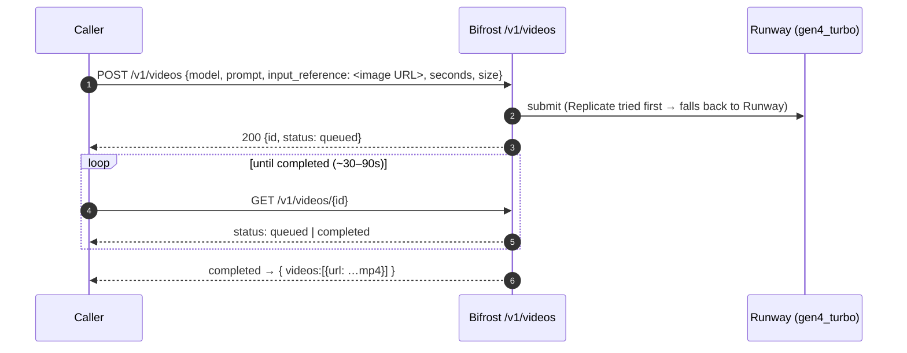

# Media lane — image · tts · video (B111)

Multi-modal generation through the **Bifrost** gateway: **image** (Runware), **text-to-speech** (self-hosted **Kokoro**,
the $0 primary — **ElevenLabs** kept as the deferred alternate), and **video** (Runway). All OpenAI-shaped, so a caller
uses the same `/v1/...` verbs it already knows. Providers: [bifrost-provider-loadout](../../aidlc-docs/bifrost-provider-loadout.md).

**Why Kokoro for tts:** ElevenLabs' free tier returns `402` — "Free users cannot use library voices via the API" — so its
credits are unspendable. Kokoro-FastAPI (Apache-2.0, ~82M, CPU) runs on our own hardware: no quota, no cost, a browser
player at `kokoro.weyland.lab`, and it fronts in Bifrost as a custom provider (`kokoro/kokoro`).

## Image — one-shot
```
kubectl -n weyland exec deploy/weyland-guard -- python -c 'import httpx; r=httpx.post("http://bifrost.weyland.svc.cluster.local:8080/v1/images/generations", json={"model":"runware:100@1","prompt":"a lone raven over a norse fjord at dusk","size":"512x512","n":1}, timeout=120); print(r.status_code); print(r.text[:300])'
```
→ `200` + an `im.runware.ai/…` image URL.

## Text-to-speech — one-shot
Direct through Bifrost:
```
kubectl -n weyland exec deploy/weyland-guard -- python -c 'import httpx; r=httpx.post("http://bifrost.weyland.svc.cluster.local:8080/v1/audio/speech", json={"model":"kokoro/kokoro","voice":"af_bella","input":"Hail, traveler."}, timeout=120); print(r.status_code, r.headers.get("content-type"), len(r.content))'
```
Or via the LiteLLM route (`wl-tts` = Kokoro primary → ElevenLabs alternate). Voices: `af_bella`, `am_adam`, `bf_emma`, …
NOTE: the `realm-llm` Bifrost VK must **allow the `kokoro` provider** or LiteLLM egress 500s ("provider not allowed").

## Video — two-step (async)
Runway is image-to-video, so it animates a still (e.g. the raven above). Submit → poll:

```
kubectl -n weyland exec deploy/weyland-guard -- python -c 'import httpx; r=httpx.post("http://bifrost.weyland.svc.cluster.local:8080/v1/videos", json={"model":"gen4_turbo","prompt":"the raven flaps its wings, cinematic","input_reference":"<image URL>","seconds":"5","size":"1280x720"}, timeout=60); print(r.status_code); print(r.text[:400])'
```
then poll `GET /v1/videos/{id}` until `status: completed` — the response carries the `.mp4` URL.

## Durability
Kokoro's Bifrost provider lives only in `config.db` (no bootstrap json), so `scripts/register_bifrost_kokoro.py`
recreates it idempotently after a wipe. The `realm-llm` VK's provider allow-list (kokoro/elevenlabs) is out-of-band —
re-add it in the Bifrost UI after a config reset (see the loadout restore note).
