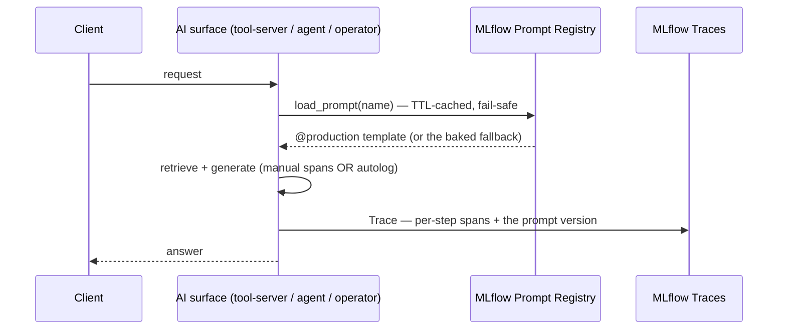

# Demo — MLflow GenAI: Traces + Prompt Registry (B100)

Two of MLflow 3.x's GenAI-platform features, wired lab-wide (B100 P1+P2): per-step **Traces** across every live AI
surface, and a versioned **Prompt Registry** whose prompts **hot-swap without a redeploy**. Validated live 2026-07-24.

Grounded in [runbooks/mlflow.md](../runbooks/mlflow.md) — the GenAI Tracing + Prompt Registry sections.

## Sequence diagram



## Prerequisites

- **mother** — `mlflow`, `weyland-tool-server` (v0.7.0), `weyland-agent` (v3), `weyland-operator` (v4), the vector backends.
- **rogueone** — Ollama (`gpt-oss:20b`).
- Prompts registered: `kubectl -n weyland exec -i deploy/weyland-agent -- python < scripts/register_prompts.py`
  (`rag_system` · `operator_system` · `agent_grade` · `agent_reflect`, all `@production`).

## Part 1 — Traces (the one pane Tempo can't give)

**UI** — `https://mlflow.weyland.lab` → **Experiments** → open **`tool-server-rag`** / **`agentic-rag`** / **`operator`**
→ the **Traces** tab → open a trace: nested **retrieve / generate** (tool-server) or **retrieve / grade / (reflect) /
generate** (agent) spans, each with the prompt/context/answer — plus the `prompt_version` tag on the generate span.

**CLI** — fire a RAG call, then confirm a trace landed (mother):
```
[mother] kubectl -n weyland exec deployment/weyland-tool-server -- python -c "import urllib.request,json; r=urllib.request.Request('http://localhost:8080/context/ask',data=json.dumps({'query':'What is the weyland data mesh?','backend':'pgvector'}).encode(),headers={'Content-Type':'application/json'}); print('answer_chars', len(json.loads(urllib.request.urlopen(r,timeout=600).read())['answer']))"
```
```
[mother] kubectl -n weyland exec deployment/weyland-tool-server -- python -c "import mlflow; mlflow.set_tracking_uri('http://mlflow.weyland.svc.cluster.local:5000'); from mlflow import MlflowClient; e=MlflowClient().get_experiment_by_name('tool-server-rag'); print('traces', len(mlflow.search_traces(experiment_ids=[e.experiment_id])))"
```

## Part 2 — Prompt Registry: hot-swap with no redeploy (the headline)

Confirm the tool-server is serving the **live** prompt (mother):
```
[mother] kubectl -n weyland exec deployment/weyland-tool-server -- sh -c "cd /app && python -c \"import prompts; prompts.load_prompt('rag_system','fb'); print('serving version', prompts.loaded_version('rag_system'))\""
```
Now edit the `rag_system` template in `scripts/register_prompts.py` (append a sentence, e.g. `Always answer in one
paragraph.`), re-register, and watch the version bump — **no rebuild, no rollout** (rogueone):
```
[rogueone] kubectl -n weyland exec -i deploy/weyland-agent -- python < /home/edwardmangini/IdeaProjects/weyland/nodes/mother/lab/weyland-platform/scripts/register_prompts.py
```
→ `rag_system: registered v2 -> @production`. Within `PROMPT_TTL` (default 300s — or restart the pod to force it),
the tool-server serves **v2** (re-run the version check above → `serving version 2`), and the next `tool-server-rag`
trace tags `prompt_version: 2`. Revert the edit + re-register to roll forward to the original text (the registry keeps
v1/v2/v3 — that's the point; diff/rollback in the UI under **Prompts**).

## Part 3 — Fail-safe (a registry/tracking outage never breaks a request)

Scale MLflow to zero, prove the RAG still answers (baked-fallback prompt + no-op tracing), restore:
```
[mother] kubectl -n weyland scale deploy/mlflow --replicas=0
```
```
[mother] kubectl -n weyland exec deployment/weyland-tool-server -- python -c "import urllib.request,json; r=urllib.request.Request('http://localhost:8080/context/ask',data=json.dumps({'query':'What is the weyland data mesh?','backend':'pgvector'}).encode(),headers={'Content-Type':'application/json'}); print('FAIL-SAFE OK — answer_chars', len(json.loads(urllib.request.urlopen(r,timeout=600).read())['answer']))"
```
```
[mother] kubectl -n weyland scale deploy/mlflow --replicas=1
```

## Expected result

- Traces in all three experiments (`tool-server-rag` / `agentic-rag` / `operator`), per-step spans + `prompt_version`.
- The tool-server serves `rag_system` from the registry (`serving version 1`), and a re-register hot-swaps it to `2`
  within the TTL with **no redeploy**.
- With MLflow at 0 replicas, `/context/ask` **still answers** — fail-safe to the baked prompt + no-op tracing.

## Cleanup / teardown

Read-mostly. It **creates**: MLflow traces (retained as observability history) + new prompt **versions** in the
registry (history — no cleanup; roll `@production` back to the desired version). If Part 3 was run, confirm MLflow is
back:
```
[mother] kubectl -n weyland get deploy mlflow
```
