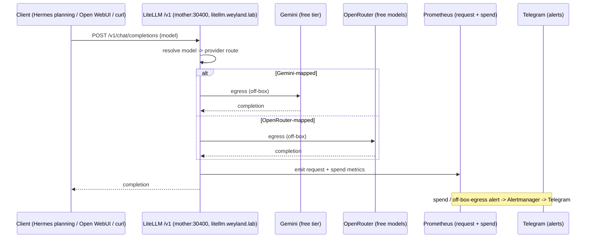
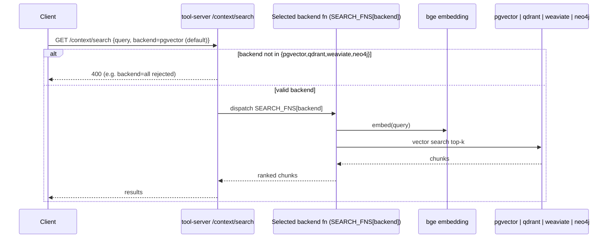

# Demo — Model Gateway (LiteLLM) + Backend Dispatch

Two related routing surfaces in one demo:

1. **LiteLLM model gateway** — a single OpenAI-compatible endpoint on mother that fronts every
   Gemini + OpenRouter model (wildcard routing), with a human-only egress valve and spend alerts.
2. **Backend dispatch** — how the tool-server's `/context/*` picks one of the 4 vector backends
   (single-dispatch per request; `backend=all` is rejected).

Grounded in [runbooks/model-gateway.md](../runbooks/model-gateway.md),
[diagrams/flow-model-gateway.md](../diagrams/flow-model-gateway.md), and
[diagrams/flow-backend-dispatch.md](../diagrams/flow-backend-dispatch.md).

## Sequence diagram

Gateway routing — reused from [diagrams/flow-model-gateway.md](../diagrams/flow-model-gateway.md):



Backend dispatch — reused from [diagrams/flow-backend-dispatch.md](../diagrams/flow-backend-dispatch.md):



## Prerequisites

- **mother** (`192.168.1.243`) — LiteLLM at NodePort `30400` (`http://mother:30400/v1`, UI
  `litellm.weyland.lab`), tool-server at `30080`, and the 4 vector backends (pgvector/qdrant/
  weaviate/neo4j).
- LiteLLM secret `litellm-secrets` in ns `weyland` holds `LITELLM_MASTER_KEY` (+ `GEMINI_API_KEY` /
  `OPENROUTER_API_KEY`). Egress **valve** must be open (replicas=1) for hosted-model calls.
- Free API keys already configured (Gemini free tier + OpenRouter free models).

## UI walkthrough

- **LiteLLM admin UI** — `https://litellm.weyland.lab` (`/ui`) — model list, keys, spend.
- **Grafana** — `https://grafana.weyland.lab` — LiteLLM request/spend metrics (job `litellm`).
- **Tool-server API docs** — `http://mother:30080/docs` — `/context/search` and `/context/ask`
  (the `backend` param).

## CLI walkthrough

**Gateway** — pull the master key from the secret (no placeholder), list served models, run a real
Gemini completion:

```
[mother] MK=$(kubectl get secret litellm-secrets -n weyland -o jsonpath='{.data.LITELLM_MASTER_KEY}' | base64 -d)
```

```
[mother] curl -s http://192.168.1.243:30400/v1/models -H "Authorization: Bearer $MK" | head -c 400; echo
```

```
[mother] curl -s http://192.168.1.243:30400/v1/chat/completions -H "Authorization: Bearer $MK" -H "Content-Type: application/json" -d '{"model":"gemini-flash","messages":[{"role":"user","content":"say hi in 3 words"}]}' | head -c 500; echo
```

Confirm the metrics target is up:

```
[mother] kubectl exec -n monitoring "$(kubectl get pod -n monitoring -l app.kubernetes.io/name=prometheus -o name | head -1)" -c prometheus -- promtool query instant http://localhost:9090 'up{job="litellm"}'
```

Query the model catalog (which hosted models are reachable + free) — populated by the Dagster
`model_catalog` asset:

```
[mother] kubectl exec -i -n weyland deploy/weyland-postgres -- psql -U weyland -d weyland -c "SELECT source, count(*), count(*) FILTER (WHERE free) AS free FROM model_catalog GROUP BY source;"
```

**Backend dispatch** — valid backend (default is `pgvector`); then show that `backend=all` is
rejected with a 400:

```
[mother] curl -s -X POST "http://mother:30080/context/search?backend=pgvector" -H "Content-Type: application/json" -d '{"query":"how is the eval leaderboard computed?"}'
```

```
[mother] curl -s -o /dev/null -w '%{http_code}\n' -X POST "http://mother:30080/context/search?backend=all" -H "Content-Type: application/json" -d '{"query":"anything"}'
```

Same single-dispatch on `/context/ask` (backend is a **body** field there, not a query param):

```
[mother] curl -s -X POST http://mother:30080/context/ask -H "Content-Type: application/json" -d '{"query":"how is the eval leaderboard computed?","backend":"qdrant"}'
```

## Expected result

- `/v1/models` lists the wildcard-routed Gemini + OpenRouter catalog; the `gemini-flash` completion
  returns a short off-box answer through the valve.
- `up{job="litellm"}` returns `1`.
- `model_catalog` counts resemble the first populated run: openrouter ~336 (26 free), gemini ~37,
  ollama 6.
- Backend dispatch: `backend=pgvector`/`qdrant` returns ranked chunks; **`backend=all` returns
  `400`** (no fan-out/compare-all mode exists).

## Cleanup / teardown

Mostly **read-only** — these calls create no lab data (LiteLLM is a stateless proxy; `/context/*`
reads the vector stores; `model_catalog` is refreshed by its own 6h asset, replace-by-source). The
one stateful lever is the **egress valve** — if you opened it only for the demo, close it so no
off-LAN calls stay possible (the `LiteLLMEgressEnabled` alert fires while replicas > 0):

```
[mother] ./valve.sh close
```

```
[mother] ./valve.sh status
```

> `valve.sh` is the human-only cut-off from the runbook (lives on mother; agents cannot reach it).
> TODO: verify its path on mother if not on `$PATH`.
