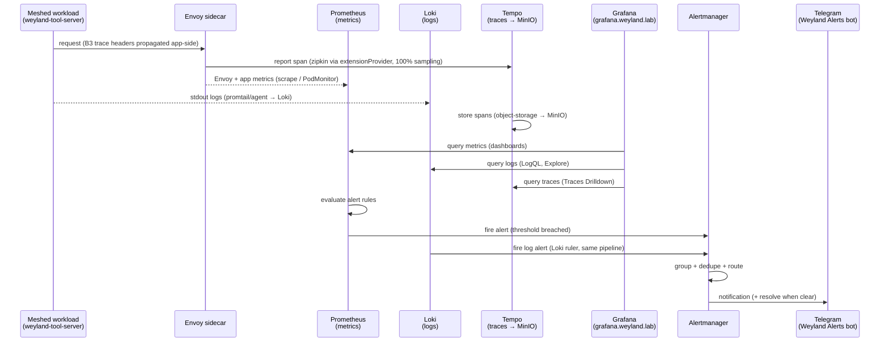

# Demo — Observability end-to-end (app emits → Prometheus / Loki / Tempo → Grafana → Alertmanager → Telegram)

> **Pending live end-to-end validation run.** Every command below is real and pulled from the two component demos
> it threads, but this cross-system walkthrough has **not** yet been executed straight through against live infra.

The three-signal loop for one meshed workload, followed from emit to page: a request generates **metrics** (via
Envoy + app scrape), **logs** (stdout → Loki), and **traces** (Envoy → Tempo, 100% sampling), Grafana is the
single read pane over all three, and a breached rule DMs the operator on Telegram. It threads:

1. **[tracing.md](tracing.md)** — how a span reaches **Tempo** (not Jaeger — retired B48) and shows in Grafana /
   Kiali; requires the mesh `extensionProvider` + `Telemetry` + a sidecar restart, and app-side B3 propagation.
2. **[alerting.md](alerting.md)** — Prometheus rule → Alertmanager (group/dedupe/route) → the **Weyland Alerts**
   Telegram bot; Loki log alerts ride the **same** pipeline.

Nothing here is new mechanism — it is the seam between the tracing and alerting demos made explicit, with metrics
and logs as the two signals that complete the trio.

## Sequence diagram

From [../diagrams/flow-e2e-observability.md](../diagrams/flow-e2e-observability.md):



## Prerequisites

The union of the two component demos' prerequisites:

- **Istio mesh tracing → Tempo** — `istio-install.yaml` extensionProvider `tempo` → `tempo.monitoring.svc:9411`,
  `telemetry.yaml` (`randomSamplingPercentage: 100`), sidecars restarted after the change. Tempo (`grafana/tempo`,
  monolithic) up in ns `monitoring`, storage → MinIO.
- **kube-prometheus-stack** in ns `monitoring` (release `monitoring`) — Prometheus scraping nodes/pods/
  ServiceMonitors/Envoy (B8 PodMonitor); Alertmanager configured for the `telegram` receiver.
- **Loki** (`loki-0`, ns `monitoring`) receiving app logs; the Loki ruler pointed at Alertmanager.
- **Grafana** — `https://grafana.weyland.lab` (Keycloak OIDC) with the **Tempo** (`:3200`), **Prometheus**,
  **Loki**, and **Alertmanager** datasources.
- **Kiali** — `https://kiali.weyland.lab` (Keycloak SSO), tracing `provider: tempo`.
- **Secret** `weyland-alerts-telegram` (bot token) mounted into Alertmanager (`bot_token_file`); the Weyland
  Alerts bot + your chat ID configured.
- `kubectl` runs on **mother** (`emangini@mother`).

## UI walkthrough

**Step 1 — generate the three signals.**
1. Drive traffic through the meshed tool-server (CLI Step 1 below). Each call emits a span (100% sampling),
   metrics, and logs.

**Step 2 — read all three in Grafana.**
2. Open `https://grafana.weyland.lab` (Keycloak). **Explore → Tempo → Search** by service
   `weyland-tool-server` (or **Traces Drilldown**) → open a trace → the span tree across the meshed hops.
3. **Explore → Loki** → LogQL `{app="weyland-tool-server"}` → the request logs from the same window.
4. A Prometheus dashboard (or **Explore → Prometheus**) shows the request-rate / Envoy metrics for the workload.
5. Cross-check the trace in `https://kiali.weyland.lab` → workload `weyland-tool-server` → **Traces** tab.

**Step 3 — fire an alert and get paged.**
6. Apply the canned test rule (CLI Step 3). Grafana → **Alerting** (Alertmanager datasource) shows it firing.
7. On your phone, the **Weyland Alerts** Telegram chat gets the paging DM within ~1-2 min (and a resolve when the
   rule is removed).

## CLI walkthrough

Kubectl runs on **mother**.

**Step 1 — emit traceable / loggable traffic** (each call fans through the mesh at 100% sampling):
```
[mother] curl -s http://mother:30080/status
[mother] curl -s http://mother:30080/qdrant/health
```
> Exact per-backend `/context/search` body is `TODO: verify` against `http://mother:30080/docs` — carried from
> [tracing.md](tracing.md); `/status` + a health route are enough to generate spans.

**Step 2 — confirm the signal stores are healthy:**
```
[mother] kubectl -n monitoring get pods -l app.kubernetes.io/name=tempo
[mother] kubectl -n monitoring get pods -l app.kubernetes.io/name=loki
[mother] kubectl -n monitoring get prometheus,alertmanager
```
If traces are missing, the classic half-wired symptom is sidecars not restarted after the tracing bootstrap:
```
[mother] kubectl -n weyland rollout restart deployment/weyland-tool-server
```

**Step 3 — fire a test alert to Telegram, then resolve it:**
```
[mother] kubectl apply -f ~/lab/weyland-platform/k8s/monitoring/telegram-test-rule.yaml
[mother] kubectl -n monitoring exec $(kubectl -n monitoring get pod -l app.kubernetes.io/name=alertmanager -o jsonpath='{.items[0].metadata.name}') -c alertmanager -- wget -qO- http://localhost:9093/api/v2/alerts
[mother] kubectl delete -f ~/lab/weyland-platform/k8s/monitoring/telegram-test-rule.yaml
```
Confirm the Loki ruler (log-alert variant) is loaded and pointing at Alertmanager:
```
[mother] kubectl logs -n monitoring loki-0 -c loki | grep -iE 'ruler|rule file|alertmanager'
```

## Expected result

- **Traces:** after a few requests a `weyland-tool-server` trace appears in Grafana Explore → Tempo (and Kiali
  Traces tab) within seconds; the span tree spans multiple hops (Envoy → backend) — proof of mesh-level tracing +
  app-side B3 propagation.
- **Logs:** the same requests appear in Grafana Explore → Loki via LogQL.
- **Metrics:** Prometheus shows the request-rate / Envoy series for the workload.
- **Alert:** the `apply` delivers a `WeylandTelegramTest` DM to the Weyland Alerts chat within ~1-2 min; the
  `delete` delivers the matching **resolved** message; `api/v2/alerts` lists it while applied (`Watchdog` always
  present, routed to `null`).

> Note: Tempo's Drilldown Rate/Error panels may show an "empty ring" — the metrics-generator (span-metrics /
> service-graph) is not enabled. Traces themselves work; documented, deferred limitation ([tracing.md](tracing.md)).

## Cleanup / teardown

The metrics/logs/traces legs are **read-only** — the only side effect is the spans/logs the `curl` calls generate,
which age out of Tempo/Loki/MinIO on their own.

The alert test rule **must** be removed (it is the created data) — the `delete` step above does exactly that:
```
[mother] kubectl delete -f ~/lab/weyland-platform/k8s/monitoring/telegram-test-rule.yaml --ignore-not-found
```
No other state is created.
