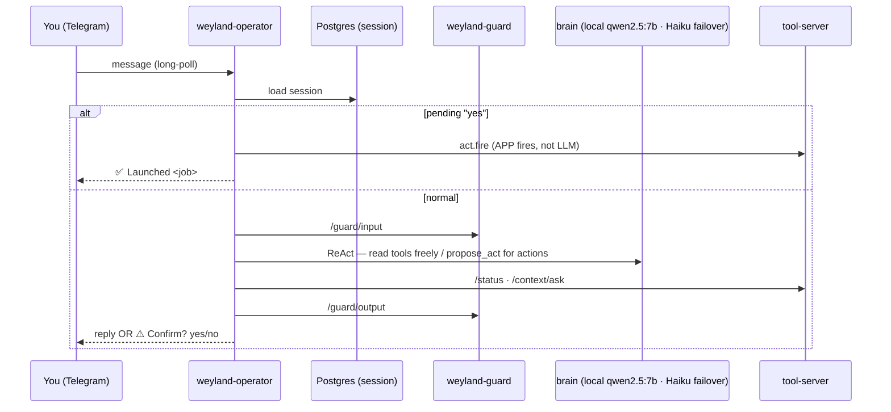

# Demo — Operator agent (`weyland-operator`, B66)

Text the lab from anywhere → it acts. A LangGraph agent — **local `qwen2.5:7b` primary, Haiku failover** — over the
tool-server's read + act tools, fronted by **Telegram**, with **session memory** and an **app-level confirm-step** on
every action. It also runs the **B45 incident sweep** — see [demos/incident-sweep.md](incident-sweep.md). The operator lane
Hermes vacated (CT-104 destroyed 2026-07-23) — now a k8s pod on mother. Validated live 2026-07-24.

Grounded in [runbooks/operator.md](../runbooks/operator.md), the design doc
(`aidlc-docs/construction/operator-agent-design.md`), and the brain [demos/brain-bakeoff.md](brain-bakeoff.md).

## Sequence diagram

See [diagrams/flow-operator.md](../diagrams/flow-operator.md).



## Prerequisites

- **mother** — `weyland-operator` (Deployment, ns `weyland`), `weyland-guard`, `weyland-tool-server`, `weyland-postgres`
  (session store), `mlflow` (tracking the `operator` experiment). A Telegram bot (`weyland-operator-secret`).
- **rogueone** — Ollama (`qwen2.5:7b`, the local-primary brain on a curated flat toolset; Haiku failover when the shared GPU can't serve) for the ReAct loop.
- Your Telegram account allowlisted (`TELEGRAM_ALLOWED_USERS` = your `chat_id`).

## Telegram walkthrough (the headline — DM the bot)

1. **Read + grounding** — "is the lab healthy?" → a grounded reply naming the real backends (the agent called
   `status`, didn't hallucinate).
2. **Tool-selection** — "what does the knowledge base say about the guardrails service?" → routes to `context_ask`
   (RAG), not `status`.
3. **Session memory** — follow up "which of those is the graph store?" → "neo4j" (the prior turn carried, from Postgres).
4. **Confirm-step, cancel path** — "run the ingestion pipeline" → **⚠️ Confirm …?** and **nothing fires**. Reply
   **"no"** → "Cancelled — nothing was run." (proves no side effect without an explicit yes).
5. **Confirm-step, fire path** — ask again → reply **"yes"** → "✅ Launched `weyland_ingestion_job` — run …", visible
   in Dagster. *(Don't fire the eval jobs — 40–70 min.)*

## CLI walkthrough (the stateless probe surface)

`/operator/ask` is read-only (no session, never fires acts) — good for a quick in-cluster smoke test:

```
[mother] kubectl -n weyland run curl-op --rm -it --image=curlimages/curl --restart=Never -- curl -s --max-time 300 -X POST http://weyland-operator:8080/operator/ask -H 'content-type: application/json' -d '{"message":"is the lab healthy?"}'
```

An action request over `/operator/ask` is **surfaced, not fired** (acts are Telegram-only):

```
[mother] kubectl -n weyland run curl-op --rm -it --image=curlimages/curl --restart=Never -- curl -s --max-time 300 -X POST http://weyland-operator:8080/operator/ask -H 'content-type: application/json' -d '{"message":"run the ingestion pipeline"}'
```
→ `[proposed action — acts require the Telegram confirm flow] …` (nothing launched).

Confirm an **MLflow Trace** landed (the langchain autolog):

```
[mother] kubectl -n weyland exec deploy/weyland-operator -- python -c "import mlflow; mlflow.set_tracking_uri('http://mlflow.weyland.svc.cluster.local:5000'); from mlflow import MlflowClient; e=MlflowClient().get_experiment_by_name('operator'); print('traces', len(mlflow.search_traces(experiment_ids=[e.experiment_id])))"
```

Confirm the ingress + confirm-step metrics:

```
[mother] kubectl -n weyland exec deploy/weyland-operator -- python -c "import urllib.request; print([l for l in urllib.request.urlopen('http://localhost:8080/metrics').read().decode().splitlines() if 'operator_telegram_messages_total' in l and not l.startswith('#')])"
```

## Local-primary brain + Haiku failover (B45 follow-up)

The brain is local `qwen2.5:7b` ($0); Haiku is a health failover only. Confirm local is actually serving (not silently
all-Haiku) — a real answer in the teens of seconds:

```
[mother] kubectl -n weyland exec deploy/weyland-operator -- python -c "import urllib.request,json,time; t=time.time(); req=urllib.request.Request('http://localhost:8080/operator/ask', data=json.dumps({'message':'which pods are running in the weyland namespace?'}).encode(), headers={'Content-Type':'application/json'}); print(urllib.request.urlopen(req, timeout=90).read().decode()[:400]); print('took', round(time.time()-t,1),'s')"
```

Then the brain-selection metric:

```
[mother] kubectl -n weyland exec deploy/weyland-operator -- python -c "import urllib.request; print(urllib.request.urlopen('http://localhost:8080/metrics').read().decode())" | grep 'operator_brain_selected_total{'
```
→ `brain="local",reason="primary"` climbing; `brain="haiku"` at ~0. A non-zero `haiku` count means the local engine was
unavailable and it failed over (rogueone/Ollama down, or the 16 GB GPU saturated) — the design degrading gracefully, not
a bug. Diagnose with [runbooks/operator.md](../runbooks/operator.md#diagnosing-a-slow--stalled-local-brain).

## Expected result

- Telegram: grounded reads, correct tool-selection, session memory across turns, and the confirm-step firing
  `weyland_ingestion_job` **only** after an explicit "yes".
- `operator_telegram_messages_total` shows `ok` / `proposed` / `acted` / `cancelled` outcomes.
- `traces >= 1` in the `operator` experiment.
- The session row: one `operator_sessions` row per `chat_id`, `pending_action` NULL between confirms.

## Cleanup / teardown

The confirm-step fire (step 5) **launches `weyland_ingestion_job`** — a real Dagster run that re-ingests the KB
(idempotent upserts, no destructive effect; let it complete or leave it). It also writes: `operator_sessions` rows
(per-chat memory, retained), `guardrail_verdicts` (shared-service telemetry), and MLflow traces in `operator`
(observability history). Nothing needs teardown; to reset a chat's memory:

```
[mother] kubectl -n weyland exec deploy/weyland-postgres -- psql -U weyland -d weyland -c "DELETE FROM operator_sessions;"
```
