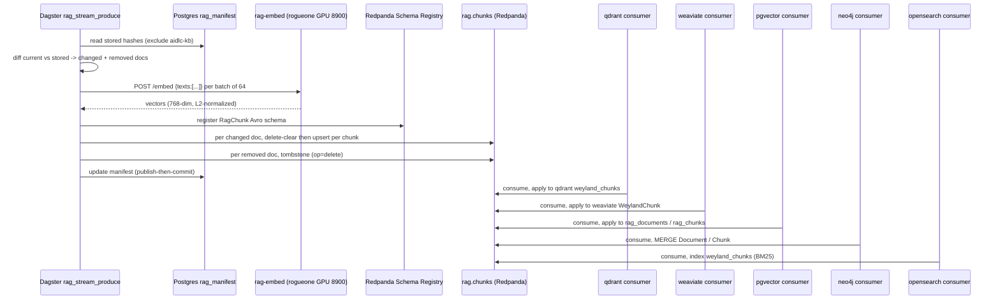

# Demo — RAG streaming indexer (B-RAG-STREAM)

Builds the RAG index as a **streaming fan-out** instead of an in-process Dagster asset chain. A Dagster op
(`rag_stream_produce`) chunks the changed docs, embeds them **once** on the warm rogueone GPU service, and
publishes `RagChunk` records (Confluent-Avro) to the Redpanda topic **`rag.chunks`** keyed by `source_path`.
Five independent consumers — one per store, one consumer group each — replay that topic into qdrant, weaviate,
pgvector, neo4j, and opensearch. The embedding is done once, out of Dagster; only the manifest + record stream
cross the orchestrator (design invariants I1–I3, I6). Diagram:
[../diagrams/flow-rag-stream.md](../diagrams/flow-rag-stream.md). Design:
[../../aidlc-docs/construction/rag-streaming-indexer-design.md](../../aidlc-docs/construction/rag-streaming-indexer-design.md).

> **Chain:** next → [rag-query.md](rag-query.md) (retrieves what this indexes). Full arc: [rag-e2e.md](rag-e2e.md).

## Sequence diagram



## Prerequisites

- **Redpanda** (`redpanda.data-mesh.svc.cluster.local:9092`, schema registry `:8081`) — pod `redpanda-0`, ns
  `data-mesh`. Serves the `rag.chunks` topic.
- **rag-embed** warm GPU service on **rogueone** (`192.168.1.230:8900`) — native systemd unit `rag-embed.service`
  holding `bge-base-en-v1.5` (768-dim, B74) on the RTX 5000 Ada.
- **Five store consumers** (image `weyland-rag-index:local`, one binary, `STORE` env each):
  - ns `data-mesh`: `rag-index-qdrant`, `rag-index-weaviate`, `rag-index-opensearch` (sidecar OFF).
  - ns `weyland`: `rag-index-pgvector`, `rag-index-neo4j` (sidecar ON — Postgres strict mTLS / neo4j Bolt mesh;
    Kafka ports 9092/8081 excluded from the sidecar).
- **Stores**: qdrant + weaviate (ns `weyland`), weyland-postgres/pgvector, neo4j, opensearch.
- **Dagster** (`dagster.weyland.lab`) with the `weyland_pipeline` code location (`dagster-user-code` deploy, ns
  `weyland`) — carries `REDPANDA_BOOTSTRAP` + `SCHEMA_REGISTRY_URL`.

## UI walkthrough

1. **Trigger the producer** — open `https://dagster.weyland.lab` → Assets → search `rag_stream_produce` →
   **Materialize**. The run logs `N changed docs (M chunk upserts), K removed (tombstones)`.
2. **Watch the topic** — open `https://redpanda.weyland.lab` (Redpanda Console) → Topics → **`rag.chunks`** →
   Messages. Console decodes the Avro against the registry; each message shows `op` = `upsert`/`delete`,
   `source_path`, `chunk_index`, and the 384-float `vector`.
3. **Check the registry** — Console → Schema Registry → subject **`rag.chunks-value`** = the `RagChunk` record.
4. **Check consumer lag** — Console → Consumer Groups → `rag-index-qdrant` / `-weaviate` / `-pgvector` /
   `-neo4j` / `-opensearch`. Lag should drain to 0 as each group applies the records.
5. **Verify a store landed** — the qdrant collection `weyland_chunks` gains points; browse via NeoDash
   (`http://mother:30088`) for the neo4j Document/Chunk graph.

## CLI walkthrough

Kubectl runs on **mother**. SSH user is `emangini@mother`, `edwardmangini@rogueone`.

```
[rogueone] curl -s http://localhost:8900/health
[mother] curl -s http://192.168.1.230:8900/health
[mother] kubectl -n data-mesh get pod redpanda-0
[mother] kubectl -n data-mesh get pods | grep rag-index
[mother] kubectl -n weyland get pods | grep rag-index
[mother] kubectl -n data-mesh exec redpanda-0 -- rpk cluster health
```

Trigger the producer (UI is the reliable path; this is the CLI equivalent from the design's Step 4):

```
[mother] kubectl -n weyland exec deploy/dagster-user-code -- dagster asset materialize -m weyland_pipeline --select "*rag_stream_produce"
```

`TODO: verify` the exact `dagster asset materialize` invocation inside the pod (module flag `-m weyland_pipeline`
= the code-location name; confirm it resolves the instance/Postgres from the pod's `DAGSTER_HOME`). The design
records the canonical selector as `dagster asset materialize --select "*rag_stream_produce"`.

Inspect the topic + schema + lag:

```
[mother] kubectl -n data-mesh exec redpanda-0 -- rpk topic list
[mother] kubectl -n data-mesh exec redpanda-0 -- rpk topic consume rag.chunks --num 1
[mother] kubectl -n data-mesh exec redpanda-0 -- curl -s localhost:8081/subjects
[mother] kubectl -n data-mesh exec redpanda-0 -- rpk group list
[mother] kubectl -n data-mesh exec redpanda-0 -- rpk group describe rag-index-qdrant
```

Verify qdrant landed (NodePort 30083, collection `weyland_chunks`):

```
[mother] curl -s http://mother:30083/collections/weyland_chunks
```

Isolated spine probe (no producer/embed — validates only the consumer→store path; ships in the image):

```
[mother] kubectl -n data-mesh exec deploy/rag-index-qdrant -- python probe.py upsert
[mother] curl -s http://mother:30083/collections/weyland_chunks
[mother] kubectl -n data-mesh exec deploy/rag-index-qdrant -- python probe.py delete
```

## Expected result

- The `rag.chunks` topic exists (3 partitions, RF=1) with subject `rag.chunks-value` (`RagChunk`) registered.
- The producer emits, per changed doc, one `delete` (replace-clear) then one `upsert` per chunk; one `delete`
  tombstone per removed doc. Validated math from Step 4: 475 changed docs → 2370 upserts + 475 clears.
- All five consumer groups drain to **lag 0**.
- Store contents: qdrant collection `weyland_chunks` + opensearch index `weyland_chunks` gain one entry per
  chunk; weaviate `WeylandDocument`/`WeylandChunk`; pgvector `rag_documents`/`rag_chunks`; neo4j `:Document`/
  `:Chunk` nodes with `BELONGS_TO` + `NEXT`.
- The **probe** path is exact: `probe.py upsert` → 2 points for `PROBE/spine.md`; `probe.py delete` → 0 points.

## Cleanup / teardown

The probe path is fully reversible — it only touches the synthetic `PROBE/spine.md` doc:

```
[mother] kubectl -n data-mesh exec deploy/rag-index-qdrant -- python probe.py delete
```

A full `rag_stream_produce` run writes the **live RAG index** (this is production data, not throwaway) — do not
casually tear it down. To fully reset the streaming plane (rebuilds from scratch on next run — destructive):

```
[mother] kubectl -n data-mesh exec redpanda-0 -- rpk topic delete rag.chunks
[mother] kubectl -n data-mesh exec redpanda-0 -- rpk group delete rag-index-qdrant
[mother] kubectl -n data-mesh exec redpanda-0 -- rpk group delete rag-index-weaviate
[mother] kubectl -n data-mesh exec redpanda-0 -- rpk group delete rag-index-opensearch
[mother] kubectl -n weyland exec redpanda-0 -- true
```

`TODO: verify` — the pgvector (`rag-index-pgvector`) and neo4j (`rag-index-neo4j`) groups live in ns `weyland`
but talk to the same Redpanda in `data-mesh`; delete their groups the same way via `redpanda-0`:
`rpk group delete rag-index-pgvector` / `rag-index-neo4j`. To wipe store rows, re-run the producer after clearing
`rag_manifest` (`DELETE FROM rag_manifest;` in weyland-postgres) so every doc re-publishes as changed, or drop
the store collections/indexes directly (qdrant `weyland_chunks`, opensearch `weyland_chunks`, etc.).
