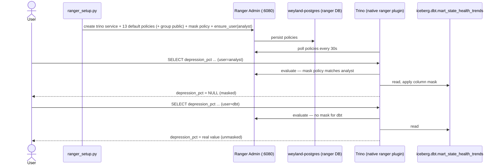

# Demo — Ranger column masking (masked vs unmasked Trino query)

> **Pending live end-to-end validation run.** The commands below are lifted from `runbooks/ranger.md`; this
> demo-shaped walkthrough has **not** yet been executed straight through against live infra.

Prove an Apache Ranger **column-masking** policy with a single before/after: the **same** query on the **same**
mart returns real values for one Trino user and `NULL` for another, because Trino's native Ranger plugin masks
`depression_pct` for the `analyst` user. Ranger is Slice A of the L5 (Governance/Security) layer (Ranger + OPA +
Soda), governing table/column/row policies, masking, and row filters for `iceberg.dbt.*` and everything else
Trino federates. Grounded in [../runbooks/ranger.md](../runbooks/ranger.md).

**Where:** Ranger UI `https://ranger.weyland.lab` (Keycloak forward-auth, then Ranger's own `admin` login). Trino
468 has a **native** Ranger access-control plugin (`access-control.name=ranger`) that pulls policies from Ranger
Admin every 30s and enforces them on every query.

## Sequence diagram



## Prerequisites

- **Ranger Admin** — `ranger-admin.data-mesh.svc.cluster.local:6080` (REST API + policy source; the forward-auth
  ingress **401s API calls**, so automation uses the svc). UI `https://ranger.weyland.lab`. Meshed (istio) so it
  reaches STRICT-mTLS Postgres. Creds: `admin` / `Weyland_dev_password1` (Ranger UI users need upper+lower+digit —
  the shared `weyland_dev_password` is rejected).
- **Policy DB** — `ranger` DB in weyland-postgres (role `rangeradmin`).
- **Trino wired to the plugin** — `access-control.name=ranger`, config resources as **absolute** paths. ⚠ The
  authz setup (`ranger_setup.py`) **must** have run **before** the plugin was enabled, or the default-deny plugin
  locks every consumer out (the service's 13 default policies grant to user `trino` only → setup adds group
  `public` to them all).
- **The mask policy + `analyst` user** — created by `scripts/ranger_setup.py`: masks `depression_pct` on
  `iceberg.dbt.mart_state_health_trends` for user `analyst`; `ensure_user()` creates the `analyst` ROLE_USER
  (a policy referencing a non-existent user 400s).
- **The mart exists** — `iceberg.dbt.mart_state_health_trends` (run [dbt.md](dbt.md) if absent).
- `kubectl` runs on **mother** (`emangini@mother`).

## UI walkthrough

1. Open `https://ranger.weyland.lab` → Keycloak → Ranger `admin` login.
2. **Access Manager → Resource Policies → the `trino` service** → **Masking** tab. Open the mask policy on
   `mart_state_health_trends` / column `depression_pct`. Confirm the **mask type** (e.g. "Redact" / "Nullify")
   and that it applies to user **`analyst`**.
3. **Users/Groups/Roles → Users** — confirm `analyst` (ROLE_USER) exists and group `public` is present on the 13
   default policies (Resource Policies list).
4. There is no query surface in the Ranger UI — prove the effect from the Trino CLI / driver below.

## CLI walkthrough

Kubectl runs on **mother**.

**Confirm the mart exists and the plugin is polling** (Trino picks up policy changes within ~30s):
```
[mother] kubectl -n data-mesh exec deploy/trino -- trino --execute "SHOW TABLES FROM iceberg.dbt LIKE 'mart_state_health_trends'"
```

**(Re)apply the authz setup if the service / mask / analyst user is missing** (idempotent):
```
[mother] kubectl -n weyland exec -i deploy/dagster-user-code -- python - < scripts/ranger_setup.py
```
> ⚠ Only meaningful if the Trino ranger plugin is already wired. If you are enabling the plugin for the first
> time, run this **before** the plugin restart or default-deny locks everyone out (see
> [../runbooks/ranger.md](../runbooks/ranger.md), "Rebuild from scratch" step 4 vs 5).

**The proof — same query, two users** (the runbook's verify block; `analyst` → masked, `dbt` → real):
```
[mother] kubectl -n weyland exec -i deploy/dagster-user-code -- python - <<'PY'
import trino
def q(u):
    c=trino.dbapi.connect(host="trino.data-mesh.svc.cluster.local", port=8080, user=u, catalog="iceberg", schema="dbt")
    cur=c.cursor(); cur.execute("SELECT state, year, depression_pct FROM iceberg.dbt.mart_state_health_trends ORDER BY state LIMIT 3"); return cur.fetchall()
print("analyst (masked):", q("analyst"))   # depression_pct -> None
print("dbt (unmasked)  :", q("dbt"))        # real values
PY
```

## Expected result

- **`analyst`** rows come back with `depression_pct = None` (masked) — `state` and `year` are unaffected (only
  the governed column is masked, the row is still visible).
- **`dbt`** rows come back with the **real** `depression_pct` values — same query, same table, no mask for that
  user.
- The single diff between the two result sets is the masked column: definitive proof the Ranger policy is
  enforced by Trino at query time, not by the application.
- (If both users see real values, the plugin has not picked up the policy yet — wait ~30s, or the setup did not
  run; if both see `None` / errors, suspect the default-deny lockout — see the runbook's gotcha gauntlet.)

## Cleanup / teardown

The demo is **read-only** — two SELECTs, no rows created. Nothing to tear down; the mask policy is the intended
steady state and should be left in place.

To roll back Ranger enforcement entirely (revert to Trino's built-in access control), remove the
`access-control.properties` mount from `trino.yaml` and restart Trino — per
[../runbooks/ranger.md](../runbooks/ranger.md). Do **not** delete the `analyst` user or the mask policy while the
plugin is enabled unless you intend to change the governance posture.
