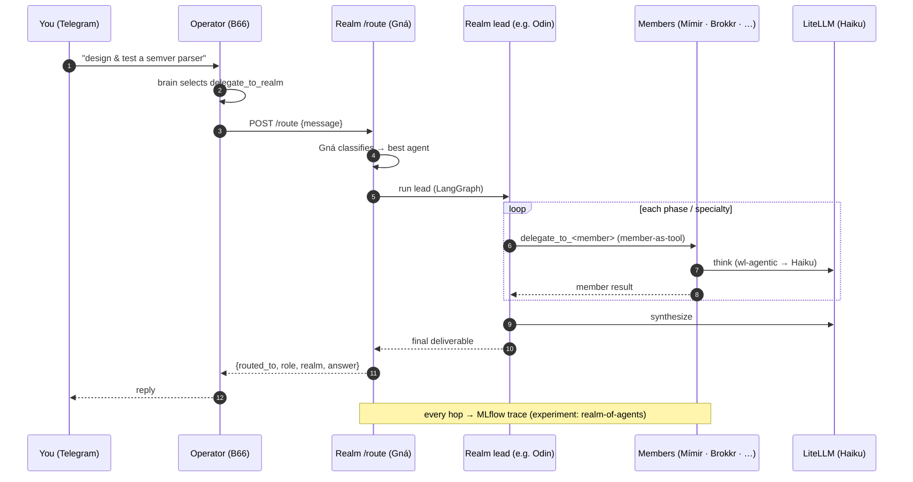
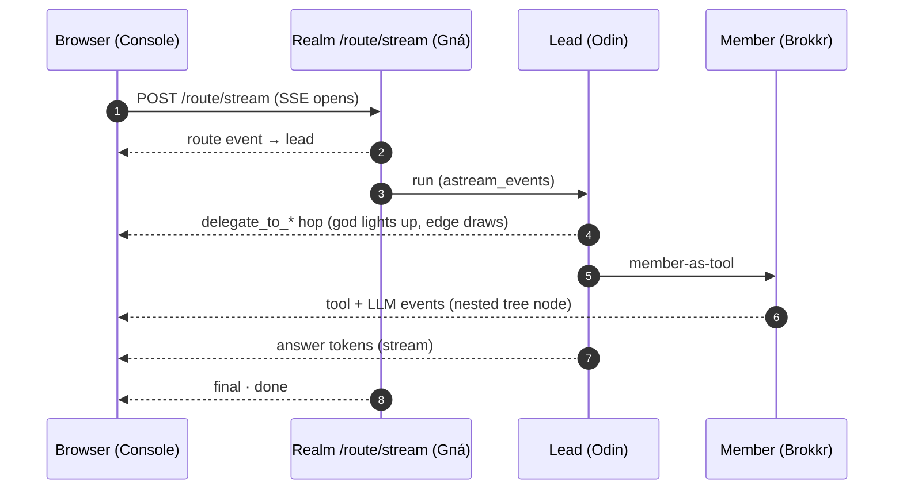

# Realm of Agents — A2A (B17)

The **Realm of Agents** is 24 small, corpus-backed specialists in five Norse-named groups, hosted in one multiplexed
pod and reachable over an A2A surface. A dispatcher (**Gná**) routes a task to the best agent; realm **leads** act on
their own specialty *or* delegate to their team and reconcile. The **Operator** (B66) reaches the whole Realm through a
single `delegate_to_realm` tool — the cross-service agent-to-agent hop.

Concept + decoder ring: [concepts/realm-of-agents.md](../concepts/realm-of-agents.md) · interactive
[Realm of Agents map](../realm-of-agents-map.html) · design of record `../design/a2a-agent-roster.md`.

**Brain:** every agent runs on **Claude Haiku** (a Realm-wide `REALM_MODEL` override via LiteLLM's `wl-agentic` lane) —
fast, reliable, and off the lab's local GPU. Tools load from the Bifrost VK; every hop is an MLflow trace.

## How a request flows



## The realms

- **Valhalla** — engineering: Odin (orchestrator) · Mímir (architect) · Brokkr (engineer) · Forseti (test) · Hermóðr (devops) · Heimdall (security) · Huginn (review) · Muninn (quality)
- **Vanaheim** — knowledge: Kvasir (strategy) · Njörðr (AIDLC delivery) · Freyja (industry lens) · Bragi (prompt eng)
- **Midgard** — data & platform: Verðandi (observability) · Vör (data quality) · Sága (SQL) · Yggdrasil (graph/lineage) · Fulla (catalog)
- **the Well** — research/eval/content/safety: Tyr (eval judge) · Óðrœrir (RAG) · Ratatoskr (web research) · Snotra (scribe) · Syn (safety)
- **Root** — the Operator (supervisor) · Gná (dispatch)

## Try it (in-cluster)

The Realm is a ClusterIP behind STRICT-mTLS, so drive it from inside the pod (host curl is blocked by the mesh):

**Route a task — Gná picks the agent:**
```
kubectl -n weyland exec deploy/realm-of-agents -c realm-of-agents -- python3 -c "import http.client,json;c=http.client.HTTPConnection('localhost',8080,timeout=300);c.request('POST','/route',json.dumps({'message':'audit the grafana dashboards'}),{'content-type':'application/json'});print(c.getresponse().read().decode())"
```

**Send to a specific agent** (`/agents/{key}/message`), e.g. Sága:
```
kubectl -n weyland exec deploy/realm-of-agents -c realm-of-agents -- python3 -c "import http.client,json;c=http.client.HTTPConnection('localhost',8080,timeout=180);c.request('POST','/agents/saga/message',json.dumps({'message':'List the Trino catalogs and their schemas.'}),{'content-type':'application/json'});print(c.getresponse().read().decode())"
```

**Watch the live delegation trace:**
```
kubectl -n weyland logs -f --tail=5 deploy/realm-of-agents
```

## See it — the Console & the Inspector

**Realm Console** — [`https://realm.weyland.lab/`](https://realm.weyland.lab/) (open on the LAN). The show-off UI: type a
task, hit **Invoke ⚡**, and watch Gná dispatch, the answering gods light up across realms, the delegation hops draw, an
inline **execution-trace tree** build (agents · `delegate_to_*` hops · tool + LLM calls, with timings + expandable I/O),
and the answer stream in. Served by the Realm pod at `GET /`; black-and-white chrome, realm color-coding, Uncial-Antiqua
title.

**A2A Inspector** — [`https://inspector.weyland.lab`](https://inspector.weyland.lab) (Keycloak SSO). Point it at
`http://realm-of-agents.weyland.svc.cluster.local:8080` to validate the Agent Cards and chat through Gná — the
protocol-level debug view (adopted over a2a-ui / LangGraph Studio / Agent Chat UI in a bake-off).

Both ride the same live stream the Console renders:



**Stream it from the CLI** (the exact events the Console consumes):
```
curl -N -sk -X POST https://realm.weyland.lab/route/stream -H "content-type: application/json" -d '{"message":"design & test a semver parser"}'
```

## The picture

```likec4-view
realmOfAgents
```

## Proven

- **Valhalla** — Odin decomposed "design & implement a semver parser with tests" across Mímir → Brokkr → Forseti → Huginn → Muninn → Hermóðr and returned one production package (parser + 80+ tests + review + deploy guide); Huginn caught a real dead-code defect, Muninn refactored it out.
- **Midgard** — Sága returned the *actual* Trino catalogs (iceberg/postgresql/system) from a live query; Verðandi audited Grafana and flagged a stale Jaeger datasource.
- **the Well** — Ratatoskr answered a current-events question with cited Perplexity results.
- **Cross-service** — the Operator's `delegate_to_realm` routed "audit the grafana dashboards" → Gná → Verðandi and returned the result back through Telegram.

Restore / durability follows the platform's Argo + image-tag flow: build `registry.weyland.lab/realm-of-agents:vN`,
bump `k8s/realm-of-agents/deployment.yaml`, push → Argo rolls it. Prompts/skills restore from the Bifrost registration
scripts.
