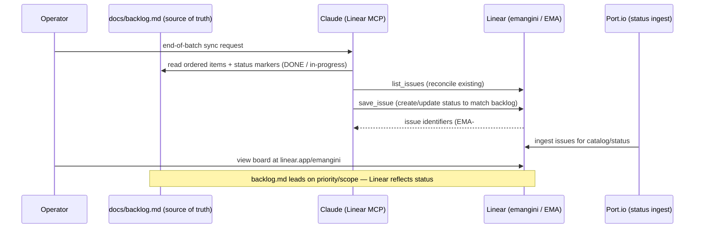

# Demo — Roadmap Sync (Linear)

The forward roadmap lives in two places with a clear split: **`docs/backlog.md` is the ordered
source of truth** (priority + scope), and **Linear holds status** (the `emangini` workspace,
team key `EMA`, projects *Weyland Lab* / *Stud.IO* / *Service Transformation*). Sync is done
**ad-hoc via the Linear MCP** at the end of each work batch, together with a doc sweep. Port
ingests Linear for its catalog/status view. There is no shell CLI for Linear — the "commands"
here are MCP tool operations driven through Claude.

Related: Hermes also mirrors `docs/backlog.md` into a **separate** one-way, read-only Kanban
board (`weyland-roadmap`) — that flow is distinct from this Linear sync. See
[../diagrams/flow-roadmap-sync.md](../diagrams/flow-roadmap-sync.md).

## Sequence diagram



## Prerequisites
- Linear MCP registered for Claude (read/write to the `emangini` workspace).
- `docs/backlog.md` current — it is the ordered source; Linear status follows it.
- Access to `https://linear.app/emangini` (SaaS login) to view the board.
- (Optional) Port.io ingest configured for the Linear status view.

## UI walkthrough
1. Open `https://linear.app/emangini`.
2. Select a project — **Weyland Lab**, **Stud.IO**, or **Service Transformation**.
3. Review the board: each issue's status (Backlog / In Progress / Done / Canceled) should reflect `docs/backlog.md`. Items DONE-marked in the backlog land as Done; dropped items are simply skipped (no prune).

## CLI walkthrough
Linear has **no shell CLI** in this lab — sync runs through the Linear MCP from Claude. The operations, in order:

1. Read the source of truth (on the repo box):
```
sed -n '1,60p' /home/edwardmangini/IdeaProjects/weyland/docs/backlog.md
```
2. Reconcile against Linear — list existing issues for the team (MCP): `list_issues` with `team: "emangini"` (key `EMA`).
3. For each backlog item that is new or changed, create/update the matching issue (MCP): `save_issue` with the team, project (`Weyland Lab` / `Stud.IO` / `Service Transformation`), title, and status.
4. Confirm a specific issue landed (MCP): `get_issue` by identifier (e.g. `EMA-123`).

> Exact per-issue field mapping (backlog `B##` → Linear title/label convention): `TODO: verify` the current convention against the live board before bulk-writing.

## Expected result
- Linear issues for the batch reflect `docs/backlog.md`: new items created, changed items updated, DONE items marked Done.
- Each created/updated issue returns an `EMA-###` identifier.
- The Port.io status view (if wired) reflects the updated Linear state.

## Cleanup / teardown
If you created a **test** issue during the demo, remove it so it does not pollute the roadmap:
- Via UI: open the test issue in `linear.app/emangini` → set status to **Canceled** or delete/archive it.
- Via MCP: `save_issue` on the test issue setting its state to **Canceled** (there is no `delete_issue` tool; cancel/archive is the removal path).
A pure read/reconcile run that only mirrors real backlog items creates no throwaway data — nothing to undo.
