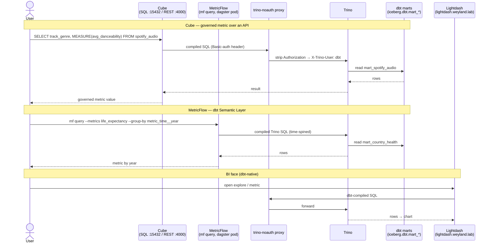

# Demo — Semantic consumption (Cube / MetricFlow → BI)

The last mile: the 7 dbt marts reach humans and apps through **governed metrics defined once**. **Cube** is a
headless semantic API (SQL / REST / GraphQL) — the metric layer an app or agent calls; **MetricFlow** is the dbt
Semantic Layer queried with `mf query`. Both compile to Trino (via the `trino-noauth` proxy for Cube). BI faces:
**Lightdash** (dbt-native) and **Superset** (Cube virtual datasets + ad-hoc SQL). Grounded in
[../runbooks/cube.md](../runbooks/cube.md), [../runbooks/lightdash.md](../runbooks/lightdash.md),
[../query/cube.md](../query/cube.md), and [../diagrams/flow-semantic-consumption.md](../diagrams/flow-semantic-consumption.md).

## Sequence diagram



## Prerequisites

- **Cube** — UI/Playground `https://cube.weyland.lab` (Keycloak forward-auth). SQL API `cube.data-mesh.svc.cluster.local:15432` (pg-wire, user `cube`). REST/GraphQL `:4000`.
- **Lightdash** — `https://lightdash.weyland.lab` (own login).
- **Superset** — `https://superset.weyland.lab` (Keycloak OIDC).
- **Trino** — reached by Cube/Lightdash through `trino-noauth.data-mesh.svc:8080` (strips Basic auth). dbt marts live in `iceberg.dbt.mart_*`.
- **MetricFlow** — `mf query` inside `deploy/dagster-user-code` (ns `weyland`); metrics in `dbt/models/semantic_models.yml`.
- `kubectl` runs on **mother** (`emangini@mother`).

## UI walkthrough

1. Open `https://cube.weyland.lab` (Keycloak). The dev-mode Playground compiles the 7 cubes — use it sparingly (heavy client-side SPA); the real integration surface is the SQL API below.
2. Open `https://lightdash.weyland.lab` → an explore (e.g. `mart_spotify_audio`) → pick a dimension (`track_genre`) + a governed metric (one of the 44 `meta.metrics`, e.g. `avg_danceability`) → run. This is dbt-native BI over the same marts.
3. Open `https://superset.weyland.lab` → the **"Weyland — Cube Semantic Layer"** dashboard (seeded by `scripts/superset_seed_cube.py`) — charts built on Cube `MEASURE()` virtual datasets.

## CLI walkthrough

[mother] Query a governed metric via Cube's SQL API (measures MUST be wrapped in `MEASURE()`):
```
kubectl -n data-mesh exec -i deploy/trino -- sh -c "PGPASSWORD=weyland_dev_password psql -h cube.data-mesh.svc.cluster.local -p 15432 -U cube -d cube -c \"SELECT track_genre, MEASURE(avg_danceability) FROM spotify_audio GROUP BY 1 ORDER BY 2 DESC LIMIT 5;\""
```
> TODO: verify `psql` is on the `deploy/trino` image; if not, run the same `psql` from any box that can reach `cube.data-mesh.svc:15432` (or via an IntelliJ K8s port-forward of the Cube SQL port).

[mother] Life expectancy by country through Cube (another governed metric):
```
kubectl -n data-mesh exec -i deploy/trino -- sh -c "PGPASSWORD=weyland_dev_password psql -h cube.data-mesh.svc.cluster.local -p 15432 -U cube -d cube -c \"SELECT country, MEASURE(avg_life_expectancy) FROM country_health GROUP BY 1 ORDER BY 2 DESC LIMIT 10;\""
```

[mother] Query a MetricFlow metric (time-spined health mart) in the dagster pod:
```
kubectl -n weyland exec -i deploy/dagster-user-code -- sh -c "cd /app/dbt && DBT_PROFILES_DIR=/app/dbt mf query --metrics life_expectancy --group-by metric_time__year --order metric_time__year"
```

[mother] See the compiled Trino SQL MetricFlow generates:
```
kubectl -n weyland exec -i deploy/dagster-user-code -- sh -c "cd /app/dbt && DBT_PROFILES_DIR=/app/dbt mf query --metrics state_diabetes_pct --group-by metric_time__year --explain"
```

## Expected result

- Cube SQL API returns the governed metric (e.g. top-5 most-danceable genres) — the identical number a dashboard would show, because the measure is defined once.
- A bare measure (`SELECT track_genre, avg_danceability ...`) fails with "could not be resolved from available columns" — proof `MEASURE()` is required.
- MetricFlow returns `life_expectancy` by year (blank tail years where no data — order descending to see populated ones).
- Lightdash/Superset render charts over the same marts.

## Cleanup / teardown

**Read-only.** This demo only issues SELECT/`mf query` reads against the marts through the semantic layers — nothing is created or mutated. No teardown required.
