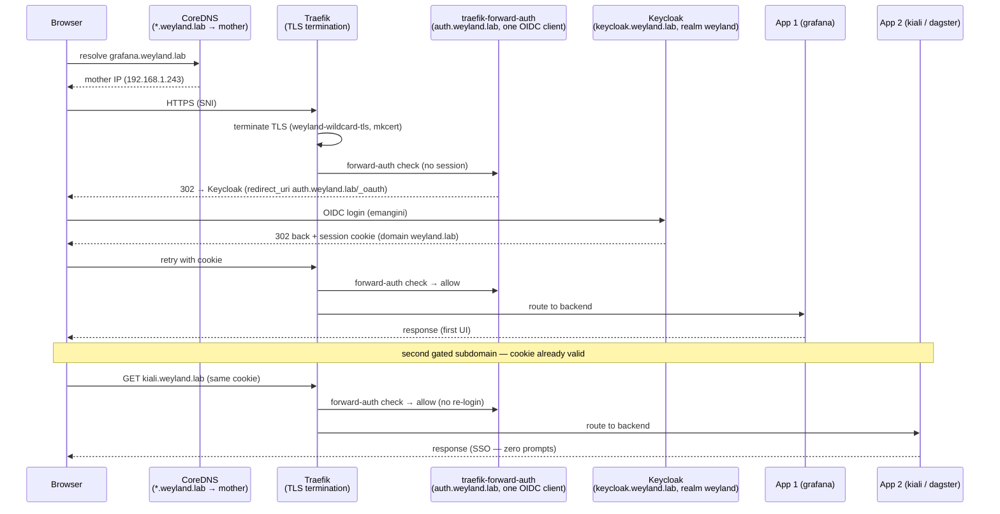

# Demo — SSO end-to-end (browser → Traefik → forward-auth → Keycloak → app; one login, every subdomain)

> **Pending live end-to-end validation run.** Every command below is real and pulled from the
> [ingress-tls.md](ingress-tls.md) demo and the Keycloak runbook, but this cross-system walkthrough has **not**
> yet been executed straight through against live infra.

The single sign-on arc for every gated `*.weyland.lab` UI, followed from the first cold hit through a second app
with **zero** re-login: CoreDNS resolves the wildcard to mother, Traefik terminates TLS, the `traefik-forward-auth`
middleware bounces an unauthenticated request to Keycloak once, and the resulting cookie (`COOKIE_DOMAIN=weyland.lab`)
covers every subdomain. It threads:

1. **[ingress-tls.md](ingress-tls.md)** — the shared front door: DNS → Traefik TLS (mkcert wildcard) →
   forward-auth middleware → backend (Envoy hop if meshed).
2. **[runbooks/keycloak.md](../runbooks/keycloak.md)** — the IdP: one realm (`weyland`), and the **single**
   forward-auth OIDC client whose one redirect URI (`auth.weyland.lab/_oauth`) + `weyland.lab` cookie make SSO
   work across every subdomain.

Nothing here is new mechanism — it is the seam between the ingress demo and the Keycloak runbook made explicit,
proving one login covers two apps.

## Sequence diagram

From [../diagrams/flow-e2e-sso.md](../diagrams/flow-e2e-sso.md):



## Prerequisites

The union of the ingress demo + Keycloak runbook prerequisites:

- **CoreDNS** on `mother:53` authoritative for `weyland.lab` (`*.weyland.lab` → mother `192.168.1.243`). On
  **rogueone**, an `/etc/hosts` line per subdomain until the workstation points at the wildcard LAN DNS (the
  browser resolves per-host, not the wildcard).
- **mkcert** root trusted by the browser (issues `weyland-wildcard-tls`).
- **Traefik** — the only edge ingress; TLS termination + the `weyland-traefik-forward-auth@kubernetescrd`
  middleware on each protected router.
- **Keycloak** — `https://keycloak.weyland.lab` (its own ingress carries **no** forward-auth middleware — it IS
  the auth), realm `weyland`, operator user `emangini` / `weyland_dev_password`.
- **traefik-forward-auth** — `https://auth.weyland.lab`, the single OIDC client (`AUTH_HOST=auth.weyland.lab`,
  `COOKIE_DOMAIN=weyland.lab`, one redirect URI `https://auth.weyland.lab/_oauth`); mounts `weyland-mkcert-ca`
  (`SSL_CERT_FILE=/mkcert/rootCA.pem`) for the back-channel to Keycloak.
- `kubectl` runs on **mother**; the browser box is `rogueone`.

## UI walkthrough

**Step 1 — first gated UI (the one login).**
1. From rogueone open `https://grafana.weyland.lab` — the browser shows a **trusted** lock (mkcert wildcard cert).
2. First visit to a forward-auth UI bounces through Keycloak (`auth.weyland.lab` → `keycloak.weyland.lab`) once;
   log in as `emangini`. You land on Grafana.

**Step 2 — second gated UI (SSO, no prompt).**
3. Open a second protected UI in the same browser — `https://kiali.weyland.lab` or `https://dagster.weyland.lab`.
   **No second login** — the `weyland.lab` cookie is already valid (cross-namespace: Kiali's ingress in
   `istio-system` references the `weyland` middleware).

**Step 3 — single logout.**
4. Hit `https://auth.weyland.lab/_oauth/logout` — it clears the forward-auth cookie **and** bounces to Keycloak's
   end-session endpoint, killing the SSO session (else the next app silently re-auths). Re-opening either app now
   prompts for login again.

## CLI walkthrough

**Step 1 — DNS + TLS front door (from rogueone):**
```
[rogueone] getent hosts grafana.weyland.lab
[rogueone] curl -sI https://grafana.weyland.lab
[rogueone] echo | openssl s_client -connect grafana.weyland.lab:443 -servername grafana.weyland.lab 2>/dev/null | openssl x509 -noout -subject -issuer -ext subjectAltName
```
An unauthenticated `curl -sI` returns a **302 to Keycloak** (`auth.weyland.lab`) — the forward-auth redirect,
proof the gate is in front. `getent` returns `192.168.1.243`; `openssl` shows issuer = mkcert CA + a
`*.weyland.lab` SAN.

**Step 2 — confirm the front-door wiring on mother:**
```
[mother] kubectl get ingress -A
[mother] kubectl get secret weyland-wildcard-tls -A
```

**Step 3 — confirm Keycloak + the single forward-auth client are healthy:**
```
[mother] kubectl -n weyland get deploy keycloak traefik-forward-auth
[mother] curl -s https://keycloak.weyland.lab/realms/weyland/.well-known/openid-configuration | head -c 300 ; echo
```
The realm's `.well-known` discovery doc returns (issuer `https://keycloak.weyland.lab/realms/weyland`) — proof the
IdP is serving OIDC. If a back-channel client throws `PKIX`/`x509 unknown authority` reaching Keycloak, its
truststore is missing the mkcert root (see the Keycloak runbook).

## Expected result

- `getent` returns `192.168.1.243  grafana.weyland.lab`; `curl -sI` returns a trusted-cert `302` to
  `auth.weyland.lab` when unauthenticated; `openssl` shows mkcert issuer + `*.weyland.lab` SAN.
- Browser reaches the **first** UI after a **single** Keycloak login.
- The **second** gated subdomain loads with **no** re-login (SSO via the `weyland.lab` cookie).
- `https://auth.weyland.lab/_oauth/logout` ends the session everywhere — the next app prompts again.

## Cleanup / teardown

Read-only demo — nothing is created. The single-logout URL resets session state; the `/etc/hosts` line on
rogueone is durable setup — leave it in place for future access.
