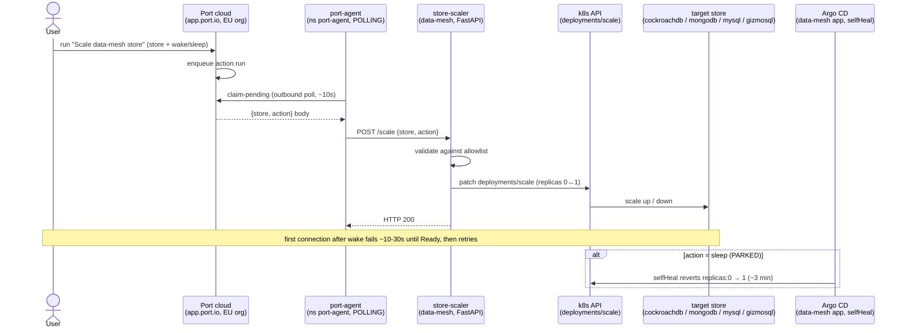

# Demo — Store scale end-to-end (Port action → port-agent poll → store-scaler → k8s scale)

> **Pending live end-to-end validation run.** Every command below is real and pulled from the
> [store-scaler.md](store-scaler.md) component demo, but this straight-through walkthrough has **not** yet been
> executed end to end against live infra.

The "easy button" arc followed from a Port click to a live replica change: Port is SaaS (EU org) and the lab is
LAN-only, so the self-hosted **port-agent** connects **outbound** and polls for action runs, then POSTs the
resolved `{store, action}` to the in-cluster **store-scaler**, which patches `deployments/scale`. It threads:

1. **[store-scaler.md](store-scaler.md)** — the Port self-service action → port-agent (POLLING) → store-scaler
   (FastAPI, allowlist) → `deployments/scale` path, and the PARKED sleep (Argo `selfHeal` wins over `replicas: 0`).

Nothing here is new mechanism — it is the [store-scaler.md](store-scaler.md) demo run as a closed loop with the
outbound-poll seam (the reusable "Port button → do X in the cluster" execution path) made explicit.

## Sequence diagram

From [../diagrams/flow-e2e-store-scale.md](../diagrams/flow-e2e-store-scale.md):



## Prerequisites

Per [store-scaler.md](store-scaler.md):

- **Port** — `https://app.port.io` (EU org `org_KyCTEN4PVUv1D3TM`); self-service action **"Scale data-mesh store"**
  (`port_action.scale_data_mesh_store`, `tofu/port/actions.tf`).
- **port-agent** — ns `port-agent`, `STREAMER_NAME: POLLING`, `PORT_API_BASE_URL: https://api.port.io` (EU),
  **Organization** creds in Secret `port-agent-creds`.
- **store-scaler** — `services/store-scaler/`, receiver `http://store-scaler.data-mesh.svc.cluster.local/scale`,
  body `{store, action}`; least-priv SA, sidecar disabled (plain HTTP).
- **Scalable stores** (all `Deployment`, replicas 1, `Recreate`): `cockroachdb`, `mongodb`, `mysql`, `gizmosql`.
- **Argo CD** — `https://argocd.weyland.lab` (the `data-mesh` app has `selfHeal: true` — relevant to the sleep
  half).
- `kubectl` runs on **mother** (`emangini@mother`).

## UI walkthrough

**Step 1 — run the Port action.**
1. Open `https://app.port.io` (EU org) → **Self-service** → the **"Scale data-mesh store"** action.
2. Pick a **store** (e.g. `gizmosql`) and **action = wake**; run it. The port-agent claims the run on its next
   outbound poll (~10s latency, not instant).

**Step 2 — watch the scale + Ready.**
3. The deployment goes to `replicas: 1` (verify below). First connection to the woken store fails for ~10-30 s
   until the pod is Ready, then a retry connects.

**Step 3 — (optional) the PARKED sleep.**
4. Run **action = sleep** — it returns HTTP 200 and scales to `replicas: 0`, but the `data-mesh` Argo app's
   `selfHeal` reverts `replicas: 0` back to `1` within ~3 min (Scaler and Argo fight; Argo wins). The execution
   plumbing is the deliverable; sleep-stickiness needs an `ignoreDifferences` carve-out on `/spec/replicas` (not
   yet applied).

## CLI walkthrough

The canonical trigger is the Port button (above). These commands verify the outbound-poll seam and the scale.

Kubectl runs on **mother**.

**Step 0 — the agent is in polling mode and reaching the EU API:**
```
[mother] kubectl -n port-agent logs deploy/port-agent --tail=30
```
Expect `PollingStreamer` + successful `claim-pending` against `api.port.io` (a 403 there = US-URL or
Personal-creds misconfig).

**Step 1 — before the wake, is the store KEDA'd or a plain Deployment, and at what replica count:**
```
[mother] kubectl -n data-mesh get scaledobject,deploy | grep -i gizmosql
[mother] kubectl -n data-mesh get deploy gizmosql -o jsonpath='{.spec.replicas}{"\n"}'
```

**Step 2 — after the Port wake, watch the scaler receive `{store, action}` and patch, then the pod reach Ready:**
```
[mother] kubectl -n data-mesh logs deploy/store-scaler --tail=20
[mother] kubectl -n data-mesh get deploy gizmosql -o jsonpath='{.spec.replicas}{"\n"}'
[mother] kubectl -n data-mesh get pods -l app=gizmosql
```

## Expected result

- **Wake:** the target deployment goes to `replicas: 1`, the pod becomes Ready, store-scaler logs a 200, and the
  store is queryable. port-agent logs show `PollingStreamer` + a successful `claim-pending`.
- **Sleep:** store-scaler returns 200 and sets `replicas: 0`, but Argo `selfHeal` restores `replicas: 1` within
  ~3 min (expected — sleep is PARKED).

## Cleanup / teardown

The scaler only **patches replica counts** — it creates no data, so there is nothing to delete.

To return the stores to steady state, either let Argo `selfHeal` restore the manifest replicas (automatic within
~3 min for anything left at `0`), or explicitly wake anything you slept:
```
[mother] kubectl -n data-mesh scale deploy/gizmosql --replicas=1
```
> The nightly `data-mesh-scaledown` CronJob (02:00 NY) would otherwise take cockroachdb/mongodb/mysql/gizmosql to
> 0, but auto scale-down is **PARKED** (same Argo selfHeal conflict), so stores stay up on their manifest replicas
> today.
