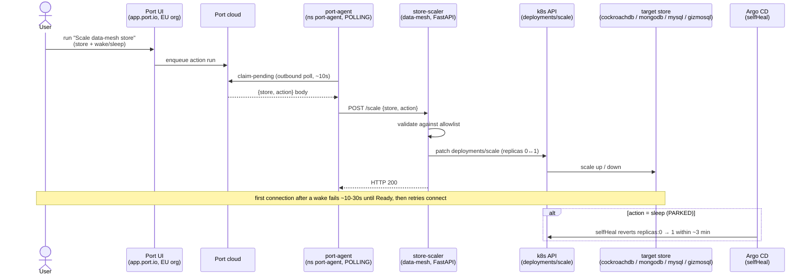

# Demo — Store scaler (wake/sleep via Port → port-agent → store-scaler)

The "easy button": a **Port self-service action** scales a `data-mesh` store up or down. Port is SaaS and the lab
is LAN-only, so the self-hosted **port-agent** connects *outbound* and polls for action runs, then POSTs the
resolved `{store, action}` to the in-cluster **store-scaler**, which patches `deployments/scale`. Grounded in
[../runbooks/port-agent-easy-button.md](../runbooks/port-agent-easy-button.md), [../runbooks/keda.md](../runbooks/keda.md),
and [../schedules.md](../schedules.md).

## Sequence diagram



## Prerequisites

- **Port** — `https://app.port.io` (EU org `org_KyCTEN4PVUv1D3TM`); self-service action **"Scale data-mesh store"** (`port_action.scale_data_mesh_store`, `tofu/port/actions.tf`).
- **port-agent** — ns `port-agent`, `STREAMER_NAME: POLLING`, `PORT_API_BASE_URL: https://api.port.io` (EU), **Organization** creds in Secret `port-agent-creds`.
- **store-scaler** — `services/store-scaler/`, receiver `http://store-scaler.data-mesh.svc.cluster.local/scale`, body `{store, action}`; least-priv SA, sidecar disabled (plain HTTP).
- **Scalable stores** (all `Deployment`, replicas 1, `Recreate`): `cockroachdb`, `mongodb`, `mysql`, `gizmosql`.
- **Argo CD** — `https://argocd.weyland.lab` (the `data-mesh` app has `selfHeal: true` — relevant to the sleep half).
- `kubectl` runs on **mother** (`emangini@mother`).

## UI walkthrough

1. Open `https://app.port.io` (EU org) → **Self-service** → the **"Scale data-mesh store"** action.
2. Pick a **store** (e.g. `gizmosql`) and **action = wake**; run it. The port-agent claims the run on its next poll (~10s latency, not instant).
3. Watch the deployment scale to `replicas: 1` (verify below). First connection to the woken store fails for ~10–30 s until the pod is Ready, then a retry connects.
4. (Optional) run **action = sleep** — it returns HTTP 200 and scales to `replicas: 0`, but **the sleep is PARKED**: the `data-mesh` Argo app's `selfHeal` reverts `replicas: 0` back to `1` within ~3 min (Scaler and Argo fight; Argo wins). The execution plumbing is the deliverable; sleep-stickiness needs an `ignoreDifferences` carve-out on `/spec/replicas` (not yet applied).

## CLI walkthrough

The canonical trigger is the Port button (above). These commands are the per-store standing check and the scale verification.

[mother] Is the store KEDA'd or a plain Deployment? (the "always-on or KEDA'd?" standing call):
```
kubectl -n data-mesh get scaledobject,deploy | grep -i gizmosql
```

[mother] Watch the replica count change after the Port wake:
```
kubectl -n data-mesh get deploy gizmosql -o jsonpath='{.spec.replicas}{"\n"}'
```

[mother] Confirm the woken pod reaches Ready:
```
kubectl -n data-mesh get pods -l app=gizmosql
```

[mother] Inspect the store-scaler logs to see it received `{store, action}` and patched the scale:
```
kubectl -n data-mesh logs deploy/store-scaler --tail=20
```

[mother] Confirm the port-agent is in polling mode (not KAFKA) and reaching the EU API:
```
kubectl -n port-agent logs deploy/port-agent --tail=30
```

## Expected result

- After a **wake**: the target deployment goes to `replicas: 1`, the pod becomes Ready, store-scaler logs a 200, and the store is queryable.
- After a **sleep**: store-scaler returns 200 and sets `replicas: 0`, but Argo `selfHeal` restores `replicas: 1` within ~3 min (expected — sleep is parked).
- port-agent logs show `PollingStreamer` and successful `claim-pending` against `api.port.io` (a 403 there would mean US-URL or Personal-creds misconfig).

## Cleanup / teardown

The scaler only **patches replica counts** — it creates no data, so there is nothing to delete.

To return the stores to their steady state, either let Argo `selfHeal` restore the manifest replicas (it does this automatically within ~3 min for any store left at `0`), or explicitly wake anything you slept:
```
kubectl -n data-mesh scale deploy/gizmosql --replicas=1
```
> The nightly `data-mesh-scaledown` CronJob (02:00 NY) would otherwise take cockroachdb/mongodb/mysql/gizmosql to 0, but auto scale-down is **PARKED** (same Argo selfHeal conflict), so stores stay up on their manifest replicas today.
